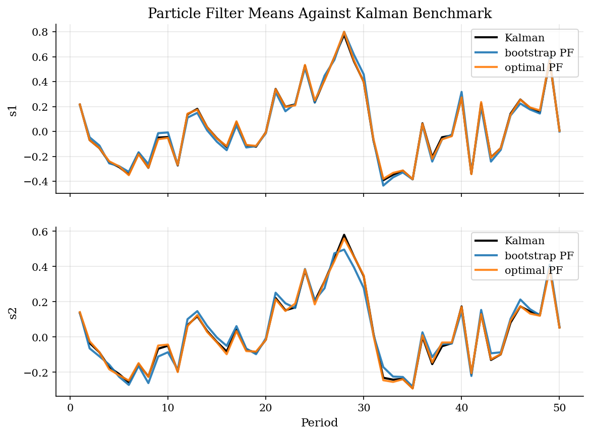
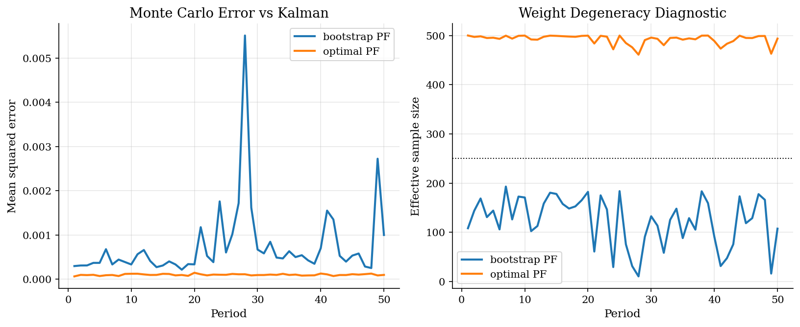
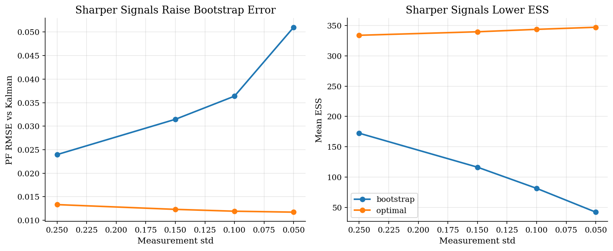
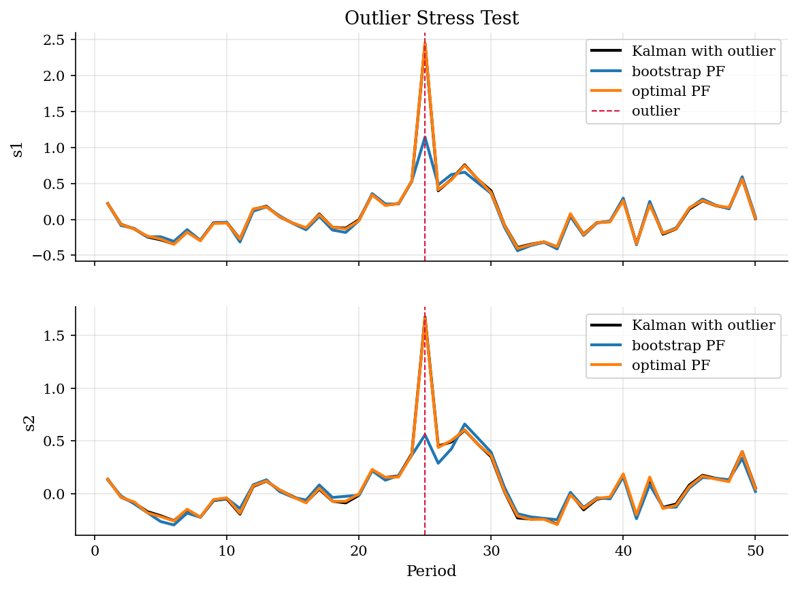

# Particle Filtering and Degeneracy

> Simulation-based filtering, particle degeneracy, and proposal design.

## Overview

Particle filters approximate a filtering distribution with simulated states. They are useful when nonlinearities or non-Gaussian shocks make the Kalman filter unavailable. Here we deliberately use a linear Gaussian model so the Kalman filter supplies a truth benchmark for particle error.

The tutorial compares a bootstrap particle filter with a conditionally optimal particle filter. The bootstrap filter simulates from the transition equation and then weights by the observation density. The conditionally optimal filter uses the current observation inside the proposal, which reduces weight degeneracy when measurements are informative.

## Equations

The hidden-state model is:

$$
y_t = \Psi s_t + u_t, \qquad s_t = \Phi s_{t-1} + \epsilon_t.
$$

The bootstrap particle filter propagates particles from:

$$
s_t^{(i)} \sim p(s_t \mid s_{t-1}^{(i)})
$$

and weights them by the observation likelihood:

$$
w_t^{(i)} \propto p(y_t \mid s_t^{(i)}).
$$

The conditionally optimal proposal uses the current observation:

$$
s_t^{(i)} \sim p(s_t \mid s_{t-1}^{(i)}, y_t).
$$

## Model Setup

| Object | Value |
|--------|-------|
| Observation matrix $\Psi$ | [1.0, 0.9] |
| Transition matrix $\Phi$ | diag(0.4, 0.5) |
| Measurement std | 0.10 |
| Process std | (0.30, 0.25) |
| Baseline particles | 500 |
| Repeated runs | 50 |
| Benchmark | Kalman filtered mean |

## Solution Method

**Bootstrap filter:** propagate particles with the transition equation, weight by the Gaussian observation density, estimate the state mean, then resample every period.

**Conditionally optimal filter:** for each particle, combine the transition density and the current observation to sample from $p(s_t \mid s_{t-1}, y_t)$. The remaining weights are the one-step predictive likelihoods $p(y_t \mid s_{t-1})$.

The code repeats each filter many times and reports Monte Carlo error relative to the Kalman filtered mean.

## Results

With 500 particles, both particle filters track the Kalman benchmark. The difference between the two methods is easier to see in repeated-run error and effective sample size.


*Particle filter state estimates compared with the Kalman filter*

Effective sample size falls when a few particles receive most of the weight. The conditionally optimal proposal usually preserves more useful particles because it looks at the observation before drawing the new state.


*Repeated-run Monte Carlo error and effective sample size*

Low measurement noise makes the likelihood sharply peaked. Bootstrap particles drawn from the transition can miss that peak, creating weight degeneracy.


*Particle accuracy as measurement noise falls*

Outliers are hard for likelihood-weighted simulation. A single extreme observation can concentrate weights and pull the filtered state sharply.


*Filtering after multiplying observation 25 by ten*

The baseline repeats each filter 50 times with 500 particles.

**Baseline repeated-run comparison**

| Method    |   Particles |   PF RMSE vs Kalman |   Mean ESS |   Loglike sd |
|:----------|------------:|--------------------:|-----------:|-------------:|
| bootstrap |         500 |              0.0273 |    121.829 |       0.6914 |
| optimal   |         500 |              0.01   |    492.636 |       0.0397 |

Lower measurement noise makes the observation likelihood sharper.

**Measurement-noise sensitivity**

|   Measurement std | Method    |   PF RMSE vs Kalman |   Mean ESS |   Loglike sd |   Kalman RMSE vs truth |
|------------------:|:----------|--------------------:|-----------:|-------------:|-----------------------:|
|              0.25 | bootstrap |              0.024  |   172.396  |       0.4286 |                 0.2361 |
|              0.25 | optimal   |              0.0133 |   334.07   |       0.0851 |                 0.2361 |
|              0.15 | bootstrap |              0.0315 |   116.293  |       0.8892 |                 0.2188 |
|              0.15 | optimal   |              0.0123 |   339.868  |       0.074  |                 0.2188 |
|              0.1  | bootstrap |              0.0364 |    81.3175 |       1.2776 |                 0.2114 |
|              0.1  | optimal   |              0.0119 |   343.872  |       0.0511 |                 0.2114 |
|              0.05 | bootstrap |              0.051  |    42.0492 |       1.4592 |                 0.2062 |
|              0.05 | optimal   |              0.0117 |   347.331  |       0.0345 |                 0.2062 |

The optimal proposal can often match bootstrap accuracy with fewer particles.

**Particle-count sensitivity**

|   Particles | Method    |   PF RMSE vs Kalman |   Mean ESS |   Loglike sd |
|------------:|:----------|--------------------:|-----------:|-------------:|
|         100 | bootstrap |              0.0637 |    24.5238 |       1.6359 |
|         100 | optimal   |              0.0224 |    98.5483 |       0.1097 |
|         250 | bootstrap |              0.0375 |    60.757  |       1.1285 |
|         250 | optimal   |              0.0142 |   246.333  |       0.0547 |
|         500 | bootstrap |              0.0276 |   121.579  |       0.6529 |
|         500 | optimal   |              0.0099 |   492.635  |       0.0406 |
|        1000 | bootstrap |              0.02   |   244.002  |       0.7239 |
|        1000 | optimal   |              0.0069 |   985.287  |       0.0324 |

With 500 particles, the bootstrap filter has RMSE 0.0273 relative to the Kalman filtered mean, while the conditionally optimal filter has RMSE 0.0100. The main difference is not the model; it is the proposal distribution used to place particles.

## Economic Takeaway

Particle filters are flexible because they replace analytic filtering distributions with weighted simulations. That flexibility has a cost: particle placement matters. When observations are very informative or contaminated by outliers, naive bootstrap particles can collapse onto a few high-weight draws. Better proposals, more particles, and outlier-robust measurement models are practical ways to respond.

## Reproduce

```bash
python run.py
```

## References

- Chang, M. ECON 609 Problem Set 3: Kalman Filter vs. Particle Filter.
- Gordon, N. J., Salmond, D. J., and Smith, A. F. M. (1993). Novel approach to nonlinear/non-Gaussian Bayesian state estimation. IEE Proceedings F.
- Doucet, A., de Freitas, N., and Gordon, N. (2001). Sequential Monte Carlo Methods in Practice. Springer.
