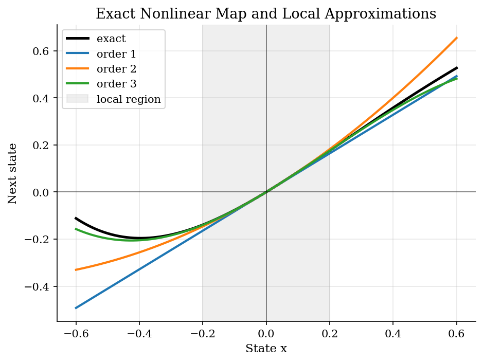
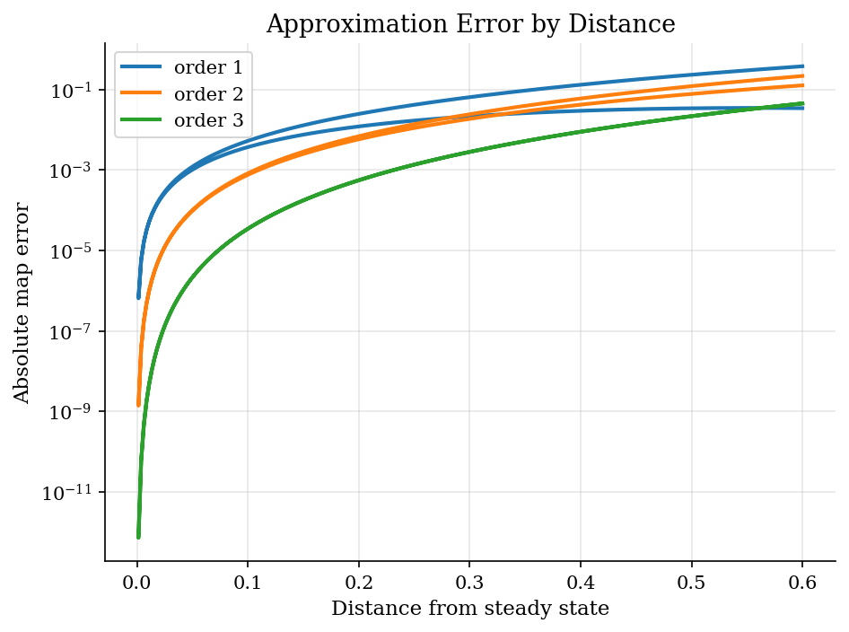
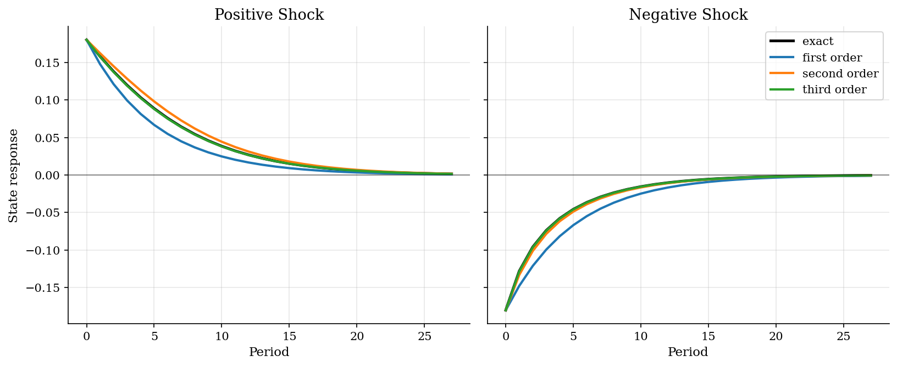
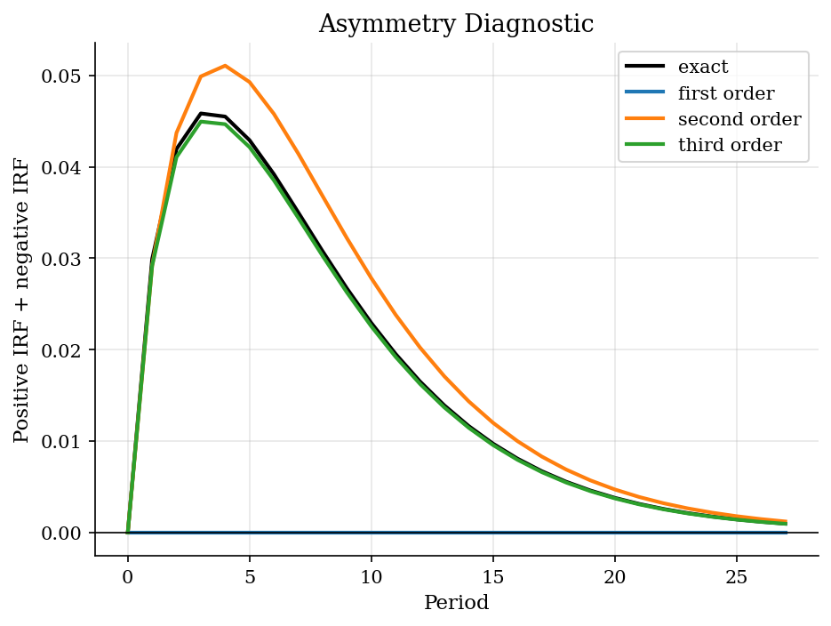

# Aggregate Adjustment Around a Steady State

## Overview

A macro model tracks an aggregate state after a shock. Here $x_t$ is a deviation from steady state. The shock can be positive or negative.

The object is the path back to steady state. Equal shocks need not unwind symmetrically when the transition is nonlinear.

Solving the full nonlinear model can be expensive. Perturbation replaces the transition with a Taylor approximation near steady state. Higher orders add local curvature.

## Equations

Let $x_t$ be a scalar deviation from the deterministic steady state. The
steady state is normalized to $x=0$. The exact nonlinear transition is:

$$
F(x) = \rho x + \gamma x^2 - \eta x^3 + \kappa x^4.
$$

These coefficients create persistence, curvature, and asymmetric responses.
A Taylor perturbation of order $n$ around zero keeps
the derivatives through order $n$:

$$
F_n(x) = \sum_{j=1}^{n} \frac{F^{(j)}(0)}{j!} x^j.
$$

For the first three orders in this example:

$$
\begin{aligned}
F_1(x) &= \rho x, \\
F_2(x) &= \rho x + \gamma x^2, \\
F_3(x) &= \rho x + \gamma x^2 - \eta x^3.
\end{aligned}
$$

Impulse responses after a one-time shock $\epsilon$ are generated by iterating:

$$
x_{t+1} = F_n(x_t), \qquad x_0 = \epsilon.
$$

## Model Setup

| Object | Value |
|--------|-------|
| Persistence $\rho$ | 0.82, so deviations decay gradually |
| Quadratic term $\gamma$ | 0.45, adding local curvature |
| Cubic term $\eta$ | 0.80, changing the speed of large responses |
| Fourth-order term $\kappa$ | 0.35, left out by third order |
| Shock size | 0.18 in either direction |
| IRF periods | 28 |

## Solution Method

The computation compares each Taylor map with the exact transition. Map error checks the law of motion at nearby states. IRF error checks the full path after a shock.

```text
Algorithm: perturbation check for a shock response
Input: nonlinear law F(x), steady state x_bar = 0, order n, shock epsilon
Output: Taylor law, map errors, IRF errors, asymmetry statistic
1. Read the Taylor coefficients of F at x_bar straight from the known parameters
2. Build the local law F_n(x) from those Taylor coefficients, keeping terms through order n
3. Compare F_n(x) with F(x) near and away from x_bar
4. Starting from x_0 = epsilon, iterate x_{t+1} = F_n(x_t)
5. Repeat from x_0 = -epsilon and add the two paths
6. Use nonzero sums to measure nonlinear asymmetry
```

The useful range is local. Check whether simulated paths stay near $x=0$ before trusting the approximation.

## Results

The maps match at the steady state. Away from zero, omitted curvature changes the next-period state.



Higher orders lower error near steady state. Error rises with distance from the expansion point.



First order is symmetric by construction. Higher orders allow positive and negative shocks to unwind at different speeds.



In a linear model, positive and negative responses cancel. A nonzero sum measures nonlinear asymmetry preserved by the approximation.



Map errors compare transition rules. IRF errors compare the full adjustment path after a shock.

**Perturbation accuracy by order**

|   Order | Domain               |   Max map error |   Median map error |   Positive IRF RMSE |   Negative IRF RMSE |
|--------:|:---------------------|----------------:|-------------------:|--------------------:|--------------------:|
|       1 | local abs(x) <= 0.20 |        0.0245   |           0.00433  |            0.0116   |            0.0117   |
|       1 | wide abs(x) <= 0.60  |        0.38     |           0.0289   |            0.0116   |            0.0117   |
|       2 | local abs(x) <= 0.20 |        0.00679  |           0.000793 |            0.00501  |            0.00203  |
|       2 | wide abs(x) <= 0.60  |        0.218    |           0.0214   |            0.00501  |            0.00203  |
|       3 | local abs(x) <= 0.20 |        0.000542 |           3.47e-05 |            0.000315 |            0.000125 |
|       3 | wide abs(x) <= 0.60  |        0.0454   |           0.00286  |            0.000315 |            0.000125 |

First order works in a tight neighborhood, but it misses curvature. Second and third order follow the nonlinear responses more closely here. The asymmetry plot shows the economic cost of linearization. Linear dynamics force positive and negative responses to cancel.

## Takeaway

Linearization is useful for small deviations. It also imposes symmetric responses. Higher-order perturbation adds curvature without solving the full nonlinear model. Always trace the path and check that it stays near the expansion point.

## References

- [Blanchard, O. J. and Kahn, C. M. (1980). The Solution of Linear Difference Models under Rational Expectations. *Econometrica*, 48(5), 1305-1311.](https://doi.org/10.2307/1912186)
- [Judd, K. L. (1998). *Numerical Methods in Economics*. MIT Press.](https://mitpress.mit.edu/9780262100717/numerical-methods-in-economics/)
- [Schmitt-Grohe, S. and Uribe, M. (2004). Solving Dynamic General Equilibrium Models Using a Second-Order Approximation to the Policy Function. *Journal of Economic Dynamics and Control*, 28(4), 755-775.](https://doi.org/10.1016/S0165-1889(03)00043-5)
