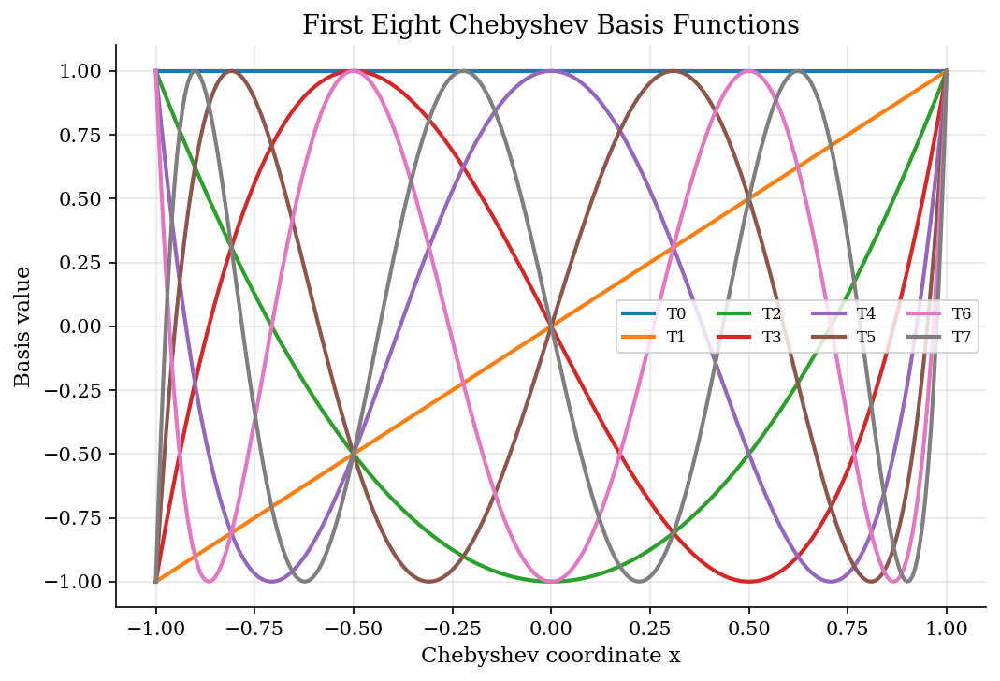
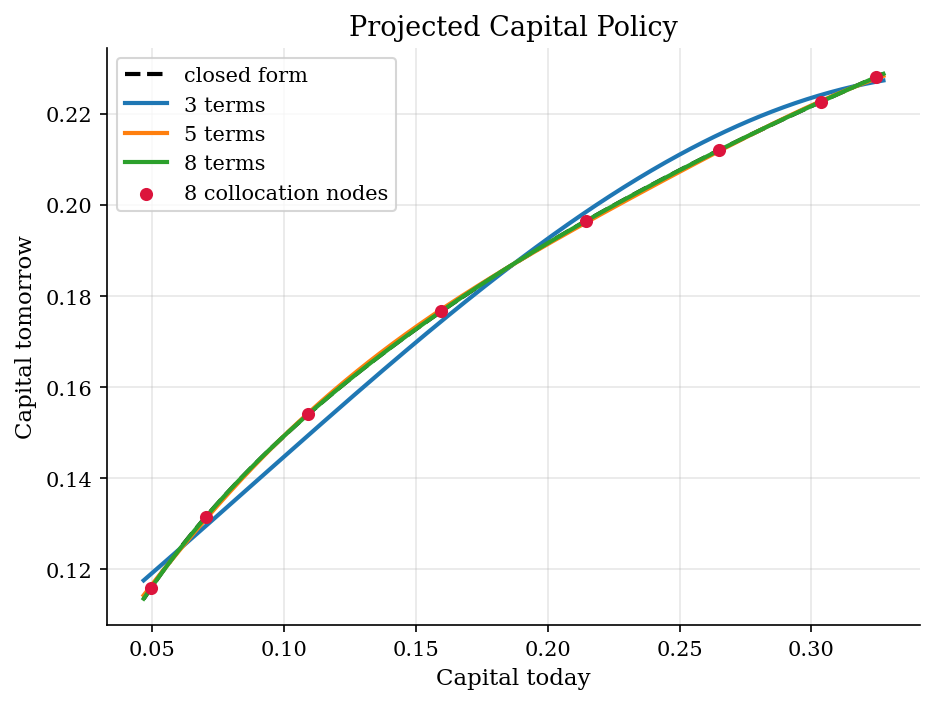
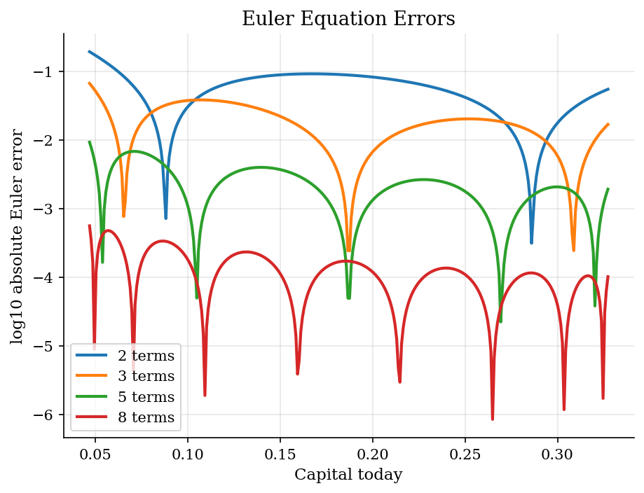
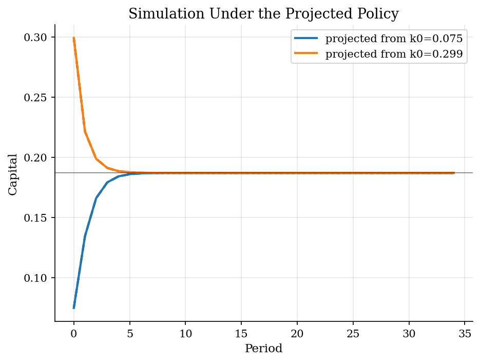

# Growth-Model Capital Policy by Chebyshev Projection

## Overview

A planner starts each period with capital. Output can be consumed today or saved as next-period capital.

The object is the policy $g(k)$ from current capital to capital tomorrow. Here the exact policy is known.

Chebyshev collocation approximates that policy with a few coefficients. Euler residuals check whether the fitted rule respects the marginal tradeoff.

## Equations

Capital evolves through a full-depreciation Cobb-Douglas technology. The planner
chooses next-period capital, so consumption is the part of output not saved:

$$
V(k) = \max_{k'} [\log(c) + \beta V(k')],
\qquad
c = A k^\alpha - k'.
$$

The Euler equation equates marginal utility today with discounted marginal
product tomorrow:

$$
\frac{1}{c_t}
= \beta \frac{\alpha A k_{t+1}^{\alpha-1}}{c_{t+1}}.
$$

Projection approximates the saving rule with Chebyshev basis functions:

$$
\log g(k;\theta)
= \sum_{j=0}^{n-1} \theta_j T_j(x(k)),
\qquad
x(k) \in [-1,1].
$$

The collocation equations set the log Euler residual to zero at selected
capital nodes $k_i$:

$$
R_i(\theta)
= \log\left[
\beta \alpha A g(k_i;\theta)^{\alpha-1}
\frac{c(k_i;\theta)}{c(g(k_i;\theta);\theta)}
\right] = 0.
$$

Here $c(k;\theta) \equiv Ak^\alpha - g(k;\theta)$ is the consumption implied by the projected saving rule.

For this calibration, the exact policy is $g^{\ast}(k)=\alpha\beta A k^\alpha$.

## Model Setup

| Object | Value |
|--------|-------|
| Discount factor $\beta$ | 0.95 |
| Capital share $\alpha$ | 0.36 |
| Productivity $A$ | 1.0 |
| Steady-state capital | 0.1870 |
| Approximation interval | [0.0468, 0.3273] |
| Main basis terms | 8 |

## Solution Method

Scale capital from [k_min, k_max] to [-1, 1]. The policy is log-linear in Chebyshev terms, then exponentiated so $g(k;\theta)>0$.

Choose coefficients so Euler residuals are zero at Chebyshev nodes. The nodes cluster near the boundaries of the capital interval.

```text
Algorithm: Chebyshev collocation for the growth policy
Input: interval [k_min, k_max], basis size n, beta, alpha, A
Output: projected policy g(k; theta) and Euler-error diagnostics
1. Map k in [k_min, k_max] to x(k) in [-1, 1]
2. Choose n Chebyshev collocation nodes k_i
3. Parameterize log g(k; theta) = sum_j theta_j T_j(x(k))
4. At each node, compute c_i = A k_i^alpha - g(k_i; theta)
5. Compute next-period consumption using g(g(k_i; theta); theta)
6. Choose theta so the Euler residuals R_i(theta) are near zero
7. Evaluate policy errors and Euler errors on a dense grid
```

## Results

The Chebyshev terms provide smooth shapes over the capital interval. A few terms can fit a smooth saving rule.



The projected policy follows the closed-form saving rule across low and high capital states.



Euler errors show whether the fitted rule preserves the planner's marginal tradeoff away from collocation nodes.



The projected rule sends low and high initial capital toward the steady state.



The table evaluates errors on a dense grid between collocation nodes.

**Projection accuracy by basis size**

|   Basis terms |   Max policy error |   Median policy error |   Max Euler error |   Median Euler error |
|--------------:|-------------------:|----------------------:|------------------:|---------------------:|
|             2 |           0.0153   |              0.0105   |          0.192    |             0.0589   |
|             3 |           0.00464  |              0.00273  |          0.0662   |             0.0174   |
|             5 |           0.000775 |              0.00028  |          0.00922  |             0.00204  |
|             8 |           4.24e-05 |              1.41e-05 |          0.000557 |             0.000111 |

With 8 Chebyshev terms, the maximum Euler error on the dense grid is 5.57e-04. The policy is stored in eight coefficients and evaluated smoothly off grid.

## Takeaway

Chebyshev projection works here because the saving rule is smooth. The economic check is still the Euler equation. Small off-node residuals mean the fitted policy preserves the planner's saving tradeoff.

## References

- [Judd, K. L. (1992). Projection Methods for Solving Aggregate Growth Models. *Journal of Economic Theory*, 58(2), 410-452.](https://doi.org/10.1016/0022-0531(92)90061-L)
- [Judd, K. L. (1998). *Numerical Methods in Economics*. MIT Press.](https://mitpress.mit.edu/9780262100717/numerical-methods-in-economics/)
- [Miranda, M. J. and Fackler, P. L. (2002). *Applied Computational Economics and Finance*. MIT Press.](https://mitpress.mit.edu/9780262633093/applied-computational-economics-and-finance/)
