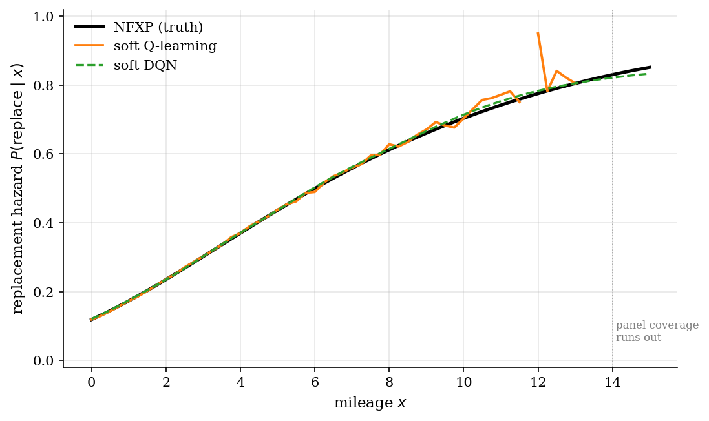
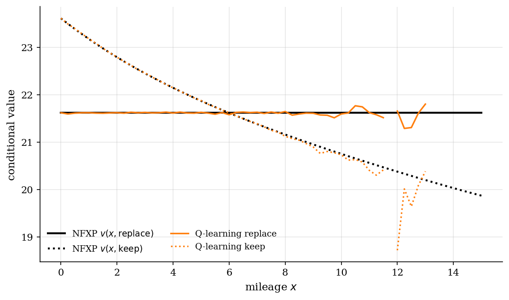
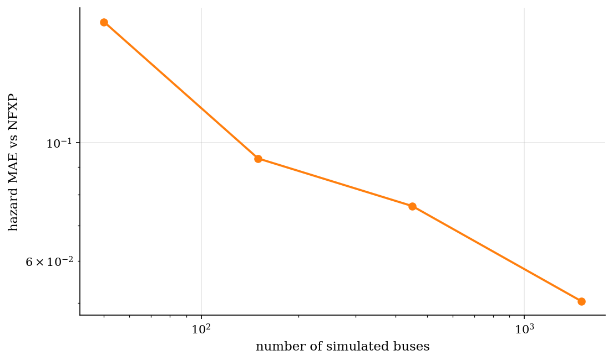
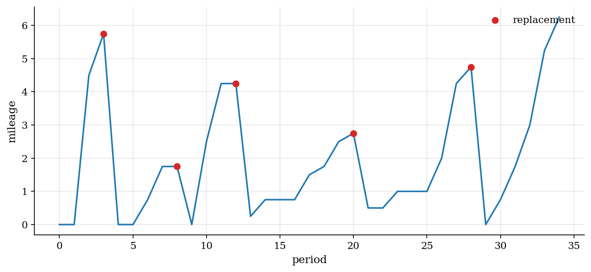

# Bus Engine Replacement by Q-Learning

> Soft Q-learning recovers Rust's replacement hazard from a simulated bus panel without the mileage transition matrix.

## Overview

A bus depot decides each period whether to keep a high-mileage engine or pay a lump-sum replacement cost. Higher mileage raises operating costs and tilts the trade-off toward replacement.

The target object is the replacement hazard $P(\mathrm{replace} \mid x)$ at each mileage level. Rust's nested fixed-point estimator computes it by iterating the structural Bellman equation through the mileage transition matrix.

Soft Q-learning replaces the matrix with the simulated bus panel. The agent sees only the same data the econometrician uses for estimation, and recovers the hazard from sampled transitions and flow payoffs.

## Equations

Let $x_t$ be mileage and $a_t \in \{\mathrm{replace}, \mathrm{keep}\}$. Flow payoffs are $u(x, \mathrm{replace}) = 0$ and $u(x, \mathrm{keep}) = \theta_0 + \theta_1 x$, with Type-I extreme value choice shocks $\varepsilon_t$.

The conditional value functions solve

$$v(x, a) = u(x, a) + \beta\, \mathbb{E}\big[\gamma + \log \sum_{a'} \exp v(x', a') \,\big|\, x, a\big],$$

and the structural CCP is the softmax of conditional values:

$$P(\mathrm{replace} \mid x) = \frac{\exp v(x, \mathrm{replace})}{\exp v(x, \mathrm{replace}) + \exp v(x, \mathrm{keep})}.$$

Soft Q-learning treats $v$ as an action-value $Q(x, a)$ and updates it from observed $(x_t, a_t, x_{t+1})$ triples:

$$Q(x_t, a_t) \leftarrow Q(x_t, a_t) + \alpha_t \Big[ u(x_t, a_t) + \beta\big(\gamma + \log \textstyle\sum_{a'} \exp Q(x_{t+1}, a')\big) - Q(x_t, a_t) \Big].$$

## Model Setup

| Object | Value |
|--------|-------|
| Mileage state $x$ | 61 grid points on $[0, 15]$ in steps of 0.25 |
| Action $a$ | $\{\mathrm{replace}, \mathrm{keep}\}$ |
| Discount $\beta$ | 0.9 |
| Replacement-payoff intercept $\theta_0$ | 2.00 |
| Mileage-cost slope $\theta_1$ | -0.15 |
| Buses | 1500 |
| Periods per bus | 35 |
| Observed transitions | 51,000 |
| Q-learning epochs per seed | 30 |
| Q-learning seeds (averaged) | 4 |
| DQN epochs | 80 |
| Benchmark | NFXP fixed point under known $F_{\mathrm{replace}}$, $F_{\mathrm{keep}}$ |

## Solution Method

NFXP iterates the structural Bellman operator on the conditional value function until it stops moving. Each iteration takes the log-sum-exp of conditional values, multiplies through the mileage transition matrices, and adds the flow payoffs. The implied CCP is the softmax of converged conditional values.

Soft Q-learning uses the same simulated panel that NFXP estimates from. For each observed transition, the agent forms the soft Bellman target with a log-sum-exp over next-period actions and applies a Robbins-Monro step. Independent runs are averaged to dampen the residual noise from finite samples.

```text
Algorithm: soft Q-learning from observed bus transitions
Input: panel (x_t, a_t, x_{t+1}), flow payoffs u(x, a), epoch budget E
Output: action-value Q(x, a) and replacement hazard P(replace | x)
Initialize Q(x, a) <- 0 for all (x, a)
for epoch = 1, ..., E:
    for each transition (x_t, a_t, x_{t+1}) in random order:
        target <- u(x_t, a_t) + beta * (gamma + log-sum-exp Q(x_{t+1}, .))
        Q(x_t, a_t) += alpha_t * (target - Q(x_t, a_t))
P(replace | x) <- exp Q(x, replace) / [exp Q(x, replace) + exp Q(x, keep)]
```

The deep-RL appendix replaces the table with a small two-layer MLP $Q_\theta(x, \cdot)$. The minibatch loss is the Huber error against a slow target network whose continuation value uses the same soft-Bellman log-sum-exp.

```text
Algorithm: soft DQN on the same observed panel
Input: panel transitions, flow payoffs, minibatch size, epoch budget
Output: parameters theta of Q_theta(x, .)
Initialize online and target networks with the same weights
for epoch = 1, ..., E_dqn:
    for each minibatch (x, a, x') sampled without replacement:
        target <- u(x, a) + beta * (gamma + log-sum-exp Q_target(x', .))
        take a gradient step on Huber(Q_theta(x, a) - target)
        every K steps copy the online weights into the target network
```

## Results

The replacement hazard rises smoothly with mileage: low-mileage buses keep their engines, high-mileage buses replace. Soft Q-learning recovers the same curve over the mileage range the panel actually visits. Past that range the table has no data to update; the DQN appendix extrapolates with the network.



The conditional values for replace and keep cross at the mileage where replacement becomes attractive. Q-learning's values overlay the NFXP values on both branches.



Hazard recovery improves as more buses enter the panel. The log-log slope shows a roughly square-root rate, consistent with the standard sample-complexity scaling of off-policy evaluation.



A representative bus accumulates mileage between replacements. Each red marker is a replacement period that resets mileage to the low-mileage transition.



The table compares the three methods on the same calibration. Q-learning and DQN see only the simulated panel, yet recover the same replacement threshold as NFXP.

**Method comparison**

| method                         | transition matrix   |   hazard MAE |   P=0.5 mileage |   samples |   runtime sec |
|:-------------------------------|:--------------------|-------------:|----------------:|----------:|--------------:|
| NFXP (model-based)             | yes                 |       0      |               6 |       228 |        0.0136 |
| soft Q-learning (4 seeds avg.) | no                  |       0.0105 |               6 |   6120000 |      223.324  |
| soft DQN                       | no                  |       0.0046 |               6 |   4080000 |       11.646  |

NFXP converges in 228 Bellman iterations. Soft Q-learning hits a hazard MAE of 0.0105 after 30 passes through 51,000 observed transitions. Soft DQN reaches 0.0046 on the same panel.

## Takeaway

Replacement hazards do not require the engineer to write down the mileage transition. Soft Q-learning recovers the same hazard from observed buses and the model's flow payoffs, which is exactly the model-free counterpart of NFXP.

## References

- [Rust, J. (1987). Optimal Replacement of GMC Bus Engines: An Empirical Model of Harold Zurcher. *Econometrica*, 55(5), 999-1033.](https://doi.org/10.2307/1911259)
- [Hotz, V. J. and Miller, R. A. (1993). Conditional Choice Probabilities and the Estimation of Dynamic Models. *Review of Economic Studies*, 60(3), 497-529.](https://doi.org/10.2307/2298122)
- [Watkins, C. J. C. H. and Dayan, P. (1992). Q-Learning. *Machine Learning*, 8(3), 279-292.](https://doi.org/10.1007/BF00992698)
- [Haarnoja, T., Tang, H., Abbeel, P., and Levine, S. (2017). Reinforcement Learning with Deep Energy-Based Policies. *ICML*.](https://proceedings.mlr.press/v70/haarnoja17a.html)
- [Mnih, V., Kavukcuoglu, K., Silver, D., et al. (2015). Human-Level Control through Deep Reinforcement Learning. *Nature*, 518, 529-533.](https://doi.org/10.1038/nature14236)
