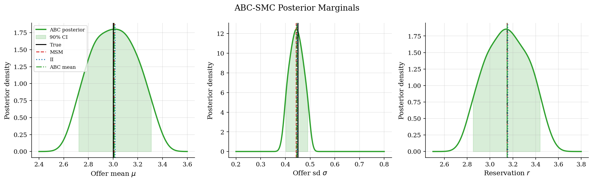
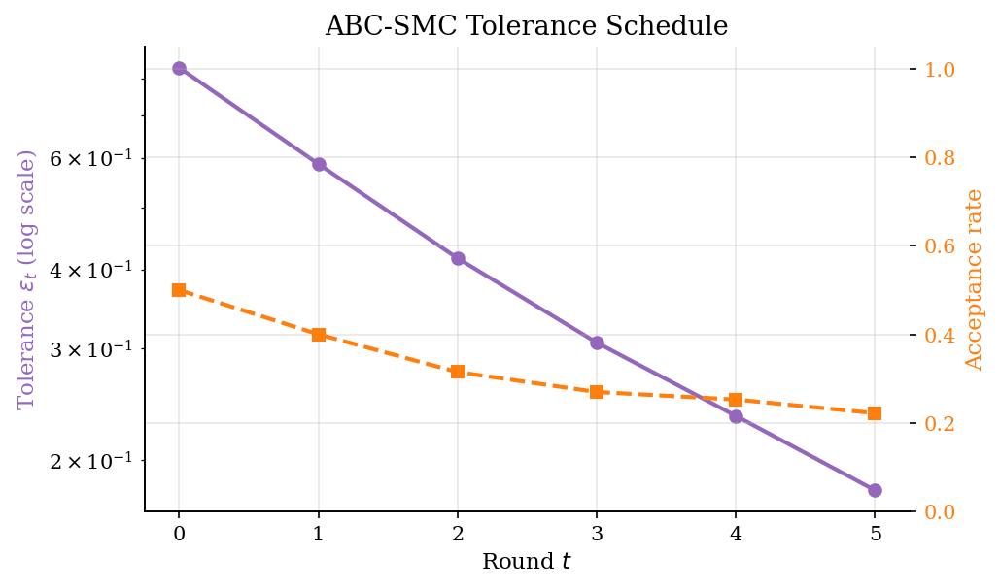

# Estimating a Search Acceptance Rule by Simulation

## Overview

A researcher observes wage offers and whether workers accept them. The reservation wage is hidden.

The object is a rule that maps offers into acceptance probabilities. It depends on offer mean, offer dispersion, and reservation log wage.

The model is easy to simulate for any parameter vector. Simulation-based estimation searches for parameters whose simulated data match observed summaries.

## Equations

Worker $i$ receives a log wage offer,

$$
\log w_i = \mu + \sigma z_i,\qquad z_i \sim N(0,1),
$$

and accepts with probability

$$
\Pr(d_i = 1 \mid w_i; \theta) =
\frac{1}{1 + \exp[-(\log w_i - r)/s]}.
$$

The structural parameter vector is $\theta = (\mu, \sigma, r)$. Offer mean is $\mu$, offer dispersion is $\sigma$, reservation log wage is $r$. The scale $s$ fixes how sharply acceptance changes near $r$.

All three estimators share the same simulator $S(\theta, \varepsilon)$ driven by a fixed vector of common shocks $\varepsilon_{sim}$. They differ in which summary statistic the simulator must reproduce, and in whether the answer is a point estimate or a distribution over $\theta$.

### Method 1: Method of Simulated Moments

Let $m_{obs} \in \mathbb{R}^{5}$ collect five economic moments computed on the observed sample,

$$
m_{obs} =
(
\underbrace{\Pr(d = 1)}_{\text{acceptance rate}},\
\underbrace{\mathbb{E}[\log w]}_{\text{offer mean}},\
\underbrace{\mathrm{SD}[\log w]}_{\text{offer sd}},\
\underbrace{\mathbb{E}[\log w \mid d = 1]}_{\text{accepted mean}},\
\underbrace{\mathrm{SD}[\log w \mid d = 1]}_{\text{accepted sd}}
).
$$

Write $m_{sim}(\theta) = m(S(\theta, \varepsilon_{sim}))$ for the same moments computed on simulated data. MSM minimizes the scaled quadratic criterion

$$
\hat\theta_{MSM} = \arg\min_\theta\,
\underbrace{[m_{sim}(\theta) - m_{obs}]^{\prime}}_{\text{moment gap, simulated vs observed}}\
\underbrace{W_m}_{\text{scale matrix}}\
\underbrace{[m_{sim}(\theta) - m_{obs}]}_{\text{moment gap}}
\equiv Q_{MSM}(\theta),
$$

with the diagonal weight $W_m = \mathrm{diag}(1 / \max(|m_{obs}|, 0.1))^{2}$.
The criterion is a weighted sum of squared moment gaps, so $W_m$ is what makes a 1% gap in the acceptance rate comparable to a 0.01 gap in the offer mean.
Scaling each gap by the magnitude of the observed moment is the simplest such normalization; in production code one would replace it by the inverse of the moment covariance estimated by bootstrap.

### Method 2: Indirect Inference

Let $b(\cdot)$ be a vector of auxiliary statistics: the OLS coefficients of the linear probability regression $d_i = b_0 + b_1 \log w_i$, augmented with offer-distribution moments and the acceptance rate. Write $b_{obs} = b(\text{observed sample})$ and $b_{sim}(\theta) = b(S(\theta, \varepsilon_{sim}))$. Indirect inference minimizes

$$
\hat\theta_{II} = \arg\min_\theta\,
\underbrace{
[b_{sim}(\theta) - b_{obs}]^{\prime}\, W_b\,
[b_{sim}(\theta) - b_{obs}]
}_{Q_{II}(\theta)},
$$

with the same scaling form, $W_b = \mathrm{diag}(1 / \max(|b_{obs}|, 0.1))^{2}$. The auxiliary model is misspecified by design; its coefficients are just summary statistics.

### Method 3: Approximate Bayesian Computation (ABC-SMC)

ABC replaces the likelihood by a tolerance ball around the observed moments. Define the scaled Euclidean distance

$$
\rho(\theta) = \sqrt{Q_{MSM}(\theta)},
$$

so the MSM criterion is $\rho^2$. Place a uniform prior on the same rectangle that bounds MSM and II,

$$
\pi(\theta) = U(2.4, 3.6) \times U(0.2, 0.8) \times U(2.5, 3.8).
$$

For a tolerance $\varepsilon > 0$ the ABC posterior is

$$
\pi_\varepsilon(\theta \mid m_{obs}) \propto \underbrace{\pi(\theta)}_{\text{prior}}\, \underbrace{\Pr[\rho(\theta) \le \varepsilon]}_{\text{ABC pseudo-likelihood}}.
$$

The pseudo-likelihood replaces the unknown true likelihood by the probability that a fresh simulation lands within $\varepsilon$ of the observed moments.
That trade is the entire point of ABC: any model that can be simulated has a usable Bayesian update, even when its density is not available.
As $\varepsilon \to 0$ the pseudo-likelihood concentrates on parameters whose simulator matches $m_{obs}$ exactly, so the posterior concentrates on $\arg\min_\theta \rho^2 = \hat\theta_{MSM}$ and ABC and MSM target the same point in the noise-free limit.
ABC adds the spread around that point that MSM's point estimate alone cannot report.

ABC-SMC approaches $\pi_0$ through a sequence $\varepsilon_0 > \varepsilon_1 > \cdots > \varepsilon_{T-1}$ of shrinking tolerances. Round $t$ maintains $N$ weighted particles $\lbrace (\theta_t^{(i)}, w_t^{(i)}) \rbrace_{i=1}^{N}$ that approximate $\pi_{\varepsilon_t}$. The schedule is adaptive: $\varepsilon_t$ is the $\alpha$-quantile of the distances at round $t-1$, with $\alpha = 0.5$.

Particles in round $t \ge 1$ are drawn by sampling a parent $\theta_{t-1}^{(j)}$ with probability $w_{t-1}^{(j)}$, perturbing it with a Gaussian kernel

$$
K_t(\theta \mid \theta^{\prime}) = \mathcal{N}(\theta^{\prime},\, 2\, \widehat{\mathrm{Cov}}_{t-1}),
$$

and keeping the proposal only if $\rho(\theta) \le \varepsilon_t$. The factor two in the covariance is the Beaumont-Cornuet-Marin-Robert (2009) twice-empirical-covariance rule. The importance weight corrects for the proposal,

$$
w_t^{(i)} \propto \frac{\pi(\theta_t^{(i)})}{\sum_{j=1}^{N} w_{t-1}^{(j)}\, K_t(\theta_t^{(i)} \mid \theta_{t-1}^{(j)})}.
$$

Under the uniform prior $\pi$ is constant on the support, so the numerator drops out and the weight is just the inverse of the kernel-mixture density evaluated at $\theta_t^{(i)}$.

## Model Setup

| Object | Value | Role |
|--------|-------|------|
| True $\mu$ | 3.00 | Mean of the latent log offer distribution |
| True $\sigma$ | 0.45 | Dispersion of latent log offers |
| True $r$ | 3.15 | Latent reservation log wage |
| Choice scale $s$ | 0.18 | Smoothness of acceptance rule |
| Observed sample | 5,000 | Synthetic data generated once from the model |
| Simulation draws | 30,000 | Common random numbers used in all three criteria |
| MSM targets | 5 | Acceptance rate and offer-wage moments |
| II targets | 6 | Auxiliary acceptance coefficients and moments |
| ABC particles $N$ | 1,000 | Particles maintained at each ABC-SMC round |
| ABC rounds $T$ | 6 | Number of shrinking-tolerance rounds |
| ABC quantile $\alpha$ | 0.50 | Adaptive tolerance is the $\alpha$-quantile of previous distances |
| ABC prior $\pi$ | $U(2.4, 3.6) \times U(0.2, 0.8) \times U(2.5, 3.8)$ | Uniform on $(\mu, \sigma, r)$ |

## Solution Method

The three estimators share the simulator $S(\theta, \varepsilon)$ and the same fixed shocks $\varepsilon_{sim}$. Common random numbers keep the criterion from changing because of fresh Monte Carlo noise. The three differ in what summary the simulator must reproduce and in whether the answer is a point or a distribution.

### Method 1: Method of Simulated Moments

Pick $\theta$ so that the simulator reproduces the five economic moments. The criterion scales each residual by the magnitude of the matching observed moment, so each moment contributes on a comparable order. Nelder-Mead minimizes the scaled quadratic distance from a fixed starting point.

```text
Algorithm: MSM
Input : observed moments m_obs, simulator S(theta, eps), fixed shocks eps_sim
For each candidate theta:
  m_sim <- moments(S(theta, eps_sim))
  Q     <- sum_k ((m_sim_k - m_obs_k) / scale_k)^2
Return theta minimizing Q via Nelder-Mead.
```

Failure mode: identification depends on the moments. If they are not informative about a parameter the criterion has a flat direction and the optimizer wanders.

### Method 2: Indirect Inference

Pick $\theta$ so that the simulator reproduces the fitted coefficients of an auxiliary regression of acceptance on log wages. The auxiliary regression is not the structural model; its coefficients are summary statistics. The slope captures threshold variation that pins down the reservation wage.

```text
Algorithm: Indirect Inference
Input : observed auxiliary stats b_obs, simulator S, fixed shocks eps_sim
For each candidate theta:
  b_sim <- aux_stats(S(theta, eps_sim))
  Q     <- sum_k ((b_sim_k - b_obs_k) / scale_k)^2
Return theta minimizing Q via Nelder-Mead.
```

Failure mode: a weak auxiliary model gives weak identification. Drop the linear-probability slope and the criterion flattens in the same direction MSM does when its moments miss the threshold.

### Method 3: Approximate Bayesian Computation (ABC-SMC)

Sample $\theta$ from the prior, keep draws whose simulated moments are close to the observed moments, then iteratively tighten the closeness threshold and reweight the survivors. The output is a posterior over $\theta$, not a single point. Tolerance shrinks adaptively as the $\alpha$-quantile of the previous round's distances, with $\alpha = 0.5$.

```text
Algorithm: ABC-SMC (adaptive tolerance schedule)
Input : observed moments m_obs, prior pi, simulator S, eps_sim,
        N particles, T rounds, quantile alpha
Round t = 0:
  Sample ceil(N / alpha) thetas from pi.
  Compute d_i = scaled_euclidean(moments(S(theta_i)), m_obs) for each.
  Keep the N smallest. Set epsilon_0 to the largest kept distance.
  Initialize weights w_0 uniform on the kept particles.
For round t = 1, ..., T - 1:
  Set epsilon_t to the alpha-quantile of distances at round t - 1.
  Compute Cov_t = 2 * weighted_covariance(round t - 1 particles).
  For i = 1, ..., N:
    Repeat:
      Sample parent index j proportional to w_{t-1}.
      Propose theta_i = parent_j + N(0, Cov_t); resample if outside prior box.
      d_i <- scaled_euclidean(moments(S(theta_i)), m_obs).
    Until d_i <= epsilon_t.
  Compute importance weights w_t^(i) (uniform-prior simplification).
  If effective sample size ESS_t < N / 2, multinomial-resample.
Output: weighted particles approximating the ABC posterior.
```

Failure mode: the perturbation covariance shrinks faster than the tolerance, so the kernel cannot reach the next level set. Acceptance rates collapse and the posterior degenerates onto a few particles. Diagnose by tracking ESS and per-round acceptance rate.

## Results

The criterion surfaces show how each estimator trades off offer mean and reservation wage. Both plots fix offer dispersion at its true value. The valley tilts because a higher mean can offset a higher reservation wage.


The observed acceptance rate is **0.401**. Accepted wages mostly come from the upper tail of offers. Stochastic choice leaves overlap near the reservation wage. That overlap helps locate the latent threshold.


All three estimators recover the acceptance curve closely. The small gaps reflect the observed sample and finite simulation. They do not come from different search models.


The ABC-SMC posterior summarizes how the five economic moments restrict each parameter. The marginal for the reservation log wage is tightest because acceptance variation near the threshold is highly informative. Offer mean is next most informed; offer dispersion is least constrained by these moments and shows the widest posterior. The MSM and indirect-inference point estimates sit near the posterior modes in every panel, which is the visual statement that all three methods are minimizing the same scaled distance under different aggregation rules.



Each round shrinks the tolerance and accepts a declining fraction of proposals as the level sets tighten. The first transition is the cheapest because the prior already overlaps the high-density region. Later rounds spend more simulator calls per accepted particle because the perturbation kernel keeps the same Beaumont 2009 scale while the posterior concentrates. Effective sample size stays well above the resampling threshold, so weight degeneracy is not the binding cost here.



Parameter estimates and residuals give a compact diagnostic. MSM and indirect inference return point estimates; ABC-SMC returns a posterior whose mean is reported alongside a 90% credible interval. Small scaled residuals show that each target vector is matched closely.

**Known-truth parameter recovery**

| Parameter            |   True |   MSM estimate |   MSM error |   Indirect inference estimate |   Indirect inference error |   ABC posterior mean |   ABC error |   ABC 5% |   ABC 95% |
|:---------------------|-------:|---------------:|------------:|------------------------------:|---------------------------:|---------------------:|------------:|---------:|----------:|
| Offer mean mu        |   3    |        3.00719 |     0.00719 |                       3.01486 |                    0.01486 |              3.00758 |     0.00758 |  2.71967 |   3.30883 |
| Offer sd sigma       |   0.45 |        0.44364 |    -0.00636 |                       0.44714 |                   -0.00286 |              0.44533 |    -0.00467 |  0.40109 |   0.49045 |
| Reservation log wage |   3.15 |        3.14907 |    -0.00093 |                       3.15368 |                    0.00368 |              3.14843 |    -0.00157 |  2.84949 |   3.44159 |

**MSM moment residuals**

| Statistic              |   Observed target |   Simulated at estimate |   Scaled residual |
|:-----------------------|------------------:|------------------------:|------------------:|
| Acceptance rate        |           0.4012  |                 0.40027 |          -0.00233 |
| Mean log wage          |           3.00239 |                 3.00751 |           0.00171 |
| SD log wage            |           0.45058 |                 0.44322 |          -0.01634 |
| Mean accepted log wage |           3.36538 |                 3.35825 |          -0.00212 |
| SD accepted log wage   |           0.31928 |                 0.32516 |           0.01842 |

**Indirect-inference auxiliary residuals**

| Statistic              |   Observed target |   Simulated at estimate |   Scaled residual |
|:-----------------------|------------------:|------------------------:|------------------:|
| LPM intercept          |          -1.75243 |                -1.74529 |           0.00408 |
| LPM slope              |           0.71731 |                 0.7125  |          -0.0067  |
| Mean log wage          |           3.00239 |                 3.01519 |           0.00426 |
| SD log wage            |           0.45058 |                 0.44672 |          -0.00858 |
| Acceptance rate        |           0.4012  |                 0.40303 |           0.00457 |
| Mean accepted log wage |           3.36538 |                 3.36797 |           0.00077 |

The method-comparison table puts parameter recoveries, loss values, work, and wall times on the same row. MSM and indirect inference report Nelder-Mead iterations and the criterion value at the argmin. ABC-SMC reports the total number of simulator calls across all rounds and the same criterion evaluated at the posterior mean, which is on the same scale as the MSM and II numbers.

**Estimates, loss, work, and wall time across the three methods**

| Method             |   Offer mean mu |   Offer sd sigma |   Reservation log wage |   Criterion at point estimate or posterior mean |   Iterations or proposals |   Wall time (s) |
|:-------------------|----------------:|-----------------:|-----------------------:|------------------------------------------------:|--------------------------:|----------------:|
| MSM                |         3.00719 |          0.44364 |                3.14907 |                                         0.00062 |                        64 |         0.04304 |
| Indirect inference |         3.01486 |          0.44714 |                3.15368 |                                         0.00017 |                        84 |         0.11836 |
| ABC-SMC            |         3.00758 |          0.44533 |                3.14843 |                                         0.00065 |                     19845 |         8.1701  |

**Per-round ABC-SMC diagnostics**

|   Round |   Tolerance |   Proposals |   Acceptance rate |     ESS |   Mean distance |
|--------:|------------:|------------:|------------------:|--------:|----------------:|
|       0 |     0.83287 |        2000 |            0.5    | 1000    |         0.56064 |
|       1 |     0.58679 |        2499 |            0.4002 |  975.17 |         0.40135 |
|       2 |     0.41656 |        3176 |            0.3149 |  973.59 |         0.29671 |
|       3 |     0.30652 |        3707 |            0.2698 |  983.49 |         0.22441 |
|       4 |     0.23479 |        3957 |            0.2527 |  986.89 |         0.17128 |
|       5 |     0.17912 |        4506 |            0.2219 |  986.21 |         0.13077 |

## Takeaway

Simulation-based estimation is useful when the structural model is easier to simulate than to evaluate by likelihood. MSM matches economic moments chosen by the researcher. Indirect inference matches fitted statistics from an auxiliary acceptance model. Approximate Bayesian computation samples from level sets of the same scaled distance and reports the spread of acceptable parameters, not just the argmin.

The three estimators are one family. All three pick a summary statistic, simulate, evaluate the distance between simulated and observed summaries, and search over $\theta$. MSM and indirect inference return the point that minimizes the distance. ABC samples from level sets of the same distance with a tolerance that shrinks toward zero.

The split is not really frequentist versus Bayesian. ABC quantifies the curvature of the criterion around its minimum, which is the question classical standard errors answer with a Hessian approximation. When the simulator is cheap and the prior is honest, ABC gives the most informative answer of the three.

## References

- [McFadden, D. (1989). A Method of Simulated Moments for Estimation of Discrete Response Models Without Numerical Integration. *Econometrica*, 57(5), 995-1026.](https://doi.org/10.2307/1913621)
- [Gourieroux, C., Monfort, A., and Renault, E. (1993). Indirect Inference. *Journal of Applied Econometrics*, 8(S1), S85-S118.](https://doi.org/10.1002/jae.3950080507)
- [Sisson, S. A., Fan, Y., and Tanaka, M. M. (2007). Sequential Monte Carlo without likelihoods. *PNAS*, 104(6), 1760-1765.](https://doi.org/10.1073/pnas.0607208104)
- [Beaumont, M. A., Cornuet, J.-M., Marin, J.-M., and Robert, C. P. (2009). Adaptive approximate Bayesian computation. *Biometrika*, 96(4), 983-990.](https://doi.org/10.1093/biomet/asp052)
- [Toni, T., Welch, D., Strelkowa, N., Ipsen, A., and Stumpf, M. P. H. (2009). Approximate Bayesian computation scheme for parameter inference and model selection in dynamical systems. *Journal of the Royal Society Interface*, 6(31), 187-202.](https://doi.org/10.1098/rsif.2008.0172)
- [Drovandi, C. C. and Pettitt, A. N. (2011). Estimation of parameters for macroparasite population evolution using approximate Bayesian computation. *Biometrics*, 67(1), 225-233.](https://doi.org/10.1111/j.1541-0420.2010.01410.x)
