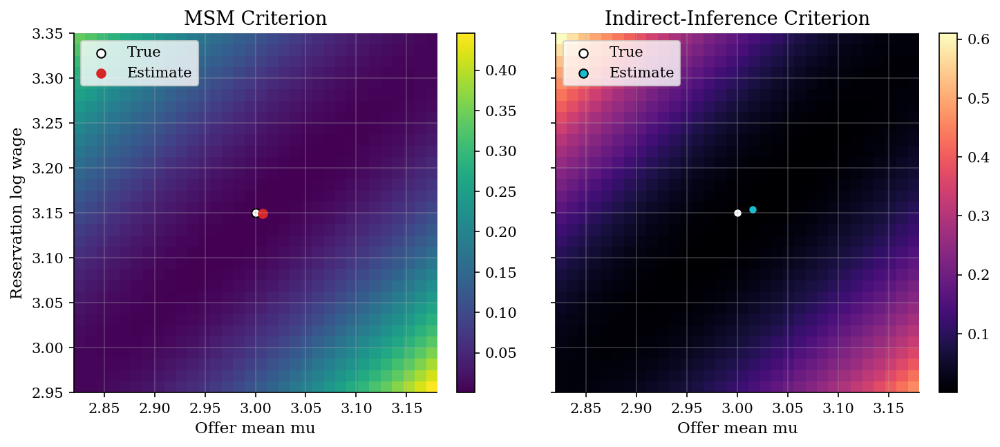
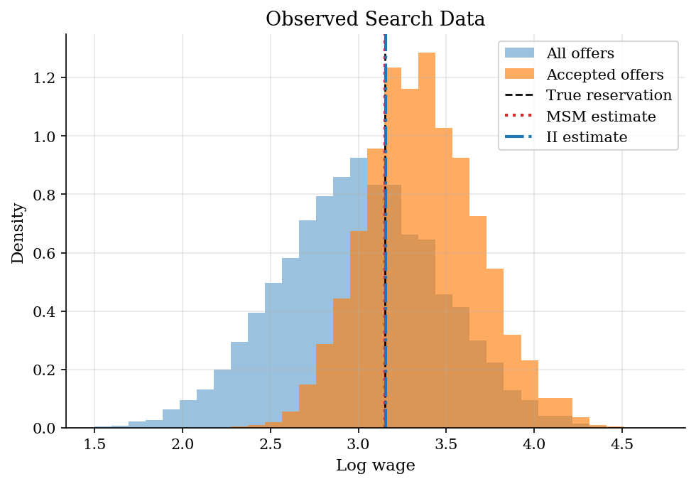
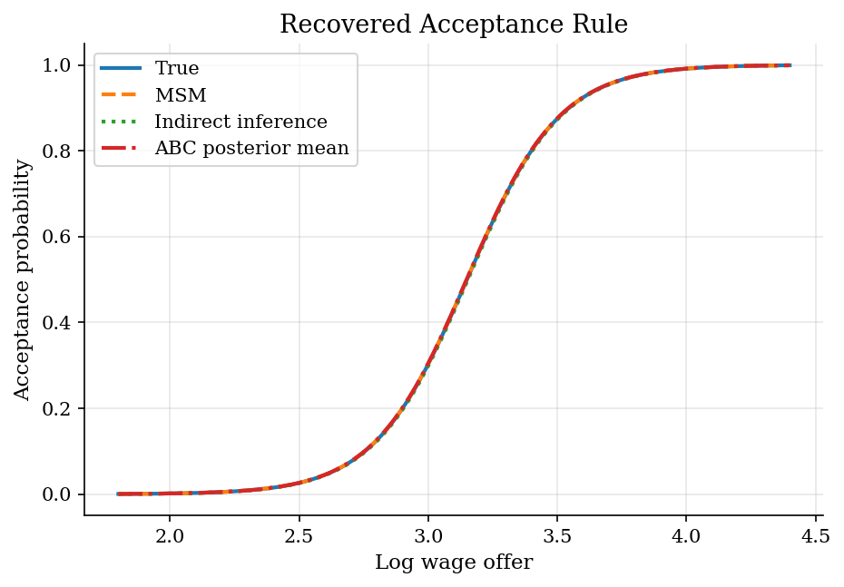

# Estimating a Search Acceptance Rule by Simulation

> Estimate offer distribution and reservation wage with simulated summaries.

## Overview

A researcher observes wage offers and whether workers accept them. The reservation wage is hidden.

The object is a rule that maps offers into acceptance probabilities. It depends on offer mean, offer dispersion, and reservation log wage.

The model is easy to simulate for any parameter vector. Simulation-based estimation searches for parameters whose simulated data match observed summaries.

## Equations

Worker $i$ receives a log wage offer,

$$
\log w_i = \mu + \sigma z_i,\qquad z_i\sim N(0,1),
$$

and accepts with probability

$$
\Pr(d_i=1\mid w_i;\theta)
= \frac{1}{1+\exp[-(\log w_i-r)/s]}.
$$

The parameter vector is $\theta=(\mu,\sigma,r)$. Parameters $\mu$ and $\sigma$
set the offer distribution. The reservation log wage is $r$. The scale $s$
fixes how sharply acceptance changes near $r$.

MSM chooses $\theta$ to match a vector of economic moments:

$$
\hat\theta_{MSM}
= \arg\min_\theta
\left[m_{sim}(\theta)-m_{obs}\right]'
W_m
\left[m_{sim}(\theta)-m_{obs}\right].
$$

Indirect inference fits an auxiliary model $a(d_i,\log w_i)$ and matches its
estimated statistics:

$$
\hat\theta_{II}
= \arg\min_\theta
\left[b_{sim}(\theta)-b_{obs}\right]'
W_b
\left[b_{sim}(\theta)-b_{obs}\right].
$$

Here the auxiliary model is a linear probability regression of acceptance on
log wages. It also includes offer-distribution and acceptance summaries. It is
not the structural model. The simulator must reproduce its fitted statistics.

## Model Setup

| Object | Value | Role |
|--------|-------|------|
| True $\mu$ | 3.00 | Mean of the latent log offer distribution |
| True $\sigma$ | 0.45 | Dispersion of latent log offers |
| True $r$ | 3.15 | Latent reservation log wage |
| Choice scale $s$ | 0.18 | Smoothness of acceptance rule |
| Observed sample | 5,000 | Synthetic data generated once from the model |
| Simulation draws | 30,000 | Common random numbers used in both criteria |
| MSM targets | 5 | Acceptance rate and offer-wage moments |
| II targets | 6 | Auxiliary acceptance coefficients and moments |

## Solution Method

The computation uses one simulator and two target vectors. For each candidate theta, the code simulates a search panel with fixed draws. It computes summaries, scales errors by target magnitudes, and minimizes the quadratic distance. Fixed draws keep the objective from changing because of fresh Monte Carlo noise.

```text
Algorithm: estimate the search rule by simulation
Input: observed offers and decisions, simulator S(theta, eps), fixed shocks eps_sim
Observed targets
  MSM: m_obs, acceptance and wage moments
  II: b_obs, auxiliary acceptance-model statistics
For each candidate theta:
  Draw simulated offers and acceptances using eps_sim
  Compute m_sim(theta) for MSM or b_sim(theta) for indirect inference
  Evaluate the scaled quadratic distance from the observed targets
Choose the theta with the smallest distance
Output: estimated offer distribution, reservation wage, residuals, and surfaces
```

MSM puts economic moments directly in the criterion. Indirect inference uses the auxiliary regression slope to summarize how acceptance changes with wages. Both criteria can identify the reservation rule when their targets use variation near the threshold.

## Results

The criterion surfaces show how each estimator trades off offer mean and reservation wage. Both plots fix offer dispersion at its true value. The valley tilts because a higher mean can offset a higher reservation wage.



The observed acceptance rate is **0.401**. Accepted wages mostly come from the upper tail of offers. Stochastic choice leaves overlap near the reservation wage. That overlap helps locate the latent threshold.



Both estimators recover the acceptance curve closely. The small gaps reflect the observed sample and finite simulation. They do not come from different search models.



Parameter estimates and residuals give a compact diagnostic. Small scaled residuals show that each target vector is matched closely.

**Known-truth parameter recovery**

| Parameter            |   True |   MSM estimate |   MSM error |   Indirect inference estimate |   Indirect inference error |
|:---------------------|-------:|---------------:|------------:|------------------------------:|---------------------------:|
| Offer mean mu        |   3    |        3.00719 |     0.00719 |                       3.01486 |                    0.01486 |
| Offer sd sigma       |   0.45 |        0.44364 |    -0.00636 |                       0.44714 |                   -0.00286 |
| Reservation log wage |   3.15 |        3.14907 |    -0.00093 |                       3.15368 |                    0.00368 |

**MSM moment residuals**

| Statistic              |   Observed target |   Simulated at estimate |   Scaled residual |
|:-----------------------|------------------:|------------------------:|------------------:|
| Acceptance rate        |           0.4012  |                 0.40027 |          -0.00233 |
| Mean log wage          |           3.00239 |                 3.00751 |           0.00171 |
| SD log wage            |           0.45058 |                 0.44322 |          -0.01634 |
| Mean accepted log wage |           3.36538 |                 3.35825 |          -0.00212 |
| SD accepted log wage   |           0.31928 |                 0.32516 |           0.01842 |

**Indirect-inference auxiliary residuals**

| Statistic              |   Observed target |   Simulated at estimate |   Scaled residual |
|:-----------------------|------------------:|------------------------:|------------------:|
| LPM intercept          |          -1.75243 |                -1.74529 |           0.00408 |
| LPM slope              |           0.71731 |                 0.7125  |          -0.0067  |
| Mean log wage          |           3.00239 |                 3.01519 |           0.00426 |
| SD log wage            |           0.45058 |                 0.44672 |          -0.00858 |
| Acceptance rate        |           0.4012  |                 0.40303 |           0.00457 |
| Mean accepted log wage |           3.36538 |                 3.36797 |           0.00077 |

## Takeaway

Simulation-based estimation is useful when the structural model is easier to simulate than to evaluate by likelihood. MSM matches economic moments chosen by the researcher. Indirect inference matches fitted statistics from an auxiliary acceptance model. Here both identify the offer distribution and reservation wage because they use threshold variation.

## References

- [McFadden, D. (1989). A Method of Simulated Moments for Estimation of Discrete Response Models Without Numerical Integration. *Econometrica*, 57(5), 995-1026.](https://doi.org/10.2307/1913621)
- [Gourieroux, C., Monfort, A., and Renault, E. (1993). Indirect Inference. *Journal of Applied Econometrics*, 8(S1), S85-S118.](https://doi.org/10.1002/jae.3950080507)
