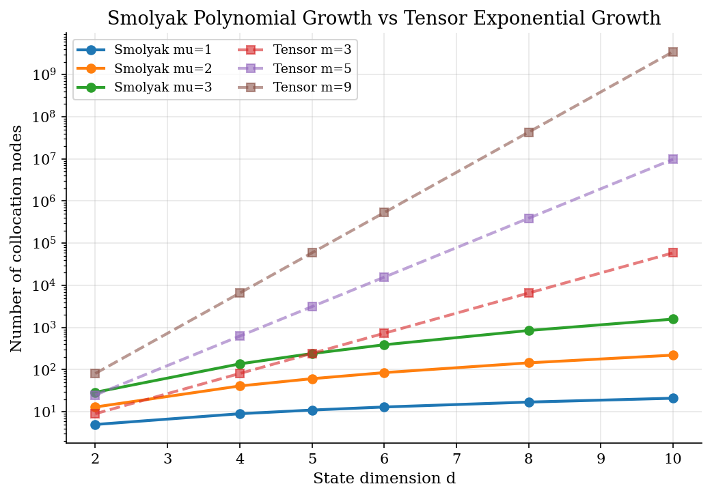
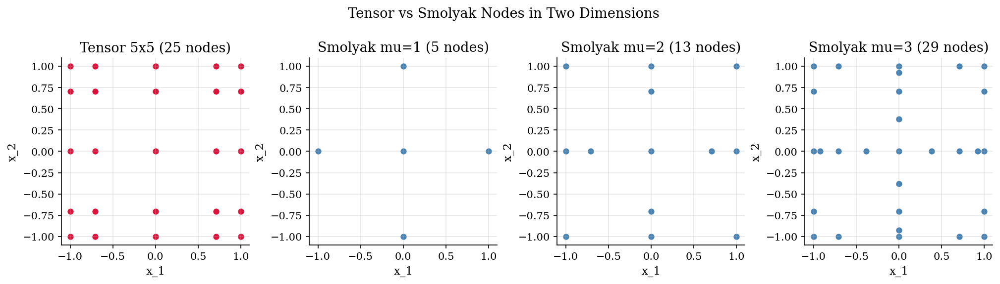
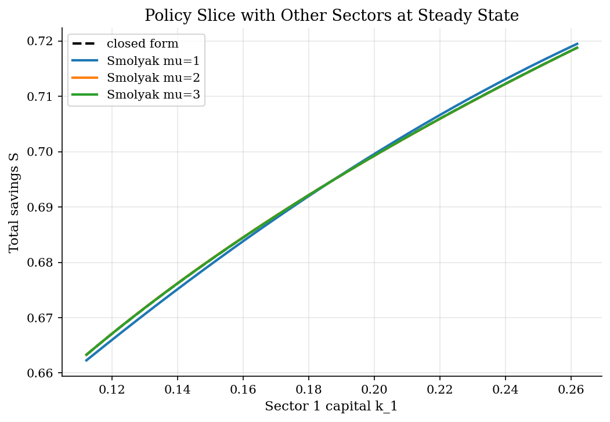
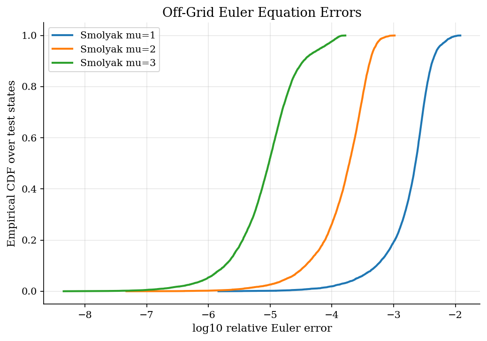

# High-Dimensional Growth Policy by Smolyak Sparse Grids

## Overview

A planner manages four sectoral capital stocks under one common productivity shock. Output flows from each sector and feeds back into consumption and the next-period capital allocations.

The state vector has five continuous coordinates. A tensor Chebyshev grid pays an exponential price in dimension for nodes per axis, which becomes wasteful long before the policy is captured. The single-state version of this projection problem is in [`computational-methods/projection-methods/`](../projection-methods/), which uses Chebyshev collocation on one capital variable.

Smolyak sparse grids keep only the tensor blocks that carry new interaction information at a chosen accuracy level. The node count then grows polynomially in dimension, and Chebyshev collocation still recovers a smooth saving rule.

## Equations

The planner chooses consumption $c$ and the next-period sectoral capitals
$k_i'$ to maximize expected log utility under a common productivity shock $z$:

$$
V(k, z) = \max_{c, k'} \left[ \log c + \beta \mathbb{E}[V(k', z') \mid z] \right],
\qquad
c + \sum_{i=1}^{N} k_i' = e^{z} \sum_{i=1}^{N} A_i k_i^{\alpha}.
$$

Productivity follows an AR(1) process $z' = \rho_z z + \sigma_z \varepsilon'$
with $\varepsilon' \sim \mathcal{N}(0, 1)$. The first-order conditions across
sectors give one Euler equation per capital:

$$
\frac{1}{c} = \beta \alpha A_i \mathbb{E}\left[ \frac{e^{z'} (k_i')^{\alpha - 1}}{c'} \,\middle|\, z \right],
\qquad i = 1, \dots, N.
$$

Taking the ratio of two sector FOCs eliminates the expectation. Because the
shock $z$ is common, the ratio of marginal products of capital must equal the
ratio of saving choices raised to $\alpha - 1$, which pins down the cross-sector
allocation in closed form:

$$
\frac{A_i (k_i')^{\alpha - 1}}{A_j (k_j')^{\alpha - 1}} = 1,
\qquad
k_i' = \omega_i\, S,
\qquad
\omega_i = \frac{A_i^{1 / (1 - \alpha)}}{\sum_{j=1}^{N} A_j^{1 / (1 - \alpha)}}.
$$

Here $S \equiv \sum_i k_i'$ is total savings and $\omega_i$ is the sector
share. With the calibration $\alpha = 0.36$ and
$A = (1.00, 0.90, 1.10, 0.80)$ the exponent is $1/(1-\alpha) \approx 1.5625$
and the worked shares are

$$
A^{1/(1-\alpha)} \approx (1.000, 0.848, 1.161, 0.706),
\qquad
Z \approx 3.714,
\qquad
\omega \approx (0.269, 0.228, 0.312, 0.190).
$$

With $Z \equiv \sum_j A_j^{1 / (1 - \alpha)}$, the four sector Euler
equations collapse to a single scalar condition on $S$:

$$
\frac{1}{c} = \beta \alpha Z^{1 - \alpha} S^{\alpha - 1} \mathbb{E}\left[ \frac{e^{z'}}{c'} \,\middle|\, z \right].
$$

This is the unknown that Smolyak collocation will fit on $[-1, 1]^{d}$ after a
linear rescaling of the state. For this calibration the closed-form policy is
$S^{\ast}(k, z) = \alpha \beta Y(k, z)$, with $Y(k, z) = e^{z} \sum_i A_i k_i^{\alpha}$.
Each sector then receives $k_i' = \omega_i S$ and the planner consumes
$c = (1 - \alpha \beta) Y$.

### Sparse grid construction

The construction reuses one-dimensional nested Chebyshev extrema with the
doubling rule $m_1 = 1$ and $m_i = 2^{i-1} + 1$ for $i \ge 2$. The 1D node
set at level $i$ is $X_i = \lbrace -\cos(\pi (j - 1) / (m_i - 1)) : j = 1, \dots, m_i \rbrace$
with $X_1 = \lbrace 0 \rbrace$, and the doubling rule guarantees
$X_i \subset X_{i+1}$ so refinement reuses prior function evaluations.

Smolyak builds a $d$-dimensional grid by combining only the tensor blocks whose
total level falls in a narrow band. A level multi-index
$\mathbf{i} = (i_1, \dots, i_d)$ with $i_k \ge 1$ is admissible at level
$\mu \ge 0$ when

$$
\underbrace{\mu + 1 \le |\mathbf{i}|}_{\text{enough resolution}} \le \underbrace{|\mathbf{i}| \le \mu + d}_{\text{not too refined in any dimension}},
\qquad
|\mathbf{i}| \equiv i_1 + \cdots + i_d.
$$

The sparse grid is the deduplicated union of admissible tensor products:

$$
H(d, \mu) = \bigcup_{\mu + 1 \le |\mathbf{i}| \le \mu + d} X_{i_1} \times \cdots \times X_{i_d}.
$$

The admissibility band is the entire point of the method, and each side of the band is there for a different reason.
The lower bound $|\mathbf{i}| \ge \mu + 1$ excludes blocks that are too coarse: their contribution is already captured inside a finer admissible block, so keeping them duplicates information.
The upper bound $|\mathbf{i}| \le \mu + d$ excludes blocks that refine too aggressively in a single dimension at the expense of the others: those blocks belong to a tensor product, not a sparse grid, because they refine one axis far beyond the joint resolution the method targets.
Keeping only the band in between is what reduces the node count from the tensor product
$|H_{\mathrm{tensor}}| = \underbrace{(2^{\mu} + 1)^{d}}_{\text{exponential in } d}$
to
$|H(d, \mu)| = \underbrace{O(2^{\mu} d^{\mu} / \mu!)}_{\text{polynomial in } d \text{ for fixed } \mu}$.
At the calibration used below ($d = 5$, $\mu = 2$) the band gives 61 nodes whereas the tensor product would need 3125, which is why Smolyak scales and dense Chebyshev does not.

In two dimensions the construction is easy to enumerate. At $\mu = 1$ the
admissible level multi-indices satisfy $2 \le |\mathbf{i}| \le 3$, so the
admissible blocks are $(1, 1), (1, 2), (2, 1)$. With $X_1 = \lbrace 0 \rbrace$
and $X_2 = \lbrace -1, 0, 1 \rbrace$ the three tensor blocks are

$$
X_1 \times X_1 = \lbrace (0, 0) \rbrace,
\qquad
X_1 \times X_2 = \lbrace (0, -1), (0, 0), (0, 1) \rbrace,
$$

$$
X_2 \times X_1 = \lbrace (-1, 0), (0, 0), (1, 0) \rbrace.
$$

Their union, after removing the duplicate $(0, 0)$, is the five-point set

$$
H(2, 1) = \lbrace (0, 0), (0, -1), (0, 1), (-1, 0), (1, 0) \rbrace,
$$

a center point with two axis endpoints in each direction. At $\mu = 2$ the
admissible blocks expand to add $(2, 2), (1, 3), (3, 1)$, and the union grows
to thirteen unique points. The figure of two-dimensional grids in the results
section visualizes these point sets next to the $5 \times 5$ tensor
alternative.

### Polynomial basis paired with the grid

The Smolyak collocation system is square only when the polynomial basis is
chosen to match the node set. For each 1D Chebyshev degree $a \ge 0$, define
the polynomial level needed to first include $T_a$ in the level-$i$
polynomial space:

$$
\ell(a) = \begin{cases} 0 & a = 0, \\ 1 & a = 1, \\ \lceil \log_2 a \rceil & a \ge 2. \end{cases}
$$

The first few values are $\ell(0) = 0, \ell(1) = \ell(2) = 1, \ell(3) = \ell(4) = 2$:
each level $i \ge 2$ adds Chebyshev polynomials of degree up to $m_i - 1 = 2^{i-1}$.
The Smolyak basis at level $\mu$ in dimension $d$ then consists of the tensor
products whose summed polynomial level fits within the budget:

$$
\mathcal{B}(d, \mu) = \left\lbrace T_{a_1}(x_1) \cdots T_{a_d}(x_d) : \sum_{k=1}^{d} \ell(a_k) \le \mu \right\rbrace.
$$

Returning to the worked $d = 2, \mu = 1$ case, the admissible degree pairs
$(a_1, a_2)$ are those with $\ell(a_1) + \ell(a_2) \le 1$:

$$
(0, 0),\ (0, 1),\ (0, 2),\ (1, 0),\ (2, 0),
$$

so the basis polynomials are

$$
T_0(x_1) T_0(x_2),\ T_0(x_1) T_1(x_2),\ T_0(x_1) T_2(x_2),\ T_1(x_1) T_0(x_2),\ T_2(x_1) T_0(x_2).
$$

Five basis polynomials match the five nodes of $H(2, 1)$. The cardinality of
$\mathcal{B}(d, \mu)$ equals the cardinality of $H(d, \mu)$ in general, so the
basis matrix $\Phi_{n,k} = \prod_j T_{a_{k,j}}(x_n^{(j)})$ is square and
invertible at the Smolyak nodes. Collocation then sets the policy residual to
zero at each node and recovers the unique coefficient vector $\theta$ that
represents $\log S(x; \theta) = \Phi(x) \theta$.

## Model Setup

| Symbol | Object | Value |
|--------|--------|-------|
| $\beta$ | Discount factor | 0.95 |
| $\alpha$ | Capital share | 0.36 |
| $N$ | Sectors | 4 |
| $d$ | State dimension | 5 |
| $A$ | Sector productivities | (1.00, 0.90, 1.10, 0.80) |
| $\omega$ | Sector shares | (0.269, 0.228, 0.312, 0.190) |
| $\rho_z$ | Productivity persistence | 0.95 |
| $\sigma_z$ | Productivity innovation SD | 0.010 |
| $k^{ss}$ | Sectoral steady states | (0.187, 0.159, 0.217, 0.132) |
| Quadrature | Gauss-Hermite nodes for $z'$ | 3 |
| Smolyak levels solved | $\mu$ values | (1, 2, 3) |

## Solution Method

The Smolyak approximator targets $\log S(x; \theta) = \Phi(x) \theta$ on $[-1, 1]^{d}$ after a linear rescaling of the state. Three ideas do the heavy lifting: the admissible grid construction defined in the Equations section, the matching polynomial basis that makes $\Phi$ square, and a time-iteration scheme that exploits the cross-sector FOC structure so each node decouples into a scalar root problem.

The single-state Chebyshev collocation step is the same one used in the [`projection-methods/`](../projection-methods/) tutorial. What is new here is how nodes and basis polynomials are selected jointly across $d$ dimensions, and how the planner's symmetric Euler equations let the $d$-dimensional fixed point reduce to a sequence of $1$-D solves.

### Decoupling the collocation residual

Time iteration freezes $\theta^{\mathrm{old}}$ on the right-hand side of the Euler equation. At each node $x^{(n)}$ the conditional expectation

$$
E_n(\theta^{\mathrm{old}}) = \sum_{q} w_q \frac{e^{z'_q}}{c'_q(\theta^{\mathrm{old}})}
$$

is a known number once $\theta^{\mathrm{old}}$ is fixed, where $(z'_q, w_q)$ are Gauss-Hermite nodes and weights for the productivity innovation and $c'_q(\theta^{\mathrm{old}})$ is consumption next period evaluated through the old policy. The collapsed Euler condition then becomes

$$
(Y_n - S_n) \cdot S_n^{\alpha - 1} = \frac{1}{\beta \alpha Z^{1-\alpha} E_n},
$$

a scalar equation in $S_n \in (0, Y_n)$. The left-hand side is strictly decreasing in $S_n$ on that interval, so a one-dimensional bracketed root solver returns the unique $S_n^{\mathrm{new}}$ at each node. The new coefficient vector is $\theta^{\mathrm{new}} = \Phi^{-1} \log S^{\mathrm{new}}$, and the iteration stops when $\|\theta^{\mathrm{new}} - \theta^{\mathrm{old}}\|_{\infty}$ falls below tolerance. Without the cross-sector ratio identity, each node would carry $N$ unknowns and the system would have to be solved jointly across nodes.

### Full algorithm

```text
Algorithm: Smolyak time iteration for the multi-sector planner
Input: dimension d, level mu, parameters (beta, alpha, A_1..A_N, rho, sigma),
       state bounds [lo, hi], quadrature nodes (eps_q, w_q), tol = 1e-7
Output: converged coefficients theta_star
1. Build admissible level set I = {i : mu+1 <= |i| <= mu+d, i_k >= 1}
2. Build sparse grid H = dedup union over i in I of X_{i_1} x ... x X_{i_d}
3. Build admissible degree set A = {a : sum_k level(a_k) <= mu}
4. Build basis matrix Phi with Phi[n, k] = prod_j T_{A[k, j]}(H[n, j])
5. theta_old <- coefficients of a constant saving fraction
6. repeat:
     for each node x_n in H:
       compute next-period state x_n' under k' = omega * S(x_n; theta_old)
       evaluate E_n by Gauss-Hermite quadrature over productivity shocks
       solve scalar Euler equation for S_n in (0, Y_n) via brentq
     theta_new <- Phi^{-1} log S
     if max_k |theta_new[k] - theta_old[k]| < tol: break
     theta_old <- theta_new
7. return theta_new
```

Two failure modes show up if the construction is altered. Pairing the Smolyak grid with a hyperbolic-cross basis leaves $\Phi$ non-square and the inverse in step 7 fails. Updating $\theta^{\mathrm{new}}$ inside the expectation rather than holding $\theta^{\mathrm{old}}$ fixed couples every node with every other and the implicit Jacobian becomes ill-conditioned at higher $\mu$. Time iteration sidesteps both.

## Results

Tensor grids charge an exponential price for each new state dimension. Smolyak nodes grow polynomially in dimension at a fixed accuracy level.



In two dimensions Smolyak keeps the axis directions resolved at higher level and skips the interior tensor points that contribute little new information.



Across five state dimensions the level-2 Smolyak grid uses 61 nodes where a tensor of 5 points per dimension would charge 3,125.

**Tensor versus Smolyak node counts across dimensions**

|   Dimension d |   Smolyak level mu | Tensor nodes   | Smolyak nodes   |   Tensor / Smolyak ratio |
|--------------:|-------------------:|:---------------|:----------------|-------------------------:|
|             2 |                  1 | 9              | 5               |              1.8         |
|             2 |                  2 | 25             | 13              |              1.92        |
|             2 |                  3 | 81             | 29              |              2.79        |
|             4 |                  1 | 81             | 9               |              9           |
|             4 |                  2 | 625            | 41              |             15.24        |
|             4 |                  3 | 6,561          | 137             |             47.89        |
|             5 |                  1 | 243            | 11              |             22.09        |
|             5 |                  2 | 3,125          | 61              |             51.23        |
|             5 |                  3 | 59,049         | 241             |            245.02        |
|             6 |                  1 | 729            | 13              |             56.08        |
|             6 |                  2 | 15,625         | 85              |            183.82        |
|             6 |                  3 | 531,441        | 389             |           1366.17        |
|             8 |                  1 | 6,561          | 17              |            385.94        |
|             8 |                  2 | 390,625        | 145             |           2693.97        |
|             8 |                  3 | 43,046,721     | 849             |          50702.8         |
|            10 |                  1 | 59,049         | 21              |           2811.86        |
|            10 |                  2 | 9,765,625      | 221             |          44188.3         |
|            10 |                  3 | 3,486,784,401  | 1,581           |              2.20543e+06 |

A k_1 slice with the other sectors at their steady-state values shows the Smolyak approximations converging onto the closed-form total savings rule as the level rises.



Off-grid Euler residuals at 10,000 Sobol test states confirm that higher-level Smolyak grids drive the worst-case error down by orders of magnitude.



The accuracy table shows that adding a Smolyak level cuts the worst-case Euler error sharply while runtime grows only with the modest increase in node count.

**Accuracy and runtime by Smolyak level**

| Method       |   Nodes |   Max Euler error |   Median Euler error |   Max savings error |   Seconds |
|:-------------|--------:|------------------:|---------------------:|--------------------:|----------:|
| Smolyak mu=1 |      11 |          0.012    |             0.00226  |            0.00911  |      0    |
| Smolyak mu=2 |      61 |          0.00104  |             0.000191 |            0.000933 |      0.01 |
| Smolyak mu=3 |     241 |          0.000165 |             9.49e-06 |            0.000166 |      0.05 |

With Smolyak level $\mu = 3$ on $d = 5$ states the policy is stored in 241 coefficients. The worst-case relative Euler error on the 10,000-point Sobol test set is 1.65e-04 and the median is 9.49e-06. The same accuracy under a tensor Chebyshev grid would charge 59,049 nodes.

## Takeaway

Smolyak sparse grids replace the tensor exponential with a polynomial node count at the cost of a slightly slower spectral convergence rate. For the smooth policies that arise in growth, RBC, and life-cycle models the trade is favorable up to about 20 continuous states. Beyond that, adaptive sparse grids that refine only in directions where the residual is large recover a further gain. Brumm and Scheidegger (2017) develop the adaptive extension.

## References

- [Judd, K. L., Maliar, L., Maliar, S., and Valero, R. (2014). Smolyak Method for Solving Dynamic Economic Models. *Journal of Economic Dynamics and Control*, 44, 92-123.](https://doi.org/10.1016/j.jedc.2014.03.003)
- [Brumm, J. and Scheidegger, S. (2017). Using Adaptive Sparse Grids to Solve High-Dimensional Dynamic Models. *Econometrica*, 85(5), 1575-1612.](https://doi.org/10.3982/ECTA12216)
- [Malin, B. A., Krueger, D., and Kubler, F. (2011). Solving the Multi-Country Real Business Cycle Model Using a Smolyak-Collocation Method. *Journal of Economic Dynamics and Control*, 35(2), 229-239.](https://doi.org/10.1016/j.jedc.2010.09.011)
- [Smolyak, S. A. (1963). Quadrature and Interpolation Formulas for Tensor Products of Certain Classes of Functions. *Doklady Akademii Nauk SSSR*, 148, 1042-1045.](https://www.mathnet.ru/eng/dan28167)
