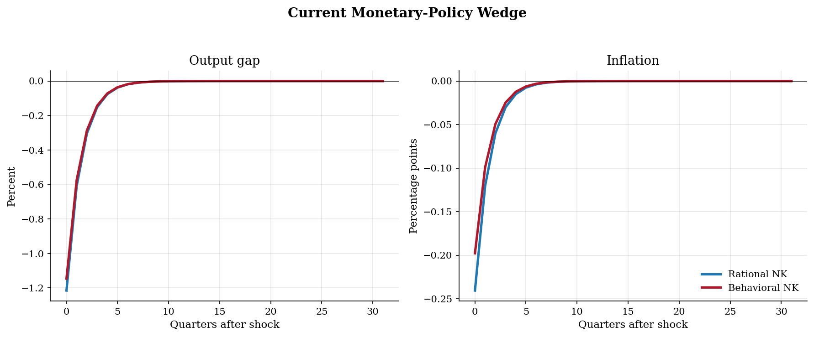
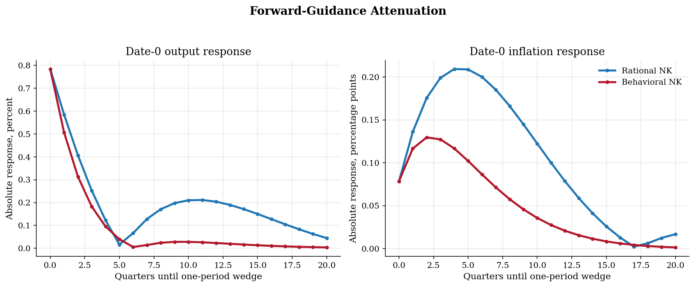

# Cognitive Discounting in a Behavioral New Keynesian Model

## Overview

Central banks often talk about future rates. The rational New Keynesian model gives those announcements a strong effect today because households and firms look far ahead. Gabaix's behavioral model asks what changes when they put less weight on future conditions.

This tutorial keeps the same linearized New Keynesian block in both models. The rational benchmark sets the attention parameters to one. The behavioral case sets them below one. Agents still respond to the future, but the future pulls less on today's output and inflation.

The computation is small. Coefficient matching solves a current AR(1) policy wedge. A backward recursion solves forward guidance, where a one-quarter policy wedge arrives several quarters from now.

## Equations

All variables are deviations from steady state. Let $x_t$ be the output gap,
$\pi_t$ inflation, $i_t$ the policy rate, $r^n_t$ the natural real rate, and
$v_t$ a policy-rate wedge. The behavioral New Keynesian block is

$$
x_t = M\mathbb{E}_t x_{t+1} - \sigma(i_t-\mathbb{E}_t\pi_{t+1}-r^n_t),
$$

$$
\pi_t = \beta M_f\mathbb{E}_t\pi_{t+1} + \kappa x_t + u_t,
$$

$$
i_t = \phi_\pi \pi_t + \phi_x x_t + v_t.
$$

Here $u_t$ is a cost-push shock, set to zero in both experiments run here.

The only change from the rational model is the pair $(M,M_f)$. The parameter
$M$ multiplies expected future output in the IS curve. The parameter $M_f$
multiplies expected future inflation in the Phillips curve. They do not change
the static Taylor rule. They change how strongly future variables enter current
private decisions.

The rational benchmark uses $M=M_f=1$. The behavioral benchmark uses
$M=M_f=0.85$.

For the current monetary-policy experiment,

$$
v_t=\rho_v v_{t-1}+\varepsilon^v_t.
$$

The forward-guidance experiment instead sets $v_H=\varepsilon^v_H$ for one future
quarter $H$ and sets all other policy wedges to zero.

## Model Setup

| Primitive | Value | Role |
|---|---:|---|
| $\sigma$ | 1 | Interest sensitivity in the IS curve |
| $\beta$ | 0.99 | Quarterly discount factor |
| $\kappa$ | 0.1 | Slope of the Phillips curve |
| $\phi_\pi$ | 1.5 | Taylor-rule response to inflation |
| $\phi_x$ | 0.125 | Taylor-rule response to the output gap |
| $\rho_v$ | 0.5 | Persistence of the current policy wedge |
| Shock innovation | 0.010 | One-percentage-point policy wedge |
| Rational attention | 1.000 | $M=M_f=1$ |
| Behavioral attention | 0.850 | $M=M_f=0.85$ |
| IRF horizon | 32 quarters | Length of the current-shock paths |
| News horizon | 20 quarters | Furthest date of the future policy wedge |

## Solution Method

Let the active current shock be $s_t=v_t$ with $\mathbb{E}_t s_{t+1}=\rho_v s_t$. Guess linear responses:

$$x_t=\psi_x s_t,\qquad \pi_t=\psi_\pi s_t,\qquad i_t=\psi_i s_t.$$

Plug the guess into the IS curve and Phillips curve. The Taylor rule then gives this 2 by 2 system:

$$
\begin{bmatrix}
1-M\rho_v+\sigma\phi_x & \sigma(\phi_\pi-\rho_v) \\
-\kappa & 1-\beta M_f\rho_v
\end{bmatrix}
\begin{bmatrix}\psi_x \\ \psi_\pi\end{bmatrix} =
\begin{bmatrix}-\sigma \\ 0\end{bmatrix}.
$$

After solving for $\psi_x$ and $\psi_\pi$, compute $\psi_i=\phi_\pi\psi_\pi+\phi_x\psi_x+1$.

Forward guidance uses a different state. The state is the date of the announced wedge. Start from $x_{H+1}=\pi_{H+1}=0$. Then step backward:

```text
Algorithm: current and future policy wedges
Inputs: beta, sigma, kappa, phi_pi, phi_x, M, M_f, rho_v, shock size eps
Outputs: output, inflation, and policy-rate responses

1. For a current AR(1) wedge, solve the 2 by 2 coefficient system above.
2. Iterate v_t=rho_v^t eps to draw the current-shock IRF.
3. For a future wedge at H, set v_H=eps and v_t=0 otherwise.
4. Given x_{t+1} and pi_{t+1}, solve the two date-t equations backward.
5. Record x_0 and pi_0 for each H and compare rational with behavioral attention.
```

The forward-guidance recursion uses the same linear model. It treats the future policy wedge as a deterministic announcement. It does not use an AR(1) state.

## Results

A current rate wedge lowers output today. Lower output then lowers inflation through the Phillips curve. In the behavioral model, households and firms put less weight on future output and future inflation. That weakens the feedback loop from future conditions back to today. The current-shock response is therefore slightly smaller in cumulative terms.



The forward-guidance figure reports absolute date-0 responses. A future rate wedge matters today only through expectations. The rational model lets that future wedge travel backward through the IS curve and Phillips curve. Cognitive discounting breaks part of that backward chain, so the behavioral response is smaller than the rational one at most horizons. It is not smaller everywhere. At a zero-quarter horizon the wedge is contemporaneous, there is nothing to discount, and the two models tie exactly. Near the sign-change band the rational and behavioral curves cross sign at different dates, so a short window around a five-quarter horizon has the behavioral absolute response slightly above the rational one at very small magnitudes. The shape is not a simple monotone decay, though. Both models trace a hump: the absolute date-0 response falls to a local minimum near a six-quarter horizon, then rises again before declining at long horizons. The rise is a residual forward-guidance puzzle. The signed date-0 output response changes sign at moderate horizons, so a future rate hike can raise current output rather than lower it. Cognitive discounting at M = M_f = 0.85 shrinks this puzzle but does not remove it; the sign reversal still appears in the behavioral model from a seven-quarter horizon onward. The clean result is the level gap, not monotone decay: distant forward guidance is much weaker under behavioral attention than under rational expectations.



The table reports percent or percentage-point responses. The first columns use the persistent current wedge. The last two columns show the signed date-0 response to a one-quarter wedge announced eight quarters ahead.

**Policy-Wedge Responses**

| Setting       |    M |   M_f |   Output impact |   Inflation impact |   Nominal-rate impact |   Cumulative output |   Cumulative inflation |   FG output H=8 |   FG inflation H=8 |
|:--------------|-----:|------:|----------------:|-------------------:|----------------------:|--------------------:|-----------------------:|----------------:|-------------------:|
| Rational NK   | 1    |  1    |          -1.215 |             -0.241 |                 0.487 |              -2.43  |                 -0.481 |           0.171 |             -0.166 |
| Behavioral NK | 0.85 |  0.85 |          -1.146 |             -0.198 |                 0.56  |              -2.292 |                 -0.396 |           0.024 |             -0.058 |

## Takeaway

Cognitive discounting changes the expectation channel. It does not change the static Taylor rule. When $M$ and $M_f$ fall below one, future output and inflation matter less for today's choices. Current monetary shocks have slightly smaller cumulative effects. Distant forward-guidance shocks lose much more of their current bite.

## References

- Gabaix, X. (2020). A Behavioral New Keynesian Model. *American Economic Review*, 110(8), 2271-2327. https://doi.org/10.1257/aer.20162005.
- Gabaix, X. (2016). A Behavioral New Keynesian Model. NBER Working Paper 22954. https://doi.org/10.3386/w22954.
- Gabaix, X. (2020). Replication Code for: A Behavioral New Keynesian Model. AEA Data and Code Repository. https://doi.org/10.3886/E117842V1.
- Gali, J. (2015). *Monetary Policy, Inflation, and the Business Cycle*. Princeton University Press, 2nd edition.
- Woodford, M. (2003). *Interest and Prices: Foundations of a Theory of Monetary Policy*. Princeton University Press.
