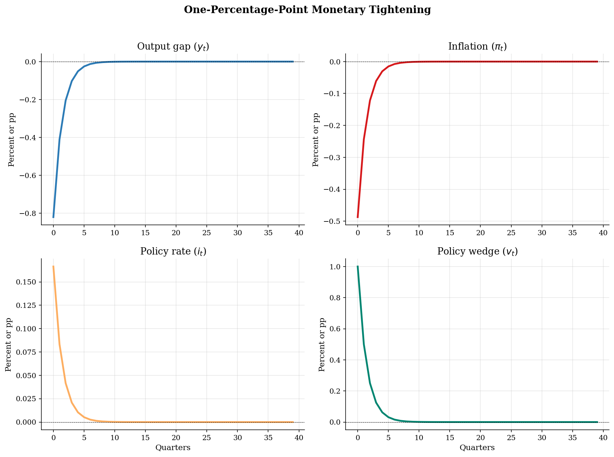
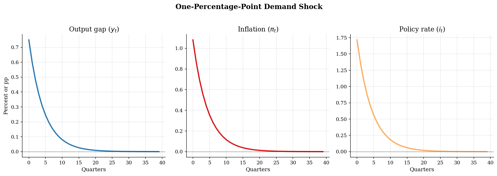

# Sticky-Price Monetary Transmission in a New Keynesian DSGE

> Policy and demand shocks in a three-equation New Keynesian model, solved by coefficient matching.

## Overview

A central bank raises the policy rate when firms adjust prices slowly. The nominal surprise raises the real rate before prices catch up. Demand falls, and the Phillips curve turns the lower output gap into lower inflation.

The model has three variables: output gap $y_t$, inflation $\pi_t$, and policy rate $i_t$. The shocks are a Taylor-rule wedge $v_t$ and a natural-rate demand shock $d_t$. The tutorial studies their impulse responses.

Today's output and inflation depend on expected future values, so the equilibrium is forward looking. Because the system is log-linear, coefficient matching solves the shock loadings directly. A Klein QZ solve checks the same stable path.

## Equations

All variables are deviations from the zero-inflation steady state. Let $y_t$ be
the output gap, $\pi_t$ inflation, $i_t$ the policy rate, and $r^n_t$ the natural
real rate. The model has an IS curve, New Keynesian Phillips curve, and Taylor
rule:

$$
y_t =
\mathbb{E}_t y_{t+1} - \frac{1}{\sigma}
\left(i_t-\mathbb{E}_t\pi_{t+1}-r^n_t\right),
$$

$$
\pi_t = \beta \mathbb{E}_t \pi_{t+1}+\kappa y_t,
$$

$$
i_t = \phi_\pi \pi_t+\phi_y y_t+v_t.
$$

The policy wedge follows

$$
v_t=\rho_v v_{t-1}+\varepsilon^v_t,
$$

The demand experiment sets the natural-rate term to

$$
r^n_t=d_t,\qquad d_t=\rho_d d_{t-1}+\varepsilon^d_t.
$$

The report keeps $v_t$ and $d_t$ separate so the two shocks do not blur together.

## Model Setup

| Primitive | Value | Role |
|---|---:|---|
| $\sigma$ | 1 | Inverse EIS in the IS curve |
| $\beta$ | 0.99 | Quarterly discount factor |
| $\kappa$ | 0.3 | Slope of the New Keynesian Phillips curve |
| $\phi_\pi$ | 1.5 | Taylor-rule response to inflation |
| $\phi_y$ | 0.125 | Taylor-rule response to the output gap |
| $\rho_v$ | 0.5 | Persistence of the policy shock |
| $\rho_d$ | 0.8 | Persistence of the demand shock |
| Shock innovation | 0.010 | One-percentage-point innovation at date 0 |
| IRF horizon | 40 quarters | Periods shown in each impulse response |

The source `model.mod` uses $\phi_\pi=0.33$ and $\kappa=0.95$. The tutorial instead uses $\phi_\pi=1.5$ and $\kappa=0.3$. That calibration keeps the Taylor rule active enough to select one stable path.

## Solution Method

Let the active shock be $s_t=\rho_s s_{t-1}+\varepsilon_t$. The equilibrium object is a pair of coefficients. They map the shock state into output and inflation:

$$y_t=\psi_y s_t,\qquad \pi_t=\psi_\pi s_t. $$

The Phillips curve links the two coefficients:

$$\psi_\pi=\frac{\kappa\psi_y}{1-\beta\rho_s}. $$

Substituting the guess into the IS curve and Taylor rule leaves one scalar equation:

$$\psi_y\left[(1-\rho_s)+\frac{\phi_y}{\sigma}+\frac{(\phi_\pi-\rho_s)\kappa}{\sigma(1-\beta\rho_s)}\right]= b_s,$$

Here $b_s=-1/\sigma$ for a policy wedge and $b_s=1$ for a demand shock. The sign changes because the two shocks enter different equations.

```text
Algorithm: New Keynesian impulse responses
Inputs: beta, sigma, kappa, phi_pi, phi_y, rho_s, shock eps_0, horizon T
Outputs: paths for y_t, pi_t, i_t, and the shock state s_t

1. Pick v_t or d_t, then set rho_s and b_s.
2. Use the Phillips curve to write psi_pi as a function of psi_y.
3. Match the coefficient on s_t in the IS curve and Taylor rule.
4. Recover psi_y, psi_pi, and the policy-rate coefficient psi_i.
5. Iterate s_t and plot y_t, pi_t, and i_t.
```

Klein QZ solves the same linear system as a check. The coefficient solution and QZ solution differ by at most 1.4e-15. This confirms the stable rational-expectations equilibrium for this calibration.

## Results

The monetary shock is the Taylor-rule wedge, not the full policy-rate response. The wedge raises the real rate on impact. Output and inflation fall, so the systematic part of the rule partly offsets the wedge.



A positive natural-rate shock raises current demand at a given nominal rate. Output and inflation rise together. The Taylor rule raises the policy rate, which dampens the expansion.



The table reports impact signs and sizes. Output is in percent deviations. Inflation and the policy rate are quarterly percentage points. The two shocks move output and inflation in opposite directions.

**Impact Responses to One-Percentage-Point Shocks**

| Variable     |   Monetary shock impact |   Demand shock impact |
|:-------------|------------------------:|----------------------:|
| Output gap   |                  -0.82  |                 0.749 |
| Inflation    |                  -0.487 |                 1.081 |
| Nominal rate |                   0.166 |                 1.715 |

## Takeaway

The three-equation New Keynesian model shows how sticky prices make nominal policy matter. A policy wedge raises the real rate and contracts demand. A natural-rate shock expands demand and inflation, with the Taylor rule leaning back.

Coefficient matching is enough because the model is log-linear. The Klein QZ check confirms the same stable equilibrium. Determinacy is economic here: inflation feedback selects one forward-looking path.

## References

- Gali, J. (2015). *Monetary Policy, Inflation, and the Business Cycle*. Princeton University Press, 2nd edition.
- Woodford, M. (2003). *Interest and Prices: Foundations of a Theory of Monetary Policy*. Princeton University Press.
- Clarida, R., Gali, J., and Gertler, M. (1999). The Science of Monetary Policy: A New Keynesian Perspective. *Journal of Economic Literature*, 37(4), 1661-1707.
- Klein, P. (2000). Using the Generalized Schur Form to Solve a Multivariate Linear Rational Expectations Model. *Journal of Economic Dynamics and Control*, 24(10), 1405-1423.
