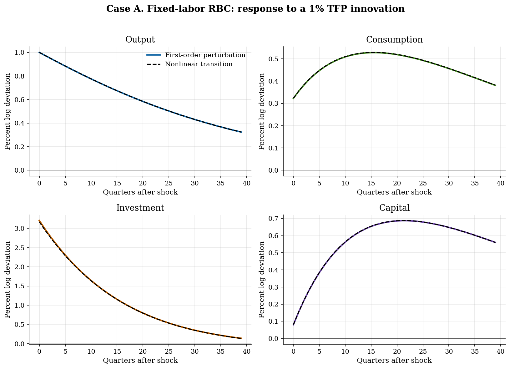
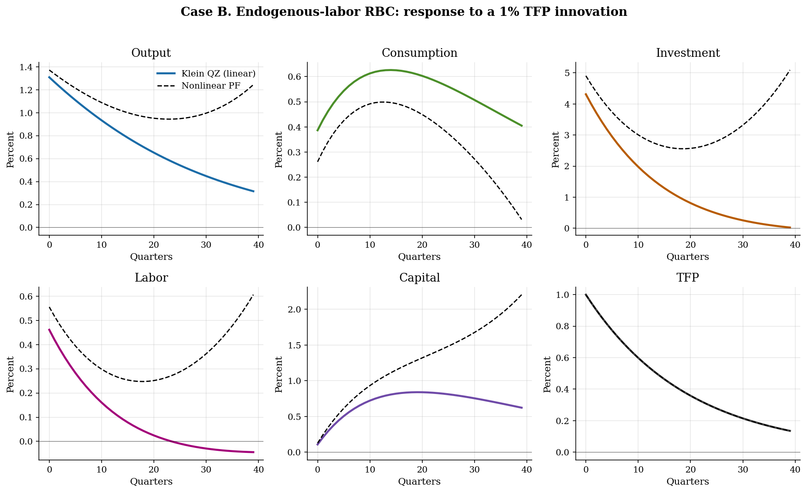
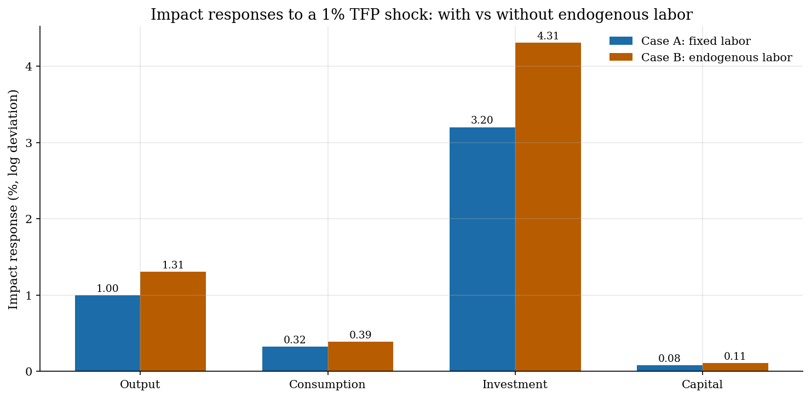

# Linearized RBC by Perturbation and QZ (with and without endogenous labor)

## Overview

A productivity shock changes the marginal product of every input. Capital was chosen yesterday and cannot move on impact. So the household carries the shock forward through investment. If labor is endogenous, hours can move on impact too and share the response.

The tutorial walks two cases on the same primitives. Case A keeps labor fixed. The system has three equations and one jump variable. Case B adds endogenous labor. The system grows to four equations and two jump variables.

Two solvers run in parallel. The fixed-labor case is small enough to solve by hand. We guess a linear capital decision rule and match coefficients on the linearized Euler equation. Klein QZ generalized-Schur cross-checks the answer to machine precision. The endogenous-labor case is too messy for hand algebra. Klein QZ is the primary solver there.

Each linear solution is checked against the exact nonlinear perfect-foresight transition for the same TFP path.

## Equations

The same primitives drive both cases. The only structural difference is
whether labor is fixed or chosen.

### A. Common setup

Let $A_t$ denote total factor productivity, $K_{t-1}$ predetermined capital,
$C_t$ consumption, $I_t$ investment, $Y_t$ output, and (when present) $N_t$
hours worked. Production is Cobb-Douglas and the resource constraint splits
output into consumption and investment:

$$Y_t = A_t K_{t-1}^\alpha N_t^{1-\alpha}, \qquad Y_t = C_t + I_t,$$

$$K_t = I_t + (1-\delta)K_{t-1}.$$

TFP follows an AR(1) in logs:

$$\log A_t = \rho \log A_{t-1} + \varepsilon_t, \qquad \varepsilon_t \sim N(0, \sigma_\varepsilon^2).$$

The household has CRRA utility over consumption. With endogenous labor it also
dislikes hours:

$$\mathbb{E}_0\sum_{t=0}^{\infty} \beta^t \left[\frac{C_t^{1-\sigma}}{1-\sigma} - \psi \frac{N_t^{1+\chi}}{1+\chi}\right].$$

The labor-disutility weight $\psi$ disappears in Case A because $N_t$ is fixed
at one. The consumption Euler equation is

$$C_t^{-\sigma} = \beta\,\mathbb{E}_t\left[ C_{t+1}^{-\sigma} \left(\alpha A_{t+1} K_t^{\alpha-1} N_{t+1}^{1-\alpha} + 1 - \delta\right)\right].$$

When labor is endogenous, the intratemporal labor-supply condition adds

$$\psi N_t^\chi = (1-\alpha)\frac{Y_t}{N_t}\,C_t^{-\sigma}.$$

### B. Steady state

At the deterministic steady state ($A=1$, $\varepsilon=0$),

$$\alpha (K/N)^{\alpha-1} = \frac{1}{\beta} - 1 + \delta, \qquad I = \delta K, \qquad C = Y - I.$$

Case A pins $N = 1$. Case B picks $N = \bar N$ as a calibration target and
recovers $\psi$ from the steady-state labor-supply condition. The Case A
calibration gives $K/Y = 9.40$, $C/Y = 0.76$. The
Case B calibration with $\bar N = 0.333$ gives $K/Y = 9.40$,
$C/Y = 0.76$, and a labor weight $\psi = 7.883$.

### C. Linearized system in log deviations

Let a hat denote a log deviation from steady state, so $\hat x_t = \log(X_t/X)$.
Linearizing the equilibrium conditions gives a system of the form

$$A\,\mathbb{E}_t s_{t+1} = B\,s_t,$$

with $s_t$ stacking the predetermined and jump variables. Predetermined
variables enter at their lagged value. Jump variables can move freely on impact.

Case A. The state vector is $s_t = (\hat k_{t-1}, \hat a_t, \hat c_t)$. Two
predetermined entries (capital and TFP), one jump (consumption).

Case B. The state vector is $s_t = (\hat k_{t-1}, \hat a_t, \hat c_t, \hat n_t)$.
Two predetermined entries, two jumps. The fourth equation is the labor-supply
condition.

Both cases linearize the same primitives. Case B is the strict augmentation.

## Model Setup

Two cases share most primitives. Case B adds the labor-disutility parameters.

**Common primitives.**

| Primitive | Value | Role |
|---|---:|---|
| $\alpha$ | 0.33 | Capital share in production |
| $\beta$ | 0.99 | Quarterly discount factor |
| $\delta$ | 0.025 | Quarterly depreciation |
| $\rho$ | 0.95 | Persistence of log TFP |
| $\sigma$ | 1.0 | CRRA coefficient (log utility) |
| $\sigma_\varepsilon$ | 0.010 | Innovation s.d. of log TFP |
| Shock | 1.0% | One-s.d. innovation at $t = 0$ |
| IRF horizon | 40 quarters | Periods plotted |

**Case B labor block.**

| Primitive | Value | Role |
|---|---:|---|
| $\chi$ | 1.0 | Inverse Frisch elasticity |
| $\bar N$ | 0.333 | Steady-state hours target |
| $\psi$ | 7.883 | Labor-disutility weight (calibrated) |

**Steady states.**

| Object | Case A (fixed labor) | Case B (endogenous labor) |
|---|---:|---:|
| $K$ | 28.348 | 9.449 |
| $Y$ | 3.015 | 1.005 |
| $C$ | 2.307 | 0.769 |
| $N$ | 1.000 | 0.333 |
| $K/Y$ | 9.401 | 9.401 |
| $C/Y$ | 0.765 | 0.765 |

## Solution Method

Two methods run in sequence. Both return a linear policy that maps states into jumps. The defining linearized equations live in the Equations section. The pseudocode here uses those symbols by name.

### Method 1: Method of undetermined coefficients (fixed labor, 3x3)

Capital is the only true state. Consumption is the one jump variable. We guess a linear capital decision rule. Then we substitute it into the linearized resource constraint and Euler equation. Coefficients on $\hat k_{t-1}$ and $\hat a_t$ have to match on both sides. That gives two equations in two unknowns. The match is exact algebra. Klein QZ on the same system reproduces $(p, q)$ to machine precision and confirms Blanchard-Kahn.

```text
Inputs:  alpha, beta, delta, rho, sigma; steady state K/Y, C/Y
Outputs: capital decision rule k_t = p * k_lag + q * a_t,
         consumption rule    c_t = c_k * k_lag + c_a * a_t

1. Compute steady-state ratios K/Y, C/Y, mpk = 1/beta - 1 + delta.
2. Linearize resource constraint:
      C/Y * c_t + (K/Y) * k_t
      = a_t + alpha * k_lag + (K/Y) * (1 - delta) * k_lag
3. Linearize Euler equation:
      sigma * (c_{t+1} - c_t) = (beta * alpha / (K/Y)) *
                                 (a_{t+1} + (alpha - 1) * k_t)
4. Guess k_t = p * k_lag + q * a_t, infer c_t = c_k * k_lag + c_a * a_t
   from the resource constraint.
5. Substitute into the linearized Euler equation.
6. Match coefficients on k_lag and a_t -> two-equation root solve for (p, q).
7. Cross-check: build (A, B) Klein matrices for the same 3x3 system and
   solve via generalized Schur. Verify (p, q) match to ~1e-15.
```

The undetermined-coefficients residual is 2.9e-15. Klein QZ agrees with the hand-derived (p, q) to 1.5e-15. Both methods isolate the same stable rule.

### Method 2: Klein QZ on the augmented 4x4 system (endogenous labor)

Adding labor pushes the system past comfortable hand algebra. The state vector becomes $s_t = (\hat k_{t-1}, \hat a_t, \hat c_t, \hat n_t)'$ with two predetermined entries on top and two jumps below. Klein QZ computes the ordered generalized Schur decomposition of $(B, A)$, places the stable roots first, and reads off the state transition $F$ and the jump rule $P$ from the Schur partition. Blanchard-Kahn determinacy holds when the number of stable roots equals the number of predetermined states.

```text
Inputs:  alpha, beta, delta, rho, sigma, chi; steady state with calibrated psi
Outputs: state transition F (2x2), jump rule P (2x2)
         x_{t+1} = F * x_t,    y_t = P * x_t
         x_t = (k_lag, a_t)',  y_t = (c_t, n_t)'

1. Build (A, B) for the 4x4 system. Rows: capital accumulation,
   TFP AR(1), intratemporal labor supply, intertemporal Euler.
   Order entries (k_lag, a, c, n) so the first two are predetermined.
2. Compute the ordered generalized Schur decomposition QZ of (B, A),
   placing stable roots (|lambda| < 1) first.
3. Blanchard-Kahn check: # stable roots == # predetermined states (= 2).
4. Partition the Schur vectors into [Z_xx Z_xy; Z_yx Z_yy].
5. Recover P = Z_yx * Z_xx^{-1}                        # jump rule
6. Recover F = Z_xx * T_xx^{-1} * S_xx * Z_xx^{-1}     # state transition
   from the stable triangular blocks T_xx, S_xx.
7. Initialize x_0 = (0, sigma_e). Iterate x_{t+1} = F x_t, y_t = P x_t.
8. Recover output and investment from production and capital accumulation.
```

Blanchard-Kahn passes: Blanchard-Kahn satisfied. The capital rule is $\hat k_t = 0.9531\hat k_{t-1} + 0.1078\hat a_t$. The labor rule is $\hat n_t = -0.1677\hat k_{t-1} + 0.4612\hat a_t$. Hours rise with productivity and fall with inherited capital. Each linear solution is then checked against the exact nonlinear perfect-foresight transition for the same shock path.

## Results

### Part 1: Fixed-labor case

Output rises immediately because the same capital is more productive. Investment jumps more than output because the household wants more capital while productivity is high. Consumption rises by less on impact and keeps drifting upward as the Euler equation smooths marginal utility. The dashed nonlinear transition sits almost on top of the first-order solution at this shock size.

The four panels track output, consumption, investment, and capital. The solid line is the first-order perturbation solution. The dashed line is the exact nonlinear transition for the same shock path. At a 1% shock the two lines almost coincide, so the linear solution is locally accurate.



Capital and consumption peak well after the shock because the state moves slowly. Investment peaks immediately because it is what moves the state. The last column is the maximum local-approximation gap to the nonlinear transition.

**Case A: Fixed-Labor IRF Summary**

| Variable    |   Impact (%) |   Peak (%) |   Peak quarter |   Half-life after peak |   Max nonlinear gap (pp) |
|:------------|-------------:|-----------:|---------------:|-----------------------:|-------------------------:|
| Output      |        1     |      1     |              0 |                     26 |                    0     |
| Consumption |        0.323 |      0.528 |             16 |                     38 |                    0.001 |
| Investment  |        3.204 |      3.204 |              0 |                     11 |                    0.033 |
| Capital     |        0.08  |      0.687 |             21 |                     39 |                    0.001 |
| TFP         |        1     |      1     |              0 |                     14 |                    0     |

### Part 2: Endogenous-labor case

Hours move with productivity. So output rises by more on impact than in the fixed-labor case. Investment still moves more than consumption because the marginal product of capital is temporarily high. Consumption is smoother because the household uses labor to bear part of the shock. The nonlinear path stays close to the linear one but with slightly larger gaps for investment and capital, where the resource constraint amplifies small linearization errors.

Six panels track the same set as Case A plus labor. The solid line is the Klein QZ linear solution. The dashed line is the nonlinear perfect-foresight transition. Hours rise with TFP and fall with inherited capital, in line with the labor-supply rule estimated above.



The peak quarter for capital is later than the peak for labor or output. Labor responds on impact, capital builds up over time. Investment carries most of the savings response.

**Case B: Endogenous-Labor IRF Summary**

| Variable    |   Impact (%) |   Peak (%) |   Peak quarter |   Max linear-vs-PF gap (pp) |
|:------------|-------------:|-----------:|---------------:|----------------------------:|
| Output      |        1.309 |      1.309 |              0 |                       0.928 |
| Consumption |        0.387 |      0.626 |             14 |                       0.373 |
| Investment  |        4.311 |      4.311 |              0 |                       5.066 |
| Labor       |        0.461 |      0.461 |              0 |                       0.651 |
| Capital     |        0.108 |      0.84  |             19 |                       1.582 |
| TFP         |        1     |      1     |              0 |                       0     |

### Part 3: How adding labor changes impact responses

The clearest comparison is the impact response. Both cases face the same 1% TFP shock and the same primitives apart from the labor block. The bar chart below puts the impact responses side by side.

Adding endogenous labor lifts the impact response of output because hours co-move with productivity. Investment also rises on impact in both cases, but the gap is larger when labor moves. Capital is unchanged on impact in both cases because it is predetermined. Consumption is nearly the same because the household smooths it through the Euler equation in either setup.



## Takeaway

Fixing labor or letting it move changes how a TFP shock propagates. With fixed labor, output rises only because TFP and inherited capital matter. Investment carries the entire savings response. With endogenous labor, hours rise too, output rises more on impact, and the household uses labor to share part of the burden with consumption smoothing.

Two solvers see the same model. Hand-derived undetermined coefficients are transparent enough to be auditable for the 3x3 fixed-labor system. The Klein QZ generalized-Schur decomposition handles the 4x4 endogenous-labor system without writing the algebra by hand. Both solvers agree on the fixed-labor coefficients to machine precision.

First-order perturbation is locally accurate at a 1% shock. The dashed nonlinear paths sit close to the linear ones in both cases. Larger shocks and stronger nonlinearities would widen the gap. The check is cheap and should be a habit rather than an afterthought.

## References

- Kydland, F. and Prescott, E. (1982). Time to Build and Aggregate Fluctuations. *Econometrica*, 50(6), 1345-1370.
- King, R., Plosser, C., and Rebelo, S. (1988). Production, Growth and Business Cycles: I. The Basic Neoclassical Model. *Journal of Monetary Economics*, 21(2-3), 195-232.
- Hansen, G. (1985). Indivisible Labor and the Business Cycle. *Journal of Monetary Economics*, 16(3), 309-327.
- Uhlig, H. (1999). A Toolkit for Analysing Nonlinear Dynamic Stochastic Models Easily. In *Computational Methods for the Study of Dynamic Economies*.
- Klein, P. (2000). Using the Generalized Schur Form to Solve a Multivariate Linear Rational Expectations Model. *Journal of Economic Dynamics and Control*, 24(10), 1405-1423.
- Villemot, S. (2011). Solving Rational Expectations Models at First Order: What Dynare Does. *Dynare Working Paper 2*, CEPREMAP.
