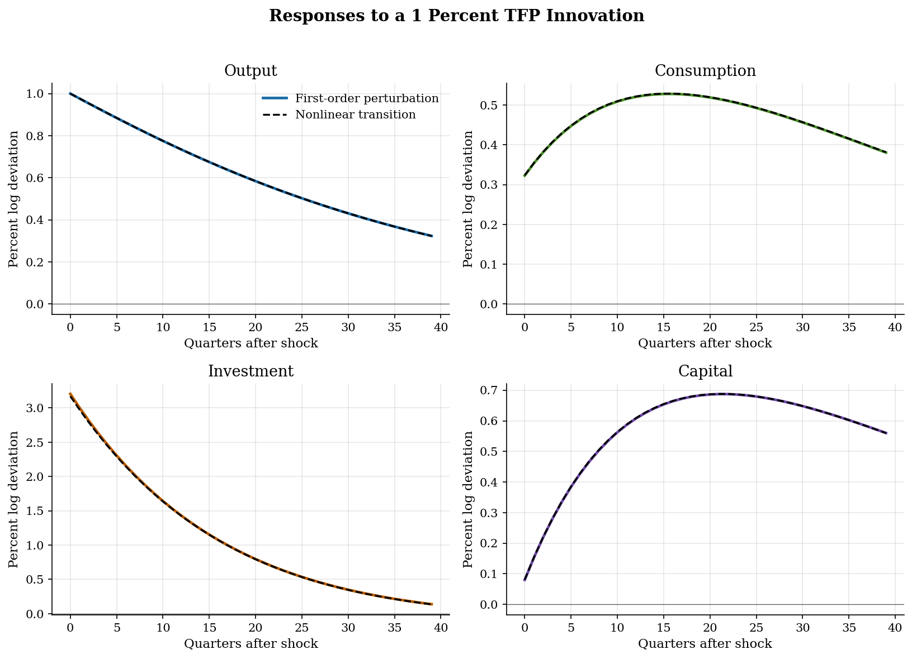

# RBC TFP Shocks and Capital Propagation

> How a productivity shock moves output when capital adjusts slowly.

## Overview

Imagine TFP rises by 1 percent this quarter. The existing capital stock can produce more right away, so output jumps. Capital itself was chosen last period, though. The household can only carry the shock forward by investing part of today's extra output.

This tutorial follows that tradeoff. A persistent TFP shock changes the marginal product of capital. The Euler equation then tells the household how much consumption to postpone. Investment is the adjustment margin, and capital moves with a lag.

To compute the path, we log-linearize the RBC model around its steady state and solve for the capital decision rule. In this fixed-labor example, coefficient matching gives the rule directly. Klein's generalized Schur (QZ) solver gives the same coefficients, which is useful because QZ scales to larger DSGE systems. The figure also includes the exact nonlinear transition for the same decaying TFP path. At this shock size, the local solution and nonlinear path nearly coincide.

## Equations

This is a representative-agent RBC allocation after a one-time technology
innovation. Let $A_t$ denote total factor productivity,
$K_{t-1}$ the capital stock chosen last period, $C_t$ consumption,
$I_t$ investment, and $Y_t$ output. Production and goods-market clearing are

$$
Y_t = A_t K_{t-1}^\alpha,
\qquad
Y_t = C_t + I_t,
$$

$$
K_t = I_t + (1-\delta)K_{t-1},
$$

so investment is the only way to move the state. The representative household's
Euler equation is

$$
C_t^{-\sigma} =
\beta \mathbb{E}_t\left[
C_{t+1}^{-\sigma}
\left(\alpha A_{t+1}K_t^{\alpha-1}+1-\delta\right)
\right].
$$

Technology follows

$$
\log A_t = \rho \log A_{t-1} + \varepsilon_t,
\qquad
\varepsilon_t \sim N(0,\sigma_\varepsilon^2).
$$

The accompanying `model.mod` spec stores $y,c,i,k,a$ as logs for documentation,
so expressions such as `exp(y)` are level variables. Around the deterministic
steady state with $A=1$,

$$
\alpha K^{\alpha-1} = \frac{1}{\beta} - 1 + \delta,
\qquad
Y=K^\alpha,\qquad I=\delta K,\qquad C=Y-I.
$$

The calibration implies $K/Y=9.40$ and $C/Y=0.76$.

## Model Setup

| Primitive | Value | Role |
|---|---:|---|
| $\alpha$ | 0.33 | Capital share in production |
| $\beta$ | 0.99 | Quarterly discount factor |
| $\delta$ | 0.025 | Quarterly depreciation |
| $\rho$ | 0.95 | Persistence of log TFP |
| $\sigma$ | 1.0 | CRRA coefficient; here log utility |
| $\sigma_\varepsilon$ | 0.010 | Innovation standard deviation in log TFP |
| Shock | 1.0% | One-standard-deviation innovation at date 0 |
| IRF horizon | 40 quarters | Periods shown in the figure |

| Steady-state object | Value |
|---|---:|
| $K$ | 28.348 |
| $Y$ | 3.015 |
| $C$ | 2.307 |
| $I$ | 0.709 |
| $K/Y$ | 9.401 |
| $C/Y$ | 0.765 |

## Solution Method

The computation needs a stable law of motion for capital. Write $\hat k_t=\log(K_t/K)$ and $\hat a_t=\log A_t$. Since capital is the only endogenous state, the decision rule is linear in last period's capital and current productivity:

$$
\hat k_t = 0.9621\hat k_{t-1} + 0.0801\hat a_t.
$$

Once we have this rule, production and the resource constraint give output, consumption, and investment. The stable capital root is below one. A temporary productivity shock can raise investment today, but capital still builds gradually because today's state inherits yesterday's choice.

```text
Algorithm: first-order RBC impulse response
Inputs: alpha, beta, delta, rho, sigma, shock size eps_0, horizon T
Outputs: paths for yhat_t, chat_t, ihat_t, khat_t

1. Compute the deterministic steady state K, Y, C, I.
2. Linearize the resource constraint and Euler equation in log deviations.
3. Guess khat_t = p khat_{t-1} + q ahat_t.
4. Substitute the guess into the linearized equations and match the
   coefficients on khat_{t-1} and ahat_t.
5. Select the stable solution for p and q.
6. Set ahat_0 = eps_0 and ahat_t = rho ahat_{t-1}.
7. Iterate the decision rule and recover yhat_t, ihat_t, and chat_t from
   production, capital accumulation, and goods-market clearing.
8. As a local accuracy check, solve the exact nonlinear perfect-foresight
   transition for the same TFP path and compare the two IRFs.
```

The coefficient-matching residual is 2.9e-15. Klein's (2000) generalized Schur (QZ) decomposition solves the same linearized system and agrees to 1.5e-15, machine precision for this problem. The stable eigenvalues are 0.9621 and 0.9500; they are the roots that govern capital and TFP propagation. The nonlinear benchmark is not a second stochastic model. It is the exact deterministic transition implied by the same one-time shock path.

## Results

Output rises immediately because the same capital is more productive. Investment jumps more than output because the household wants more capital while productivity remains high. Consumption rises by less on impact and keeps drifting upward for several quarters as the Euler equation smooths marginal utility. The dashed nonlinear transition sits almost on top of the first-order solution at this shock size.



The summary statistics separate impact effects from delayed peaks. Capital and consumption peak well after the shock because the state is slow-moving; investment peaks immediately because it is the margin that changes the state.

**IRF Summary Statistics**

| Variable    |   Impact (%) |   Peak (%) |   Peak quarter |   Half-life after peak |   Max nonlinear gap (pp) |
|:------------|-------------:|-----------:|---------------:|-----------------------:|-------------------------:|
| Output      |        1     |      1     |              0 |                     26 |                    0     |
| Consumption |        0.323 |      0.528 |             16 |                     38 |                    0.001 |
| Investment  |        3.204 |      3.204 |              0 |                     11 |                    0.033 |
| Capital     |        0.08  |      0.687 |             21 |                     39 |                    0.001 |
| TFP         |        1     |      1     |              0 |                     14 |                    0     |

## Takeaway

In this RBC model, a productivity shock is both a level effect and an intertemporal price signal. Output rises on impact because firms are more productive. Investment responds strongly because the marginal product of capital is temporarily high. Consumption moves more smoothly, and capital accumulates only gradually. The first-order perturbation isolates that propagation mechanism by solving for the stable capital decision rule near steady state.

This tutorial is the equilibrium counterpart to the [persistent-shock tutorial](../../time-series/ar-processes/): the AR(1) process supplies the shock's timing, while the Euler equation and capital law of motion decide how that timing shows up in macro quantities. For a global Bellman version of the same RBC mechanism, compare this local solution with the [dynamic-programming RBC tutorial](../../dynamic-programming/rbc/).

## References

- Kydland, F. and Prescott, E. (1982). Time to Build and Aggregate Fluctuations. *Econometrica*, 50(6), 1345-1370.
- King, R., Plosser, C., and Rebelo, S. (1988). Production, Growth and Business Cycles: I. The Basic Neoclassical Model. *Journal of Monetary Economics*, 21(2-3), 195-232.
- Uhlig, H. (1999). A Toolkit for Analysing Nonlinear Dynamic Stochastic Models Easily. In *Computational Methods for the Study of Dynamic Economies*.
- Klein, P. (2000). Using the Generalized Schur Form to Solve a Multivariate Linear Rational Expectations Model. *Journal of Economic Dynamics and Control*, 24(10), 1405-1423.
