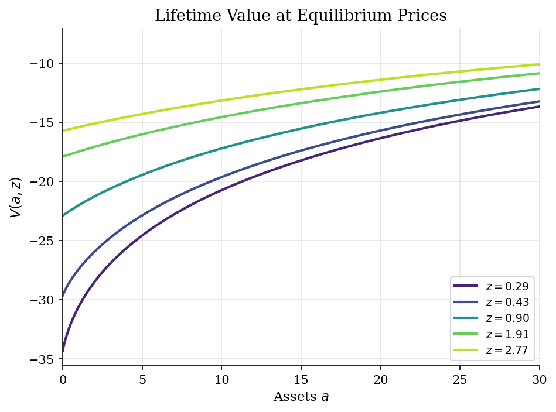
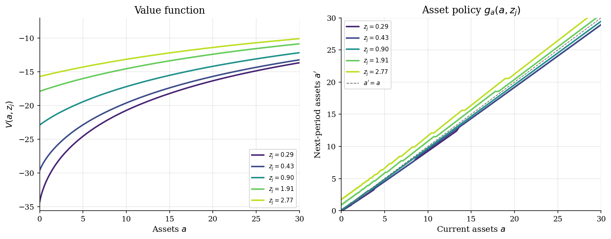
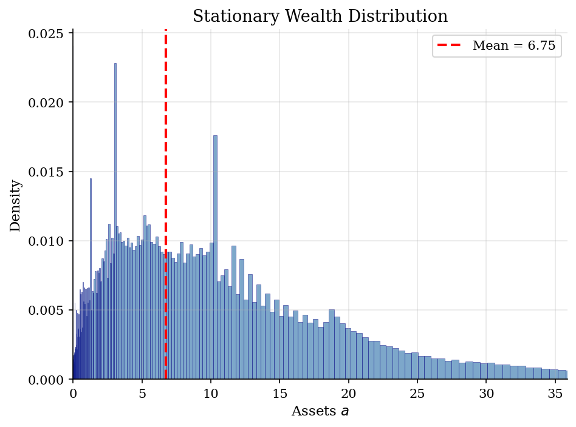
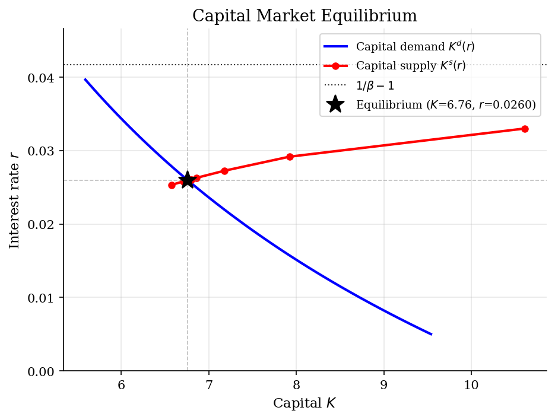

# Aiyagari Saving and Capital-Market Clearing

> A stationary incomplete-markets economy where household buffer stocks determine aggregate capital.

## Overview

Aiyagari (1994) closes the income-risk savings problem in general equilibrium. Individual households still use assets as self-insurance, as in the [buffer-stock savings tutorial](../consumption-savings/), but the risk-free return is no longer imposed from outside the model. It is the price that makes aggregate household assets equal the firm's demand for productive capital.

That feedback is the economic object of the tutorial. Persistent idiosyncratic risk makes households want precautionary buffers; the representative firm wants capital only up to the point where its marginal product justifies the rental rate. The stationary equilibrium is where those two schedules meet. If the household solve is the bottleneck, the [EGP tutorial](../../heterogeneous-agents/endogenous-grid-points/) shows the Euler-equation inversion behind faster incomplete-market solvers; this page keeps the general-equilibrium fixed point explicit.

## Equations

Let $a_t$ be beginning-of-period assets, $z_t$ idiosyncratic labor efficiency,
and $P_{jk}=\Pr(z_{t+1}=z_k\mid z_t=z_j)$ the Markov transition matrix. Given
prices $(r,w)$, a household chooses next-period assets $a_{t+1}=a'$ and consumes

$$c_t=(1+r)a_t+wz_t-a_{t+1}.$$

The no-borrowing constraint is $a_{t+1}\geq \underline a=0$. Preferences are

$$u(c)=\frac{c^{1-\sigma}}{1-\sigma},\qquad \sigma>0,\quad \sigma\neq 1,$$

and log efficiency follows

$$\log z_{t+1}=\rho\log z_t+\varepsilon_{t+1},\qquad
\varepsilon_{t+1}\sim N(0,\sigma_\varepsilon^2),$$

which is approximated by a Rouwenhorst chain. The household Bellman equation is

$$
V(a,z_j)=
\max_{\underline a\leq a'\leq \bar a,\ a'\leq (1+r)a+wz_j}
\left[
u((1+r)a+wz_j-a')+
\beta\sum_{k=1}^J P_{jk}V(a',z_k)
\right].
$$

The asset policy is $g_a(a,z_j)$. Given this policy, the stationary distribution
$\mu$ over asset-income states satisfies

$$
\mu(a_i,z_k)=
\sum_{j=1}^J\sum_{\ell:g_a(a_\ell,z_j)=a_i}\mu(a_\ell,z_j)P_{jk}.
$$

The firm has production $Y=K^\alpha L^{1-\alpha}$ and competitive factor prices

$$
r(K)=\alpha K^{\alpha-1}L^{1-\alpha}-\delta,\qquad
w(K)=(1-\alpha)K^\alpha L^{-\alpha}.
$$

With aggregate labor normalized to $L=1$, capital demand at interest rate $r$ is

$$
K^d(r)=\left(\frac{r+\delta}{\alpha}\right)^{1/(\alpha-1)}.
$$

An Aiyagari stationary equilibrium is a price $r^{\ast}$, wage $w^{\ast}$, household policy
$g_a$, and stationary distribution $\mu$ such that

$$
K^s(r^{\ast})=\sum_{i,j} a_i\mu(a_i,z_j)=K^d(r^{\ast}).
$$

## Model Setup

| Parameter | Value | Description |
|-----------|-------|-------------|
| $\beta$ | 0.96 | Discount factor |
| $1/\beta-1$ | 0.0417 | Complete-markets impatience benchmark |
| $\sigma$ | 2.0 | CRRA risk aversion |
| $\alpha$ | 0.36 | Capital share |
| $\delta$ | 0.08 | Depreciation rate |
| $\rho$ | 0.9 | Persistence of log income |
| $\sigma_\varepsilon$ | 0.2 | Innovation standard deviation |
| $\underline{a}$ | 0.0 | No-borrowing lower bound |
| $a \in$ | [0.0, 50.0] | Exponential asset grid support |
| Asset grid | 200 points | Denser near $\underline{a}$ |
| Income states | 7 | Rouwenhorst approximation to log income |
| Capital-market target | 5e-04 | Relative gap $\lvert K^s-K^d\rvert/K^d$ |
| Interest-rate bracket stop | 1e-06 | Backup stopping rule for bisection |
| VFI tolerance | 1e-06 | Sup-norm value-function tolerance |

## Solution Method

There are two fixed points. The inner problem finds the optimal asset policy at a candidate price vector. The outer problem changes the interest rate until the stationary cross-section supplies the capital that firms demand.

```text
Algorithm 1: household block at candidate prices (r,w)
Input: asset grid A, income states Z, transition matrix P, beta, utility u
Output: value V(a,z), asset policy g_a(a,z), consumption policy c*(a,z)
Initialize V_0(a_i,z_j) from consuming cash on hand forever
repeat for n = 0, 1, 2, ...:
    for each income state z_j:
        C(a_i) = sum_k P_jk * V_n(a_i,z_k)
        for each current asset a_i:
            search over feasible next assets a_m in A
            choose a_m maximizing u((1+r)*a_i + w*z_j - a_m) + beta*C(a_m)
            store V_{n+1}(a_i,z_j) and g_a(a_i,z_j)
    error = max_{i,j} |V_{n+1}(a_i,z_j) - V_n(a_i,z_j)|
until error < epsilon_V
set c*(a_i,z_j) = (1+r)*a_i + w*z_j - g_a(a_i,z_j)
```

```text
Algorithm 2: stationary general equilibrium
Input: interest-rate bracket [r_L,r_H], firm technology, household primitives
Output: r*, w*, K, stationary distribution mu
repeat:
    r = (r_L + r_H) / 2
    K^d(r) = ((r + delta) / alpha)^(1/(alpha - 1))
    w = (1 - alpha) * (K^d(r))^alpha
    solve Algorithm 1 at (r,w)
    iterate mu forward under g_a and P until stationary
    K^s(r) = sum_{i,j} a_i * mu(a_i,z_j)
    if K^s(r) > K^d(r): set r_H = r
    if K^s(r) < K^d(r): set r_L = r
until |K^s(r) - K^d(r)| / K^d(r) < epsilon_K or r_H - r_L < epsilon_r
```

The outer search stopped after **15 iterations** because the interest-rate bracket was exhausted; on this discrete asset grid the capital-supply schedule moves in small jumps. The final household VFI took **33 iterations** and ended with sup-norm error **9.81e-07**. The final signed relative capital-market gap is **-1.26e-03**.

## Results

The value functions show the price of being liquidity constrained. Higher income states have higher lifetime value everywhere, but the vertical distance across income states is most visible at low assets. Once households hold larger buffers, current income matters less because the asset stock can absorb bad draws.



The asset policy turns income histories into wealth dispersion. Points above the 45-degree line mean accumulation; points below it mean drawdown. Low-income households use assets to smooth consumption and often move toward the constraint. High-income households save out of current resources, which is how persistent good income states feed the upper tail of the stationary wealth distribution.



The stationary distribution is not an assumption; it is implied by the policy and the income Markov chain. Mean assets are **6.75**, median assets are **4.47**, and the 90th percentile is **16.31**. The gap between the mean and the median is the visible aggregate counterpart of self-insurance and persistent income risk. The wealth Gini is **0.527**, with **2.4%** of households exactly at the borrowing constraint.



The capital-market plot is the general-equilibrium step. Firm demand slopes down because the marginal product of capital falls with $K$. Household supply is shown at the rates visited by bisection, so it should be read as the fixed-point search, not as a separately smoothed object. The equilibrium rate is **0.0260**, below the complete-markets impatience benchmark **0.0417**, because uninsured income risk raises desired buffer assets.



The table separates firm capital demand from household asset supply because the computed equilibrium is numerical. The reported gap is the remaining market-clearing error, while the interest-rate comparison and the distributional statistics are the main economic diagnostics.

**Stationary equilibrium diagnostics**

| Variable                         | Value               |
|:---------------------------------|:--------------------|
| Interest rate $r$                | 0.025959            |
| Wage $w$                         | 1.2734              |
| Firm capital demand $K^d$        | 6.7599              |
| Aggregate household assets $K^s$ | 6.7514              |
| Market-clearing gap $K^s-K^d$    | -8.4953e-03         |
| Relative gap $(K^s-K^d)/K^d$     | -1.2567e-03         |
| Output $Y$                       | 1.9897              |
| Capital-output ratio $K/Y$       | 3.3975              |
| Gini coefficient                 | 0.5271              |
| Fraction at constraint           | 0.0241              |
| $r$ vs $1/\beta - 1$             | 0.025959 < 0.041667 |

## Takeaway

The useful lesson is that incomplete markets turn a household precautionary motive into an aggregate price effect. With no insurance against persistent income risk, households want buffer assets; in equilibrium those assets are the economy's capital stock. The result is $r^{\ast}=0.0260$, below $1/\beta-1=0.0417$, and a right-skewed wealth distribution generated without ex ante heterogeneity. Faster algorithms can change the cost of the computation, but they do not change the fixed point: solve household policies, find the stationary distribution, and clear the capital market.

## References

- Aiyagari, S. R. (1994). Uninsured Idiosyncratic Risk and Aggregate Saving. *Quarterly Journal of Economics*, 109(3), 659-684.
- Huggett, M. (1993). The Risk-Free Rate in Heterogeneous-Agent Incomplete-Insurance Economies. *Journal of Economic Dynamics and Control*, 17(5-6), 953-969.
- Ljungqvist, L. and Sargent, T. (2018). *Recursive Macroeconomic Theory*. MIT Press, 4th edition, Ch. 18.
- Kaplan, G., Moll, B., and Violante, G. L. (2018). Monetary Policy According to HANK. *American Economic Review*, 108(3), 697-743.
