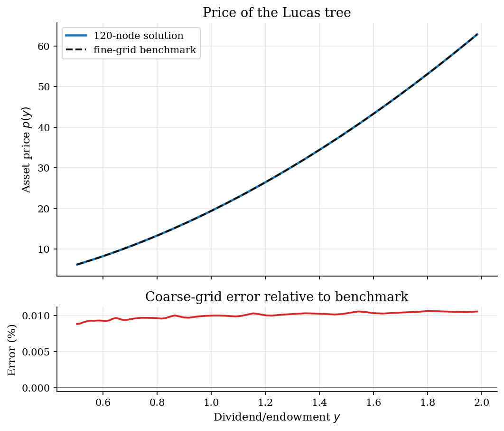
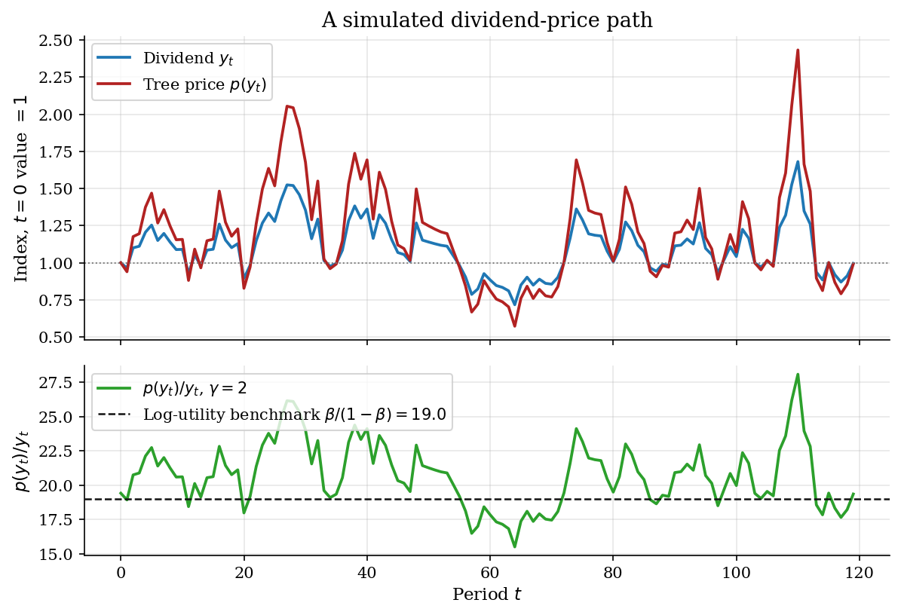
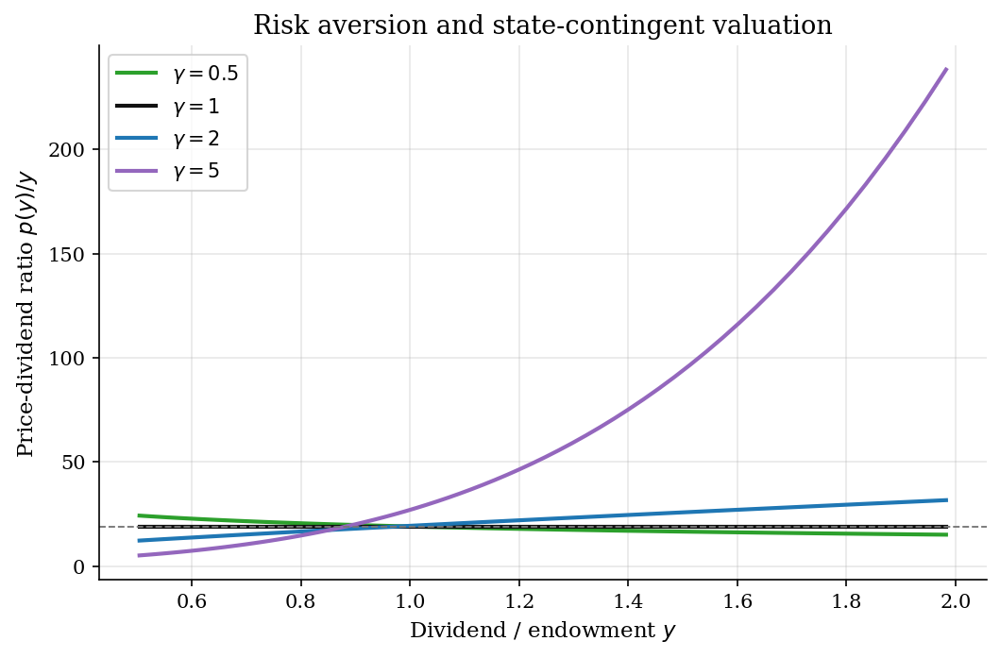

# Lucas Tree Asset Prices and the Stochastic Discount Factor

> A representative-agent exchange economy where dividend risk is priced by marginal utility.

## Overview

A single durable claim, the tree, pays a stochastic dividend $y_t$ each period. The single representative household holds the claim, eats the dividend, and prices it. There is no labor income, no outside asset, and no saving margin: market clearing forces $c_t=y_t$, so the entire economic content of the model is the equilibrium price function $p(y)$ that makes the household willing to hold what it already owns.

What this exercise teaches is how the same Euler equation that governs consumption-saving choice elsewhere in the catalog turns into a *pricing* equation when quantities are pinned down. The household's intertemporal marginal rate of substitution

$$M_{t+1}=\beta\,\frac{u'(c_{t+1})}{u'(c_t)}=\beta\,\left(\frac{y_{t+1}}{y_t}\right)^{-\gamma}$$

is the stochastic discount factor (SDF) the model produces endogenously. Once $c_t=y_t$ is imposed, $M_{t+1}$ is a deterministic function of next period's dividend, and the price of any payoff is $\mathbb{E}_t[M_{t+1}\,\text{payoff}_{t+1}]$. The Lucas tree is the claim whose payoff is the dividend itself plus its resale value.

Three things make the model a useful baseline. First, persistence in $y$ couples valuation today with expected payoffs tomorrow: a high dividend predicts mean reversion, which interacts with risk aversion in the SDF. Second, log utility ($\gamma=1$) is a knife-edge benchmark with a constant price-dividend ratio $p/y=\beta/(1-\beta)$, so any state dependence in $p/y$ is visibly *due to* preferences departing from log. Third, the recursion is linear in a transformed object, which makes the fixed point unusually clean to solve.

Compared with the [income-risk savings problem](../consumption-savings/), the household's continuation expectation looks identical but the choice set has collapsed: prices, not policies, do the work. The same Lucas tree shows up under richer dividend processes and news shocks in the [news-shock asset-pricing tutorial](../../dsge/assetNews/), and the log-endowment AR(1) here is the same primitive that drives [shock discretization](../shock-discretization/) — but with continuous Gauss-Hermite quadrature instead of a finite Markov chain, because the operator is linear in $f$ and one-dimensional integration is enough.

## Equations

**Endowment process.** Let $x_t=\log y_t$ follow

$$x_{t+1}=\rho x_t+\varepsilon_{t+1}, \qquad
\varepsilon_{t+1}\sim \mathcal{N}(0,\sigma^2),\qquad |\rho|<1.$$

The stationary log endowment has zero mean and variance $\sigma^2/(1-\rho^2)$.
Persistence $\rho$ controls how fast $y_{t+1}$ regresses to its long-run level.

**Preferences.** The representative household has CRRA utility

$$u(c)=\frac{c^{1-\gamma}}{1-\gamma}, \qquad u'(c)=c^{-\gamma},\qquad \gamma>0,$$

with the log case $u(c)=\log c$ obtained as $\gamma\to 1$.

**Equilibrium pricing equation.** Market clearing imposes $c_t=y_t$. A claim
that pays the dividend $y_{t+1}$ and a resale value $p(y_{t+1})$ next period
must satisfy the Euler condition

$$p(y_t)=\mathbb{E}_t\!\left[M_{t+1}(y_{t+1}+p(y_{t+1}))\right],
\qquad M_{t+1}=\beta\left(\frac{y_{t+1}}{y_t}\right)^{-\gamma}.$$

Writing this out and noting that $u'(y_t)=y_t^{-\gamma}$ does not depend on
$y_{t+1}$,

$$p(y_t)=\beta\,\mathbb{E}_t\!\left[
\frac{u'(y_{t+1})}{u'(y_t)}(p(y_{t+1})+y_{t+1})\right].$$

**Linearizing transform.** Multiply both sides by $u'(y_t)$ and define the
*marginal-utility-scaled price*

$$f(y)\equiv u'(y)\,p(y).$$

The Euler equation becomes

$$f(y)=\beta\,\mathbb{E}\!\left[f(y')+u'(y')\,y'\,\big|\,y\right],$$

a linear functional fixed point: the right-hand side has no $f^2$ or $f'$
terms, no $1/f$, just a conditional expectation with a known forcing term
$u'(y')y'$. The price and price-dividend ratio recover from

$$p(y)=\frac{f(y)}{u'(y)},\qquad \frac{p(y)}{y}=\frac{f(y)}{y\,u'(y)}.$$

**Log-utility benchmark.** When $\gamma=1$, $u'(y)y=1$, so the recursion
collapses to $f=\beta(f+1)$ at every $y$, giving $f=\beta/(1-\beta)$ and the
constant ratio

$$\frac{p(y)}{y}=\frac{\beta}{1-\beta}.$$

This is the only calibration in which $p/y$ is state-independent: under log
utility the income and substitution effects on intertemporal valuation cancel
exactly. Any visible curvature in $p/y$ in the figures below is therefore a
direct fingerprint of $\gamma\neq 1$.

## Model Setup

| Primitive | Value | Role |
|---|---:|---|
| $\beta$ | 0.95 | Discount factor |
| $\rho$ | 0.90 | Persistence of log dividends |
| $\sigma$ | 0.10 | Innovation standard deviation in log dividends |
| Stationary $\mathrm{sd}(\log y)$ | 0.2294 | $\sigma/\sqrt{1-\rho^2}$ |
| $\gamma$ | 2.0 | Baseline CRRA risk aversion |
| Coarse grid | 120 log-endowment nodes on $[\pm 5\,\mathrm{sd}(\log y)]$ | Tutorial solution |
| Quadrature | 21 Gauss-Hermite nodes for $\varepsilon$ | Conditional expectation |
| Benchmark | 900 grid nodes, 45 quadrature nodes | Fine-grid ground truth |
| Stopping rule | $\|f_{n+1}-f_n\|_\infty < 10^{-9}$ | Fixed-point tolerance |

## Solution Method

**Why the linearizing transform matters.** The raw Euler equation in $p$ has the marginal-utility ratio $u'(y_{t+1})/u'(y_t)$ inside the expectation, with the denominator depending on the *current* state. That makes the operator nonlinear in $p$ even though all the agent does is hold the tree. Multiplying through by $u'(y_t)$ moves $u'(y_t)$ outside the conditional expectation and absorbs $u'(y_{t+1})\,y_{t+1}$ into a known forcing term. What is left is a vanilla affine recursion in the scaled price $f(y)=u'(y)p(y)$.

**Contraction.** The operator

$$(Tf)(y)=\beta\,\mathbb{E}\!\left[f(y')+u'(y')y'\,\big|\,y\right]$$

is a $\beta$-contraction on bounded continuous functions: $|Tf-Tg|\leq \beta\,\|f-g\|_\infty$ pointwise. Banach gives a unique fixed point and geometric convergence at rate $\beta$. There is no Bellman maximization in sight because the household has no choice once $c=y$ is imposed; the iteration is purely a recursive expectation.

**Discretizing the conditional expectation.** The state $x=\log y$ is approximated on a uniform grid spanning $\pm 5$ stationary standard deviations of $\log y$. Tail truncation matters because high-$x$ states carry the largest weight in $u'(y')y'=y'^{1-\gamma}$ when $\gamma<1$ and the smallest when $\gamma>1$. Conditional on $x_t$, the next log-endowment is normal with mean $\rho x_t$ and variance $\sigma^2$, so $n_q=21$-node Gauss-Hermite quadrature integrates exactly any polynomial of degree $\leq 2n_q-1$ in the innovation. Linear interpolation evaluates $f$ at the off-grid points $\rho x_t+\varepsilon_j$.

```text
Algorithm  Lucas-tree fixed-point iteration on f = u'(y) p
Inputs   beta, rho, sigma, gamma; log-endowment grid X = {x_i};
           Gauss-Hermite nodes {eps_j}, weights {w_j};
           tolerance epsilon
Outputs  scaled price f(x_i), price p(y_i), price-dividend ratio p/y

Precompute   x'_{ij} <- rho * x_i + eps_j                  # next-state nodes
             y'_{ij} <- exp(x'_{ij})
             d_{ij}  <- (y'_{ij})^{1 - gamma}              # forcing term u'(y') y'
Initialise   f_0(x_i) <- 0
for n = 0, 1, 2, ...:
    for each x_i:
        f_hat_{ij}  <- interp(f_n, X, x'_{ij})              # off-grid continuation
        f_{n+1}(x_i) <- beta * sum_j w_j * (f_hat_{ij} + d_{ij})
    err <- max_i | f_{n+1}(x_i) - f_n(x_i) |
stop when err < epsilon
p(y_i)     <- f(x_i) * (y_i)^{gamma}
p(y_i)/y_i <- p(y_i) / y_i
```

**Hyperparameters and trade-offs.** The convergence rate is fixed at $\beta=0.95$ and is independent of $n_{q}$ or grid size, because the contraction modulus comes from the time discount, not the discretization. Refining the grid mainly reduces interpolation bias near the tails; refining $n_q$ reduces quadrature bias for higher moments of $y'^{1-\gamma}$. Both errors are controlled by comparing the tutorial solution to a fine-grid benchmark with 900 state nodes and 45 quadrature nodes.

At $\gamma=2.0$ the tutorial solution converges in **405 iterations** to sup-norm residual **9.76e-10**. Across the central $\pm 3\,\mathrm{sd}(\log y)$ region the coarse-grid price agrees with the benchmark to within **0.011%**, which is interpolation noise rather than economic disagreement.

## Results

The equilibrium price is strictly increasing and convex in the dividend state, with a slope above one in the right tail: a higher dividend today predicts persistently higher dividends tomorrow, and with $\gamma=2$ the future high-dividend states are weighted *less* by the SDF, so the price still rises but mostly through the level of future cash flows rather than through discounting. The lower panel shows that the 120-node solution stays within 0.011% of the 900-node benchmark across the central $\pm 3\,\mathrm{sd}$ region. The benchmark is numerical, but the agreement confirms that the visible curvature is economic, not a coarse-grid artefact.



Along a 120-period simulation, prices co-move closely with dividends because persistence in $y$ raises expected future cash flows roughly proportionally. The price index is more volatile than the dividend index when the state is far from its mean: prices capitalize the entire continuation stream, not just the next payment. The lower panel isolates the more informative ratio $p(y_t)/y_t$. Under $\gamma=2$ it varies systematically with the state and sits above the log-utility benchmark $\beta/(1-\beta)$ when dividends are high — exactly the comparative-static the next figure reads off the cross-section of states.



Risk aversion changes the *slope* of the price-dividend ratio in the state, not just its level. With log utility ($\gamma=1$), the ratio collapses to $\beta/(1-\beta)\approx 19.0$ at every $y$ — the dashed grey line and the $\gamma=1$ curve overlap exactly, which is the cleanest possible audit of the solver. When $\gamma<1$, the ratio falls in $y$: high current dividends predict mean reversion downward, and an agent with low risk aversion values the resulting smoothing in future $u'(y')y'$ less. When $\gamma>1$, the ratio rises in $y$ and steeply so for $\gamma=5$, because the SDF heavily up-weights the low-dividend tail of $y_{t+1}\mid y_t$ that is *more likely* after a high $y_t$. Dotted same-color lines are the fine-grid benchmarks; they sit on top of the coarse-grid solutions across the plotted range.



Reading across rows isolates two effects. At the median state $y\approx 1$ all four economies price the tree at roughly the log-utility benchmark $\beta/(1-\beta)=19.0$, because $\mathbb{E}_t[(y_{t+1}/y_t)^{1-\gamma}]\approx 1$ in a neighbourhood of the long-run mean. Away from the mean the SDF interacts with mean reversion: the $\gamma=5$ ratio doubles from the median to the tails, while the $\gamma=0.5$ ratio compresses. The $\gamma=1$ column is the closed-form benchmark $19$ at every $y$, exact to numerical tolerance.

**Price-dividend ratios at selected dividend states**

|     y |   p(y), gamma=2 |   p/y, gamma=0.5 |   p/y, gamma=1 |   p/y, gamma=2 |   p/y, gamma=5 |
|------:|----------------:|-----------------:|---------------:|---------------:|---------------:|
| 0.504 |           6.221 |           24.302 |             19 |         12.334 |          5.208 |
| 0.624 |           8.815 |           22.534 |             19 |         14.137 |          8.09  |
| 0.786 |          12.949 |           20.772 |             19 |         16.477 |         14.075 |
| 0.99  |          19.105 |           19.167 |             19 |         19.29  |         26.323 |
| 1.248 |          28.308 |           17.706 |             19 |         22.679 |         52.398 |
| 1.573 |          42.114 |           16.373 |             19 |         26.771 |        109.637 |
| 1.983 |          62.894 |           15.157 |             19 |         31.724 |        238.292 |

## Takeaway

Once market clearing forces $c=y$, the household has nothing to choose and the entire model lives inside the equilibrium price. The Euler equation becomes a *valuation* equation, not a household problem. Multiplying through by $u'(y)$ turns it into a linear, $\beta$-contractive recursion in the scaled price, which iterates without any policy-function machinery. Risk aversion then has a sharp diagnostic role: log utility gives a flat $p/y=\beta/(1-\beta)$, and any state-dependence in the price-dividend ratio is preferences interacting with mean reversion in dividends — *the* fingerprint that asset-pricing puzzles like the equity premium read off the data.

## References

- Lucas, R. (1978). "Asset Prices in an Exchange Economy." *Econometrica*, 46(6), 1429-1445.
- Mehra, R. and Prescott, E. (1985). "The Equity Premium: A Puzzle." *Journal of Monetary Economics*, 15(2), 145-161.
- Ljungqvist, L. and Sargent, T. (2018). *Recursive Macroeconomic Theory*. MIT Press, 4th edition, Ch. 13.
- Stokey, N., Lucas, R., and Prescott, E. (1989). *Recursive Methods in Economic Dynamics*. Harvard University Press.
