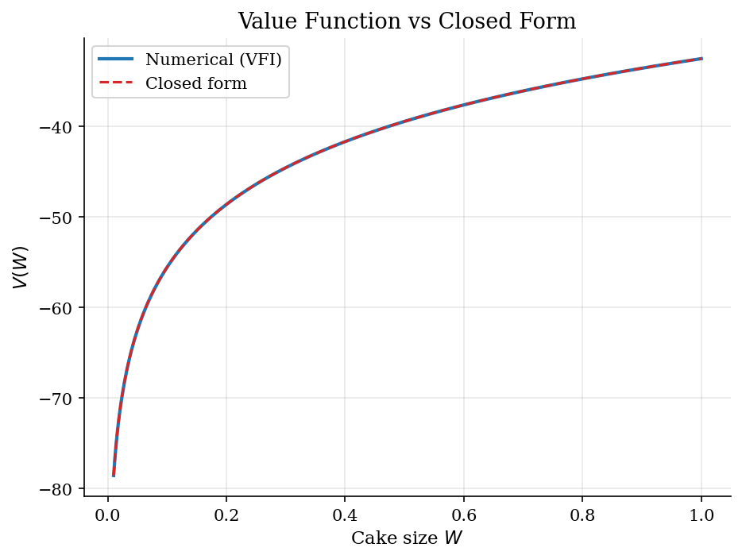
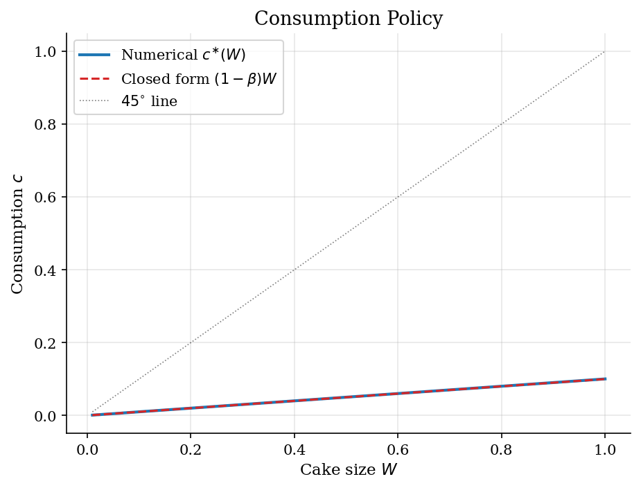
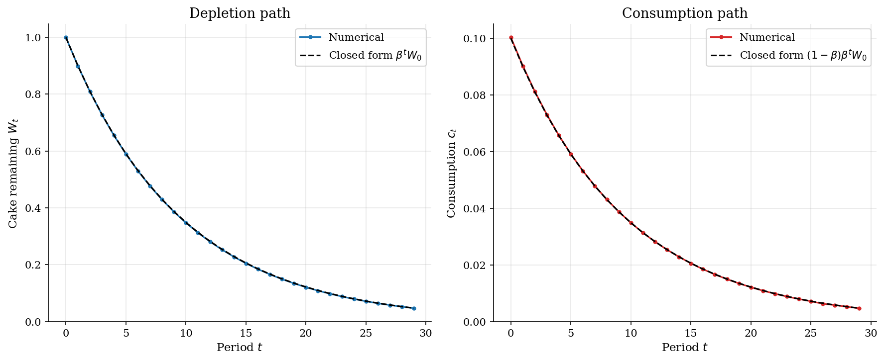

# Finite-Resource Cake Eating

> A non-renewable resource consumed over an infinite horizon, with a closed-form audit.

## Overview

Cake eating is the smallest non-trivial dynamic programming problem. The state is one-dimensional, there is no production, no income, no uncertainty, and the agent's only decision is how to slice a fixed pie across an infinite horizon. Saving a unit returns nothing extra tomorrow — the gross interest rate is one — so the entire trade-off lives inside the discount factor $\beta$ and the curvature of $u(c)$.

Despite that simplicity, the model exposes the recursive structure that the rest of the dynamic programming section reuses. The Bellman operator is a contraction with modulus $\beta$; the optimum delivers a Hotelling-style Euler equation that pins down the *growth rate* of the shadow value of wealth; and under log utility the closed form $c_t = (1-\beta)W_t$ provides a direct audit for any numerical solver. That last point is what makes this tutorial useful as a benchmark: every figure and table here shows the computed object next to its analytical twin, so the residuals are pure numerical error rather than economic disagreement.

Once production is added, the same recursion becomes [optimal growth](../optimal-growth/); once income risk and a borrowing constraint are added, it becomes [consumption-savings](../consumption-savings/). The closed-form check disappears in both, which is why it is worth having a clean instance of it first.

## Equations

Let $W_t$ denote remaining cake at the start of period $t$. The agent picks
consumption $c_t \in [0, W_t]$ and faces the resource constraint

$$W_{t+1} = W_t - c_t, \qquad W_0 \text{ given}.$$

Preferences are time-separable with discount factor $\beta \in (0,1)$ and
CRRA flow utility,

$$\sum_{t=0}^{\infty} \beta^t u(c_t),
\qquad u(c)=\frac{c^{1-\sigma}}{1-\sigma},
\qquad u(c)=\log c \text{ when } \sigma=1.$$

The Bellman equation collapses the lifetime problem onto the one-dimensional
state $W$:

$$V(W) = \max_{0 \le c \le W} \bigl\{\, u(c) + \beta\, V(W-c) \,\bigr\}.$$

Differentiating inside the max and using the envelope theorem $V'(W)=u'(c^{\ast}(W))$
gives the **Euler equation**

$$u'(c_t) = \beta\, u'(c_{t+1}).$$

Because the gross return on saved cake is one, marginal utility must rise at
rate $1/\beta$ along the optimal path — the discrete-time analog of
Hotelling's rule for a non-renewable resource. With log utility, this
collapses to $c_{t+1}/c_t = \beta$, so consumption itself decays geometrically
at rate $\beta$.

Conjecturing $c^{\ast}(W) = \kappa W$ and substituting into the Bellman
equation pins down $\kappa = 1-\beta$, so

$$c^{\ast}(W) = (1-\beta)\, W,
\qquad g(W) = W - c^{\ast}(W) = \beta\, W,$$

$$V(W) = \frac{\ln\bigl((1-\beta) W\bigr)}{1-\beta}
+ \frac{\beta \ln \beta}{(1-\beta)^2},
\qquad V'(W) = \frac{1}{(1-\beta)\,W}.$$

The shadow value $V'(W)$ blows up as $W \to 0$: the last crumb is
infinitely valuable, which is what disciplines the agent against eating
everything immediately.

## Model Setup

| Symbol | Value | Role |
|--------|-------|------|
| $\beta$ | 0.9 | Discount factor; pins down the saving rate $\beta$ and the consumption rate $1-\beta$ |
| $\sigma$ | 1.0 | CRRA curvature; $\sigma=1$ is the log case used for the closed-form audit |
| $W$ | $[0.01,\, 1.0]$ | Wealth domain on which $V$ and $c^{\ast}$ are tabulated |
| $N_W$ | 500 | Uniform grid points for the state $W$ |
| $N_c$ | 300 | Inner grid for the consumption choice at each state |
| Tolerance $\varepsilon$ | 1e-06 | Sup-norm convergence threshold for the Bellman operator |
| $T_{sim}$ | 30 | Periods simulated for the depletion path |

## Solution Method

Define the Bellman operator

$$(TV)(W) \;=\; \max_{0 \le c \le W} \bigl\{\, u(c) + \beta\, V(W-c) \,\bigr\}.$$

Blackwell's sufficient conditions hold (monotonicity and discounting), so $T$ is a contraction on bounded continuous functions with modulus $\beta$. Any guess $V_0$ delivers $\|V_n - V\|_{\infty} \le \beta^n \|V_0 - V\|_{\infty}$, which gives the convergence rate and the stopping rule.

Numerically the algorithm is brute-force VFI: tabulate $V$ on a uniform grid for $W$, search for the optimal $c$ on a finer inner grid at each state, and **interpolate** $V$ at the off-grid point $W-c$ because the resource constraint moves the next state continuously. Below the grid floor $W_{\min}$ we extrapolate using the closed-form $V$; this matters only because the log-utility benchmark makes that small detail testable. In a generic problem the same role is played by a polynomial or shape-preserving extrapolation.

```text
Algorithm — Cake-Eating VFI with continuous c, interpolated continuation
Input : grid {W_i}_{i=1..N_W}, choice grid size N_c, tolerance epsilon
Output: value V*(W_i), consumption policy c*(W_i)
  initialise V_0(W_i) = u(W_i)                     # guess: eat everything
  for n = 0, 1, 2, ... :
      for each state W_i :
          c_grid <- N_c points uniform on (0, W_i)
          W'     <- W_i - c_grid                   # next-period wealth
          V_cont <- interp(V_n, W')                # off-grid continuation
          obj    <- u(c_grid) + beta * V_cont
          V_{n+1}(W_i) <- max(obj)
          c*(W_i)      <- argmax(obj)
      err <- max_i | V_{n+1}(W_i) - V_n(W_i) |
      stop when err < epsilon
```

With the calibration above the iteration converges in **68 steps** to a sup-norm residual of **4.23e-07**. The closed form is computed afterward and used only for verification. For this problem the Euler equation $u'(c_t)=\beta\, u'(c_{t+1})$ would also support endogenous-grid or shooting solvers in a single pass; VFI is overkill but instructive because the same operator carries unchanged into stochastic models in later tutorials.

## Results

The value function is concave in $W$: marginal cake is worth a lot when the stock is nearly gone and very little when it is plentiful. The numerical curve sits on top of the closed-form curve almost everywhere — visually the two are indistinguishable on the bulk of the grid. The largest sup-norm gap outside the bottom decile is **2.52e-02**; the wider deviation near $W=0$ comes from the log singularity, which is hard to resolve on any uniform grid.



The economic content of the model lives in this picture. Under log utility the agent eats a constant share $1-\beta$, equal to **10%** of available wealth, in every period regardless of how rich she currently is — a scale invariance that survives because both the utility increment and the continuation value scale logarithmically. The numerical policy traces this line and lies well below the $45^{\circ}$ line, which would correspond to eating all remaining cake immediately. The largest pointwise policy gap above the bottom decile is **3.24e-04**, dominated by the discretization of the inner consumption grid.



Forward-iterating the policy from $W_0=1$ traces the depletion path. Both wealth and consumption decay geometrically at rate $\beta$, as the Euler equation predicts: nothing is ever eaten in finite time, but the asymptote is zero. The black dashed paths $W_t = \beta^t W_0$ and $c_t = (1-\beta)\beta^t W_0$ are the closed-form trajectories, and the numerical path tracks them to a sup-norm error of **1.25e-03** over the simulation horizon — below grid resolution and not visible at this scale.



The audit table reports both objects at eight representative wealth states. Reading the rightmost columns confirms that the residuals are small and smooth in $W$: there are no sign reversals, no kinks, and the errors shrink in absolute terms as $W$ grows away from the singular boundary. This is the kind of diagnostic that disappears in the [optimal growth](../optimal-growth/) and [consumption-savings](../consumption-savings/) tutorials, where the closed form goes away and the only checks left are Euler-equation residuals and steady-state consistency.

**Numerical vs closed-form solution at selected wealth states**

|     W |   V numerical |   V closed form |   V error |   c* numerical |   c* closed form |   c* error |
|------:|--------------:|----------------:|----------:|---------------:|-----------------:|-----------:|
| 0.109 |      -54.6794 |        -54.6542 |  -0.0252  |         0.011  |           0.0109 |   3.54e-05 |
| 0.236 |      -46.9527 |        -46.9402 |  -0.0124  |         0.0237 |           0.0236 |   7.66e-05 |
| 0.363 |      -42.646  |        -42.6378 |  -0.00825 |         0.0364 |           0.0363 |   0.000118 |
| 0.49  |      -39.6455 |        -39.6393 |  -0.0062  |         0.0492 |           0.049  |   0.000159 |
| 0.617 |      -37.3406 |        -37.3356 |  -0.00495 |         0.0619 |           0.0617 |   0.0002   |
| 0.744 |      -35.4687 |        -35.4645 |  -0.00415 |         0.0746 |           0.0744 |   0.000241 |
| 0.871 |      -33.8925 |        -33.8889 |  -0.00351 |         0.0874 |           0.0871 |   0.000283 |
| 1     |      -32.5114 |        -32.5083 |  -0.00313 |         0.1003 |           0.1    |   0.000324 |

## Takeaway

Cake eating is the dynamic programming problem stripped down to one state and no risk, which is exactly why it is useful as a calibration target for any Bellman solver. The Euler equation $u'(c_t)=\beta\, u'(c_{t+1})$ delivers a Hotelling-style growth rule for the marginal value of wealth; under log utility it pins consumption to a constant share $1-\beta$ and forces wealth to decay at rate $\beta$. The numerical residuals reported above are interpolation and inner-grid error, not features of the model. Once production, income risk, or borrowing constraints are added, the closed form vanishes — and the calibration habits learned here (audit against ground truth, watch the boundary, keep the inner choice grid finer than the state grid) become the only line of defense.

## References

- Stokey, N., Lucas, R., and Prescott, E. (1989). *Recursive Methods in Economic Dynamics*. Harvard University Press, Ch. 4.
- Ljungqvist, L. and Sargent, T. (2018). *Recursive Macroeconomic Theory*. MIT Press, 4th edition, Ch. 3.
- Hotelling, H. (1931). The Economics of Exhaustible Resources. *Journal of Political Economy*, 39(2), 137-175.
