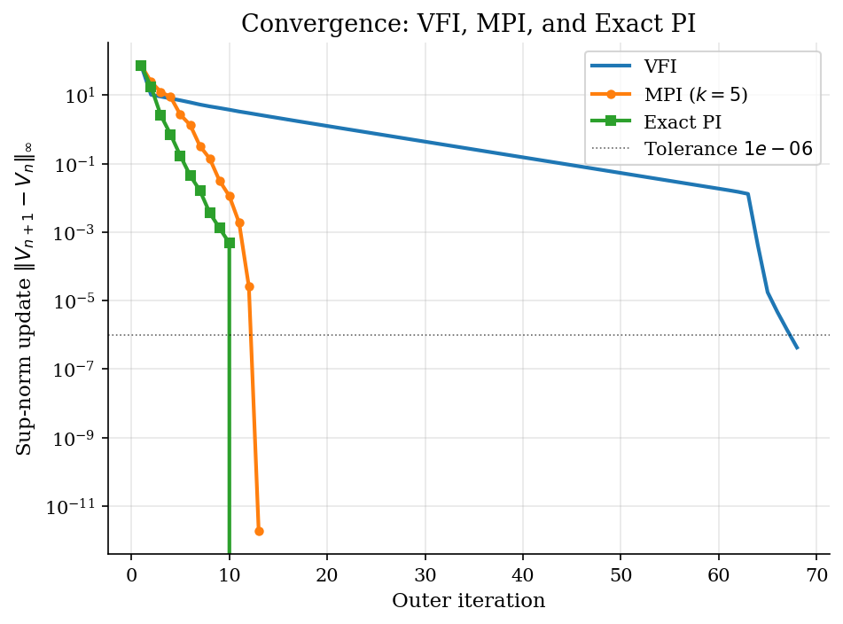

# Finite-Resource Cake Eating

## Overview

A household owns a fixed cake and chooses consumption each period. The cake does not grow. There is no income or uncertainty. Consuming more today leaves less cake for every future period.

The state is the remaining stock of cake $W_t$ at the start of period $t$. The control is consumption $c_t$ chosen from the feasible set $[0, W_t]$. A policy rule $\pi$ maps each stock $W$ into a consumption choice $c = \pi(W)$. The value function $V$ assigns to each stock the discounted utility from following the optimal policy.

The Bellman equation is solved three ways on the same wealth grid. Method 1 is value function iteration. Method 2 is modified policy iteration, also called Howard acceleration. Method 3 is exact Howard policy iteration. Log utility gives a closed-form value and policy that benchmark all three numerical solutions.

## Equations

Let $W_t$ be remaining cake at the start of period $t$.
The household chooses $c_t \in [0, W_t]$ and leaves next-period cake:

$$W_{t+1} = W_t - c_t, \qquad W_0 \text{ given}.$$

Here $W_0$ is the initial cake endowment.

Preferences use discount factor $\beta \in (0,1)$ and CRRA flow utility:

$$\sum_{t=0}^{\infty} \beta^t u(c_t),
\qquad u(c)=\frac{c^{1-\sigma}}{1-\sigma},
\qquad u(c)=\log c \text{ when } \sigma=1.$$

The value function solves a one-state Bellman equation:

$$V(W) = \max_{0 \le c \le W} \big\{\, \underbrace{u(c)}_{\text{flow utility today}} + \underbrace{\beta\, V(W-c)}_{\text{discounted continuation value}} \,\big\}.$$

The flow / continuation split is the entire economic content of the Bellman equation.
Eating one more unit today raises $u(c)$ but shrinks the stock left for tomorrow, which lowers $V(W-c)$.
The optimum balances those two forces.

The first-order condition and envelope condition give the Euler equation:

$$u'(c_t) = \beta\, u'(c_{t+1}).$$

This says marginal utility rises as the cake stock falls.
In the log case, consumption falls at rate $\beta$.

A policy is a function $c^{\ast}: W \mapsto c$ that prescribes a feasible consumption choice at every stock.
Guessing a constant consumption share and verifying the Euler equation gives the closed-form optimal policy:

$$c^{\ast}(W) = (1-\beta)\, W,
\qquad g(W) = W - c^{\ast}(W) = \beta\, W.$$

Here $g(W)$ is the law of motion for the cake under the optimal policy.
The matching value function is:

$$V(W) = \frac{\ln((1-\beta) W)}{1-\beta}
+ \frac{\beta \ln \beta}{(1-\beta)^2},
\qquad V'(W) = \frac{1}{(1-\beta)\,W}.$$

This closed form is the target for the numerical check.

### Method 1: Value Function Iteration

Let $T$ be the Bellman operator.
It maps any candidate value function $V$ to a new function $TV$ defined pointwise by:

$$(TV)(W) = \max_{0 \le c \le W} \{\, u(c) + \beta\, V(W-c) \,\}.$$

The operator $T$ is a contraction with modulus $\beta$ in the sup norm $\| \cdot \|_{\infty}$.
By the Banach fixed-point theorem it has a unique fixed point $V^{\ast}$.
The iteration $V_{n+1} = T V_n$ starts from any guess $V_0$.
The sup-norm distance to $V^{\ast}$ shrinks by a factor of $\beta$ at each step.

### Method 2: Modified Policy Iteration

A policy is a function $\pi: W \mapsto c$ that prescribes a consumption choice at every stock $W$.
Define the policy operator $T_{\pi}$ that performs one Bellman step with $\pi$ held fixed:

$$(T_{\pi} V)(W) = u(\pi(W)) + \beta\, V(W - \pi(W)).$$

The operator $T_{\pi}$ is also a $\beta$-contraction in the sup norm.
Its unique fixed point is denoted $V_{\pi}$.
$V_{\pi}$ is the expected discounted utility of always playing $\pi$.

Let $T_{\pi}^{\,k}$ denote the $k$-fold composition $T_{\pi} \circ \cdots \circ T_{\pi}$ with $k$ copies.
Applying $T_{\pi}^{\,k}$ to any starting $V$ moves it $k$ steps closer to $V_{\pi}$.
Modified policy iteration interleaves one improvement step with $k$ such evaluation steps:

$$\pi_{n+1}(W) \in \arg\max_{c} \{\, u(c) + \beta\, V_n(W-c) \,\},
\qquad V_{n+1} = T_{\pi_{n+1}}^{\,k} V_n.$$

The integer $k$ is the inner-sweep count and is set by the user.
Choosing $k=1$ recovers value function iteration exactly.
Letting $k \to \infty$ recovers exact policy iteration.

### Method 3: Exact Howard Policy Iteration

On the finite grid the policy operator becomes an affine map on $\mathbb{R}^{N_W}$.
Let $P_{\pi}$ be the $N_W \times N_W$ matrix whose row $i$ holds the linear-interpolation weights at the point $W_i - \pi(W_i)$.
Row $i$ of $P_{\pi}$ has at most two nonzero entries, one for each end of the bracketing interval.
Stacking grid values into a vector, the policy operator becomes:

$$T_{\pi} V = u(\pi) + \beta\, P_{\pi}\, V.$$

The fixed point $V_{\pi}$ satisfies $V_{\pi} = u(\pi) + \beta P_{\pi} V_{\pi}$.
Rearranging gives a linear system in $V_{\pi}$:

$$\underbrace{(I - \beta\, P_{\pi})}_{\text{discounted resolvent}}\, V_{\pi} = \underbrace{u(\pi)}_{\text{flow utility under } \pi}.$$

The resolvent $(I - \beta P_{\pi})^{-1}$ is the discrete analogue of the geometric series $\sum_{k=0}^{\infty} (\beta P_{\pi})^k$, which is exactly the discounted sum of flow utilities along the Markov chain induced by the policy.
That is why the linear system is the exact policy evaluation: it computes the infinite expected discounted utility in one solve rather than approximating it by repeated application of $T_{\pi}$.
The matrix $I - \beta P_{\pi}$ is invertible because $\beta P_{\pi}$ has spectral radius at most $\beta < 1$.
Exact policy iteration alternates policy improvement with this exact solve:

$$\pi_{n+1} \in \arg\max_{c} \{\, u(c) + \beta\, V_n(W-c) \,\},
\qquad V_{n+1} = \underbrace{(I - \beta\, P_{\pi_{n+1}})^{-1}\, u(\pi_{n+1})}_{\text{exact value of always playing } \pi_{n+1}}.$$

The iteration can be read as Newton's method applied to the fixed-point equation $V = T V$.
Near an optimal policy the improvement step makes only second-order changes in $V$.
Convergence is therefore super-linear once the policy is close to the optimum, which is why Howard typically finishes in three or four iterations while VFI needs hundreds.

## Model Setup

| Symbol | Value | Role |
|--------|-------|------|
| $\beta$ | 0.9 | Discount factor; closed-form saving rate is $\beta$ |
| $\sigma$ | 1.0 | CRRA curvature; $\sigma=1$ gives the log closed form |
| $W_0$ | 1.0 | Initial cake endowment |
| $W$ | $[0.01,\, 1.0]$ | Wealth grid for $V$ and $c^{\ast}$ |
| $N_W$ | 500 | Uniform grid points for the state $W$ |
| $N_c$ | 300 | Inner grid for the consumption choice at each state |
| $k$ | 5 | Inner policy-evaluation sweeps in modified policy iteration |
| Tolerance $\varepsilon$ | 1e-06 | Sup-norm convergence threshold |
| $T_{sim}$ | 30 | Periods simulated for the depletion path |

## Solution Method

Three solvers run on the same wealth grid. They share the same initial guess $V_0(W_i) = u(W_i)$. They share the same off-grid continuation rule that interpolates $V$ on $W' = W - c$ and falls back to the analytical formula when $W'$ is below the grid. They differ in how the continuation value is updated between successive policy improvements.

### Method 1: Value Function Iteration

At each outer step apply the Bellman operator $T$ to the current value function $V_n$. The inner work is a state-by-state maximization over a uniform consumption grid $c_{\mathrm{grid}}$ of size $N_c$. The continuation value $V_n(W - c)$ is read off the grid by linear interpolation. The iteration stops when the sup-norm update $\|V_{n+1} - V_n\|_{\infty}$ falls below the tolerance $\varepsilon$.

```text
Algorithm: Value Function Iteration
Input : wealth grid, choice grid size N_c, tolerance epsilon
Output: value V*(W_i), consumption policy c*(W_i)
  initialise V_0(W_i) = u(W_i)                     # guess: eat everything
  for n = 0, 1, 2, ... :
      for each state W_i :
          c_grid <- N_c points uniform on (0, W_i)
          W'     <- W_i - c_grid                   # next-period wealth
          V_cont <- interp(V_n, W')                # off-grid continuation
          obj    <- u(c_grid) + beta * V_cont
          V_{n+1}(W_i) <- max(obj)
          c*(W_i)      <- argmax(obj)
      err <- max_i | V_{n+1}(W_i) - V_n(W_i) |
      stop when err < epsilon
```

Failure mode: each step shrinks the sup-norm distance to $V^{\ast}$ by exactly the factor $\beta$. The iteration count to reach tolerance $\varepsilon$ is therefore of order $\log(\varepsilon) / \log(\beta)$. Long-horizon calibrations push $\beta$ close to one and make this count explode.

### Method 2: Modified Policy Iteration

Each outer step has two phases. The improvement phase computes a new policy $\pi_{n+1}$ by the same state-by-state maximization used in VFI. The evaluation phase applies the policy operator $T_{\pi_{n+1}}$ to $V_n$ a total of $k$ times. Each evaluation sweep skips the maximization and is therefore cheaper than a VFI sweep. The improvement step prevents the iteration from getting stuck at a suboptimal $V_{\pi}$.

```text
Algorithm: Modified Policy Iteration
Input : wealth grid, choice grid size N_c, inner sweeps k, tolerance epsilon
Output: value V*(W_i), consumption policy c*(W_i)
  initialise V_0(W_i) = u(W_i)
  for n = 0, 1, 2, ... :
      # improvement step
      for each state W_i :
          pi(W_i) <- argmax_c { u(c) + beta * interp(V_n, W_i - c) }
      # k policy-evaluation sweeps under fixed policy pi
      V_eval <- V_n
      repeat k times :
          V_eval(W_i) <- u(pi(W_i)) + beta * interp(V_eval, W_i - pi(W_i))
      err   <- max_i | V_eval(W_i) - V_n(W_i) |
      V_{n+1} <- V_eval
      stop when err < epsilon
```

Failure mode: setting $k=1$ makes MPI identical to VFI and removes the speed-up. Setting $k$ very large is wasteful in the first few outer iterations because the early policies are still far from optimal. A moderate $k$ in the 5 to 50 range is the practical sweet spot.

### Method 3: Exact Howard Policy Iteration

Each outer step also has two phases. The improvement phase computes a new policy $\pi_{n+1}$ exactly as in VFI and MPI. The evaluation phase solves the linear system $(I - \beta P_{\pi_{n+1}}) V_{n+1} = u(\pi_{n+1})$ for the new value. Row $i$ of $P_{\pi}$ contains the two interpolation weights for the bracket around $W_i - \pi(W_i)$, so $P_{\pi}$ has at most $2 N_W$ nonzero entries. The implementation in this tutorial uses a dense direct solve for clarity.

```text
Algorithm: Exact Howard Policy Iteration
Input : wealth grid, choice grid size N_c, tolerance epsilon
Output: value V*(W_i), consumption policy c*(W_i)
  initialise V_0(W_i) = u(W_i)
  for n = 0, 1, 2, ... :
      # improvement step
      for each state W_i :
          pi(W_i) <- argmax_c { u(c) + beta * interp(V_n, W_i - c) }
      # exact policy evaluation
      build P_pi : row i has linear-interp weights at W_i - pi(W_i)
      solve (I - beta * P_pi) V_{n+1} = u(pi)
      err <- max_i | V_{n+1}(W_i) - V_n(W_i) |
      stop when err < epsilon
```

Failure mode: a dense direct solve costs $O(N_W^{3})$ flops per outer iteration. On a 500-point grid this cost is negligible. On a 50000-point grid the linear solve dominates wall time. Production implementations exploit the sparsity of $P_{\pi}$ or fall back to MPI with a moderate $k$.

On this calibration, VFI converges in **68** iterations with final sup-norm update **4.23e-07**. MPI with $k=5$ converges in **13** outer iterations with final update **1.88e-12**. Exact PI converges in **11** outer iterations with final update **0.00e+00**.

## Results

The value function $V(W)$ is concave in the stock $W$ and matches the closed form away from the lower boundary. Outside the bottom decile of the wealth grid, the largest sup-norm gap to the closed form is **2.52e-02**. The gap near $W = 0$ is driven by the log singularity in $u$, which the linear interpolation cannot capture. The three numerical methods agree to machine precision on this grid. Only the VFI curve is plotted to keep the figure uncluttered.


Under log utility the household consumes a constant share $1 - \beta = $10% of the remaining stock. The numerical consumption policy $c^{\ast}(W)$ traces the closed-form line through the origin. The dotted $45^{\circ}$ line marks immediate exhaustion of the cake. Above the bottom decile of the wealth grid, the largest sup-norm gap is **3.24e-04**.


Starting from $W_0 = 1$ the policy produces geometric depletion of the cake. The stock follows $W_t = \beta^t W_0$ at every period $t$. Consumption follows $c_t = (1 - \beta) \beta^t W_0$ at every period. The simulated path stays within **1.25e-03** of the closed-form path in sup norm over $T_{\mathrm{sim}} = 30$ periods.


The convergence plot shows three different rates on the same problem. VFI traces a straight line on the log scale with slope $\log_{10} \beta$. This is the contraction rate of the operator $T$ in the sup norm. MPI with $k = 5$ inner sweeps drops faster because each outer step composes the policy contraction $T_{\pi}$ a total of $k+1$ times. Exact PI reaches tolerance in a handful of outer iterations and shows the super-linear shape characteristic of Newton's method. The wall times on this run are recorded for reference. VFI took **0.45s**. MPI took **0.09s**. Exact PI took **0.10s**.



The pointwise table reports the value function at eight selected wealth states. The first three numerical columns hold $V$ from VFI, MPI, and exact PI. The fourth column is the closed-form $V(W)$. The numerical columns agree to within tolerance at every row. All three columns stay close to the closed-form column once $W$ is above the bottom decile of the grid.

**Value and policy from VFI, MPI, and exact PI against the closed form**

|     W |    V VFI |    V MPI |     V PI |   V closed form |   c VFI |   c closed form |
|------:|---------:|---------:|---------:|----------------:|--------:|----------------:|
| 0.109 | -54.6794 | -54.6794 | -54.6794 |        -54.6542 |  0.011  |          0.0109 |
| 0.236 | -46.9527 | -46.9527 | -46.9527 |        -46.9402 |  0.0237 |          0.0236 |
| 0.363 | -42.646  | -42.646  | -42.646  |        -42.6378 |  0.0364 |          0.0363 |
| 0.49  | -39.6455 | -39.6455 | -39.6455 |        -39.6393 |  0.0492 |          0.049  |
| 0.617 | -37.3406 | -37.3406 | -37.3406 |        -37.3356 |  0.0619 |          0.0617 |
| 0.744 | -35.4687 | -35.4687 | -35.4687 |        -35.4645 |  0.0746 |          0.0744 |
| 0.871 | -33.8925 | -33.8925 | -33.8925 |        -33.8889 |  0.0874 |          0.0871 |
| 1     | -32.5114 | -32.5114 | -32.5114 |        -32.5083 |  0.1003 |          0.1    |

The method table summarises the trade-off across the three solvers. VFI takes the most outer iterations but the cheapest per-iteration work. Exact PI takes the fewest outer iterations but pays for an $O(N_W^{3})$ linear solve at each step. MPI sits between the two extremes and is the workhorse for larger state spaces. The sup-norm gap to the closed form is identical across the three methods because they share the same wealth grid and the same boundary treatment.

**Outer iterations, final residuals, and wall time across the three solvers**

| Method                    |   Outer iterations |   Final update |   Sup-norm vs closed form |   Wall time (s) |
|:--------------------------|-------------------:|---------------:|--------------------------:|----------------:|
| Value function iteration  |                 68 |       4.23e-07 |                    0.0252 |            0.45 |
| Modified policy iteration |                 13 |       1.88e-12 |                    0.0252 |            0.09 |
| Exact policy iteration    |                 11 |       0        |                    0.0252 |            0.1  |

## Takeaway

Cake eating isolates Bellman logic in a one-state deterministic resource problem. The optimal policy consumes a constant share of the remaining stock. Under log utility this share is exactly $1 - \beta$. The closed form makes the three numerical solvers easy to compare against the same target.

Value function iteration applies the contraction $T$ and shrinks the sup-norm error by a factor of $\beta$ each step. Modified policy iteration applies the policy contraction $T_{\pi}$ a total of $k$ times per outer step and shrinks the error roughly by $\beta^{k+1}$. Exact policy iteration solves for $V_{\pi}$ in closed form by inverting $I - \beta P_{\pi}$ and shows the super-linear rate of Newton's method.

All three methods converge to the same discrete approximation of $V^{\ast}$. The remaining gap to the closed form is shared by all three. It comes from the finite wealth grid and the finite consumption grid, not from the choice of solver.

## References

- Stokey, N., Lucas, R., and Prescott, E. (1989). *Recursive Methods in Economic Dynamics*. Harvard University Press, Ch. 4.
- Ljungqvist, L. and Sargent, T. (2018). *Recursive Macroeconomic Theory*. MIT Press, 4th edition, Ch. 3.
- Howard, R. (1960). *Dynamic Programming and Markov Processes*. MIT Press.
- Puterman, M. and Brumelle, S. (1979). On the convergence of policy iteration in stationary dynamic programming. *Mathematics of Operations Research*, 4(1), 60-69.
