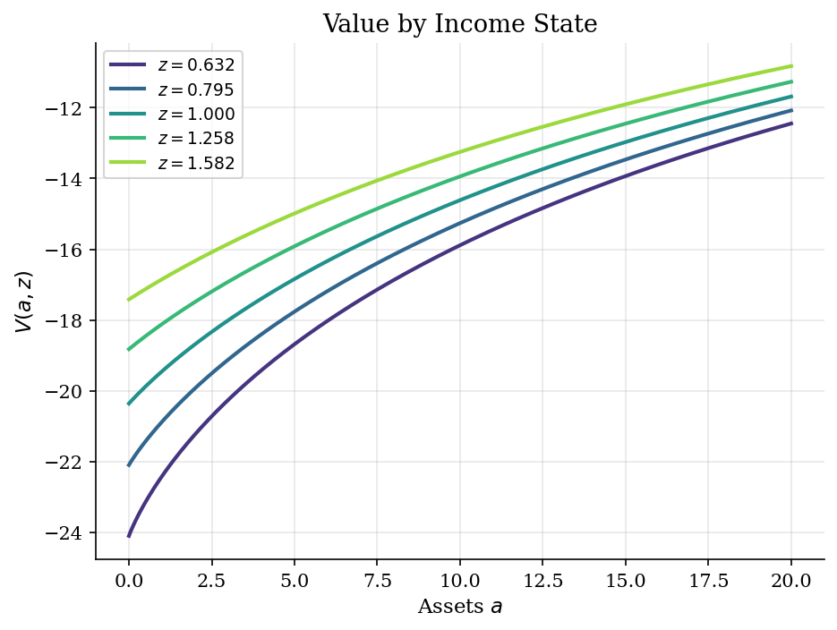
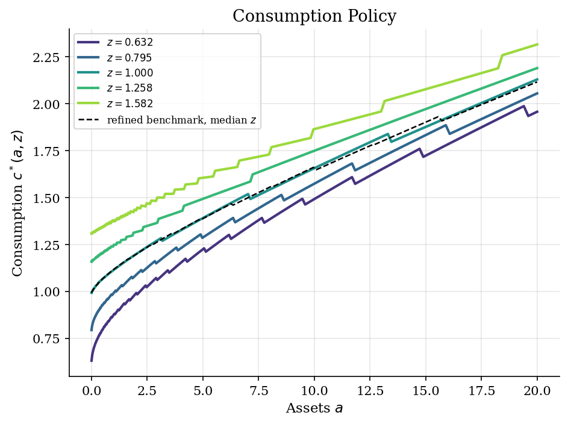
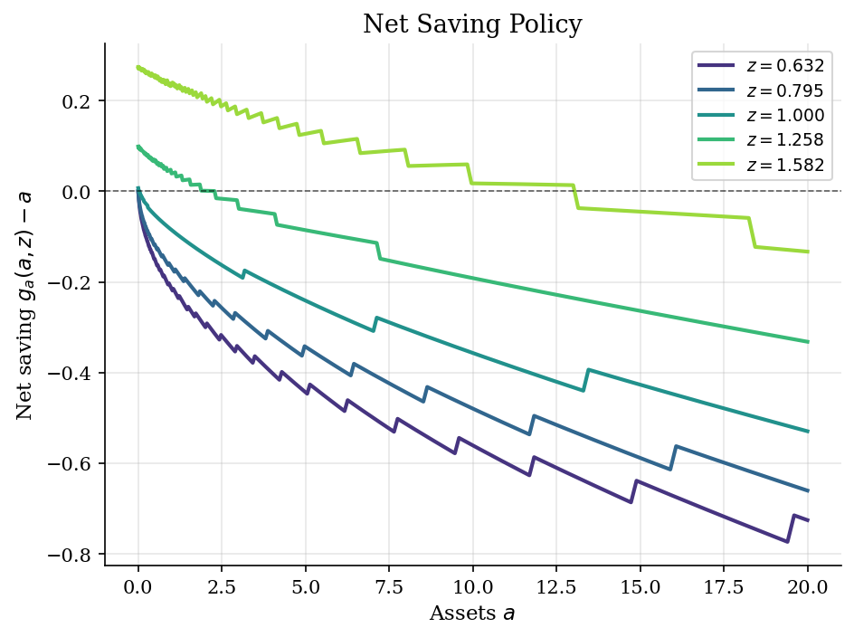
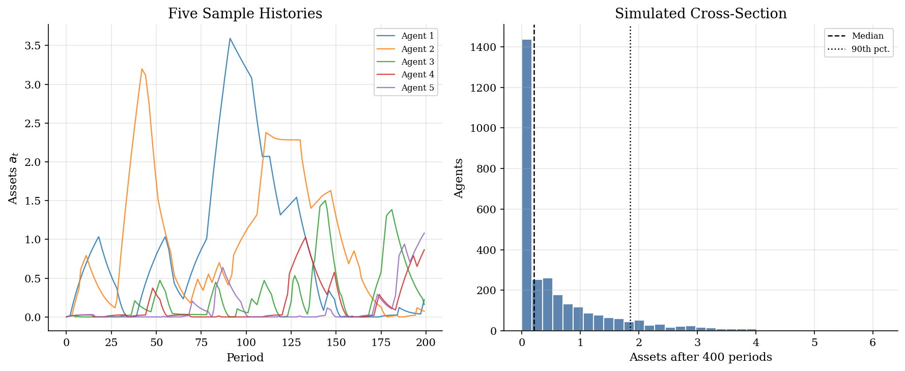

# Income Risk and Buffer-Stock Saving

> A partial-equilibrium savings problem with persistent idiosyncratic income.

## Overview

Households often face income paths they cannot insure. A worker with low assets must absorb a bad income draw through current consumption.

The object is a household savings rule. The state is assets $a$ and income $z$. The control is next-period assets $a'$ under a no-borrowing limit.

Income is persistent, so today's choice changes future cash-on-hand risk. Value function iteration solves the Bellman equation on an asset grid and a finite Markov chain for income.

## Equations

Let $a_t$ be beginning-of-period assets, $z_t$ labor income, and
$R=1+r$ the gross risk-free return. The household chooses next-period assets
$a_{t+1}=a'$ and consumes the residual

$$c_t = R a_t + z_t - a_{t+1}.$$

Assets must respect the no-borrowing constraint:

$$a_{t+1}\geq \underline a = 0,$$

The numerical problem also uses an upper grid bound $\bar a$. Utility is CRRA:

$$u(c)=\frac{c^{1-\sigma}}{1-\sigma}, \qquad \sigma>0,\quad \sigma\neq 1.$$

Log income follows:

$$\log z_{t+1}=\rho \log z_t+\varepsilon_{t+1},\qquad
\varepsilon_{t+1}\sim N(0,\sigma_\varepsilon^2),$$

It is approximated by income states $z_1,\ldots,z_J$ with transition matrix
$P$. Here $P_{jk}=\Pr(z_{t+1}=z_k\mid z_t=z_j)$. The Bellman equation is

$$
V(a,z_j)=
\max_{\underline a\leq a'\leq \bar a,\ a'\leq R a+z_j}
\left[
u(Ra+z_j-a')+
\beta\sum_{k=1}^J P_{jk}V(a',z_k)
\right].
$$

The asset policy is $g_a(a,z)=a'$. The consumption policy is
$c^{\ast}(a,z)=Ra+z-g_a(a,z)$. At an interior choice, the Euler equation is:

$$u'(c_t)=\beta R\,\mathbb{E}_t[u'(c_{t+1})],$$

When the constraint binds, $a_{t+1}=0$ and the Euler inequality holds:

$$u'(c_t)\geq \beta R\,\mathbb{E}_t[u'(c_{t+1})].$$

## Model Setup

| Parameter | Value | Description |
|-----------|-------|-------------|
| $\beta$ | 0.95 | Discount factor |
| $r$ | 0.03 | Exogenous risk-free interest rate |
| $R$ | 1.03 | Gross return on assets |
| $\beta R$ | 0.9785 | Impatience margin; below one here |
| $\sigma$ | 2.0 | CRRA risk aversion |
| $\rho$ | 0.9 | Persistence of log income |
| $\sigma_\varepsilon$ | 0.1 | Innovation standard deviation |
| $\underline{a}$ | 0.0 | No-borrowing lower bound |
| $a \in$ | [0.0, 20.0] | Asset grid support |
| Asset state grid | 300 points | Exponential spacing near $\underline{a}$ |
| Next-asset choice grid | 900 points | Candidate $a'$ values in each Bellman update |
| Refined diagnostic grid | 600 states, 1500 choices | Held-out check for the median income state |
| Income states | 5 | Rouwenhorst approximation to log income |
| Simulation panel | 3000 agents, 400 periods | Used only to illustrate the induced asset distribution |

## Solution Method

The value function is stored on a grid for assets and income. Income uses a five-point Rouwenhorst chain for $\log z$.

The Bellman operator is

$$(TV)(a,z_j)=\max_{0\leq a'\leq Ra+z_j}\left[u(Ra+z_j-a')+\beta\sum_{k=1}^J P_{jk}V(a',z_k)\right],$$

a $\beta$-contraction on bounded functions of $(a,z)$. For each income state, the code computes expected continuation value on the asset grid. It interpolates that value onto a denser grid for $a'$.

At each $(a,z)$, infeasible choices with $a'>Ra+z$ receive value $-\infty$. The algorithm picks the best $a'$ and repeats until the sup-norm change is below tolerance.

```text
Algorithm  Income-fluctuation VFI
Inputs   asset state grid A = {a_i}, asset choice grid G = {g_l},
           income grid Z = {z_j}, transition P with P_{jk} = Pr(z' = z_k | z = z_j),
           primitives (beta, R, sigma), utility u, tolerance epsilon
Outputs  V*(a_i, z_j), asset policy g_a(a_i, z_j),
           consumption policy c*(a_i, z_j) = R a_i + z_j - g_a(a_i, z_j)

Initialise V_0(a_i, z_j) <- u(R a_i + z_j) / (1 - beta)        # eat-cash-on-hand guess
for n = 0, 1, 2, ...:
    for each income state z_j:
        EV(a_i) <- sum_k P_{jk} * V_n(a_i, z_k)                # expected continuation on A
        EV_hat(g_l) <- interp(EV from A to G)                  # off-state continuation on G
        for each asset state a_i:
            feasible(g_l) := { g_l <= R a_i + z_j }            # respects no-borrowing
            obj(g_l) <- u(R a_i + z_j - g_l) + beta * EV_hat(g_l)
            g_a(a_i, z_j) <- argmax_{feasible} obj
            V_{n+1}(a_i, z_j) <- max obj
    err <- max_{i,j} | V_{n+1}(a_i, z_j) - V_n(a_i, z_j) |
    stop when err < epsilon
```

The main grid converges in **260 iterations** to sup-norm residual **9.91e-07**. A refined grid repeats the same solve with 600 state points and 1500 choice points. Its median-income policy is plotted below as a diagnostic.

## Results

$V(a,z_j)$ rises with assets and income. Near $\underline{a}=0$, income states have large value gaps. Low assets give the household little insurance against a bad draw.



Consumption rises with assets and is steepest near the borrowing limit. For the median income state, average MPC is **0.52** near zero assets and **0.04** near the top. The fall measures buffer-stock saving. An extra dollar is mostly consumed when assets are scarce. It is mostly saved after the buffer is large.

The dashed line is the refined-grid median-income policy. Its maximum gap from the main grid is **2.55e-02**.



Net saving $g_a(a,z_j)-a$ shows when the household builds the buffer. High income raises saving, especially close to the borrowing limit. Low income leads to dissaving until the constraint stops it. The zero crossing is the buffer-stock target for the median income state.



Forward simulation applies the policy after each income draw. Five agents start with identical median income. Persistent shocks spread their assets over time. Runs of bad income push assets back toward the constraint.

A panel of 3,000 agents shows the cross-section after 400 periods. Median wealth is **0.20**, and the 90th percentile is **1.85**. About **20.5%** of agents sit near $\underline{a}$. The pile-up at zero and the right tail come from the policy and persistent risk.



## Takeaway

Persistent income risk and no borrowing make saving state-contingent. Value function iteration turns the recursive choice into a policy on the asset-income grid. The computed policy has high MPCs near zero assets, positive saving after high income, and a finite buffer-stock target.

## References

- Carroll, C. D. (1997). Buffer-Stock Saving and the Life Cycle/Permanent Income Hypothesis. *Quarterly Journal of Economics*, 112(1), 1-55.
- Deaton, A. (1991). Saving and Liquidity Constraints. *Econometrica*, 59(5), 1221-1248.
- Ljungqvist, L. and Sargent, T. (2018). *Recursive Macroeconomic Theory*. MIT Press, 4th edition, Ch. 18.
