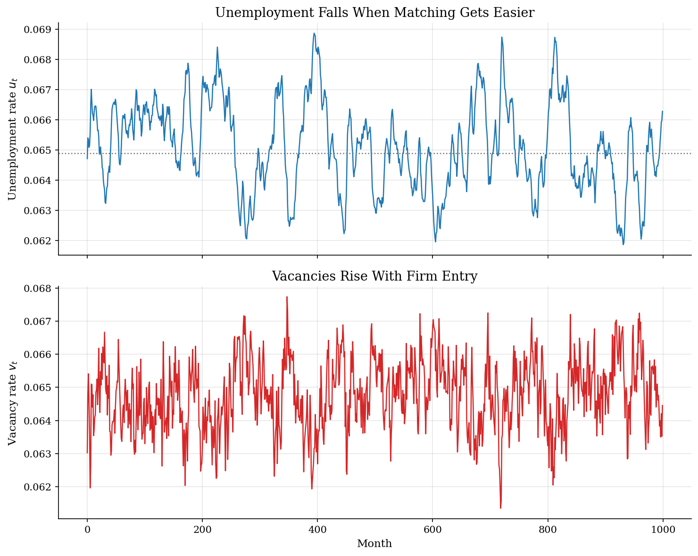
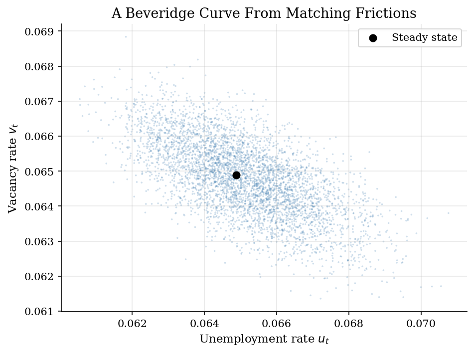
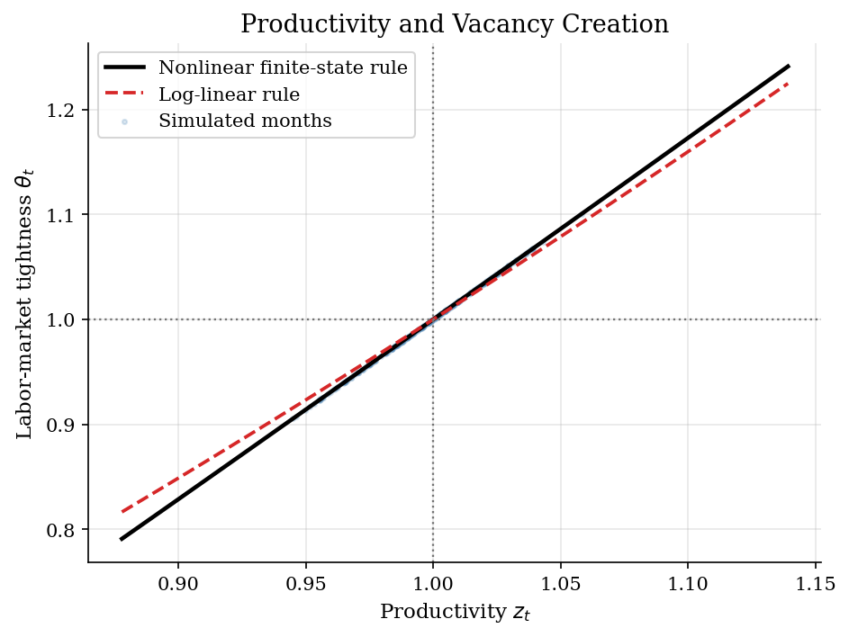

# DMP Search, Vacancies, and Unemployment

> Matching frictions, vacancy creation, and the Shimer volatility puzzle.

## Overview

The Diamond-Mortensen-Pissarides model asks why unemployment and vacancies move together the way they do over the business cycle. Firms pay to post vacancies, workers search while unemployed, and jobs are created only when the matching technology brings the two sides together. The central price-like object is labor-market tightness, $\theta_t=v_t/u_t$: a high value means vacancies are plentiful relative to unemployed workers.

This tutorial uses the Shimer (2005) calibration to make the model's main tension visible. Productivity shocks move job surplus and vacancy creation, so the model generates a Beveridge curve. But with the standard surplus implied by $b=0.40$, tightness and unemployment are much less volatile than in U.S. data. The example extends the [McCall search tutorial](../job-search-mccall/) from a worker's reservation rule to an equilibrium labor market with endogenous vacancies, and it connects to the [RBC tutorial](../rbc/) through the use of persistent aggregate productivity shocks.

## Equations

Let $u_t$ be unemployment, $v_t$ vacancies, and
$\theta_t=v_t/u_t$ labor-market tightness. Matches are produced by

$$m(u_t,v_t)=\chi u_t^{1-\eta}v_t^\eta,$$

so the worker job-finding rate and firm vacancy-filling rate are

$$f(\theta_t)=\chi\theta_t^\eta,\qquad
q(\theta_t)=\chi\theta_t^{\eta-1}.$$

Productivity follows

$$\hat z_{t+1}=\rho \hat z_t+\epsilon_{t+1},\qquad
\epsilon_{t+1}\sim N(0,\sigma_\epsilon^2),\qquad
z_t=\bar z\exp(\hat z_t).$$

With Nash bargaining weight $\gamma$ for the worker, the wage rule is

$$w_t=\gamma(z_t+k\theta_t)+(1-\gamma)b.$$

The value $J_t$ of a filled job satisfies

$$J_t=z_t-w_t+\beta(1-\sigma)\mathbb{E}_t[J_{t+1}],$$

and free entry into vacancy posting imposes

$$k=\beta q(\theta_t)\mathbb{E}_t[J_{t+1}].$$

Unemployment evolves mechanically once $\theta_t$ is known:

$$u_{t+1}=\sigma(1-u_t)+[1-f(\theta_t)]u_t.$$

The local solution writes $\hat\theta_t=C\hat z_t$. For this timing convention,
the linearized free-entry condition gives

$$C=\frac{\rho}{A-B\rho},\qquad
A=\frac{\eta k}{(1-\gamma)\beta\chi},\qquad
B=\beta A(1-\sigma)-\frac{\gamma k}{1-\gamma}.$$

At the baseline calibration, $A=1.1098$ and $B=0.5262$.

## Model Setup

| Object | Value | Role |
|---|---:|---|
| Discount factor $\beta$ | 0.996 | Monthly discounting |
| Productivity persistence $\rho$ | 0.949 | AR(1) persistence of $\hat z_t$ |
| Innovation s.d. $\sigma_\epsilon$ | 0.0065 | Monthly productivity shock scale |
| Separation rate $\sigma$ | 0.034 | Exogenous job destruction |
| Matching efficiency $\chi$ | 0.49 | Level of the matching function |
| Matching elasticity $\eta$ | 0.72 | Vacancy elasticity in $m(u,v)$ |
| Worker bargaining weight $\gamma$ | 0.72 | Worker share in Nash bargaining |
| Flow value of unemployment $b$ | 0.40 | Outside option while searching |
| Vacancy cost $k$ | 0.2106 | Calibrated so $\theta_{ss}=1$ |
| Steady-state unemployment $u_{ss}$ | 0.0649 | Implied by separations and job finding |
| Steady-state wage $w_{ss}$ | 0.9837 | Nash wage at $z=\bar z$ |
| Job surplus $\bar z-b$ | 0.60 | Baseline surplus before vacancy costs |

## Solution Method

There are two computations. The report uses the nonlinear finite-state solution as a check on the log-linear tightness rule, then simulates unemployment from the nonlinear rule. The approximation gap is small in this calibration, so the main economic point is not numerical failure; it is that the standard surplus calibration leaves little amplification to begin with.

```text
Algorithm: log-linear DMP rule
Input: beta, rho, sigma, chi, eta, gamma, b, z_bar
Output: elasticity C and simulated theta_t
Choose k so the deterministic steady state has theta_ss = 1
Compute the linearized free-entry coefficients A and B
Set C = rho / (A - B*rho)
For each simulated productivity deviation zhat_t:
    theta_t = exp(C * zhat_t)
    f_t = chi * theta_t^eta
    u_{t+1} = sigma*(1 - u_t) + (1 - f_t)*u_t
```

```text
Algorithm: nonlinear finite-state free-entry check
Input: Rouwenhorst grid for zhat, transition matrix P, calibrated k
Output: job values J_i and tightness theta_i at each productivity state i
Initialize J_i at its steady-state value
repeat:
    EJ_i = sum_j P_ij J_j
    theta_i = (beta * chi * EJ_i / k)^(1 / (1 - eta))
    J_i_new = (1 - gamma)*(z_i - b) - gamma*k*theta_i
              + beta*(1 - sigma)*EJ_i
    error = max_i |J_i_new - J_i|
    set J_i = J_i_new
until error < epsilon
```

The local rule implies $C=1.554$: a one percent productivity increase raises tightness by about 1.55 percent. The finite-state fixed point converged in **26 iterations** with sup-norm error **5.32e-12**. Across the productivity grid, the largest proportional gap between nonlinear and log-linear tightness is **3.23%**.

## Results

The simulated path shows the stock-flow logic of the model. A good productivity spell raises the surplus from a match, firms post more vacancies, and the job-finding rate rises. Unemployment then moves with a lag because it is a stock: today's hiring changes tomorrow's pool of searchers.



The Beveridge curve appears because vacancy posting and unemployment respond on opposite sides of the matching market. The cloud is tight here because the only shock is aggregate productivity. A shock to matching efficiency $\chi$ would shift the curve rather than just move the economy along it.



The policy comparison keeps the approximation honest. Over this shock range, the log-linear rule tracks the nonlinear free-entry fixed point closely. The important failure is therefore economic: even the nonlinear rule moves tightness only about 1.72 times as much as productivity, well below the volatility of labor-market tightness emphasized by Shimer.



The table reports log-deviation moments after the burn-in. Tightness is strongly procyclical and unemployment is strongly countercyclical, so the model has the right signs. The volatility ratios show the Shimer puzzle: the canonical calibration produces far too little amplification relative to productivity.

**Simulated business-cycle moments**

| Variable                    |   Mean |   Std. log dev. |   Std./Std. z |   Corr. with z |
|:----------------------------|-------:|----------------:|--------------:|---------------:|
| Productivity z              | 0.9976 |          0.0216 |          1    |          1     |
| Unemployment u              | 0.0651 |          0.0243 |          1.13 |         -0.94  |
| Vacancies v                 | 0.0648 |          0.0166 |          0.77 |          0.866 |
| Tightness theta             | 0.9959 |          0.0372 |          1.72 |          1     |
| Tightness theta, log-linear | 0.9965 |          0.0336 |          1.55 |          1     |

## Takeaway

The DMP model gives a clean equilibrium account of the Beveridge curve: productivity raises match surplus, vacancy posting increases, and unemployment falls through the job-finding rate. The same computation also shows why Shimer's result is sharp. With $b=0.40$, the surplus from a match is not small enough for modest productivity shocks to create large swings in vacancy creation. Changing the numerical method from a local rule to a finite-state nonlinear fixed point does not remove that tension; resolving it requires changing the economic surplus or other primitives.

## References

- Diamond, P. (1982). "Aggregate Demand Management in Search Equilibrium." *Journal of Political Economy*, 90(5), 881-894.
- Mortensen, D. and Pissarides, C. (1994). "Job Creation and Job Destruction in the Theory of Unemployment." *Review of Economic Studies*, 61(3), 397-415.
- Shimer, R. (2005). "The Cyclical Behavior of Equilibrium Unemployment and Vacancies." *American Economic Review*, 95(1), 25-49.
- Hagedorn, M. and Manovskii, I. (2008). "The Cyclical Behavior of Equilibrium Unemployment and Vacancies Revisited." *American Economic Review*, 98(4), 1692-1706.
- Pissarides, C.A. (2000). *Equilibrium Unemployment Theory*. MIT Press.
