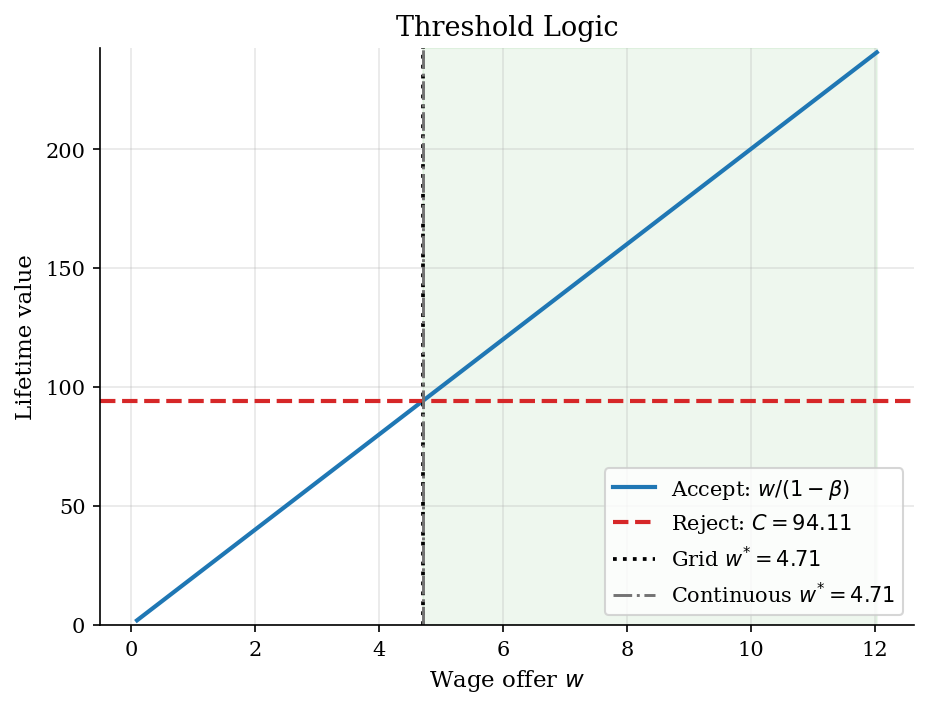
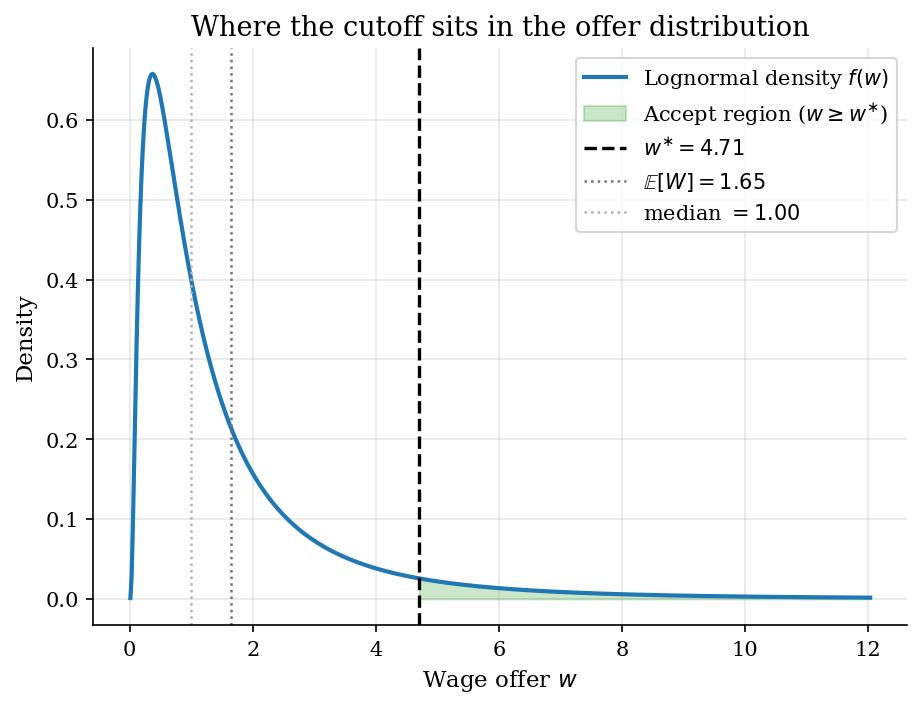
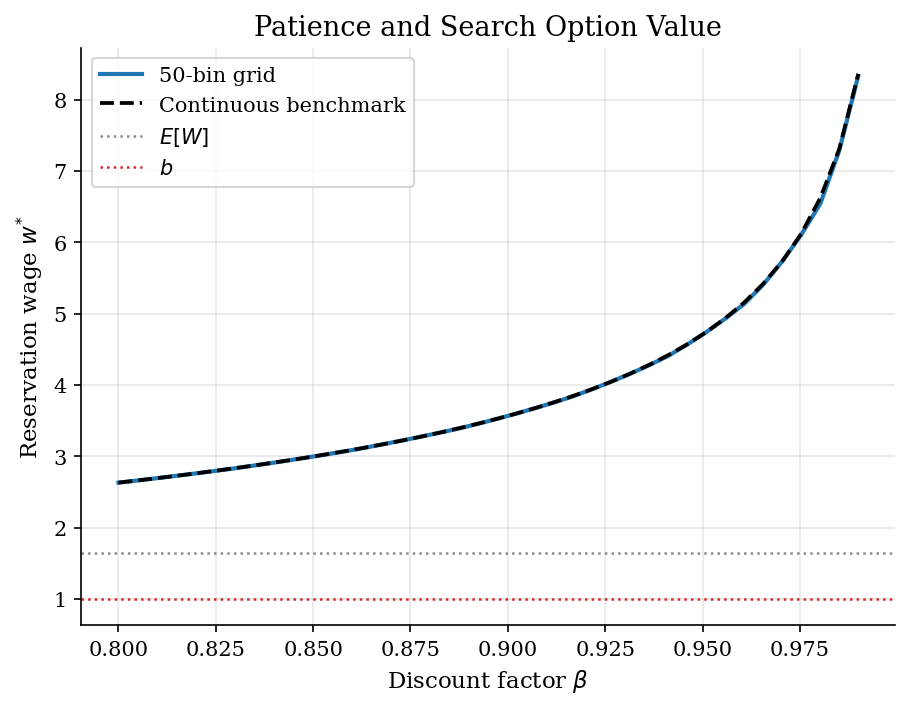
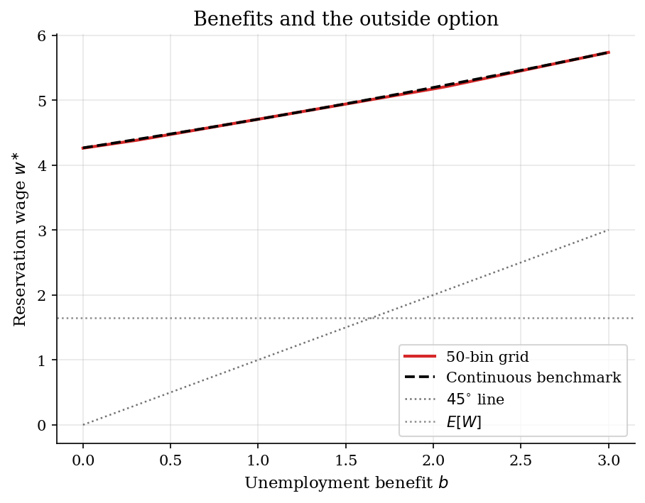

# McCall Job Search and the Reservation Wage

> Sequential wage-offer search with a scalar reservation-wage fixed point.

## Overview

An unemployed worker draws one wage offer each period. Accepting locks in that wage forever. Rejecting pays benefit $b$ and returns the worker to search next period.

The object is the reservation wage $w^{\ast}$. The worker accepts offers at or above it and rejects offers below it.

The computation needs one continuation value. Rejection discards today's offer, so the Bellman equation compares acceptance against a scalar. That scalar gives a fixed point for $w^{\ast}$.

## Equations

Let $W$ be a wage offer with distribution $F$.
The current offer is $w$.
The worker discounts at $\beta\in(0,1)$.

Accepting gives a permanent income stream:

$$A(w)=\frac{w}{1-\beta}.$$

Rejecting pays $b$ today.
Tomorrow the worker draws again.
Because today's rejected offer is gone, rejection has one value:

$$C=b+\beta\,\mathbb{E}_{F}[V(W')].$$

The Bellman equation compares the two values:

$$V(w)=\max\left(\frac{w}{1-\beta}, C\right).$$

Since $A(w)$ rises with $w$ and $C$ is constant, the policy is a cutoff.
At indifference, $A(w^{\ast})=C$:

$$\frac{w^{\ast}}{1-\beta}=b+\beta\,\mathbb{E}_{F}[V(W')].$$

Substitution gives a scalar fixed point in $w^{\ast}$:

$$w^{\ast}=(1-\beta)\,b+\beta\,\mathbb{E}_{F}[\max(W',w^{\ast})].$$

The equation shows the two main margins.
Higher $b$ raises the outside option.
Higher $\beta$ raises the value of waiting.
The right tail of $F$ matters through the expectation.

## Model Setup

| Object | Value | Role |
|---|---:|---|
| Discount factor $\beta$ | 0.95 | Weight on the next draw |
| Flow benefit $b$ | 1.0 | Per-period payoff while unemployed |
| Wage law | $\log W\sim N(0.0,1.0^2)$ | Lognormal offer distribution |
| Median offer | 1.0000 | $e^{\mu}$ for the lognormal |
| Mean offer $\mathbb{E}[W]$ | 1.6487 | Reference level for the cutoff |
| Wage grid | 50 equiprobable bins | Each bin represented by its conditional mean |
| Continuous benchmark | exact lognormal moments | Check on the grid cutoff |
| VFI tolerance | 1e-08 | Sup-norm stopping rule |

## Solution Method

**Finite-grid VFI.** The Bellman operator $T$ acting on a candidate $V$ is

$$(TV)(w)=\max\left(\frac{w}{1-\beta}, b+\beta\,\mathbb{E}_{F}[V(W')]\right).$$

Repeated application converges to the fixed point. Here the update is simple because $C$ is one number. Each sweep computes one expectation and one max over the wage grid.

The code replaces the lognormal offer law with $n_w=50$ equal-probability bins. Each support point is the conditional mean inside its bin. This keeps the mean offer exact.

```text
Algorithm  Finite-grid McCall VFI
Inputs   wages w_1,...,w_n; probabilities p_1,...,p_n;
           discount beta in (0,1); benefit b; tolerance epsilon
Outputs  value V_i and reservation wage w*

Initialise V_i <- w_i / (1 - beta)             # accept-everything guess
repeat n = 0, 1, 2, ...:
    C  <- b + beta * sum_i p_i V_i             # one expectation per sweep
    V_i_new <- max{ w_i / (1 - beta), C }      # elementwise threshold update
    err <- max_i | V_i_new - V_i |
    V_i <- V_i_new
stop when err < epsilon
w* <- (1 - beta) * (b + beta * sum_i p_i V_i)  # invert C = w* / (1 - beta)
```

The continuous lognormal case gives a benchmark. The scalar fixed-point equation

$$r = (1-\beta)\,b+\beta\,m(r),\qquad m(r)=\mathbb{E}_{F}[\max(W,r)],$$

has a closed-form $m(r)$ from lognormal moments. The code solves the residual by Brent's method.

At baseline, finite-grid VFI converges in **178 iterations**. The sup-norm error is **9.84e-09**. The grid cutoff is $w^{\ast}_{\text{grid}}=4.7054$. The continuous cutoff is $w^{\ast}_{\text{cont}}=4.7055$. Absolute grid error is **9.1e-05**.

## Results

The figure shows the reservation rule. The rising line is acceptance value. The dashed line is rejection value. They cross at the cutoff. The shaded region marks acceptable offers. The grid and continuous cutoffs nearly coincide. At baseline, continuous acceptance probability is **6.1%**. Expected unemployment duration is about **16 periods**.



The density plot explains why the cutoff exceeds the mean. The lognormal right tail makes waiting valuable. Most offers are rejected, but rare high offers compensate for waiting.



Patience raises the reservation wage. As $\beta$ approaches one, the worker values future draws more. The cutoff moves into the right tail. The grid solution stays close to the continuous benchmark. The gap widens only at high $\beta$.



Benefits raise the cutoff. Higher $b$ makes rejection less costly. With wage risk, the cutoff rises less than one-for-one because search still has upside.



The table separates benefit and patience margins. Both higher $b$ and higher $\beta$ raise the cutoff. They also lower acceptance rates and lengthen expected duration. Grid error stays small at moderate $\beta$. It grows at $\beta=0.99$ because the cutoff sits deeper in the tail.

**Reservation wages, acceptance rates, and expected unemployment duration**

|   beta |   b |   w* grid |   w* cont. |   grid gap |   Accept % (cont.) |   E[duration] |   VFI iter. |
|-------:|----:|----------:|-----------:|-----------:|-------------------:|--------------:|------------:|
|   0.9  | 0.5 |    3.3118 |     3.3126 |    -0.0007 |               11.6 |           8.7 |          86 |
|   0.9  | 1   |    3.5654 |     3.5656 |    -0.0002 |               10.2 |           9.8 |          95 |
|   0.9  | 2   |    4.1194 |     4.1196 |    -0.0002 |                7.8 |          12.8 |         106 |
|   0.95 | 0.5 |    4.4718 |     4.4794 |    -0.0076 |                6.7 |          15   |         176 |
|   0.95 | 1   |    4.7054 |     4.7055 |    -0.0001 |                6.1 |          16.5 |         178 |
|   0.95 | 2   |    5.1727 |     5.1946 |    -0.0219 |                5   |          20.1 |         181 |
|   0.99 | 0.5 |    8.1646 |     8.1789 |    -0.0143 |                1.8 |          56.2 |         694 |
|   0.99 | 1   |    8.3324 |     8.3631 |    -0.0308 |                1.7 |          59.4 |         696 |
|   0.99 | 2   |    8.6679 |     8.7514 |    -0.0834 |                1.5 |          66.5 |         699 |

## Takeaway

McCall search turns unemployment duration into a reservation wage. The worker accepts only offers that beat this price of waiting. A higher benefit or more patience raises the cutoff and extends unemployment duration. Computationally, the Bellman problem is nearly scalar because rejection has one continuation value. The scalar fixed point gives a clear check on finite-grid VFI.

## References

- McCall, J.J. (1970). "Economics of Information and Job Search." *Quarterly Journal of Economics*, 84(1), 113-126.
- Ljungqvist, L. and Sargent, T. (2018). *Recursive Macroeconomic Theory*. MIT Press, 4th edition, Ch. 6.
- Stokey, N., Lucas, R., and Prescott, E. (1989). *Recursive Methods in Economic Dynamics*. Harvard University Press.
- Pissarides, C.A. (2000). *Equilibrium Unemployment Theory*. MIT Press, 2nd edition.
