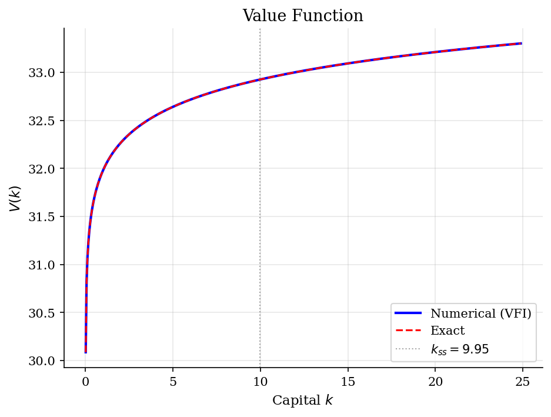
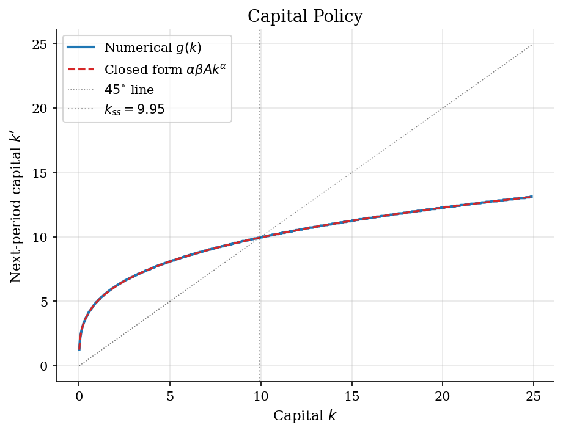
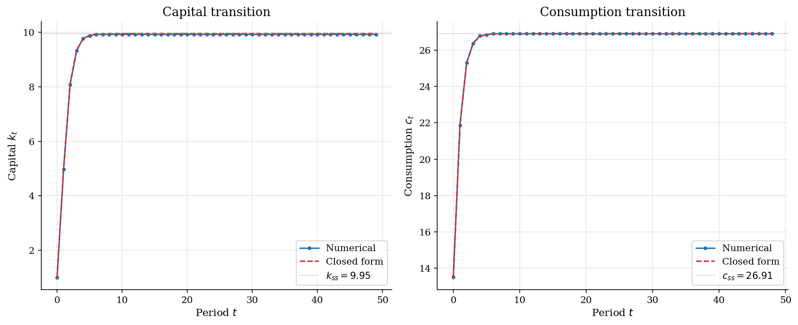

# Optimal Growth by Value Function Iteration

> Productive capital, Euler logic, and the transition to the Ramsey steady state.

## Overview

Optimal growth adds one economic force that is absent from [cake eating](../cake-eating/): the state is productive. A planner who carries capital into tomorrow gives up current consumption, but that capital raises future output through a Cobb-Douglas technology. The policy problem is therefore not just resource depletion; it is intertemporal investment.

This deterministic log-utility version is deliberately transparent. It has a closed form, so value function iteration can be judged against the true value function, policy function, and transition path. The same Bellman equation logic reappears in [RBC](../rbc/) and [Aiyagari](../aiyagari/) models once shocks and equilibrium prices are added.

## Equations

Let $k_t$ be capital at the start of period $t$. Output is

$$y_t = A k_t^\alpha, \qquad A>0,\quad \alpha \in (0,1).$$

The tutorial uses the full-depreciation resource constraint

$$c_t + k_{t+1} = A k_t^\alpha, \qquad c_t>0,\quad k_{t+1}\geq 0.$$

The planner maximizes discounted log utility,

$$\sum_{t=0}^{\infty} \beta^t \log c_t, \qquad \beta \in (0,1).$$

The Bellman equation is

$$V(k) = \max_{0 < k' < A k^\alpha}
\left[\log(Ak^\alpha-k')+\beta V(k')\right].$$

The policy function is $g(k)=k'$. For log utility and Cobb-Douglas production,
the exact solution is

$$g(k)=\alpha\beta A k^\alpha,\qquad
c^{\ast}(k)=(1-\alpha\beta)A k^\alpha.$$

The value function is affine in $\log k$:

$$V(k)=E+B\log k,\qquad B=\frac{\alpha}{1-\alpha\beta},$$

where

$$E=\frac{\log(A(1-\alpha\beta))
+\frac{\beta\alpha}{1-\alpha\beta}\log(A\alpha\beta)}{1-\beta}.$$

The steady state solves $k=g(k)$:

$$k_{ss}=(\alpha\beta A)^{1/(1-\alpha)}.$$

## Model Setup

| Parameter | Value | Description |
|-----------|-------|-------------|
| $\alpha$  | 0.3 | Capital share in $Ak^\alpha$ |
| $A$       | 18.5 | Total factor productivity |
| $\beta$   | 0.9 | Discount factor |
| $k_{ss}$ | 9.9519 | Steady state capital |
| $c_{ss}$ | 26.9071 | Steady state consumption |
| Capital grid | 500 points | Uniform grid for $k$ |
| Choice grid | 500 points | Candidate values for $k'$ in each Bellman update |
| $k \in$   | [0.01, 24.88] | Capital range |
| Tolerance | 1e-06 | Sup-norm convergence criterion |
| Simulation periods | 50 | Transition-path horizon |

## Solution Method

The numerical solution approximates $V(k)$ on a grid. For each capital state, the solver searches over feasible next-period capital, interpolates the current continuation-value guess at off-grid choices, and applies the Bellman operator. The closed-form policy is not used to choose the maximizer; it is held out as a ground-truth diagnostic.

```text
Algorithm: grid VFI for deterministic optimal growth
Input: capital grid K, primitives A, alpha, beta, utility u(c)=log c, tolerance epsilon
Output: value function V and capital policy g(k)
Initialize V_0(k_i) = log(A k_i^alpha) for each k_i in K
repeat for n = 0, 1, 2, ...:
    for each capital state k_i:
        y_i = A k_i^alpha
        build candidate choices k' in [k_min, min(y_i, k_max)]
        c = y_i - k'
        continuation = interpolate V_n at k'
        choose k' that maximizes log(c) + beta * continuation
        record V_{n+1}(k_i) and g(k_i)
    error = max_i |V_{n+1}(k_i) - V_n(k_i)|
until error < epsilon
```

The Bellman operator is a contraction under the usual bounded-state numerical approximation. Here it converged in **143 iterations** with sup-norm error **9.32e-07**.

## Results

The value function is increasing and concave because capital relaxes the resource constraint, but with diminishing marginal product. The exact log-linear value function gives a direct error check. Outside the bottom decile of the grid, the largest value-function deviation is **1.91e-05**.

The numerical and exact value functions are visually indistinguishable over most of the economically relevant state space. The vertical line marks the steady state, not a kink in preferences or technology.



The policy function is the main economic object. Below $k_{ss}$, the policy lies above the 45-degree line, so the economy accumulates capital. Above $k_{ss}$, it lies below the line, so capital is run down. The largest policy deviation from the exact rule outside the bottom decile is **2.87e-02**; the corresponding consumption-policy deviation is **2.87e-02**.

The crossing with the 45-degree line is the steady state. The exact policy is $g(k)=\alpha\beta A k^\alpha$, so this calibration saves **27.0%** of output each period.



The transition path starts from one tenth of steady-state capital. High marginal product makes investment attractive, so capital rises quickly and then approaches the fixed point more slowly. The largest numerical capital-path deviation from the exact transition over the simulation is **2.39e-02**.

Capital and consumption both rise along this low-capital transition. The exact path makes clear that the visible dynamics are economic convergence, while the numerical gap is a grid-search approximation error.



The table reports pointwise approximation errors. The value-function errors are small relative to the value level, and the policy errors are the relevant diagnostic because policies determine simulated allocations.

**Numerical vs exact solution at selected capital states**

|      k |   V(k) numerical |   V(k) exact |   V error |   k' numerical |   k' exact |   k' error |
|-------:|-----------------:|-------------:|----------:|---------------:|-----------:|-----------:|
|  2.502 |          32.3565 |      32.3565 | -1.53e-05 |         6.5967 |     6.5769 |    0.0198  |
|  5.692 |          32.6943 |      32.6943 | -1.53e-05 |         8.4329 |     8.416  |    0.0168  |
|  8.881 |          32.8771 |      32.8771 | -1.53e-05 |         9.629  |     9.6179 |    0.0111  |
| 12.071 |          33.0032 |      33.0032 | -1.53e-05 |        10.5261 |    10.5453 |   -0.0192  |
| 15.261 |          33.0996 |      33.0996 | -1.53e-05 |        11.3235 |    11.3138 |    0.00972 |
| 18.451 |          33.1776 |      33.1776 | -1.53e-05 |        11.9715 |    11.9767 |   -0.00528 |
| 21.64  |          33.2431 |      33.2431 | -1.14e-05 |        12.5695 |    12.5636 |    0.00592 |
| 24.88  |          33.3004 |      33.3005 | -1.53e-05 |        13.1178 |    13.1006 |    0.0172  |

## Takeaway

Optimal growth changes the cake-eating logic by making saving productive. The state still summarizes the future, but now carrying resources forward raises tomorrow's feasible set. With log utility and full-depreciation Cobb-Douglas production, the exact rule saves $\alpha\beta=0.27$ of output and drives capital toward $k_{ss}=9.95$. VFI recovers that policy closely, which is why this example is a useful bridge from closed-form dynamic programming to stochastic growth models where the benchmark has to be replaced by Euler errors, simulation moments, or equilibrium residuals.

## References

- Stokey, N., Lucas, R., and Prescott, E. (1989). *Recursive Methods in Economic Dynamics*. Harvard University Press, Ch. 2 & 4.
- Ljungqvist, L. and Sargent, T. (2018). *Recursive Macroeconomic Theory*. MIT Press, 4th edition, Ch. 3.
- Ramsey, F. (1928). A Mathematical Theory of Saving. *Economic Journal*, 38(152), 543-559.
