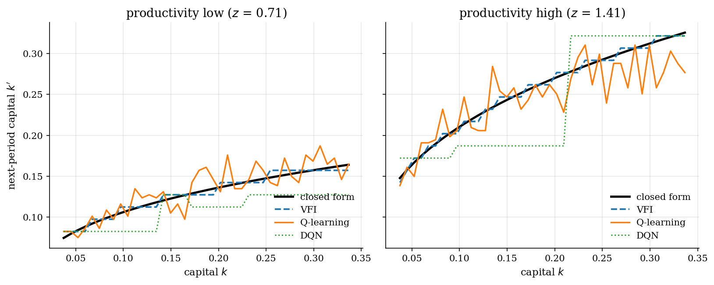
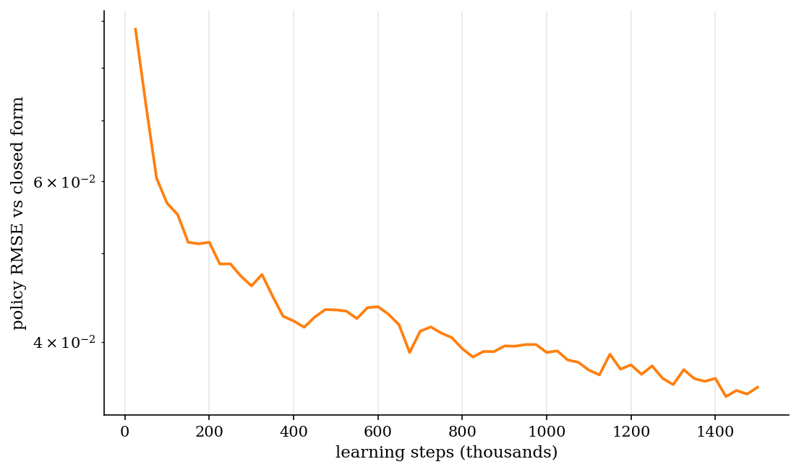
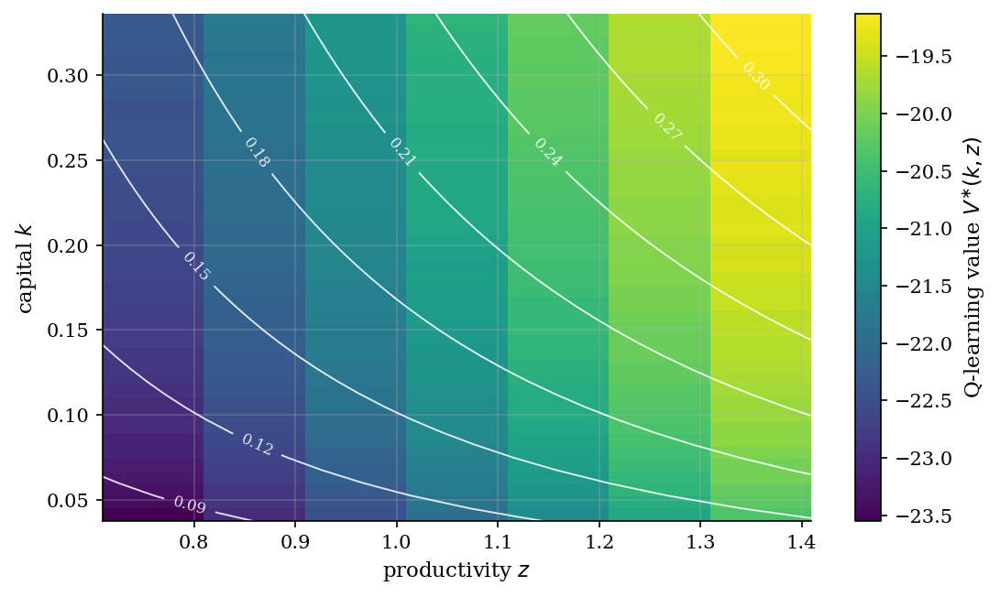

# Stochastic Optimal Growth by Q-Learning

## Overview

A planner allocates output between consumption and productive capital. Productivity moves stochastically each period. The saving choice carries today's shock into tomorrow's capital stock.

The target object is the optimal saving rule $k'(k, z)$. Log utility, Cobb-Douglas production, and full depreciation pin down a closed form, $k'(k, z) = \alpha\beta z A k^{\alpha}$. The closed form audits any numerical solver.

Value iteration solves the Bellman equation through the productivity transition matrix. Q-learning replaces the matrix with sampled transitions. The same saving rule emerges from interaction alone.

## Equations

Let $k_t$ be capital and $z_t$ a productivity shock. Output is $y_t = z_t A k_t^{\alpha}$, the resource constraint is $c_t + k_{t+1} = y_t$, and productivity follows $\log z_{t+1} = \rho \log z_t + \sigma \varepsilon_{t+1}$ with $\varepsilon_{t+1} \sim N(0, 1)$.

The planner's value function solves the Bellman equation:

$$V(k, z) = \max_{k' \in [0, y]} \{\, \log(z A k^{\alpha} - k') + \beta\, \mathbb{E}[V(k', z') \mid z] \,\}.$$

Tabular Q-learning stores an action-value $Q(s, a)$ for each state-action pair and updates it from observed transitions:

$$Q(s, a) \leftarrow Q(s, a) + \alpha_t [\, r + \beta \max_{a'} Q(s', a') - Q(s, a) \,].$$

Here $\alpha_t$ is the step size (learning rate) for update $t$.

Exploration draws each transition uniformly over feasible state-action pairs $(s, a)$, so every region of the grid receives updates regardless of the on-policy distribution. The greedy policy is read off the table as $a^{\ast}(s) = \arg\max_a Q(s, a)$.

## Model Setup

| Object | Value |
|--------|-------|
| Capital state $k$ | 41 grid points on $[0.20, 1.80] \cdot k_{ss}$ |
| Action $k'$ | 21 grid points on the same capital range |
| Productivity $z$ | 7-state Rouwenhorst chain |
| Capital share $\alpha$ | 0.36 |
| Discount $\beta$ | 0.95 |
| Productivity persistence $\rho$ | 0.70 |
| Innovation std $\sigma$ | 0.10 |
| TFP parameter $A$ | 1.0 |
| Q-learning steps per seed | 1,500,000 |
| Q-learning seeds (averaged) | 4 |
| DQN training steps | 250,000 |
| Benchmark | $k'(k, z) = \alpha\beta z A k^{\alpha}$ |
| Steady-state capital $k_{ss}$ | 0.187 |

## Solution Method

Value iteration sweeps the discrete Bellman operator until the value function stops moving. Each sweep evaluates expected continuation values through the productivity transition matrix.

Tabular Q-learning sees one transition at a time. Each step samples a state and a feasible action uniformly at random. The productivity Markov chain delivers the next state. The Bellman temporal-difference error corrects the action-value estimate.

Uniform sampling makes coverage of the grid independent of the steady-state distribution. A Robbins-Monro step size $1 / n_{s,a}^{0.6}$ decays with visit counts. Independent runs are averaged to dampen the action-argmax variance left on individual seeds.

```text
Algorithm: tabular Q-learning with uniform exploration
Input: feasible reward r(s, a), productivity transition, step budget
Output: action-value Q(s, a) and greedy policy a*(s)
Initialize Q(s, a) <- pessimistic constant for all feasible (s, a)
for t = 1, ..., T:
    sample state s_t = (i_k, i_z) uniformly over the grid
    sample action a_t uniformly over feasible actions at s_t
    receive reward r_t = log(z A k^alpha - k'(a_t))
    sample next productivity from the transition row
    Q(s_t, a_t) += alpha_t * (r_t + beta * max_a Q(s_{t+1}, a) - Q(s_t, a_t))
```

The deep-RL appendix replaces the table with a small two-layer MLP $Q_\theta(k, z, \cdot)$. A replay buffer stores recent transitions. The loss is a Huber penalty against a slow-moving target network.

```text
Algorithm: deep Q-network on continuous (k, z)
Input: discrete next-capital actions, replay buffer, minibatch size
Output: parameters theta of Q_theta(k, z, .)
Initialize online and target networks with the same weights
for t = 1, ..., T_dqn:
    select a_t with epsilon-greedy on Q_theta(s_t, .)
    step the environment, store (s_t, a_t, r_t, s_{t+1}) in the buffer
    sample a minibatch and form targets y = r + beta * max_a Q_target(s', a)
    take a gradient step on Huber(Q_theta(s, a) - y)
    every K steps copy the online weights into the target network
```

## Results

The greedy policy out of the Q-table tracks the closed-form saving rule across capital and productivity states. Both numerical methods reproduce the same proportional response to a productivity shock.



Policy error against the closed form falls as the agent visits more states. The curve flattens once each region of the grid has enough samples to anchor the maximizer.



The learned value surface is monotone in capital and increasing in productivity. White contours mark the closed-form saving rule. The iso-policy curves rise with $z$.



The table compares the solvers on the same calibration. Q-learning uses no transition matrix. It matches the VFI policy and value to a few hundredths in capital units.

**Algorithm comparison**

| algorithm                         | transition matrix   |   policy MAE |   value sup-norm vs VFI |   samples |   runtime sec |
|:----------------------------------|:--------------------|-------------:|------------------------:|----------:|--------------:|
| value iteration                   | yes                 |       0.0038 |                  0      |   2175747 |         0.006 |
| tabular Q-learning (4 seeds avg.) | no                  |       0.0154 |                  0.6721 |   6000000 |        79.278 |
| DQN                               | no                  |       0.0299 |                nan      |    250000 |       121.828 |

VFI converges in 361 sweeps. Q-learning hits a policy MAE of 0.0154 after 6,000,000 sampled transitions across 4 seeds. DQN reaches 0.0299 after 250,000 steps.

## Takeaway

When the transition is unknown, the planner can still recover the saving rule. Sampled transitions are enough.

Q-learning trades a model for data. The closed-form Brock-Mirman policy keeps both the model-based and the model-free solvers honest.

## References

- [Brock, W. A. and Mirman, L. J. (1972). Optimal Economic Growth and Uncertainty: The Discounted Case. *Journal of Economic Theory*, 4(3), 479-513.](https://doi.org/10.1016/0022-0531(72)90135-4)
- [Watkins, C. J. C. H. and Dayan, P. (1992). Q-Learning. *Machine Learning*, 8(3), 279-292.](https://doi.org/10.1007/BF00992698)
- [Sutton, R. S. and Barto, A. G. (2018). *Reinforcement Learning: An Introduction*, 2nd ed. MIT Press.](http://incompleteideas.net/book/the-book-2nd.html)
- [Mnih, V., Kavukcuoglu, K., Silver, D., et al. (2015). Human-Level Control through Deep Reinforcement Learning. *Nature*, 518, 529-533.](https://doi.org/10.1038/nature14236)
