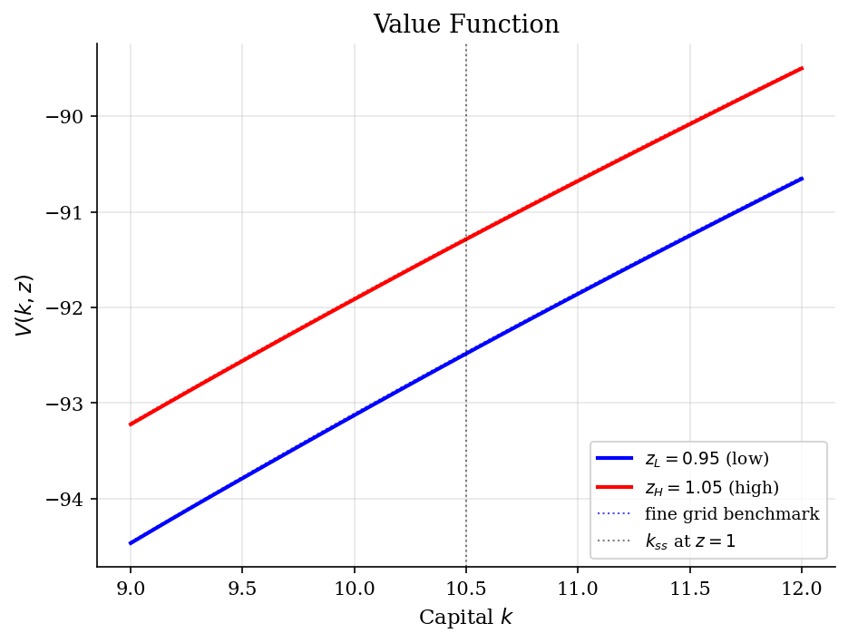
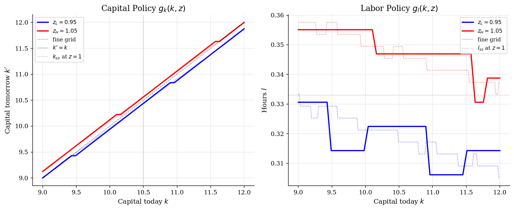
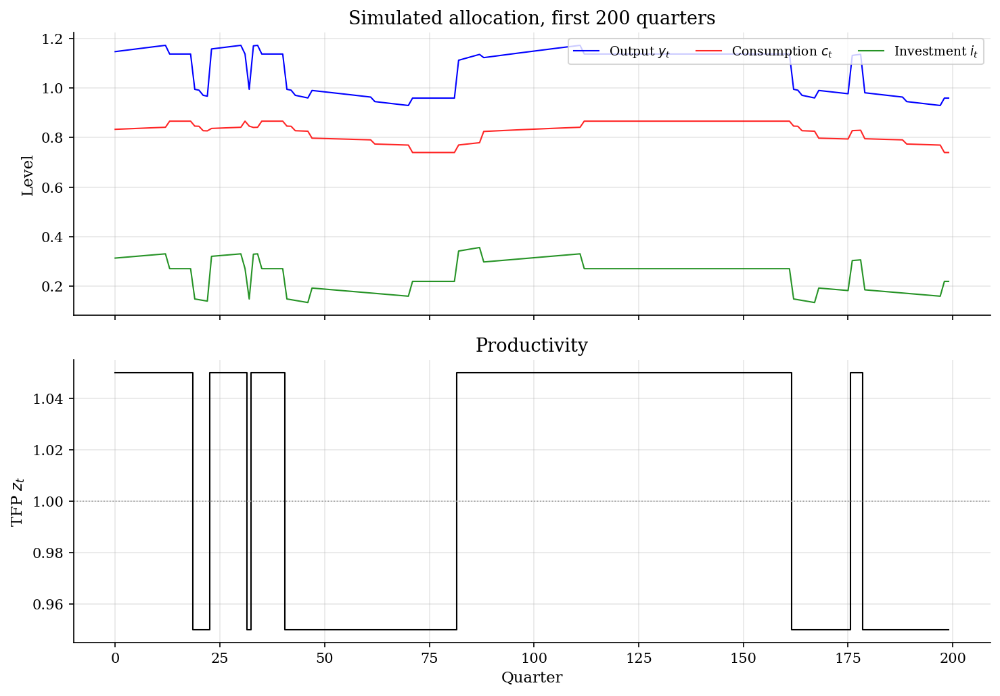
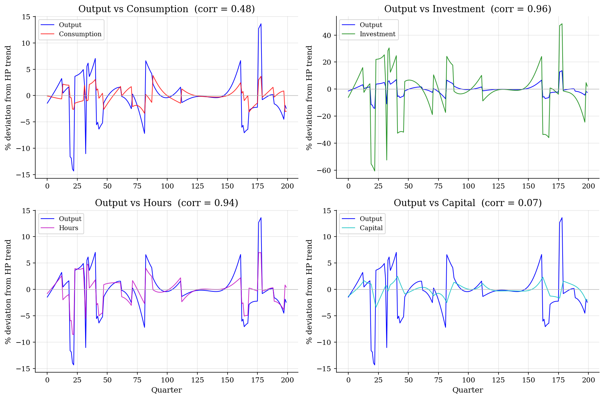

# RBC Capital, Labor, and Business-Cycle Moments

> A representative-household RBC model with endogenous labor and two-state TFP, solved on a global grid and audited against a finer-grid benchmark.

## Overview

A representative household owns the capital stock, supplies labor, and chooses investment after observing aggregate productivity. With log consumption and log-leisure utility, this is the original [Kydland-Prescott (1982)](#references) recipe stripped to its essentials: the technology shock is the impulse, and the *capital* and *labor* policies determine how a one-period innovation in $z_t$ propagates into a persistent path for $(y_t,c_t,i_t,l_t)$.

The exercise is intentionally global and nonlinear. Unlike the [linearized RBC](../../dsge/rbc/) tutorial, which log-linearizes the same first-order system around the deterministic steady state and solves it by method of undetermined coefficients (cross-checked against [Klein QZ with endogenous labor](../../dsge/rbc-with-labor/)), here the solution operates on the level of the value function. Productivity lives on a two-state Markov chain rather than a continuous AR(1), so the Bellman operator, the policy functions, and the simulated second moments fit on a single page without losing the canonical King-Plosser-Rebelo (1988) moment pattern.

Two neighboring tutorials provide useful contrasts. [Optimal growth](../optimal-growth/) is the same Bellman recursion with deterministic technology and inelastic labor, where the closed form $s=\alpha\beta$ pins down saving exactly. [Aiyagari](../aiyagari/) replaces the single representative agent with a continuum of income-risk-bearing households, and the resulting general equilibrium endogenizes both factor prices that the planner here treats as marginal products.

## Equations

**Technology and resources.** Capital $k_t$, labor $l_t\in(0,1)$, and TFP $z_t$
combine through a Cobb-Douglas production function

$$y_t = z_t\,k_t^{\alpha}\,l_t^{1-\alpha},\qquad \alpha\in(0,1),$$

and the resource constraint

$$c_t + k_{t+1} = z_t\,k_t^{\alpha}\,l_t^{1-\alpha} + (1-\delta)\,k_t,$$

with $c_t>0$ and $k_{t+1}\geq 0$.

**Preferences.** Period utility is additively separable in consumption and
leisure,

$$u(c,l)=\log c+\phi\log(1-l),\qquad \phi>0,$$

and the household maximizes
$\mathbb{E}_0\sum_{t=0}^{\infty}\beta^t u(c_t,l_t)$. Log utility makes the
intertemporal substitution elasticity equal to one and gives a closed form
for the deterministic steady state below; the leisure weight $\phi$ controls
the Frisch-elasticity-equivalent margin.

**TFP process.** Productivity takes two values $z_t\in\{z_L,z_H\}=\{0.95,1.05\}$
with persistent symmetric transitions

$$P_{ij}=\Pr(z_{t+1}=z_j\mid z_t=z_i),\qquad
P=\begin{pmatrix}0.95 & 0.05\\ 0.05 & 0.95\end{pmatrix}.$$

The unconditional distribution is uniform; the half-life of a shock is roughly
$\log 0.5/\log 0.9\approx 6.6$ periods.

**Bellman equation.** Conditioning on the current state $(k,z_i)$, the household
solves

$$V(k,z_i)=\max_{k',\,l\in(0,1)}\bigl[\log c+\phi\log(1-l)+\beta\sum_{j}P_{ij}\,V(k',z_j)\bigr],$$

subject to $c=z_i k^{\alpha} l^{1-\alpha}+(1-\delta)k-k'>0$. The policy
functions are $g_k(k,z)=k'$ and $g_l(k,z)=l$.

**Static labor margin.** Because labor enters only the period payoff, its
optimum at every $(k,z,k')$ satisfies the static intratemporal first-order
condition $u_l=u_c\cdot \mathrm{MPL}$, i.e.

$$\frac{\phi}{1-l}=\frac{(1-\alpha)\,z\,k^{\alpha}\,l^{-\alpha}}{c},$$

so the labor decision is a wealth-vs-substitution trade-off conditional on
the saving choice. The solver below sweeps a grid in $(l,k')$ jointly rather
than substituting this FOC, which keeps the algorithm fully vectorized at
the cost of a bigger per-iteration tensor.

**Deterministic $z=1$ benchmark.** Setting $z\equiv 1$ in the stochastic
Bellman, the Euler condition for capital pins down the steady-state
capital-labor ratio,

$$\frac{k_{ss}}{l_{ss}}=\Bigl(\frac{1/\beta-1+\delta}{\alpha}\Bigr)^{1/(\alpha-1)},$$

and the labor first-order condition pins down hours

$$l_{ss}=\frac{w_{ss}}{w_{ss}+\phi\,(c_{ss}/l_{ss})},\qquad
w_{ss}=(1-\alpha)\bigl(k_{ss}/l_{ss}\bigr)^{\alpha}.$$

This is the *only* point in $(k,z)$-space where the model has an exact
analytical solution; the stochastic policy fluctuates around it.

## Model Setup

| Object | Value | Role |
|---|---:|---|
| $\beta$ | 0.99 | Discount factor (quarterly) |
| $\delta$ | 0.0233 | Depreciation rate |
| $\alpha$ | 0.3333 | Capital share in Cobb-Douglas |
| $\phi$ | 1.74 | Leisure weight in utility |
| $z\in\{z_L,z_H\}$ | $\{0.95,1.05\}$ | Two-state aggregate TFP |
| $P_{ii}$ | 0.95 | Probability of staying in the same TFP state |
| $k_{ss}$ | 10.4980 | Deterministic steady-state capital at $z=1$ |
| $l_{ss}$ | 0.3330 | Deterministic steady-state hours |
| $c_{ss}$ | 0.8073 | Deterministic steady-state consumption |
| $i_{ss}$ | 0.2446 | Deterministic steady-state investment |
| Capital grid | $[9.0,12.0]$, 50 pts | State and $k'$ choice grid |
| Labor grid | $[0.2,0.6]$, 50 pts | $l$ candidates |
| Fine benchmark | 200 capital, 100 labor pts | Audit only |
| Tolerance | 1e-05 | Sup-norm stopping rule for VFI |
| Simulation | 5000 periods after 500 burn-in | Stationary moments |

## Solution Method

**What the algorithm does.** The Bellman operator

$$(TV)(k,z_i)=\max_{(l,k')}\bigl[\log c(k,z_i,l,k')+\phi\log(1-l)+\beta\sum_{j}P_{ij}V(k',z_j)\bigr]$$

is a $\beta$-contraction on bounded continuous functions, so iterates converge geometrically at rate $\beta=0.99$ to the unique fixed point. The ingredients that make a finite-grid implementation behave well are the same as in [optimal growth](../optimal-growth/): a state grid wide enough that the ergodic distribution stays in its interior, a fine-enough $k'$ grid to avoid policy quantization, and a labor grid covering the equilibrium hours range.

**Vectorization.** The inner maximization is over a $50\times 50$ rectangle in $(l,k')$ for each of $50\times 2=100$ states. Precomputing the whole flow-utility tensor $u(k,z,l,k')$ once turns each VFI sweep into a single broadcast addition $\beta\,EV[k',z]+u[k,z,l,k']$ followed by an `argmax` over the joint $(l,k')$ axis. Negative consumption is masked by $-\infty$ before the loop starts, so every iteration is a pure linear-algebra pass.

**Why grid search instead of nesting the labor FOC.** With log-leisure preferences the static labor FOC has the closed form $1-l=\phi c/w$ with $w=(1-\alpha)y/l$, which can be substituted out and reduce the outer maximization to a one-dimensional search over $k'$. The trade-off is between dimensionality and code clarity: grid search makes the algorithm fully vectorized, treats infeasibility uniformly, and keeps the labor policy explicit as a diagnostic. For a small two-state model the cost is negligible; for a continuous AR(1) productivity process with several hundred quadrature nodes the FOC substitution would pay.

**Pseudocode.**

```text
Algorithm  Global VFI for the two-state RBC model
Inputs   capital grid K = {k_i}, labor grid L = {l_m}, TFP states {z_1,z_2},
           transition matrix P, primitives (beta, delta, alpha, phi),
           tolerance epsilon
Outputs  V(k_i, z_s), capital policy g_k(k_i, z_s), labor policy g_l(k_i, z_s)

Precompute  u_{i,s,m,j} <- log c + phi log(1 - l_m)
            with c = z_s k_i^alpha l_m^(1-alpha) + (1-delta) k_i - k_j,
            and u_{i,s,m,j} <- -infinity if c <= 0
Initialize  V_{i,s} <- (log c_guess + phi log(1 - l_guess)) / (1 - beta)
repeat n = 0, 1, 2, ...:
    EV_{j,s} <- sum_t P_{s,t} V_{j,t}                  # 1 mat-mat
    M_{i,s,m,j} <- u_{i,s,m,j} + beta * EV_{j,s}        # broadcast add
    (m*, j*)_{i,s} <- argmax over (m, j) of M_{i,s,m,j} # joint argmax
    V^new_{i,s}    <- max over (m, j) of M_{i,s,m,j}
    err            <- max_{i,s} | V^new_{i,s} - V_{i,s} |
    V              <- V^new
stop when err < epsilon
g_k(k_i, z_s) <- k_{j*_{i,s}};   g_l(k_i, z_s) <- l_{m*_{i,s}}
```

**Hyperparameters and what they buy.** Coarsening the capital grid below $\sim 30$ points starts to cause visible step artefacts in $g_k(k,z)$ near the saving 45-degree line; refining it past $\sim 200$ buys very little economically because the policy is almost linear in $k$ over the ergodic set. The labor grid $[0.2,0.6]$ comfortably brackets the deterministic $l_{ss}=0.333$ and the stochastic policy below, so $50$ points already give policy gaps under one quarter of one percentage point.

**Audit against a fine grid.** The same VFI is rerun with 200 capital and 100 labor nodes on the same domain. The coarse-grid value function agrees with the fine-grid benchmark to max relative error **2.1e-04** across the state space, the capital policy to max absolute error **0.0461** units of capital, and hours to **0.0150**. The coarse solution is what feeds the simulation; the benchmark only certifies that the moment comparisons below are not driven by discretization.

At baseline calibration the coarse VFI converged in **515 iterations** with sup-norm error **9.95e-06**, and the fine-grid solver in **525 iterations** with error **9.96e-06**.

## Results

The value function is monotone and concave in capital, with a uniform vertical shift between the high- and low-TFP curves: a more productive aggregate state raises the marginal value of every level of installed capital. The dotted lines are the 200-point benchmark and overlay the 50-point solution to within 2e-04 relative error, so any visible structure is economic, not numerical. The vertical reference is the deterministic steady-state capital at $z=1$, which sits between the two stochastic ergodic centers.



The capital policy stays close to the 45-degree line over the ergodic set: investment is small relative to the stock, so $k$ moves slowly. Where $g_k(k,z)$ lies above $k$, gross investment exceeds depreciation and capital rises next period; the high-TFP curve sits above the low-TFP curve at every $k$, because productivity raises the after-depreciation marginal return on installed capital. Hours show a small negative slope in $k$ — the wealth effect — and a clear upward shift between low- and high-TFP states. The TFP shift dominates the wealth effect by an order of magnitude, which is why the simulated cyclical comovement of hours is essentially the intertemporal-substitution response to $z$. The fine-grid benchmark traces out a smoother version of the same step pattern; the residual stepping in the coarse solution is grid quantization, not economics.



Output reacts to the TFP regime on impact through both the direct Cobb-Douglas channel and the labor response. Consumption is visibly smoother than output: with $\beta R\approx 1$ the household uses capital to buffer the marginal utility profile, so the resource gap between output and consumption — investment, the green line — does most of the absorbing. The investment series spikes at every regime switch and undershoots between switches as the capital stock catches up.



Each panel overlays the model output cycle on a second variable, so the RBC second-moment pattern reads off directly. Consumption tracks output but with smaller swings: that is consumption smoothing made visible. Investment moves with output and amplifies it by a factor of about four — investment is the high-frequency margin in the model. Hours move with output through the intertemporal labor-supply channel and are nearly as volatile as a fraction of output as data suggest. Capital barely shows a contemporaneous correlation with output because it is a stock variable that integrates past investment; its lag against the cycle is what creates the model's persistence.



Three rows characterize the model. *Investment* is over four times as volatile as output and almost perfectly procyclical; *consumption* is roughly a third as volatile and procyclical but not as much; *hours* are about $0.6$ times as volatile as output and strongly procyclical. These ratios match the qualitative pattern that King-Plosser-Rebelo (1988) report from US data, which is the standard test the RBC model passes by construction. The autocorrelation column shows that capital is the model's stock of persistence: $\rho_k\approx 0.95$ from the integration of investment, against $\rho_y\approx 0.71$ for the flow output.

**Business-cycle moments, HP-filtered (lambda=1600), 5000-quarter simulation**

| Variable        |   Std Dev (%) |   Relative to Y |   Corr with Y |   Autocorr(1) |
|:----------------|--------------:|----------------:|--------------:|--------------:|
| Output (Y)      |          4.55 |            1    |          1    |          0.71 |
| Consumption (C) |          1.54 |            0.34 |          0.48 |          0.74 |
| Investment (I)  |         18.75 |            4.12 |          0.96 |          0.69 |
| Hours (L)       |          2.75 |            0.6  |          0.94 |          0.7  |
| Capital (K)     |          1.32 |            0.29 |          0.07 |          0.95 |

## Takeaway

Putting the standard RBC primitives on a finite grid recovers the canonical King-Plosser-Rebelo signature without log-linearization. The technology shock is the impulse, but the *capital* and *labor* policies determine the propagation: investment is the volatile margin (relative std $\approx4.12$), consumption is much smoother ($\approx0.34$), hours are strongly procyclical ($\mathrm{corr}(L,Y)\approx0.94$), and capital is the persistent stock that turns a memoryless Markov chain into an autocorrelated output series ($\rho_y\approx0.71$). The fine-grid benchmark certifies these moments are not artefacts of discretization. Two natural extensions: replacing the two-state TFP process with a discretized AR(1) (see [shock discretization](../shock-discretization/)) moves the analysis closer to the [linearized RBC](../../dsge/rbc/) tutorial and the [Klein QZ solution with endogenous labor](../../dsge/rbc-with-labor/); replacing the single representative agent with a continuum of heterogeneous households gives the [Aiyagari general equilibrium](../aiyagari/).

## References

- Kydland, F. and Prescott, E. (1982). "Time to Build and Aggregate Fluctuations." *Econometrica*, 50(6), 1345-1370.
- King, R., Plosser, C., and Rebelo, S. (1988). "Production, Growth and Business Cycles: I. The Basic Neoclassical Model." *Journal of Monetary Economics*, 21(2-3), 195-232.
- Cooley, T. and Prescott, E. (1995). "Economic Growth and Business Cycles." In Cooley (ed.), *Frontiers of Business Cycle Research*, Princeton University Press.
- Hansen, G. (1985). "Indivisible Labor and the Business Cycle." *Journal of Monetary Economics*, 16(3), 309-327.
- Ljungqvist, L. and Sargent, T. (2018). *Recursive Macroeconomic Theory*. MIT Press, 4th edition, Ch. 12.
