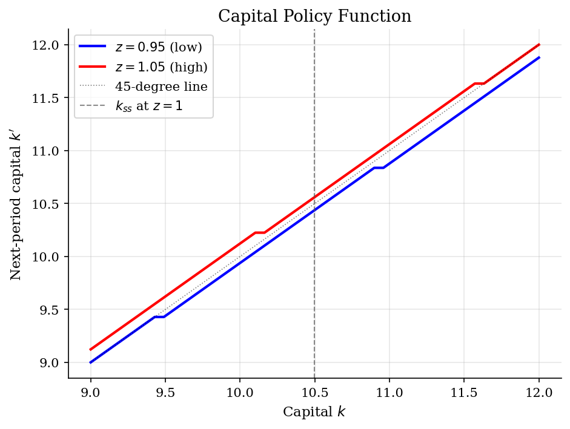

# RBC Capital, Labor, and Business-Cycle Moments

> Persistent productivity shocks move output on impact, while investment and labor choices determine how the cycle propagates.

## Overview

This tutorial puts the standard real-business-cycle mechanism on a finite state space. A representative household owns the capital stock, supplies labor, and chooses investment after observing aggregate productivity. Good technology states raise the return to working and accumulating capital; bad states make investment the main margin that absorbs the shock.

The example is intentionally global and nonlinear. Unlike the [linearized RBC](../../dsge/rbc/) tutorial, it does not log-linearize around the steady state. It keeps productivity to two Markov states so the Bellman logic, policy functions, and simulated business-cycle moments fit in one pass.

## Equations

Let $k_t$ be capital at the start of period $t$, $z_t$ aggregate TFP,
$l_t \in (0,1)$ labor, $c_t>0$ consumption, and $k_{t+1}$ next-period
capital. Output is

$$y_t = z_t k_t^\alpha l_t^{1-\alpha}, \qquad \alpha \in (0,1).$$

Capital evolves through the resource constraint

$$c_t + k_{t+1} = z_t k_t^\alpha l_t^{1-\alpha}
    + (1-\delta)k_t.$$

The household has period utility

$$u(c_t,l_t)=\log c_t + \phi \log(1-l_t), \qquad \phi>0,$$

and maximizes $\mathbb{E}_0\sum_{t=0}^{\infty}\beta^t u(c_t,l_t)$.
With $z \in \{z_L,z_H\}=\{0.95,1.05\}$ and
$P_{ij}=\Pr(z_{t+1}=z_j\mid z_t=z_i)$,

$$P = \begin{pmatrix} 0.95 & 0.05 \\ 0.05 & 0.95 \end{pmatrix}$$

is the productivity transition matrix.

The recursive problem is

$$V(k,z_i)=\max_{k',l}
\bigl[
\log c+\phi\log(1-l)+
\beta \sum_j P_{ij}V(k',z_j)
\bigr],$$

where $c=z_i k^\alpha l^{1-\alpha}+(1-\delta)k-k'$ and infeasible choices
with $c \leq 0$ are discarded. The capital policy is $g_k(k,z)$ and the labor
policy is $g_l(k,z)$.

The deterministic $z=1$ steady state is useful as a benchmark. Its capital-labor
ratio satisfies

$$\frac{k}{l} =
\left(\frac{1/\beta-1+\delta}{\alpha}\right)^{1/(\alpha-1)},$$

and labor is pinned down by

$$\frac{\phi}{1-l} =
\frac{(1-\alpha)(k/l)^\alpha}{l\left((k/l)^\alpha-\delta(k/l)\right)}.$$

## Model Setup

| Parameter | Value | Description |
|-----------|-------|-------------|
| $\beta$  | 0.99 | Discount factor |
| $\delta$ | 0.0233 | Depreciation rate |
| $\alpha$ | 0.3333 | Capital share |
| $\phi$   | 1.74 | Weight on leisure |
| $z$       | {0.95, 1.05} | Low and high TFP states |
| $P_{ii}$ | 0.95 | Probability that TFP remains in the same state |
| $k_{ss}$ | 10.4980 | Deterministic steady-state capital at $z=1$ |
| $l_{ss}$ | 0.3330 | Deterministic steady-state labor |
| $c_{ss}$ | 0.8073 | Deterministic steady-state consumption |
| $i_{ss}$ | 0.2446 | Deterministic steady-state investment |
| Capital grid | [9.0, 12.0], 50 points | State and $k'$ choice grid |
| Labor grid | [0.2, 0.6], 50 points | Candidate values for $l$ |
| Tolerance | 1e-05 | Sup-norm convergence criterion |
| Simulation periods | 5000 | Kept after 500 burn-in periods |

## Solution Method

The solution approximates $V(k,z)$ on the capital grid and treats labor as a static choice nested inside the Bellman update. For every current state, the solver evaluates all feasible pairs $(l,k')$. The continuation value is the Markov expectation over tomorrow's productivity state.

```text
Algorithm: global VFI for the two-state RBC model
Input: capital grid K, labor grid L, TFP states Z, transition matrix P,
       primitives beta, delta, alpha, phi, tolerance epsilon
Output: value V(k,z), capital policy g_k(k,z), labor policy g_l(k,z)
Precompute u(k,z,l,k') for every feasible c = z k^alpha l^(1-alpha) + (1-delta)k - k'
Initialize V_0(k,z) from a steady-state-like consumption rule
repeat for n = 0, 1, 2, ...:
    for each productivity state z_i:
        EV_n(k',z_i) = sum_j P_ij V_n(k',z_j)
    for each state (k,z_i):
        choose (l,k') maximizing u(k,z_i,l,k') + beta * EV_n(k',z_i)
        record V_{n+1}(k,z_i), g_l(k,z_i), and g_k(k,z_i)
    error = max_{k,z} |V_{n+1}(k,z) - V_n(k,z)|
until error < epsilon
Simulate z_t from P, apply the policies, HP-filter log series, and compute moments
```

There is no closed-form stochastic policy here, so the deterministic steady state serves only as a benchmark location. The economic diagnostics are the policy functions and the simulated second moments. The VFI loop converged in **515 iterations** with sup-norm error **9.95e-06**.

## Results

The value function is increasing in capital and higher in the good productivity state. The vertical line is the exact deterministic steady state at $z=1$; the stochastic economy does not stay there, but it is a useful reference point for reading the state space.


The capital policy is the main intertemporal object. Where $g_k(k,z)$ lies above the 45-degree line, gross investment more than offsets depreciation and capital rises. The high-TFP policy is above the low-TFP policy because productivity raises the return to carrying capital into the next period.



Output jumps when TFP switches, while consumption moves less because the household smooths marginal utility. The gap between output and consumption is investment, so investment takes much of the adjustment when productivity changes.


The HP-filtered series show the second-moment logic usually used to summarize RBC models. Consumption is smoother than output, investment is much more volatile, and labor is procyclical. Capital is persistent because it is a stock, so it comoves less tightly with the contemporaneous output cycle.


The table reports model moments, not empirical estimates. They are the standard RBC diagnostic: relative volatility says which margins absorb shocks, correlations say which variables are procyclical, and autocorrelations summarize propagation.

**Business Cycle Statistics (HP-filtered, simulated 5000 periods)**

| Variable        |   Std Dev (%) |   Relative Std |   Corr with Y |   Autocorr(1) |
|:----------------|--------------:|---------------:|--------------:|--------------:|
| Output (Y)      |          4.55 |           1    |          1    |          0.71 |
| Consumption (C) |          1.54 |           0.34 |          0.48 |          0.74 |
| Investment (I)  |         18.75 |           4.12 |          0.96 |          0.69 |
| Capital (K)     |          1.32 |           0.29 |          0.07 |          0.95 |
| Labor (L)       |          2.75 |           0.6  |          0.94 |          0.7  |

## Takeaway

In this finite-state RBC economy, the technology shock is the impulse, but the capital and labor policies decide the propagation. Investment is the volatile margin, with relative standard deviation **4.12**, while consumption is smoother at **0.34**. Labor is strongly procyclical ($\mathrm{corr}(L,Y)$ = **0.94**), and capital is highly persistent (autocorr = **0.95**) because it moves only through accumulated investment. This small calibration is not a complete quantitative business-cycle model. It shows that a Bellman equation over aggregate capital and TFP can produce the canonical RBC moment comparisons without leaving the nonlinear policy functions.

## References

- Kydland, F. and Prescott, E. (1982). "Time to Build and Aggregate Fluctuations." *Econometrica*, 50(6), 1345-1370.
- Cooley, T. and Prescott, E. (1995). "Economic Growth and Business Cycles." In Cooley (ed.), *Frontiers of Business Cycle Research*, Princeton University Press.
- King, R., Plosser, C., and Rebelo, S. (1988). "Production, Growth and Business Cycles: I. The Basic Neoclassical Model." *Journal of Monetary Economics*, 21(2-3), 195-232.
- Ljungqvist, L. and Sargent, T. (2018). *Recursive Macroeconomic Theory*. MIT Press, 4th edition, Ch. 12.
