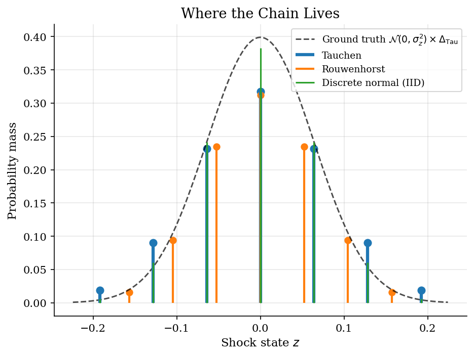
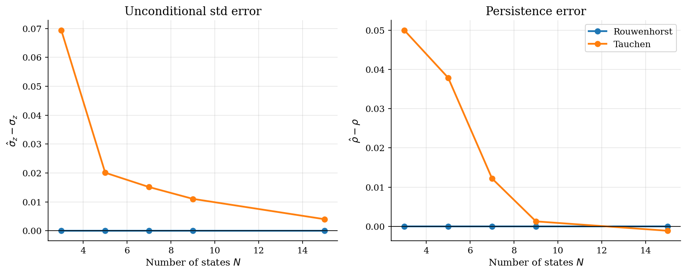
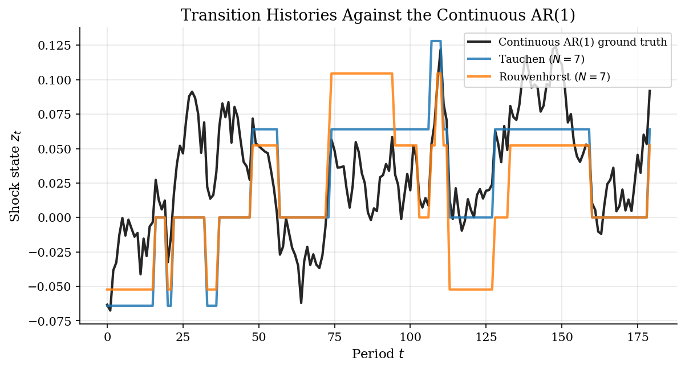

# Discretizing Persistent Shocks

> Tauchen and Rouwenhorst approximations to a Gaussian AR(1).

## Overview

Almost every quantitative dynamic model in this section replaces a continuous productivity or income shock with a finite Markov chain so that the Bellman operator integrates over a finite expectation. The chain that comes out is *part of the model*: it sets the support over which households evaluate marginal utility, the persistence that propagates into continuation values, and the long-run distribution underneath any stationary equilibrium.

Two algorithms cover most uses. **Tauchen** lays a uniform grid over a few unconditional standard deviations and integrates conditional Gaussian mass between cell midpoints. **Rouwenhorst** builds a chain recursively that matches unconditional variance and one-period autocorrelation by construction. For annual productivity or labor income with $\rho \approx 0.95$, the gap is not a rounding issue: with $N=7$, Tauchen overstates persistence by about a percentage point, while Rouwenhorst is exact at every $N$. Kopecky and Suen (2010) formalize this dominance for highly persistent processes.

The same calibration of $(\rho,\sigma_\epsilon)$ feeds the [consumption-savings](../consumption-savings/), [Aiyagari](../aiyagari/), and [RBC](../rbc/) tutorials, where the discretized chain enters the household's or planner's expected continuation value directly.

## Equations

The target is the Gaussian AR(1)

$$z_{t+1} = \rho\, z_t + \sigma_\epsilon\, \varepsilon_{t+1},
\qquad \varepsilon_{t+1} \sim \mathcal{N}(0,1).$$

Its unconditional law is $z_t \sim \mathcal{N}(0, \sigma_z^2)$ with

$$\sigma_z^2 \;=\; \frac{\sigma_\epsilon^2}{1-\rho^2},
\qquad \rho_k \;\equiv\; \mathrm{Corr}(z_t, z_{t+k}) \;=\; \rho^k.$$

For $\rho=0.95$ and $\sigma_\epsilon=0.02$ this gives
$\sigma_z = 0.0641$, with shock half-life
$\ln 2 / (-\ln \rho) \approx 14$ periods.

A finite-state approximation replaces $z_t$ with a state space
$\{z_1,\dots,z_N\}$ and a row-stochastic transition matrix
$P\in\mathbb{R}^{N\times N}$ with
$P_{ij}=\Pr(z_{t+1}=z_j\mid z_t=z_i)$. Inside any Bellman equation that
integrates over next period's shock, the conditional expectation collapses
to a finite sum:

$$\mathbb{E}\bigl[V(x_{t+1},z_{t+1})\,\big|\,z_t=z_i\bigr]
\;=\; \sum_{j=1}^N P_{ij}\, V(x_{t+1}, z_j).$$

The chain has a unique invariant distribution $\pi$ satisfying $\pi=\pi P$
and $\sum_i \pi_i = 1$. Two diagnostics decide whether the chain is a
faithful stand-in for the AR(1):

1. Does the implied unconditional standard deviation match $\sigma_z$?
2. Does the implied one-period autocorrelation match $\rho$?

Both moments enter $\sum_j P_{ij} V(\cdot, z_j)$ directly, so errors here
translate into bias in policies, prices, and stationary distributions.

## Model Setup

| Parameter | Value | Description |
|-----------|-------|-------------|
| $\rho$ | 0.95 | AR(1) persistence (annual productivity-like calibration) |
| $\sigma_\epsilon$ | 0.02 | Innovation standard deviation |
| $\sigma_z$ | 0.0641 | Implied unconditional standard deviation |
| $N$ | 7 | Main comparison grid size |
| Grid sweep | [3, 5, 7, 9, 15] | Grid sizes used in the moment-accuracy panel |
| Tauchen half-width $m$ | 3 | Grid bound in unconditional std deviations |
| $T_{sim}$ | 180 | Simulation horizon for transition-history figure |

## Solution Method

Two algorithms cover most teaching and research uses for AR(1) discretization. They differ in what they target and how the error scales with $N$.

### Tauchen (1986): integrate Gaussian mass between cell midpoints

Place an evenly spaced grid over $[-m\sigma_z,\, m\sigma_z]$. For each starting state $z_i$ the conditional law of $z_{t+1}$ is $\mathcal{N}(\rho z_i,\,\sigma_\epsilon^2)$, and $P_{ij}$ is the mass that conditional Gaussian assigns to the cell around $z_j$. Endpoint cells absorb the remaining tail mass.

```text
Algorithm 1 — Tauchen
Input:  rho, sigma_eps, N, half-width m
Output: grid {z_j}, transition P, invariant pi
  sigma_z = sigma_eps / sqrt(1 - rho^2)
  z_j     = -m*sigma_z + (j-1) * 2*m*sigma_z/(N-1)         for j = 1..N
  c_j     = (z_{j-1} + z_j) / 2                             (cell midpoints)
  c_1     = -inf,   c_{N+1} = +inf
  for i = 1..N, j = 1..N:
      P[i,j] = Phi((c_{j+1} - rho*z_i) / sigma_eps)
             - Phi((c_j     - rho*z_i) / sigma_eps)
  solve pi = pi P,   sum_j pi_j = 1
```

Tradeoffs. Tauchen is transparent and nests an obvious limit: refining $N$ recovers the conditional Gaussian. The catch on coarse grids with $\rho$ near one is that the conditional density centred on a near-tail $z_i$ leaks mass past the endpoint, so the endpoint absorbs more probability than the AR(1) actually places there. The chain ends up with too much variance and mildly distorted persistence. Larger $m$ widens the support but hollows out the centre; smaller $m$ truncates the tails. Tauchen-Hussey quadrature improves on the bin choice for moderate $\rho$, but on coarse grids and high persistence the cleaner answer is to switch methods.

### Rouwenhorst (1995): match the moments by construction

Build $P_N$ recursively from a 2-state base whose persistence $p=(1+\rho)/2$ is calibrated to deliver the AR(1) one-period autocorrelation. The grid is then chosen so that the chain has unconditional variance $\sigma_z^2$ exactly. By construction the resulting chain matches $\rho$ and $\sigma_z^2$ for any $N \ge 2$, with no quadrature error. The price is that $\pi_j = \binom{N-1}{j-1}/2^{N-1}$ is binomial, so on small grids the *shape* of the stationary distribution is wrong even though the first two moments are right.

```text
Algorithm 2 — Rouwenhorst
Input:  rho, sigma_eps, N
Output: grid {z_j}, transition P_N, invariant pi
  p   = (1 + rho) / 2
  P_2 = [[p, 1-p],
         [1-p, p]]
  for n = 3..N:
      A_TL = embed P_{n-1} in top-left of n x n zero matrix
      A_TR = embed P_{n-1} in top-right of n x n zero matrix
      A_BL = embed P_{n-1} in bottom-left of n x n zero matrix
      A_BR = embed P_{n-1} in bottom-right of n x n zero matrix
      P_n  = p*A_TL + (1-p)*A_TR + (1-p)*A_BL + p*A_BR
      row-normalize interior rows of P_n     (they receive two contributions)
  sigma_z = sigma_eps / sqrt(1 - rho^2)
  z_j     = sigma_z * sqrt(N-1) * (2*(j-1)/(N-1) - 1)        for j = 1..N
  pi_j    = binomial(N-1, j-1) / 2^{N-1}
```

Kopecky and Suen (2010) prove that Rouwenhorst dominates Tauchen for highly persistent processes on coarse grids: the moments are exact rather than approximated, and the conditional persistence does not collapse near the support boundary.

### Discrete-normal quadrature (for contrast only)

The first figure also shows a discrete-normal quadrature, which approximates the *unconditional* law $\mathcal{N}(0,\sigma_z^2)$ directly without a transition matrix. It is the right tool for IID shocks (taste shocks, measurement error, one-shot quadrature inside another expectation) and the wrong tool for persistent shocks. It is included to make the distinction explicit: a discrete-normal grid loses all serial dependence.

## Results

The first figure shows the stationary mass each chain places on its support. The dashed reference curve is the continuous AR(1)'s long-run Gaussian density rescaled by the Tauchen cell width, so a faithful Tauchen approximation should sit on the curve. Tauchen tracks it reasonably well at $N=7$ but bleeds extra mass into its outermost states, which is exactly the source of the variance overstatement documented next. Rouwenhorst sits on a different shape — its $\pi$ is binomial, so even though $\sigma_z$ is exact, the central states are heavier and the tails thinner than the Gaussian. The discrete-normal stems are included only to flag the contrast: without a transition matrix, that grid carries no information about persistence.



The second figure separates the two diagnostics. The horizontal axis is grid size; the zero line is the true AR(1) moment in each panel. Rouwenhorst sits on zero at every $N$ — the construction enforces both moments analytically. Tauchen approaches the targets only as $N$ grows, and convergence is slow when $\rho$ is close to one. The $N=3$ Tauchen case is instructive: with only three states the chain rarely transitions, so the implied autocorrelation collapses to essentially one regardless of the target. For PhD-style consumption-savings or RBC calibrations that pair $\rho \approx 0.95$ with small $N$, the persistence error is the more damaging one — it enters every continuation value off the chain and biases precautionary saving and asset prices.



A common-random-numbers simulation makes the transition matrix concrete. Both finite chains receive the same sequence of innovation ranks fed through their own conditional CDFs, so any deviation from the black AR(1) path comes from discretization alone. The chains step between grid points — what was a smooth path becomes a coarse staircase. The right question is not whether the staircase tracks the continuous line point by point (it cannot at $N=7$) but whether the rhythm of its movements is reasonable. Tauchen occasionally jumps to its wider tail states; Rouwenhorst is forced to stay closer to the centre by its binomial $\pi$, but reproduces the slow drift of a high-$\rho$ process more cleanly.



Numerical detail behind the previous figure. The 7-state Tauchen chain implies persistence 0.9622 against a target of 0.95; Rouwenhorst matches the target to numerical precision at every $N$. The discrete-normal unconditional-std error at $N=7$ is 2.51e-03, reported separately because that grid carries no transition law.

**Moment accuracy across discretization methods**

| Method      |   States |     Std |   Std error |   Persistence |   Persistence error |
|:------------|---------:|--------:|------------:|--------------:|--------------------:|
| Tauchen     |        3 | 0.13344 |     0.06939 |       0.99999 |             0.04999 |
| Rouwenhorst |        3 | 0.06405 |     0       |       0.95    |             0       |
| Tauchen     |        5 | 0.08414 |     0.02009 |       0.98787 |             0.03787 |
| Rouwenhorst |        5 | 0.06405 |    -0       |       0.95    |            -0       |
| Tauchen     |        7 | 0.07918 |     0.01513 |       0.9622  |             0.0122  |
| Rouwenhorst |        7 | 0.06405 |     0       |       0.95    |             0       |
| Tauchen     |        9 | 0.07509 |     0.01103 |       0.95128 |             0.00128 |
| Rouwenhorst |        9 | 0.06405 |    -0       |       0.95    |            -0       |
| Tauchen     |       15 | 0.06805 |     0.004   |       0.94889 |            -0.00111 |
| Rouwenhorst |       15 | 0.06405 |     0       |       0.95    |             0       |

## Takeaway

The discretized shock process is part of the economic model, not preprocessing. With persistent shocks and small $N$, Rouwenhorst is the safer default: it nails $\sigma_z$ and $\rho$ by construction, which controls the bias entering expected continuation values in any Bellman problem the chain feeds into. Tauchen is more transparent and delivers a Gaussian-like stationary distribution, which can matter when the *shape* of the unconditional law shows up in the equilibrium object (for example, wealth distributions aggregating over income states). It is fine when persistence is moderate or the grid is fine enough — but with $\rho=0.95$ and $N=7$ it overstates persistence by about a percentage point, enough to perturb precautionary saving and asset prices in the downstream [consumption-savings](../consumption-savings/) and [Aiyagari](../aiyagari/) tutorials. Discrete-normal grids belong to a different problem entirely: they approximate IID shocks and discard serial dependence.

## References

- [Tauchen, G. (1986). Finite State Markov-Chain Approximations to Univariate and Vector Autoregressions. *Economics Letters*, 20(2), 177-181.](https://doi.org/10.1016/0165-1765%2886%2990168-0)
- [Rouwenhorst, K. G. (1995). Asset Pricing Implications of Equilibrium Business Cycle Models. In T. Cooley (ed.), *Frontiers of Business Cycle Research*. Princeton University Press.](https://doi.org/10.1515/9780691218052-014)
- [Kopecky, K. A. and Suen, R. M. H. (2010). Finite State Markov-Chain Approximations to Highly Persistent Processes. *Review of Economic Dynamics*, 13(3), 701-714.](https://doi.org/10.1016/j.red.2009.07.002)
