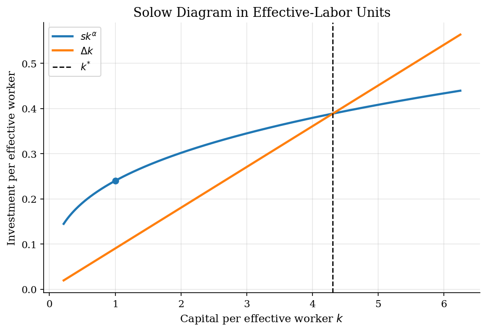
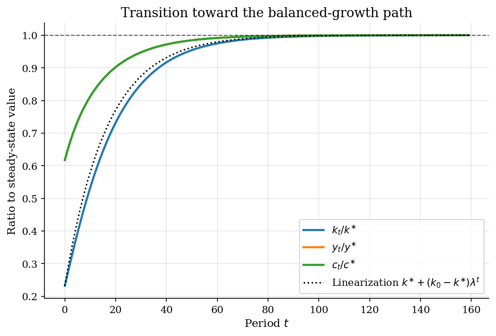
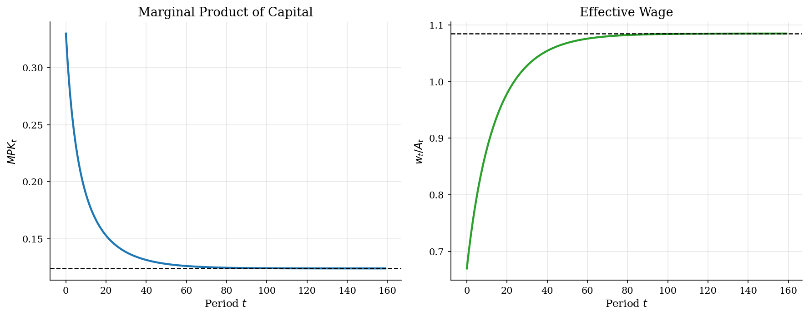

# Solow Growth and Conditional Convergence

> A deterministic growth economy where saving is exogenous and technology pins down balanced-growth dynamics.

## Overview

The Solow model is useful precisely because it removes the household Euler equation. A fixed saving rate turns growth into an accounting problem: output produces investment, investment raises the capital stock, and population growth, technology growth, and depreciation dilute capital measured per effective worker.

The economic object in this tutorial is the transition of $k_t=K_t/(A_tL_t)$. If an economy starts below its balanced-growth capital intensity, investment exceeds the amount needed to keep $k_t$ constant and the economy accumulates. If it starts above that level, effective depreciation dominates and capital intensity falls. This makes Solow a natural bridge between the finite-resource and optimal-growth examples: [cake eating](../cake-eating/) has no production, [optimal growth](../optimal-growth/) makes saving optimal, and Solow sits in between as an exogenous-saving transition map.

## Equations

Let $K_t$ be aggregate capital, $A_t$ labor-augmenting technology, and $L_t$
labor. Output is Cobb-Douglas:

$$Y_t = K_t^\alpha (A_t L_t)^{1-\alpha}, \qquad \alpha\in(0,1).$$

Capital, technology, and labor evolve according to

$$K_{t+1}=(1-\delta)K_t+sY_t,$$

$$A_{t+1}=(1+g)A_t,\qquad L_{t+1}=(1+n)L_t,$$

where $s$ is the exogenous saving rate, $\delta$ is depreciation, $g$ is
technology growth, and $n$ is population growth. In effective-labor units,

$$k_t=\frac{K_t}{A_tL_t},\qquad y_t=\frac{Y_t}{A_tL_t}=k_t^\alpha,$$

so the exact discrete-time transition is

$$k_{t+1}=
\frac{(1-\delta)k_t+s k_t^\alpha}{(1+g)(1+n)}.$$

The steady state in effective units solves

$$s(k^{\ast})^\alpha = \Delta k^{\ast},$$

with

$$\Delta=(1+g)(1+n)-1+\delta.$$

Thus

$$k^{\ast}=\left(\frac{s}{\Delta}\right)^{1/(1-\alpha)},\qquad
y^{\ast}=(k^{\ast})^\alpha,\qquad c^{\ast}=(1-s)y^{\ast}.$$

Competitive factor prices are the marginal products

$$MPK_t=\alpha k_t^{\alpha-1},\qquad
\frac{w_t}{A_t}=(1-\alpha)k_t^\alpha.$$

The plotted wage is $w_t/A_t$, the wage per unit of effective labor. The wage
per raw worker grows with $A_t$ along the balanced-growth path.

## Model Setup

| Parameter | Value | Role |
|-----------|------:|------|
| $\alpha$ | 0.33 | Capital share in $K^\alpha(AL)^{1-\alpha}$ |
| $s$ | 0.24 | Exogenous fraction of output invested |
| $\delta$ | 0.06 | Physical depreciation of capital |
| $n$ | 0.01 | Labor-force growth |
| $g$ | 0.02 | Labor-augmenting technology growth |
| $K_0,A_0,L_0$ | 1.0, 1.0, 1.0 | Initial aggregate stocks, implying $k_0=1.0$ |
| Horizon | 160 periods | Long enough for the transition gap to be visible |
| $\Delta$ | 0.0902 | Exact break-even investment term in effective units |
| $k^{\ast}$ | 4.3086 | Analytical steady-state capital per effective worker |

## Solution Method

There is no Bellman equation here. Once $s$ is fixed, the whole model is the scalar map for $k_{t+1}$. The analytical steady state is used as ground truth; the simulation is only the transition path generated by repeatedly applying that map.

```text
Algorithm: deterministic Solow transition in effective units
Input: primitives alpha, s, delta, n, g; initial k0; horizon T
Output: paths for k_t, y_t, c_t, MPK_t, and w_t/A_t
Delta = (1 + g)(1 + n) - 1 + delta
k_star = (s / Delta)^(1 / (1 - alpha))
set k = k0
for t = 0, 1, ..., T-1:
    y_t = k^alpha
    c_t = (1 - s) y_t
    investment_t = s y_t
    break_even_t = Delta k
    MPK_t = alpha k^(alpha - 1)
    w_t / A_t = (1 - alpha) k^alpha
    k = ((1 - delta) k + s k^alpha) / ((1 + g)(1 + n))
compare the terminal path to k_star, y_star, and c_star
```

With this calibration, the local convergence factor around $k^{\ast}$ is **0.941**, implying a half-life of about **11.5 periods** for small deviations from the balanced-growth path.

## Results

The Solow diagram has two curves. The curved schedule is actual investment per effective worker, $s k^\alpha$. The line is the investment required to offset depreciation, population growth, and technology growth, $\Delta k$. Their intersection is not estimated from the simulation; it is the exact $k^{\ast}=4.309$ implied by the primitives.

Because $k_0=1.000$ lies to the left of the intersection, the economy begins with investment above break-even investment. Capital per effective worker therefore rises.



The transition figure normalizes capital, output, and consumption by their effective-unit steady states. Capital moves more slowly than output because production is concave: as $k_t$ rises, the marginal product of the next unit of capital falls. By the terminal period, $|k_{T-1}-k^{\ast}|$ is **2.73e-04**.

Consumption and output have the same normalized path because consumption is the fixed share $(1-s)$ of output. This is the mechanical implication of exogenous saving.



Factor prices make the convergence mechanism observable. Starting from low capital, the marginal product of capital is high and the effective wage is low. As capital deepens, $MPK_t$ falls toward **0.124** while $w_t/A_t$ rises toward **1.085**. The same diminishing-returns force underlies conditional convergence.

The dashed lines are analytical steady-state values. The simulation approaches them because capital per effective worker approaches $k^{\ast}$.



The table is a check on the simulation, not a separate estimator. Since the transition map and steady state are both analytical, the remaining gap is just the finite horizon.

**Analytical steady state versus terminal simulation**

| Object                             |   Analytical steady state |   Simulated t=159 |   Absolute gap |
|:-----------------------------------|--------------------------:|------------------:|---------------:|
| Capital per effective worker k     |                  4.30859  |           4.30832 |       0.000273 |
| Output per effective worker y      |                  1.61931  |           1.61928 |       3.38e-05 |
| Consumption per effective worker c |                  1.23068  |           1.23065 |       2.57e-05 |
| Marginal product of capital MPK    |                  0.124025 |           0.12403 |       5.26e-06 |
| Effective wage w/A                 |                  1.08494  |           1.08492 |       2.27e-05 |

## Takeaway

Solow separates level effects from growth effects. A higher saving rate raises capital and output per effective worker, but it does not change the balanced-growth rate of output per worker. In this model, long-run per-capita growth comes from $g$; saving and depreciation determine the level around which the economy grows. That distinction is exactly what the Ramsey and RBC tutorials complicate by making saving an equilibrium choice rather than an imposed fraction of output.

## References

- Solow, R. (1956). "A Contribution to the Theory of Economic Growth." *Quarterly Journal of Economics*, 70(1), 65-94.
- Romer, D. (2019). *Advanced Macroeconomics*. McGraw-Hill, 5th edition, Ch. 1.
- Barro, R. and Sala-i-Martin, X. (2004). *Economic Growth*. MIT Press, 2nd edition, Ch. 1.
- Acemoglu, D. (2009). *Introduction to Modern Economic Growth*. Princeton University Press, Ch. 2.
