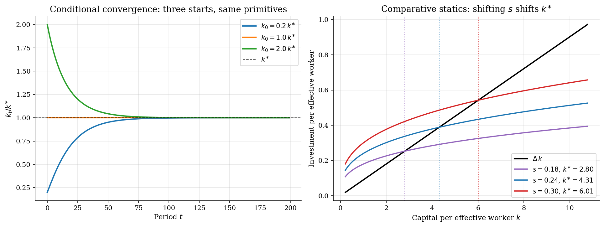

# Solow Growth and Conditional Convergence

> Capital per effective worker follows one transition map toward a closed-form steady state.

## Overview

A Solow economy saves a fixed share of output each period. Capital grows through investment and shrinks through depreciation. Labor and technology growth make each unit of capital serve more effective workers.

The state is $k_t = K_t/(A_t L_t)$, capital per unit of effective labor. If investment exceeds break-even investment, $k_t$ rises. If investment falls short, $k_t$ falls. Concavity gives one positive steady state.

The computation iterates the law of motion from an initial $k_0$. A closed-form steady state checks the path and makes convergence visible.

## Equations

Let $K_t$ denote aggregate capital, $A_t$ labor-augmenting technology, and
$L_t$ raw labor. Output is Cobb-Douglas:

$$Y_t = K_t^\alpha (A_t L_t)^{1-\alpha}, \qquad \alpha\in(0,1).$$

Capital, technology, and labor evolve as

$$K_{t+1}=(1-\delta)K_t + sY_t, \qquad
A_{t+1}=(1+g)A_t, \qquad L_{t+1}=(1+n)L_t,$$

Here $s$ is the saving rate, $\delta$ is depreciation, $g$ is technology
growth, and $n$ is labor-force growth.

Divide by $A_tL_t$ to work in effective-labor units:

$$k_t = \frac{K_t}{A_t L_t}, \qquad
y_t = \frac{Y_t}{A_t L_t} = k_t^\alpha,$$

with consumption per effective worker $c_t = (1-s)\,y_t$.

In these units, the law of motion is one scalar equation:

$$k_{t+1} = \phi(k_t) := \frac{(1-\delta)\,k_t + s\,k_t^\alpha}{(1+g)(1+n)}.$$

Define break-even investment as

$$\Delta := (1+g)(1+n) - 1 + \delta$$

The steady state $k^{\ast}$ solves $\phi(k^{\ast})=k^{\ast}$. This is
equivalent to $s(k^{\ast})^\alpha = \Delta k^{\ast}$.

The closed-form values are

$$k^{\ast}=\left(\frac{s}{\Delta}\right)^{1/(1-\alpha)}, \qquad
y^{\ast}=(k^{\ast})^\alpha, \qquad c^{\ast}=(1-s)\,y^{\ast}.$$

## Model Setup

| Symbol | Value | Role |
|--------|------:|------|
| $\alpha$ | 0.33 | Capital share in $K^\alpha(AL)^{1-\alpha}$ |
| $s$ | 0.24 | Exogenous saving rate |
| $\delta$ | 0.06 | Capital depreciation |
| $n$ | 0.01 | Labor-force growth |
| $g$ | 0.02 | Labor-augmenting productivity growth |
| $K_0,A_0,L_0$ | 1.0, 1.0, 1.0 | Initial stocks; implies $k_0=1.0$ |
| Horizon $T$ | 160 | Long enough to make the terminal gap small |
| $\Delta$ | 0.0902 | Break-even investment per unit of $k$ |
| $k^{\ast}$ | 4.3086 | Closed-form steady-state capital per effective worker |

## Solution Method

There is no Bellman equation here. Once $s$ is fixed, the model is the scalar map $\phi$. The simulation applies $\phi$ from $k_0$ until the path is close to $k^{\ast}$.

A local linearization gives the convergence rate near the steady state:

$$k_{t+1} - k^{\ast} \approx \lambda\,(k_t - k^{\ast}), \qquad \lambda \equiv \phi'(k^{\ast}) = \frac{(1-\delta) + s\alpha\,(k^{\ast})^{\alpha-1}}{(1+g)(1+n)}.$$

When $\lambda \in (0,1)$, deviations shrink at a geometric rate. The half-life is $H := \ln(0.5)/\ln(\lambda)$.

```text
Algorithm: Solow transition in effective-labor units
Input : primitives (alpha, s, delta, n, g), initial k0, horizon T
Output: paths {k_t, y_t, c_t}; closed-form k_star, lambda, half-life H

Delta   <- (1 + g)(1 + n) - 1 + delta              # break-even per unit k
k_star  <- (s / Delta)^(1 / (1 - alpha))           # closed-form fixed point
lambda  <- ((1 - delta) + s * alpha * k_star^(alpha - 1)) / ((1 + g)(1 + n))
H       <- ln(0.5) / ln(lambda)                    # local half-life

set k <- k0
for t = 0, 1, ..., T - 1:
    y_t       <- k^alpha
    c_t       <- (1 - s) * y_t
    invest_t  <- s * y_t
    k         <- ((1 - delta) * k + s * y_t) / ((1 + g)(1 + n))

audit         : |k_T - k_star|, |y_T - y_star|, |c_T - c_star|
linearization : compare k_t to k_star + (k_0 - k_star) * lambda^t
```

For this calibration, $\lambda \approx 0.941$ and the local half-life is roughly 11.5 periods.

## Results

At $k_0=1.00$ the curved schedule $s k^\alpha$ sits above the linear break-even line $\Delta k$. Capital deepens from the start. The curves cross at $k^{\ast}=4.309$, the unique positive steady state. Above $k^{\ast}$, break-even investment exceeds saving.


The transition plot normalizes each series by its steady-state value. Output and consumption move together because $c_t=(1-s)y_t$. Capital moves more slowly because it inherits the past stock.

The dotted line is $k^{\ast}+(k_0-k^{\ast})\lambda^t$. It tracks the path well near $k^{\ast}$. By period 159, simulated $k$ is within 2.73e-04 of $k^{\ast}$.


The left panel starts three economies from different capital stocks. They share the same primitives, so they converge to the same normalized $k^{\ast}$. Conditional convergence means convergence to that own steady state.

The right panel changes the saving rate. Higher $s$ shifts investment up and gives $k^{\ast}\in\{2.80,\,4.31,\,6.01\}$. It raises the level of output per worker, not the long-run growth rate.



The table compares the closed form with the terminal simulation. Any gap comes from finite horizon truncation. The geometric residual is about 2.21e-04.

**Closed-form steady state versus terminal simulation**

| Object                             |   Closed form |   Simulated t=159 |   Absolute gap |
|:-----------------------------------|--------------:|------------------:|---------------:|
| Capital per effective worker k     |       4.30859 |           4.30832 |       0.000273 |
| Output per effective worker y      |       1.61931 |           1.61928 |       3.38e-05 |
| Consumption per effective worker c |       1.23068 |           1.23065 |       2.57e-05 |

## Takeaway

Solow disciplines what saving can and cannot do. A higher $s$ raises the level of $k^{\ast}$ but leaves the long-run growth rate of output per worker equal to $g$.

Conditional convergence follows from the same steady-state logic. Economies with the same primitives approach the same balanced-growth path. Different primitives imply different paths.

## References

- Solow, R. M. (1956). "A Contribution to the Theory of Economic Growth." *Quarterly Journal of Economics*, 70(1), 65-94.
- Mankiw, N. G., Romer, D., and Weil, D. N. (1992). "A Contribution to the Empirics of Economic Growth." *Quarterly Journal of Economics*, 107(2), 407-437.
- Romer, D. (2019). *Advanced Macroeconomics*. McGraw-Hill, 5th edition, Ch. 1.
- Barro, R. and Sala-i-Martin, X. (2004). *Economic Growth*. MIT Press, 2nd edition, Ch. 1.
- Acemoglu, D. (2009). *Introduction to Modern Economic Growth*. Princeton University Press, Ch. 2.
