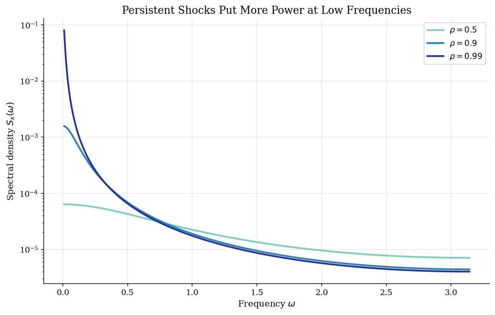

# Persistent Shocks and Multiplier-Accelerator Dynamics

> How AR(1) persistence turns innovations into macroeconomic propagation.

## Overview

A large share of macroeconomic dynamics comes from a simple question: after a shock hits, how much of it is still economically relevant next period, next year, or a decade later? The AR(1) law of motion is the standard way to put that persistence into a model. In the [RBC tutorial](../rbc/), it drives technology. In the [New Keynesian tutorial](../nkdsge/), the same idea is used for policy and demand disturbances.

This tutorial isolates the propagation mechanism before embedding it in a larger equilibrium system. The first model is a scalar AR(1). The second is Samuelson's multiplier-accelerator model, where persistent government spending moves income, income moves consumption with a lag, and investment responds to changes in consumption.

## Equations

The scalar shock process is

$$
x_t = \rho x_{t-1} + \varepsilon_t, \qquad
\varepsilon_t \sim N(0,\sigma^2), \qquad |\rho|<1.
$$

The same equation in Dynare lag notation is:

```text
x = rho*x(-1) + e
```

For the multiplier-accelerator model, let $Y_t$ be income, $C_t$ consumption,
$I_t$ investment, and $G_t$ government spending:

$$
C_t = \beta Y_{t-1},
\qquad
G_t = \rho_g G_{t-1} + (1-\rho_g)\bar G + \varepsilon_t,
$$

$$
I_t = \alpha(C_t-C_{t-1}),
\qquad
Y_t = C_t + I_t + G_t.
$$

The steady state is $\bar Y=\bar G/(1-\beta)$, $\bar C=\beta \bar Y$, and
$\bar I=0$. The reported impulse responses use deviations from this steady
state:

$$
y_t = \beta(1+\alpha)y_{t-1}-\alpha\beta y_{t-2}+g_t,
\qquad
g_t=\rho_g g_{t-1}+\varepsilon_t.
$$

## Model Setup

**AR(1) shock process**

| Parameter | Value | Role |
|---|---:|---|
| $\rho$ | 0.90 | Persistence of the state |
| $\sigma$ | 0.01 | Innovation standard deviation |
| $T_{sim}$ | 220 | Simulated periods after burn-in |

**Multiplier-accelerator economy**

| Parameter | Value | Role |
|---|---:|---|
| $\alpha$ | 0.30 | Accelerator response of investment to consumption growth |
| $\beta$ | 0.80 | Marginal propensity to consume out of lagged income |
| $\rho_g$ | 0.90 | Persistence of government spending deviations |
| $\bar G$ | 1.00 | Steady-state government spending |
| $\bar Y$ | 5.00 | Implied steady-state income |
| $\bar C$ | 4.00 | Implied steady-state consumption |

## Solution Method

Both systems are backward-looking, so solving them means forward iteration rather than a rational-expectations fixed point. The economic content is still useful: the AR(1) coefficient chooses the horizon of a disturbance, while the multiplier-accelerator equations decide how that disturbance moves income components.

For the AR(1), the main population objects are available in closed form:

$$E[x_t]=0, \qquad \operatorname{Var}(x_t)=\frac{\sigma^2}{1-\rho^2}=0.000526, \qquad \operatorname{Corr}(x_t,x_{t-k})=\rho^k.$$

The half-life is $\log(0.5)/\log(\rho)=6.6$ periods. For the multiplier-accelerator block, the endogenous income roots are 0.346, 0.694; their largest modulus is 0.694, so the calibrated internal propagation is stable.

```text
Algorithm: forward propagation of persistent shocks
Inputs: rho, sigma, alpha, beta, rho_g, horizon T, shock sequence eps_t
Outputs: AR path x_t and multiplier-accelerator paths y_t, c_t, i_t, g_t

1. For an impulse response, set eps_0 = 1 and eps_t = 0 for t > 0.
   For a simulation, draw eps_t from N(0, sigma^2) and discard burn-in.
2. AR(1): update x_t = rho x_{t-1} + eps_t.
3. Government spending: update g_t = rho_g g_{t-1} + eps_t.
4. Consumption: set c_t = beta y_{t-1}.
5. Investment: set i_t = alpha(c_t - c_{t-1}).
6. Income: impose the identity y_t = c_t + i_t + g_t.
7. Compare simulated AR(1) autocorrelations with the population benchmark rho^k.
```

## Results

The first plot is the exact response $\rho^h$ to a unit innovation. Moving $\rho$ from 0.5 to 0.9 is not a cosmetic change: it turns a one-period half-life into roughly seven periods. At $\rho=0.99$, the shock is effectively a slow-moving state for any short macro sample.


The government spending process is monotone, but income need not simply copy it. Lagged consumption keeps demand elevated after the shock, while investment reacts to the change in consumption. The accelerator channel therefore matters most around turning points, when consumption growth starts to fade.


The simulated AR(1) path is shown against its analytic two-standard-deviation band, so the finite sample can be read against the population benchmark. In the multiplier-accelerator panel, income and consumption move together but not simultaneously: lagged consumption is the economic memory that carries government spending shocks forward.


The left panel is a built-in accuracy check: the simulated AR(1) autocorrelations should track $\rho^k$, with remaining gaps coming from finite-sample noise. The right panel shows that the multiplier-accelerator economy creates additional serial correlation in income because government spending is filtered through lagged consumption.


The frequency-domain view says the same thing in a different language. High persistence shifts variance toward low frequencies, so the state looks like a slow cycle or trend over short samples. This is why the choice of $\rho$ in a DSGE shock process affects business-cycle timing, not only unconditional volatility.



The analytic benchmarks make the calibration stakes explicit. Holding $\sigma$ fixed, raising $\rho$ increases both the variance of the state and the amount of time a shock remains economically relevant.

**AR(1) Analytical Benchmarks**

| Object                      | $\rho=0.5$   | $\rho=0.9$   | $\rho=0.99$   |
|:----------------------------|:-------------|:-------------|:--------------|
| Persistence ($\rho$)        | 0.50         | 0.90         | 0.99          |
| Unconditional variance      | 0.000133     | 0.000526     | 0.005025      |
| Half-life (periods)         | 1.0          | 6.6          | 69.0          |
| First-order autocorrelation | 0.50         | 0.90         | 0.99          |
| Spectral peak               | Frequency 0  | Frequency 0  | Frequency 0   |

## Takeaway

An AR(1) coefficient is an economic timing assumption. With $\rho=0.9$, a shock still has about half of its initial effect after 6.6 periods; with $\rho=0.99$, the same calculation gives 69.0 periods. Once that process enters a macro model, other equilibrium or accounting equations decide how the persistent state appears in observables.

The multiplier-accelerator example is deliberately simpler than the RBC and New Keynesian tutorials, but it is useful for the same reason: it separates the shock law from the propagation mechanism. Government spending supplies the persistent disturbance; lagged consumption and accelerator investment turn it into a richer income path.

## References

- Hamilton, J. (1994). *Time Series Analysis*. Princeton University Press.
- Samuelson, P. (1939). Interactions between the Multiplier Analysis and the Principle of Acceleration. *Review of Economics and Statistics*, 21(2), 75-78.
- Ljungqvist, L. and Sargent, T. (2018). *Recursive Macroeconomic Theory*. MIT Press, 4th edition, Ch. 2.
