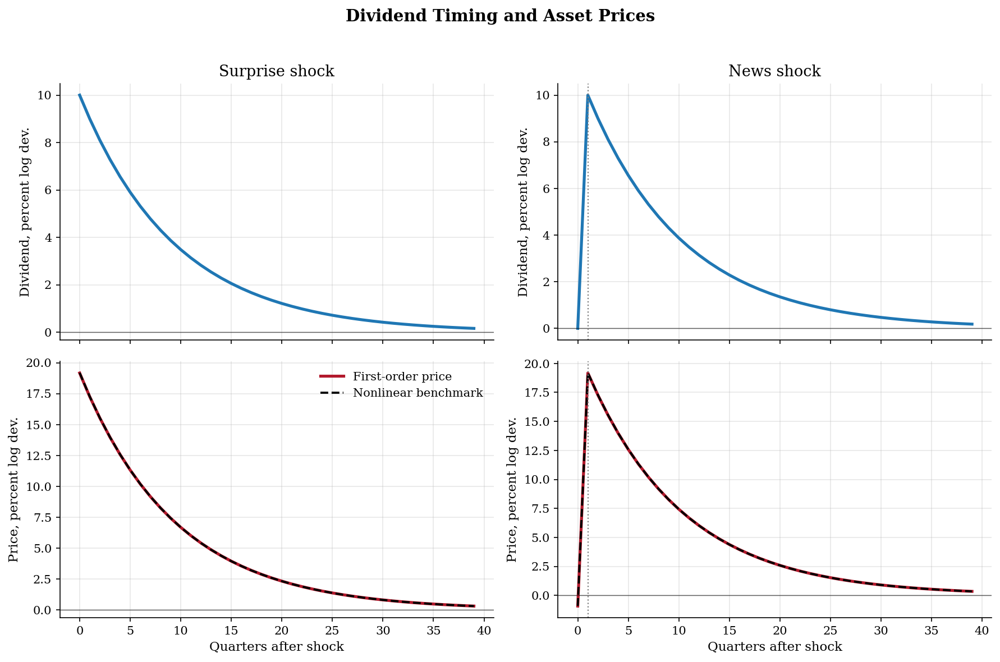
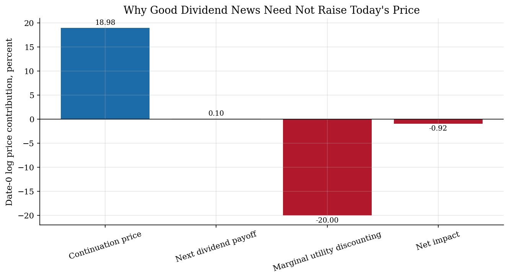
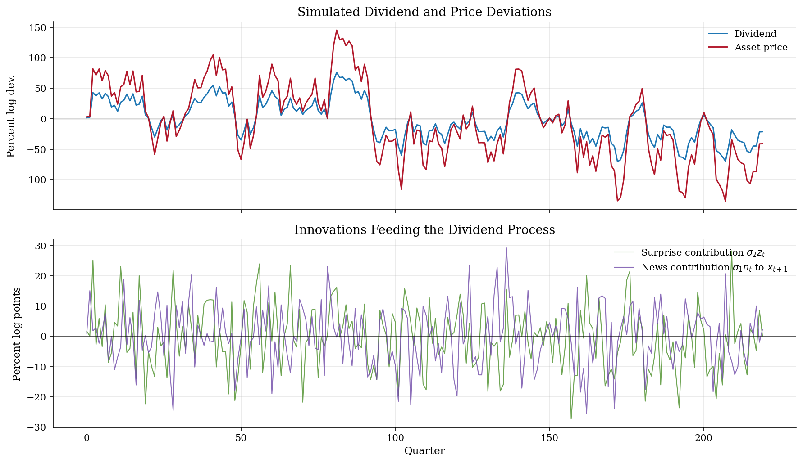

# Asset Pricing with News Shocks

> A Lucas-tree model where agents receive advance signals (news) about future dividend changes, generating distinct price dynamics from anticipated vs unanticipated shocks.

## Overview

In standard asset pricing models, shocks are unanticipated --- agents learn about dividend changes only when they occur. The **news shock** framework extends this by allowing agents to receive signals about future fundamentals before they materialize.

This creates a striking distinction:
- **Surprise shocks:** Dividends and prices move together on impact.
- **News shocks:** Prices jump immediately when news arrives, but dividends don't change until later. This generates a disconnect between current fundamentals and asset prices --- a pattern often observed in financial markets.

The model is parsed from the Dynare `model.mod` file and solved analytically using the present-value pricing formula under CRRA preferences.

## Equations

**From `model.mod` (Dynare syntax):**
```
d = exp(rho*log(d(-1)) + sigma1*n(-1) + sigma2*z)
p*d^(-gamma) = beta*d(+1)^(-gamma)*(p(+1)+d(+1))
```

**Interpretation:**

$$\log d_t = \rho \log d_{t-1} + \sigma_1 n_{t-1} + \sigma_2 z_t$$

$$p_t \cdot d_t^{-\gamma} = \beta \, \mathbb{E}_t \left[ d_{t+1}^{-\gamma} (p_{t+1} + d_{t+1}) \right]$$

where $d_t$ is the dividend, $p_t$ is the asset price, $z_t$ is a **surprise shock**
(contemporaneous), and $n_t$ is a **news shock** (affects dividends one period later).

The pricing equation is the Euler equation with CRRA marginal utility: the price
equals the expected discounted value of future dividends and capital gains, weighted
by the stochastic discount factor $\beta (d_{t+1}/d_t)^{-\gamma}$.

## Model Setup

| Parameter | Value | Description |
|-----------|-------|-------------|
| $\beta$    | 0.99 | Discount factor |
| $\gamma$   | 2.0 | Risk aversion (CRRA) |
| $\rho$     | 0.9 | Dividend persistence |
| $\sigma_1$ | 0.1 | News shock std. dev. |
| $\sigma_2$ | 0.1 | Surprise shock std. dev. |

**Steady state:** $d^{*} = 1.0$, $p^{*} = 99.00$, $p/d = 99.00$, $R^{*} = 1.0101$

## Solution Method

**Present-value pricing:** Under rational expectations, the asset price equals the present discounted value of all future dividends:

$$p_t = \sum_{j=1}^{\infty} \beta^j \, \mathbb{E}_t \left[ \frac{d_{t+j}^{1-\gamma}}{d_t^{-\gamma}} \right]$$

For log-linearized dividends following an AR(1) with both surprise and news components, the IRFs are computed by tracing the expected path of dividends and discounting.

**Key mechanism:** News shocks create a *wedge* between current fundamentals and prices. When $n_0 = 1$ (positive news arrives at $t=0$), the price jumps immediately even though $d_0$ is unchanged, because agents rationally anticipate higher future dividends.

## Results

The key difference is timing: under a surprise shock (blue), dividends and prices jump simultaneously at t=0. Under a news shock (red dashed), the price jumps at t=0 when the signal arrives but dividends remain flat until t=1. This one-period lead of prices over fundamentals is the hallmark of forward-looking asset pricing with anticipated shocks.


*Comparison of impulse responses to surprise (unanticipated) vs news (anticipated) dividend shocks*

In the left panel, the price and dividend shaded areas overlap, showing that prices are driven by concurrent fundamentals. In the right panel, the price (red) leads the dividend (blue) by exactly one period. This disconnect between current cash flows and asset valuations is what makes news shocks a compelling explanation for observed price-fundamental puzzles in financial markets.


*Detailed view: surprise shocks move prices and dividends together; news shocks cause prices to lead dividends*

With both shock types active simultaneously, the price series is smoother and more persistent than dividends because prices aggregate information about future cash flows. Price movements that precede dividend changes reflect the news component, while co-movements reflect the surprise component.


*Simulated dividend and asset price paths with both surprise and news shocks*

The critical row is the dividend at t=0: it is nonzero for the surprise shock but exactly zero for the news shock, confirming that news moves prices without any change in current fundamentals. The t=1 column for the news shock shows when the anticipated dividend change finally materializes.

**Impact Responses: Surprise vs News Shocks**

| Variable    |   Surprise shock (t=0) |   News shock (t=0) |   News shock (t=1) |
|:------------|-----------------------:|-------------------:|-------------------:|
| Dividend    |                 0.1    |             0      |             0.1    |
| Asset price |                 0.8174 |             0.9083 |             0.8174 |
| Return      |                 0.1    |             0.099  |             0.001  |

## Takeaway

News shocks create a fundamental distinction in asset pricing dynamics that helps explain observed financial market behavior.

**Key insights:**
- **Surprise shocks** move dividends and prices simultaneously --- the classic textbook response where asset prices reflect concurrent changes in fundamentals.
- **News shocks** cause prices to *lead* fundamentals: the price jumps at $t=0$ when news arrives, but dividends don't change until $t=1$. This generates a disconnect between prices and current cash flows.
- This price-fundamental disconnect is ubiquitous in financial data. Stock prices routinely move on earnings guidance, policy announcements, and other forward-looking information before the underlying cash flows materialize.
- The magnitude of the anticipation effect depends on dividend persistence ($\rho$) and the discount rate: more persistent dividend processes and lower discount rates amplify the news effect because future cash flows are worth more.
- Risk aversion ($\gamma$) affects the *level* of asset prices (risk premia) but the *qualitative* difference between surprise and news responses persists across all $\gamma > 0$.

## Reproduce

```bash
python run.py
```

## References

- Lucas, R. (1978). Asset Prices in an Exchange Economy. *Econometrica*, 46(6), 1429-1445.
- Beaudry, P. and Portier, F. (2006). Stock Prices, News, and Economic Fluctuations. *American Economic Review*, 96(4), 1293-1307.
- Schmitt-Grohe, S. and Uribe, M. (2012). What's News in Business Cycles. *Econometrica*, 80(6), 2733-2764.
