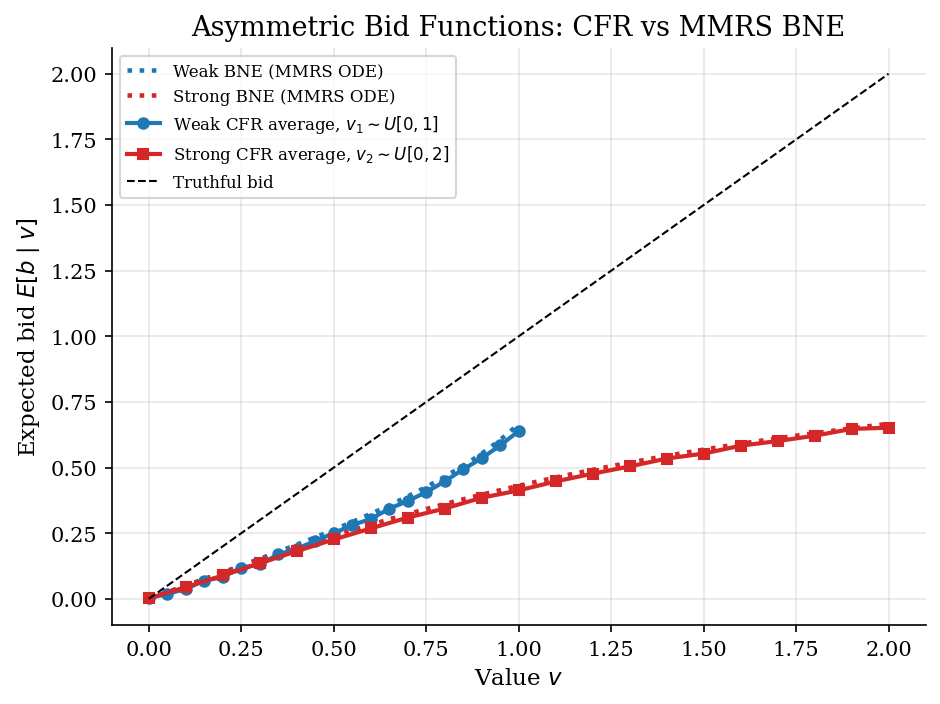
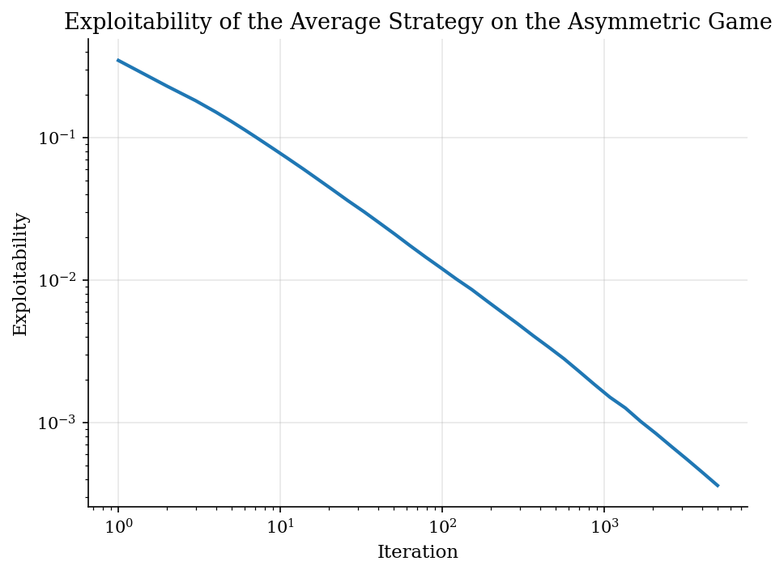
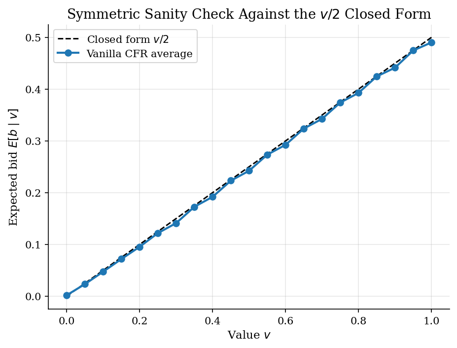

# Asymmetric First-Price Auctions by Counterfactual Regret Minimization

## Overview

Two bidders compete in a sealed-bid first-price auction with private values. Their value distributions are not the same. One bidder draws from a uniform distribution on a small support; the other draws from a uniform distribution on a wider support. The symmetric closed-form bid rule from the existing first-price auction tutorial does not apply. Best-response iteration cycles instead of converging.

Counterfactual regret minimization is a learning algorithm that handles this case. Each bidder type is treated as an information set. The bidder accumulates regret for each candidate bid against the opponent's current strategy. The next strategy puts probability on bids in proportion to their positive cumulative regret. The time-averaged strategy converges to a Bayesian Nash equilibrium.

The tutorial implements vanilla CFR on the asymmetric game and gives it two independent ground-truth checks. The symmetric closed form anchors the implementation when both value distributions are made equal. The continuous asymmetric BNE itself is recovered separately by solving the Marshall, Meurer, Richard, and Stromquist boundary-value problem on the inverse bid functions, and overlaid on the CFR result. Exploitability of the average strategy on the discretized game is the third diagnostic, the same no-deviation idea as the bid-grid deviation check in the existing first-price auction tutorial.

## Equations

The auction has two bidders indexed by $i \in \lbrace 1, 2 \rbrace$. Bidder $i$ draws a
private value $v_i$ from a known distribution $F_i$, independently across bidders.
Each bidder submits one sealed bid $b_i$ on a finite bid grid $B$, the highest bid
wins, the winner pays its own bid, and ties are broken uniformly at random.

A behavioral strategy $\sigma_i(b \mid v)$ is a probability distribution over bids
for each type $v$. The information set $I_v$ for bidder $i$ is the set of game
histories at which the bidder has observed type $v$. There is one information set
per type.

The expected payoff to bidder $i$ from bidding $b$ at type $v$ against the
opponent strategy $\sigma_{-i}$ is

$$
u_i(v, b; \sigma_{-i}) = (v - b) \cdot \Pr(\text{win} \mid b, \sigma_{-i}).
$$

The win probability uses the marginal opponent bid distribution
$q_{-i}(b') = \sum_{v'} P(v') \sigma_{-i}(b' \mid v')$ and the uniform tie-break
$\Pr(\text{win} \mid b) = \sum_{b' < b} q_{-i}(b') + \tfrac{1}{2} q_{-i}(b)$.

The counterfactual value at information set $I_v$ for action $b$ multiplies the
expected payoff by the chance reach probability $P(v)$:

$$
v_i^{\sigma}(I_v, b) = P(v) \cdot u_i(v, b; \sigma_{-i}).
$$

The instantaneous regret at iteration $t$ is the gap between the value of
deviating to $b$ and the value of the current mixed strategy:

$$
r_i^{t}(I_v, b) = v_i^{\sigma^{t}}(I_v, b) - \sum_{b'} \sigma_i^{t}(b' \mid v) \cdot v_i^{\sigma^{t}}(I_v, b').
$$

Cumulative regret accumulates these one-shot gaps:

$$
R_i^{T}(I_v, b) = \sum_{t = 1}^{T} r_i^{t}(I_v, b).
$$

The next strategy is regret matching, which puts mass on each bid in proportion
to its positive cumulative regret:

$$
\sigma_i^{T+1}(b \mid v) = \frac{\max(R_i^{T}(I_v, b), 0)}{\sum_{b'} \max(R_i^{T}(I_v, b'), 0)},
$$

with a uniform fallback when every cumulative regret is non-positive. The output
of the algorithm is the time-averaged strategy

$$
\bar{\sigma}_i^{T}(b \mid v) = \frac{1}{T} \sum_{t = 1}^{T} \sigma_i^{t}(b \mid v).
$$

The exploitability of a strategy profile $\sigma$ is the sum across players of
the most a single bidder could gain by switching to the best response:

$$
\varepsilon(\sigma) = \sum_{i = 1}^{2} \left(\max_{\sigma'_i} U_i(\sigma'_i, \sigma_{-i}) - U_i(\sigma_i, \sigma_{-i})\right),
$$

where $U_i(\sigma) = \sum_{v} P(v) \sum_{b} \sigma_i(b \mid v) \cdot u_i(v, b; \sigma_{-i})$
is the ex-ante expected payoff. Exploitability equals zero exactly at a Bayesian
Nash equilibrium of the discretized game. The best response in the maximization
is computed by picking, at each type, the bid on $B$ with the highest expected
payoff.

The continuous-game BNE itself can be written down as an ODE system on the
inverse bid functions $\phi_i(b)$, which give the type of bidder $i$ that bids
$b$ in equilibrium. Differentiating the bidder's first-order condition and
imposing equilibrium $v_i = \phi_i(b)$ yields the MMRS system

$$
\phi_i'(b) = \frac{F_i(\phi_i(b))}{f_i(\phi_i(b)) \cdot (\phi_j(b) - b)}, \quad j = 3 - i.
$$

For uniform value distributions on $[0, M_i]$, $F_i / f_i = v$ identically, so
the system simplifies to $\phi_1'(b) = \phi_1 / (\phi_2 - b)$ and
$\phi_2'(b) = \phi_2 / (\phi_1 - b)$. The boundary conditions are
$\phi_1(0) = \phi_2(0) = 0$ and $\phi_1(\bar{b}) = 1$, $\phi_2(\bar{b}) = 2$,
where the common upper bid $\bar{b}$ is an unknown that the boundary-value
problem pins down. Near $b = 0$ the inverse functions admit the asymptotic

$$
\phi_1(b) = 2b - \alpha b^3 + O(b^5), \qquad \phi_2(b) = 2b + \alpha b^3 + O(b^5),
$$

where $\alpha$ is a free coefficient. Shooting forward from a small $b_0$ with
this asymptotic initial condition and bisecting $\alpha$ on the constraint
$\phi_2(\bar{b}) = 2$ produces $\alpha = 3/2$ and $\bar{b} = 2/3$ for our
distributions. The continuous BNE bid function $b_i(v)$ is the inverse of
$\phi_i(b)$.

## Model Setup

| Object | Value | Role |
|---|---:|---|
| Weak bidder values | $v_1 \sim U[0, 1]$ | Smaller-support distribution |
| Strong bidder values | $v_2 \sim U[0, 2]$ | Larger-support distribution |
| Type grid | 21 nodes per bidder | Each type is one information set |
| Bid grid | 41 nodes on $[0, 1]$ | Shared discrete action set |
| Iterations | 5,000 | Simultaneous regret updates |
| Tie-break | Uniform | Splits ties evenly across bidders |
| Symmetric check | $v_1, v_2 \sim U[0, 1]$ | Compares to $b^{\ast}(v) = v / 2$ |

## Solution Method

Each bidder type is its own information set. The bidder runs regret matching locally at every type, accumulating regret for each candidate bid against the opponent's current strategy. Regret matching is Hannan-consistent at each information set, so the per-set average regret shrinks at rate of order one over the square root of iterations. The chance-reach weighting glues these per-set bounds into a global average regret bound on the time-averaged strategy. The tightest theoretical guarantee that the time-averaged strategy converges to a Nash equilibrium holds in two-player zero-sum games. The first-price auction is general-sum from the bidders' point of view, but CFR converges in practice on this game and on many other extensive-form Bayesian games beyond the zero-sum case. Exploitability of the average strategy is the diagnostic that confirms convergence on this run.

Why regret matching works can be seen in a one-information-set toy. Suppose action $a$ always pays 2 and action $b$ always pays 1 against a fixed opponent. Starting from uniform play the average payoff is 1.5. Action $a$ accumulates regret 0.5 per iteration and action $b$ accumulates regret minus 0.5. After a few iterations the strategy puts all mass on $a$. The time-averaged strategy converges to the dominant action.

```text
Algorithm: vanilla CFR for the asymmetric first-price auction
Inputs: type grids V_1, V_2 with PMFs P_1, P_2; bid grid B; iterations T
Outputs: time-averaged strategies sigma_bar_1, sigma_bar_2

1. Initialize R_i(v, b) = 0 and S_i(v, b) = 0 for i in {1, 2}.
2. For t = 1, 2, ..., T:
   a. For each i, compute sigma_i^t(b | v) by regret matching on R_i(v, .).
   b. For each i, form the marginal opponent bid PMF
      q_{-i}(b) = sum_{v'} P_{-i}(v') sigma_{-i}^t(b | v').
   c. Compute the win probability w_{-i}(b) under uniform tie-break.
   d. For each i, v in V_i, b in B, compute the counterfactual value
      cf_i(v, b) = P_i(v) (v - b) w_{-i}(b)
      and the iteration-average value cf_i_avg(v) = sum_b sigma_i^t(b | v) cf_i(v, b).
   e. R_i(v, b) <- R_i(v, b) + cf_i(v, b) - cf_i_avg(v).
   f. S_i(v, b) <- S_i(v, b) + sigma_i^t(b | v).
3. Return sigma_bar_i(b | v) = S_i(v, b) / sum_{b'} S_i(v, b').
```

Exploitability of the average strategy is the deviation diagnostic. At each logged iteration the code computes the best-response payoff at every type and subtracts the average-strategy payoff. The expected gap, summed across bidders, is the exploitability.

## Results

The average strategies on the asymmetric game match the continuous BNE computed independently from the MMRS boundary-value problem. The weak bidder bids more aggressively per unit of value than in the symmetric game because the rival often holds a higher value and shading too much loses too many auctions. The strong bidder shades more deeply and tops out at a maximum bid of about 0.667, well below the weak-support upper bound at one. Both CFR bid functions track the BNE within bid-grid spacing across the full type range. The asymmetric game has no closed-form solution, but the BNE is pinned down by a coupled ODE system on the inverse bid functions.



Exploitability of the average strategy falls steadily across iterations and tracks the textbook rate of order one over the square root of iterations on a log-log plot. Exploitability never reaches exactly zero because the bid grid is finite, but the residual gap is small relative to expected revenue. Exploitability is the asymmetric analogue of the bid-grid deviation check used by the existing first-price auction tutorial.



Setting both value distributions to uniform on the unit interval recovers a case where the analytic Bayesian Nash bid is half the value. The CFR average strategy tracks the closed form to within bid-grid spacing. The sanity check confirms that the implementation finds the right equilibrium on a case where the right answer is known.



Symmetric residual benchmarks the CFR average against the $v / 2$ closed form when both bidders draw from $U[0, 1]$. Asymmetric residuals benchmark the CFR average against the BNE bid function obtained by solving the MMRS boundary-value problem with `scipy.integrate.solve_ivp` plus bisection on $\bar{b}$. Asymmetric exploitability is the sum of best-response payoff gains at the average strategy on the discretized asymmetric game.

**Run summary**

| Quantity                                                           | Value     |
|:-------------------------------------------------------------------|:----------|
| Symmetric residual (max CFR bid error vs $v / 2$)                  | 9.741e-03 |
| Asymmetric residual: weak bidder (max CFR bid error vs MMRS BNE)   | 2.768e-02 |
| Asymmetric residual: strong bidder (max CFR bid error vs MMRS BNE) | 1.760e-02 |
| MMRS upper bid $\bar{b}$                                           | 0.6667    |
| Asymmetric exploitability (final iteration)                        | 3.624e-04 |
| CFR iterations                                                     | 5,000     |

Logarithmically spaced iteration checkpoints. Each row reports the exploitability of the time-averaged strategy at that iteration.

**Exploitability decay on the asymmetric game**

|   Iteration |   Exploitability |
|------------:|-----------------:|
|           1 |        0.3465    |
|           2 |        0.2286    |
|           3 |        0.1809    |
|           4 |        0.1505    |
|           5 |        0.1291    |
|           6 |        0.1133    |
|           7 |        0.1011    |
|           9 |        0.08366   |
|          11 |        0.0718    |
|          14 |        0.05955   |
|          17 |        0.05098   |
|          21 |        0.04301   |
|          26 |        0.03614   |
|          33 |        0.03      |
|          41 |        0.02508   |
|          51 |        0.02093   |
|          63 |        0.01745   |
|          79 |        0.01446   |
|          98 |        0.01216   |
|         122 |        0.01016   |
|         152 |        0.008572  |
|         189 |        0.007109  |
|         235 |        0.005916  |
|         292 |        0.00493   |
|         364 |        0.004067  |
|         453 |        0.003386  |
|         563 |        0.002807  |
|         700 |        0.002282  |
|         871 |        0.001847  |
|        1084 |        0.001505  |
|        1349 |        0.001266  |
|        1678 |        0.001019  |
|        2087 |        0.0008371 |
|        2597 |        0.0006796 |
|        3231 |        0.0005538 |
|        4019 |        0.0004489 |
|        5000 |        0.0003624 |

## Takeaway

Counterfactual regret minimization replaces the analytic Bayesian Nash calculation with a regret-matching loop on the discretized game. The algorithm applies whenever each player has its own information set, including auctions where no closed form is available.

On this asymmetric auction the CFR average strategy lands within bid-grid spacing of the continuous BNE recovered from the MMRS boundary-value problem. Two independent computations agreeing on the same bid functions is the convergence test that the exploitability metric alone could not provide.

The same algorithm, scaled up to large extensive-form games with carefully tuned variants such as CFR+, is the engine behind modern poker AI.

## References

- [Zinkevich, M., Johanson, M., Bowling, M., and Piccione, C. (2007). Regret Minimization in Games with Incomplete Information. *Advances in Neural Information Processing Systems*, 20.](https://papers.nips.cc/paper_files/paper/2007/hash/08d98638c6fcd194a4b1e6992063e944-Abstract.html)
- [Tammelin, O., Burch, N., Johanson, M., and Bowling, M. (2015). Solving Heads-Up Limit Texas Hold'em. *IJCAI*, 645-652.](https://www.ijcai.org/Proceedings/15/Papers/097.pdf)
- [Maskin, E. and Riley, J. (2000). Asymmetric Auctions. *Review of Economic Studies*, 67(3), 413-438.](https://doi.org/10.1111/1467-937X.00137)
- [Krishna, V. (2009). *Auction Theory*, 2nd ed. Academic Press.](https://shop.elsevier.com/books/auction-theory/krishna/978-0-12-374507-1)
- **See also.** The symmetric uniform first-price auction is solved by the closed-form bid rule and verified by a bid-grid deviation check in [`game-theory/first-price-auctions/`](../../game-theory/first-price-auctions/). That tutorial is the symmetric ground-truth anchor for this one.
