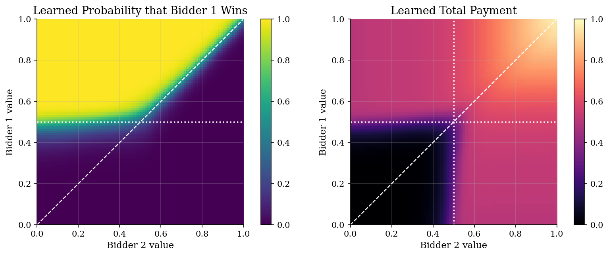
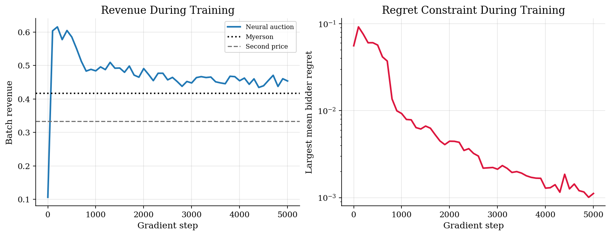

# Deep Learning for Optimal Auction Design

> A small neural auction learns revenue with a regret constraint and is audited against Myerson.

## Overview

A seller knows the distribution of bidder values but not the realized values. The design problem is to choose an auction that earns revenue while still making truthful bidding optimal.

For one item and IID uniform values, Myerson's reserve-price auction is the exact answer. Duetting et al. study the harder case where the auction itself is a neural network. The network maps reported values into allocations and payments, then training penalizes profitable misreports.

This tutorial keeps the environment small enough to run locally. The computation trains a two-bidder neural auction and audits it against the Myerson benchmark.

## Equations

There are two risk-neutral bidders and one item. Bidder $i$ has value
$v_i \sim U[0,1]$. A direct mechanism asks each bidder to report a value
$b_i$. Given the report vector $b=(b_1,b_2)$, the mechanism returns allocation
probabilities $x_i(b)$ and payments $p_i(b)$.

Feasibility means the item is not allocated more than once:

$$
0 \leq x_i(b) \leq 1,
\qquad
x_1(b)+x_2(b) \leq 1.
$$

The neural network enforces this by applying a softmax to three outcomes:
bidder 1 wins, bidder 2 wins, or no sale. Payments are also bounded by the
allocated report in this tutorial, so truthful individual rationality is built
into the parameterization.

If bidder $i$ has true value $v_i$ but the report profile is $b$, utility is

$$
u_i(v_i,b;\theta)=v_i x_i(b;\theta)-p_i(b;\theta).
$$

The seller wants revenue, but the mechanism is useful only if bidders want to
tell the truth. Dominant-strategy incentive compatibility says that truthful
reporting must weakly dominate every one-player misreport:

$$
u_i(v_i,(v_i,b_{-i});\theta) \geq
u_i(v_i,(b_i',b_{-i});\theta)
\quad \forall i,v_i,b_i',b_{-i}.
$$

Regret turns that many-inequality condition into one diagnostic number. At a
value profile $v$, bidder $i$'s ex post regret is the best gain from lying:

$$
R_i(v;\theta)
= \max_{b_i' \in [0,1]}
\{u_i(v_i,(b_i',v_{-i});\theta)
{}- u_i(v_i,v;\theta)\}.
$$

If $R_i(v;\theta)=0$, the bidder cannot improve at that profile. Duetting et
al. train on a sample of value profiles $v^1,\ldots,v^L$, so the constraint is
the empirical average regret:

$$
\mathrm{rgt}_i(\theta)
= \frac{1}{L}\sum_{\ell=1}^{L} R_i(v^{\ell};\theta).
$$

Revenue on the same sample is

$$
\widehat{\mathrm{Rev}}(\theta)
= \frac{1}{L}\sum_{\ell=1}^{L}\sum_{i=1}^{2}
p_i(v^{\ell};\theta).
$$

The ideal learning problem is therefore revenue maximization subject to
truthfulness constraints:

$$
\max_{\theta} \widehat{\mathrm{Rev}}(\theta)
\quad \mathrm{subject\ to}\quad
\mathrm{rgt}_i(\theta)=0,\ i=1,2.
$$

This is why the loss is not just negative revenue. Pure revenue maximization
would let the network exploit bidders by making truthful reporting unattractive.
The constraint must push the network toward mechanisms that are hard to
manipulate.

The code uses an augmented Lagrangian:

$$
\mathcal{L}(\theta,\lambda,\rho)
= {}-\widehat{\mathrm{Rev}}(\theta)
{}+ \sum_{i=1}^{2} \lambda_i \mathrm{rgt}_i(\theta)
{}+ \frac{\rho}{2}\sum_{i=1}^{2}\mathrm{rgt}_i(\theta)^2.
$$

The first term rewards revenue. The multiplier term prices each bidder's
regret violation. The quadratic term makes large violations increasingly
expensive. As training proceeds, the multipliers and penalty weight rise when
regret remains positive.

The one-item uniform benchmark gives a clean audit. Myerson's virtual value is

$$
\phi(v)=v-\frac{1-F(v)}{f(v)}=2v-1,
$$

so the optimal reserve is $r^{\ast}=1/2$. The exact auction sells to the
highest bidder only when the highest value exceeds this reserve.

## Model Setup

The paper studies flexible multi-bidder, multi-item settings. This tutorial uses the smallest benchmark where the answer is known.

| Object | Value | Role |
|---|---:|---|
| Bidders | 2 | Strategic agents |
| Items | 1 | Single allocation probability plus no-sale option |
| Values | IID $U[0,1]$ | Private values known only to bidders |
| Myerson reserve $r^{\ast}$ | 0.50 | Exact optimal reserve for uniform values |
| Myerson revenue | 0.4167 | Analytical benchmark |
| Plain second-price revenue | 0.3333 | No-reserve benchmark |
| Neural net | 2-32-32-5 tanh MLP | Allocation logits and payment fractions |
| Training steps | 5,000 | Adam updates with JAX autodiff |
| Misreport grid | 41 points | Inner regret search during training |

## Solution Method

The neural mechanism is a differentiable direct mechanism. The allocation head chooses among bidder 1, bidder 2, and no sale. The payment head chooses how much of each allocated report to charge. This keeps the object close to auction theory: the network is not predicting labels; it is choosing an allocation rule and a payment rule.

The hard part is incentive compatibility. The algorithm approximates each bidder's best lie by a grid search. That makes regret differentiable through the neural mechanism except at grid argmax switches, which is enough for this small tutorial.

```text
Algorithm: local RegretNet-style auction training
Inputs:
    value distribution F on [0,1]^2
    neural mechanism m_theta(b) = (x_theta(b), p_theta(b))
    misreport grid B = {0, 1/(K-1), ..., 1}
    batch size L, steps T, initial rho, multipliers lambda_i = 0
Outputs:
    trained theta, revenue audit, regret audit

For t = 1,...,T:
1. Draw v^1,...,v^L iid from F.

2. Truthful pass. For each sample ell, evaluate
       (x^ell, p^ell) = m_theta(v^ell)
       u_i^ell = v_i^ell x_i^ell - p_i^ell
       Rev_hat(theta) = (1/L) sum_ell sum_i p_i^ell

3. Misreport pass. For each bidder i, sample ell, and b in B, form
       report profile (b, v_-i^ell)
       u_i^ell(b) = v_i^ell x_i(b, v_-i^ell; theta)
                    - p_i(b, v_-i^ell; theta)

4. Grid regret. Collapse the misreport utilities to
       R_i^ell(theta) = max_b in B {u_i^ell(b) - u_i^ell}
       rgt_i(theta) = (1/L) sum_ell max{R_i^ell(theta), 0}

5. Training objective. Minimize
       L(theta; lambda, rho) = -Rev_hat(theta)
                              + sum_i lambda_i rgt_i(theta)
                              + (rho/2) sum_i rgt_i(theta)^2

6. Gradient step. Update theta with Adam using grad_theta L(theta; lambda, rho).

7. Constraint update every M steps:
       lambda_i <- max{0, lambda_i + rho rgt_i(theta)}
       rho <- min{rho_growth rho, rho_max}

8. Final audit. Draw fresh values and recompute Rev_hat, rgt_i, and max regret
   with a finer grid B_audit.
```

The audit is the important part. A neural auction can earn more than Myerson on a finite regret grid if it leaves small profitable deviations. The revenue number and the regret number have to be read together.

## Results

The learned allocation is close to reserve-price logic. Bidder 1 wins mostly when its value is above both the rival value and the reserve. The dashed diagonal marks equal values. The dotted reserve lines show where Myerson starts selling.



Training pushes revenue up first and then spends penalty weight reducing regret. On the final audit sample, revenue is 0.4498. The exact Myerson benchmark is 0.4167. The learned auction is not certified optimal; its largest mean regret on the audit grid is 0.0012.



The neural auction is evaluated on fresh value draws and a finer misreport grid than the one used during training. The two benchmark auctions are DSIC, so their regret entries are zero by construction.

**Revenue and Regret Audit**

| Mechanism               |   Revenue |   Mean regret |   Max regret |   Max IR violation |
|:------------------------|----------:|--------------:|-------------:|-------------------:|
| Neural auction          |    0.4498 |        0.0012 |       0.0164 |                  0 |
| Myerson reserve auction |    0.4185 |        0      |       0      |                  0 |
| Second-price auction    |    0.3334 |        0      |       0      |                  0 |

## Takeaway

The Duetting et al. idea is to learn an auction as a constrained prediction problem. Revenue is the objective. Regret is the incentive-compatibility check.

In the single-item uniform benchmark, Myerson gives the exact answer: sell to the highest value above reserve $r^{\ast}=1/2$ and charge the larger of the reserve and the second value. The neural auction recovers the same broad shape, but the audit still reports nonzero grid regret. That is the main lesson: learned mechanisms need incentive audits, not only revenue comparisons.

## References

- [Duetting, P., Feng, Z., Narasimhan, H., Parkes, D., and Ravindranath, S. S. (2019). Optimal Auctions through Deep Learning. *Proceedings of Machine Learning Research*, 97, 1706-1715.](https://proceedings.mlr.press/v97/duetting19a.html)
- [Myerson, R. B. (1981). Optimal Auction Design. *Mathematics of Operations Research*, 6(1), 58-73.](https://doi.org/10.1287/moor.6.1.58)
- [Krishna, V. (2009). *Auction Theory*, 2nd ed. Academic Press.](https://shop.elsevier.com/books/auction-theory/krishna/978-0-12-374507-1)
