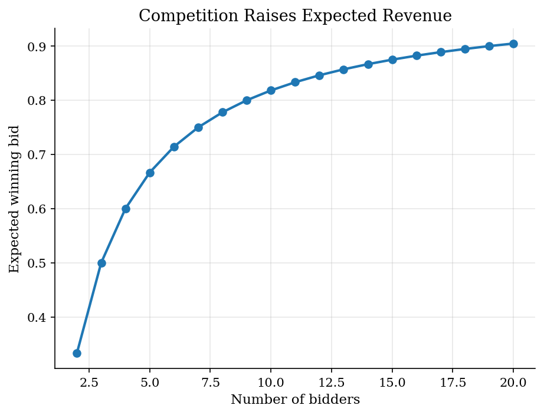

# First-Price Auctions and Bid Shading

> Bayesian Nash equilibrium in a symmetric independent private values auction.

## Overview

A first-price sealed-bid auction is a Bayesian game: each bidder knows their own value but not rivals' values. In the symmetric independent private values model with uniform values, the equilibrium is a simple bid-shading rule. The code uses the closed-form solution and then checks it by direct best-response search on a grid.

## Equations

There are $n$ risk-neutral bidders. Values are independently drawn from $U[0,1]$.
In a symmetric increasing equilibrium, bidder $i$ with value $v$ bids
$$
b(v) = \frac{n-1}{n}v.
$$

If a bidder with value $v$ deviates to bid $b$ while opponents use the equilibrium strategy,
the probability of winning is
$$
\Pr(\text{win} \mid b) =
\left(\frac{n}{n-1}b\right)^{n-1},
$$
for bids below the highest equilibrium bid. Expected payoff is
$$
\pi(v,b) = (v-b)\Pr(\text{win} \mid b).
$$

## Model Setup

The baseline assumes independent $U[0,1]$ values, risk-neutral bidders, no reserve price, and no binding ties. The script compares auctions with 2, 3, 5, and 10 bidders.

## Solution Method

**Closed form:** use the symmetric equilibrium bid function $b(v)=\frac{n-1}{n}v$.

**Numerical check:** for a grid of values, search over bids and verify that the best response against equilibrium opponents is close to the closed-form bid.

## Results

More competition reduces bid shading. With many rivals, winning becomes more valuable at the margin, so bids move closer to values.


*First-price bidders shade bids below values*

For a bidder with value 0.8 in a 3-bidder auction, the payoff-maximizing deviation is the equilibrium bid.


*Closed-form bid matches the grid best response*


*Expected revenue rises with the number of bidders*

**Auction Summary**

|   Bidders | Bid function   |   Bid shading at v=1 |   Expected revenue |
|----------:|:---------------|---------------------:|-------------------:|
|         2 | b(v)=1/2 v     |                0.5   |              0.333 |
|         3 | b(v)=2/3 v     |                0.333 |              0.5   |
|         5 | b(v)=4/5 v     |                0.2   |              0.667 |
|        10 | b(v)=9/10 v    |                0.1   |              0.818 |

The residual is the largest absolute difference between the closed-form bid and a grid best response.

**Best-Response Check**

|   Bidders |   Max grid BR error |
|----------:|--------------------:|
|         2 |           2.776e-17 |
|         3 |           0.0001583 |
|         5 |           1.11e-16  |
|        10 |           1.11e-16  |

## Takeaway

The symmetric auction model is a compact example of Bayesian Nash equilibrium. A bidder trades off a lower payment conditional on winning against a lower probability of winning. The equilibrium bid rule solves that tradeoff, and the grid check verifies the strategic optimality without introducing a specialized auction package.

## Reproduce

```bash
python run.py
```

## References

- [Vickrey, W. (1961). Counterspeculation, Auctions, and Competitive Sealed Tenders. *Journal of Finance*, 16(1), 8-37.](https://doi.org/10.1111/j.1540-6261.1961.tb02789.x)
- [Riley, J. G. and Samuelson, W. F. (1981). Optimal Auctions. *American Economic Review*, 71(3), 381-392.](https://www.jstor.org/stable/1802786)
- [Krishna, V. (2009). *Auction Theory*, 2nd ed. Academic Press.](https://shop.elsevier.com/books/auction-theory/krishna/978-0-12-374507-1)
