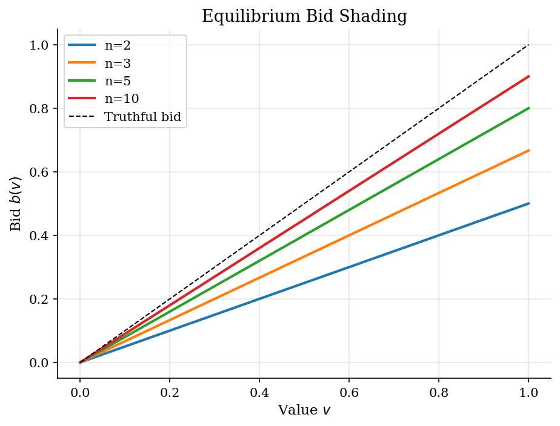
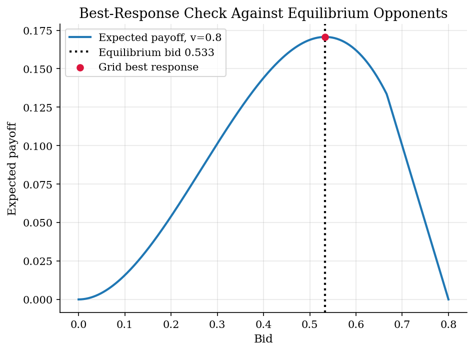

# First-Price Auctions, Bid Shading, and Deviation Checks

> Private-value bidding, the symmetric rule, and a direct deviation check.

## Overview

In a first-price sealed-bid auction, each bidder pays its own bid if it wins. Bidding value helps win, but it leaves no surplus.

The object is a symmetric bid rule for independent private values. With uniform values and risk-neutral bidders, equilibrium bids are a constant fraction of value.

The computation checks whether that rule is optimal type by type. Given rival strategies, a bid grid should recover the analytic bid as the best response.

## Equations

An auction has $n$ risk-neutral bidders. Bidder $i$ observes a private value
$v_i \sim U[0,1]$, independently across bidders, and submits one sealed bid.
The highest bid wins, and the winner pays its own bid. A symmetric Bayesian
Nash strategy is an increasing bid function $b(v)$.

Under uniform values, the equilibrium bid is

$$
b^{\ast}(v)=\frac{n-1}{n}v.
$$

The rule shades value by $v/n$.

To check optimality, fix a type $v$. Let that bidder choose a dollar bid
$\hat b$ while opponents use $b^{\ast}$. The rival value threshold beaten by
$\hat b$ is

$$
x(\hat b)=\min\left(\frac{n}{n-1}\hat b,\ 1\right).
$$

The probability of winning is

$$
\Pr(\text{win}\mid \hat b)=x(\hat b)^{n-1},
$$

Expected payoff is

$$
\pi(v,\hat b)=(v-\hat b)x(\hat b)^{n-1}.
$$

## Model Setup

| Object | Value | Role |
|---|---:|---|
| Value distribution | $U[0,1]$ | Independent private values |
| Risk preferences | Risk neutral | Payoff is value minus payment when winning |
| Bidder counts | 2, 3, 5, 10 | More or fewer rivals |
| Deviation grid | 2,001 bids per value | Best-response check for each $v$ |
| Check values | 19 values in [0.05, 0.95] | Types used for residuals |
| Focal deviation plot | $n=3$, $v=0.8$ | Payoff shape for one bidder type |

## Solution Method

The code treats the formula as a candidate equilibrium. It holds opponent behavior fixed and computes a grid best response for each checked type.

```text
Algorithm: bid shading and unilateral-deviation check
Inputs: bidder count n, type grid V, bid grid B(v) on [0,v]
Outputs: exact bid rule b*(v) and max best-response residual Delta_n

1. For each type v in V, set the exact bid b*(v) = ((n-1)/n) v.
2. For each candidate bid bhat in B(v), compute x(bhat)=min{n bhat/(n-1), 1}.
3. Evaluate pi(v,bhat) = (v-bhat) x(bhat)^(n-1).
4. Let BR(v) be the bid on the grid with the highest pi(v,bhat).
5. Report Delta_n = max_v |BR(v)-b*(v)|.
```

Each residual is the distance between the grid best response and the analytic bid. Small residuals mean the candidate passes the no-deviation check.

## Results

The bid functions show less shading when more bidders compete. With two bidders, a bidder bids one half of value. With ten bidders, the bid is close to value. Extra rivals make low bids more costly because they reduce win probability.



For value 0.8 with 2 rivals, the payoff curve peaks at the analytic bid. Lower bids raise margin only when they still win. Higher bids buy win probability at a higher payment. The grid best response sits on the analytic bid.



**Auction Summary**

|   Bidders | Equilibrium bid rule   |   Shading at v=1 |
|----------:|:-----------------------|-----------------:|
|         2 | b*(v)=1/2 v            |            0.5   |
|         3 | b*(v)=2/3 v            |            0.333 |
|         5 | b*(v)=4/5 v            |            0.2   |
|        10 | b*(v)=9/10 v           |            0.1   |

Residuals measure grid error. Some exact bids lie between grid points.

**Best-Response Check**

|   Bidders |   Max absolute BR error |
|----------:|------------------------:|
|         2 |               2.776e-17 |
|         3 |               0.0001583 |
|         5 |               1.11e-16  |
|        10 |               1.11e-16  |

## Takeaway

First-price auctions reward bid shading. In the uniform symmetric benchmark, the equilibrium bid is $((n-1)/n)v$.

The useful computational check is type by type. Hold rival strategies fixed and verify that no bid on the grid improves payoff.

## References

- [Vickrey, W. (1961). Counterspeculation, Auctions, and Competitive Sealed Tenders. *Journal of Finance*, 16(1), 8-37.](https://doi.org/10.1111/j.1540-6261.1961.tb02789.x)
- [Riley, J. G. and Samuelson, W. F. (1981). Optimal Auctions. *American Economic Review*, 71(3), 381-392.](https://www.jstor.org/stable/1802786)
- [Krishna, V. (2009). *Auction Theory*, 2nd ed. Academic Press.](https://shop.elsevier.com/books/auction-theory/krishna/978-0-12-374507-1)
