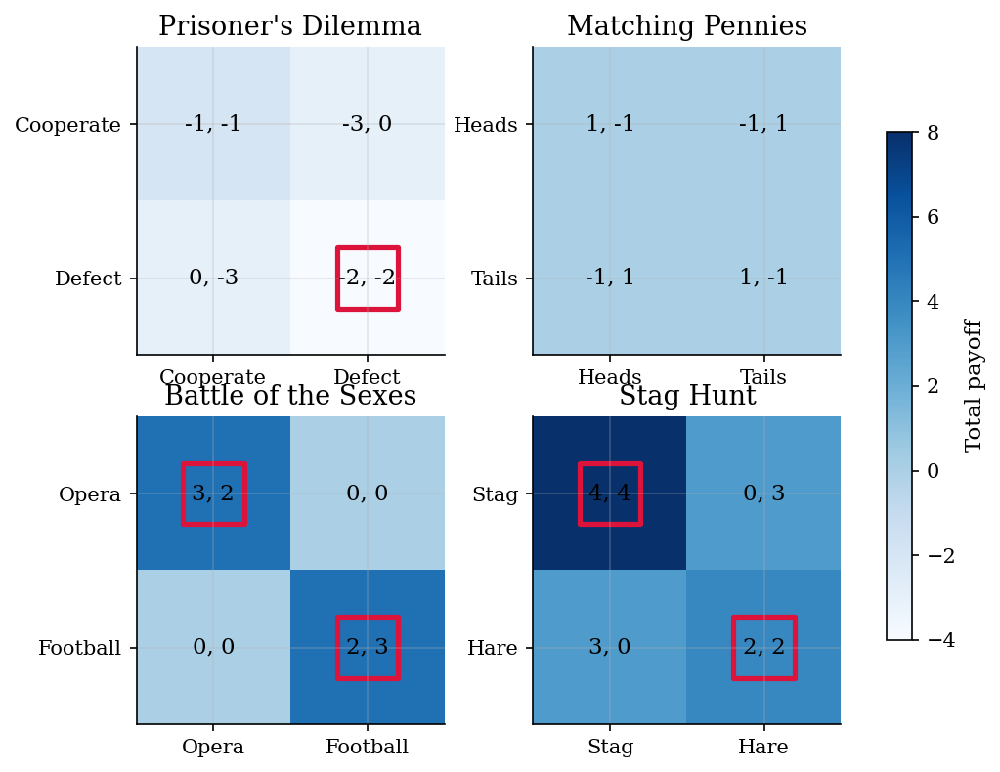

# Normal-Form Games

> Nash equilibria by enumeration and 2x2 indifference conditions.

## Overview

A normal-form game lists each player's actions and payoffs for every action profile. For small games, the cleanest computational method is not a black-box solver: enumerate profiles, check best responses, and solve 2x2 mixed equilibria by making each player indifferent between the actions used with positive probability.

## Equations

**Pure Nash equilibrium:** action profile $(i^*, j^*)$ satisfies
$$
u_1(i^*, j^*) \geq u_1(i, j^*) \quad \forall i,
\qquad
u_2(i^*, j^*) \geq u_2(i^*, j) \quad \forall j.
$$

**2x2 mixed Nash equilibrium:** if the row player plays action 0 with probability $p$
and the column player plays action 0 with probability $q$, then an interior mixed equilibrium
solves the two indifference equations:
$$
u_1(0, q) = u_1(1, q),
\qquad
u_2(p, 0) = u_2(p, 1).
$$

## Model Setup

The examples are four canonical 2x2 games: Prisoner's Dilemma, Matching Pennies, Battle of the Sexes, and Stag Hunt. The payoff matrices are hard-coded in the script so the equilibrium checks are visible and easy to audit.

## Solution Method

**Pure equilibria:** loop over all cells and check whether both players are best responding.

**Mixed equilibria:** solve the two linear indifference equations for 2x2 games, then verify that the mixing probabilities lie in $[0, 1]$ and report the indifference residual.

## Results

The red boxes mark pure Nash equilibria. Matching Pennies has no red box because every pure profile gives one player a profitable deviation.


*Payoff matrices with pure Nash equilibria outlined*

At probability 0.5, each player's two pure actions have the same expected payoff. That indifference is what supports randomization.


*Mixed equilibrium makes both players indifferent*

The residual column checks the mixed-equilibrium indifference equations.

**Equilibrium Summary**

| Game                | Pure Nash                            | Interior mixed Nash   | Indifference residual   |
|:--------------------|:-------------------------------------|:----------------------|:------------------------|
| Prisoner's Dilemma  | (Defect, Defect)                     | None                  |                         |
| Matching Pennies    | None                                 | p=0.500, q=0.500      | 0.0e+00                 |
| Battle of the Sexes | (Opera, Opera), (Football, Football) | p=0.600, q=0.400      | 2.2e-16                 |
| Stag Hunt           | (Stag, Stag), (Hare, Hare)           | p=0.667, q=0.667      | 4.4e-16                 |

**Expected Payoffs at Interior Mixed Equilibria**

| Game                |   Row payoff |   Column payoff |     p |     q |
|:--------------------|-------------:|----------------:|------:|------:|
| Matching Pennies    |        0     |           0     | 0.5   | 0.5   |
| Battle of the Sexes |        1.2   |           1.2   | 0.6   | 0.4   |
| Stag Hunt           |        2.667 |           2.667 | 0.667 | 0.667 |

## Economic Takeaway

The computational lesson is simple: for small finite games, equilibrium is a set of inequality and indifference checks. Pure Nash equilibria are found by checking unilateral deviations cell by cell. Mixed equilibria are found by making the opponent indifferent. This gives a transparent baseline before using heavier fixed-point or dynamic-game methods.

## Reproduce

```bash
python run.py
```

## References

- Nash, J. (1950). Equilibrium Points in N-Person Games. *Proceedings of the National Academy of Sciences*, 36(1).
- Osborne, M. and Rubinstein, A. (1994). *A Course in Game Theory*. MIT Press.
