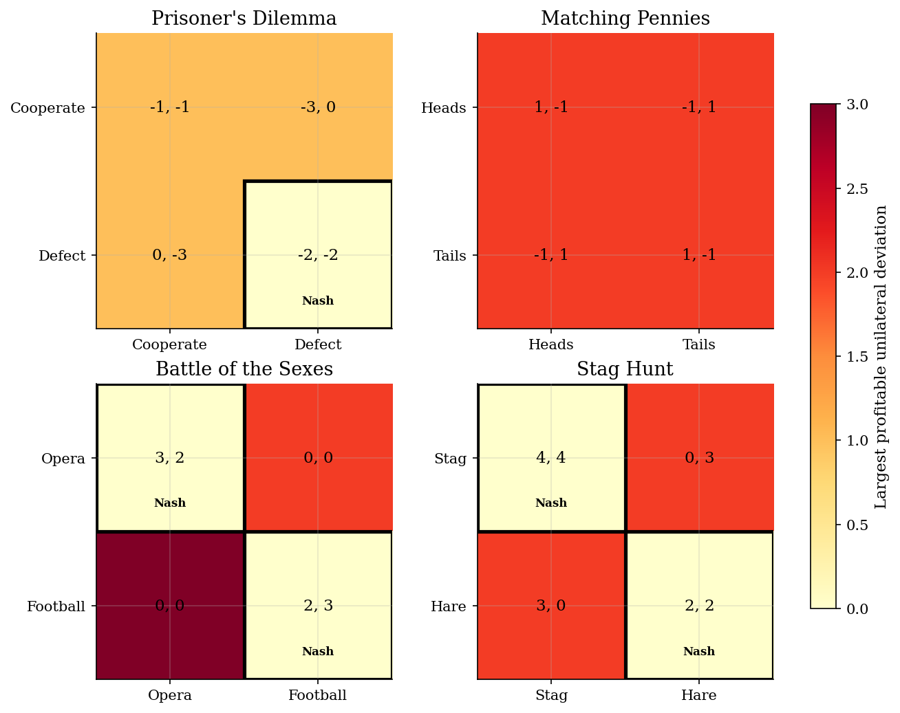
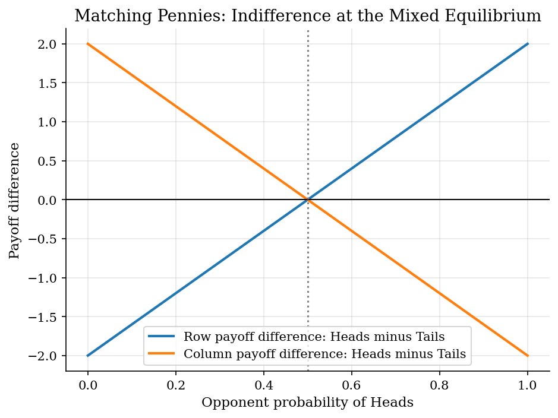

# Finite Strategic Games and Nash Equilibrium Checks

## Overview

Strategic settings often turn on unilateral incentives. An outcome is stable only when each player is content with its own action.

A normal-form game stores those incentives in a payoff table. Each cell lists the row and column payoffs for one action profile.

The computation asks two questions. Which cells have zero profitable one-player deviations? In 2x2 games, which probabilities make both players indifferent over the actions they use?

## Equations

A finite two-player game has a row player with actions $i \in I$ and a column
player with actions $j \in J$. The matrices $A$ and $B$ record row and column
payoffs. At pure profile $(i,j)$, the players receive $(A_{ij},B_{ij})$.

The row player's one-step deviation gain at $(i,j)$ is

$$
d_1(i,j)=\max_{i' \in I} A_{i'j}-A_{ij},
$$

and the column player's gain is

$$
d_2(i,j)=\max_{j' \in J} B_{ij'}-B_{ij}.
$$

The combined deviation gain at $(i,j)$ is the larger of the two,

$$
d(i,j)=\max\lbrace d_1(i,j), d_2(i,j) \rbrace.
$$

The heat maps color each cell by $d(i,j)$, and the pseudocode tests
$d(i,j)=0$.

A pure Nash equilibrium is a profile $(i^{\ast}, j^{\ast})$ with

$$
d_1(i^{\ast},j^{\ast})=d_2(i^{\ast},j^{\ast})=0,
$$

Equivalently, the two best-response inequalities are

$$
A_{i^{\ast}j^{\ast}} \geq A_{ij^{\ast}} \quad \forall i \in I,
\qquad
B_{i^{\ast}j^{\ast}} \geq B_{i^{\ast}j} \quad \forall j \in J.
$$

For a 2x2 game, let the row player use mixed strategy $x=(p,1-p)$ and the
column player use $y=(q,1-q)$. An interior mixed equilibrium requires both
players to be indifferent across the actions used with positive probability:

$$
A_{11}q + A_{12}(1-q) = A_{21}q + A_{22}(1-q),
\qquad
B_{11}p + B_{21}(1-p) = B_{12}p + B_{22}(1-p).
$$

The candidate is an equilibrium only if $p,q \in [0,1]$. The reported mixed
residual is the maximum absolute gap left in these two indifference equations.

## Model Setup

Four 2x2 games make the checks concrete. Prisoner's Dilemma isolates private incentives against joint surplus. Matching Pennies has no pure equilibrium. Battle of the Sexes has two conventions and conflicting preferences. Stag Hunt has a safe action and a payoff-dominant convention.

| Game | Actions | What the payoffs isolate |
|---|---|---|
| Prisoner's Dilemma | Cooperate/Defect | Individual incentives overturn the efficient profile. |
| Matching Pennies | Heads/Tails | No pure action can be predictable in equilibrium. |
| Battle of the Sexes | Opera/Football | Coordination is valuable, but players prefer different conventions. |
| Stag Hunt | Stag/Hare | Safe and payoff-dominant coordination profiles coexist. |

## Solution Method

Equilibrium is a finite set of inequalities. The code computes deviation gains at every pure profile. For each 2x2 game, it also solves the two linear indifference equations for p and q.

```text
Algorithm: Nash checks for a two-player finite game
Inputs: payoff matrices A, B and action labels I, J
Outputs: pure Nash set E and, for 2x2 games, an interior mixed candidate

1. For each pure profile (i,j), compute d1(i,j) and d2(i,j).
2. Add (i,j) to E when max{d1(i,j), d2(i,j)} = 0.
3. For each 2x2 game, solve the two indifference equations for p and q.
4. Keep the mixed candidate only when p and q lie in [0,1].
5. Recompute both expected-payoff gaps and report the largest absolute residual.
```

The residual checks the mixed calculation. Pure profiles pass when both deviation gains equal zero. Mixed profiles pass when both actions used in the mixture have equal expected payoffs.

## Results

The heat maps color each payoff table by the largest one-player deviation gain. Warmer cells have larger gains from switching action. A black outline marks a zero-deviation cell. In Prisoner's Dilemma, mutual defection is stable even though mutual cooperation gives more total payoff.



The mixed-strategy panels show the payoff differences behind randomization. Each curve subtracts the second-action payoff from the first-action payoff. A root gives the opponent probability that makes the player willing to mix. Matching Pennies lands at half-half. Battle of the Sexes gives asymmetric probabilities. Stag Hunt gives a threshold between safe and payoff-dominant coordination.



The summary table lists the equilibria from the same checks. Pure entries are zero-deviation cells. Mixed entries give the interior probability pair and the largest indifference residual.

**Equilibrium Summary by Game**

| Game                | Pure Nash equilibria                 | Interior mixed equilibrium                  | Indifference residual   | Economic pattern                                                            |
|:--------------------|:-------------------------------------|:--------------------------------------------|:------------------------|:----------------------------------------------------------------------------|
| Prisoner's Dilemma  | (Defect, Defect)                     | None                                        | None                    | Defection is stable even though cooperation has higher joint payoff.        |
| Matching Pennies    | None                                 | Pr(row Heads)=0.500; Pr(column Heads)=0.500 | 0.0e+00                 | Any predictable pure action invites a profitable response.                  |
| Battle of the Sexes | (Opera, Opera), (Football, Football) | Pr(row Opera)=0.600; Pr(column Opera)=0.400 | 2.2e-16                 | Two conventions are stable; mixing balances conflicting preferred outcomes. |
| Stag Hunt           | (Stag, Stag), (Hare, Hare)           | Pr(row Stag)=0.667; Pr(column Stag)=0.667   | 4.4e-16                 | Safe and payoff-dominant conventions both satisfy no-deviation.             |

## Takeaway

Finite normal-form games make Nash equilibrium directly checkable. Enumeration finds pure equilibria by testing profitable one-player deviations. The 2x2 mixed check chooses probabilities that erase payoff gaps within each player's support.

## References

- [Nash, J. (1950). Equilibrium Points in N-Person Games. *Proceedings of the National Academy of Sciences*, 36(1), 48-49.](https://doi.org/10.1073/pnas.36.1.48)
- [Osborne, M. and Rubinstein, A. (1994). *A Course in Game Theory*. MIT Press.](https://mitpress.mit.edu/9780262650403/a-course-in-game-theory)
