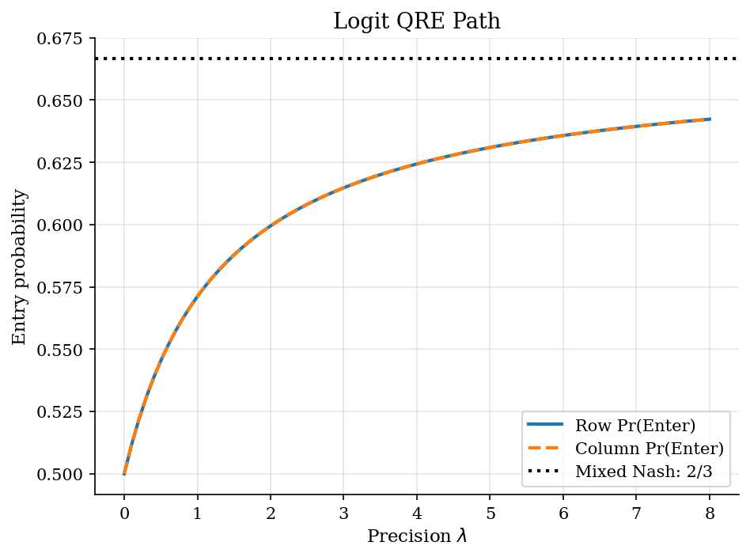
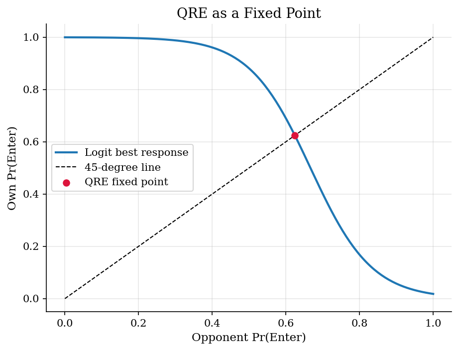

# Market Entry with Quantal Response Equilibrium

## Overview

Two firms decide whether to enter a small market. Entry pays when only one firm enters. Joint entry makes both firms lose money.

Quantal response equilibrium keeps payoff comparison but allows mistakes. More profitable actions receive higher probability. The precision parameter controls how sharply firms respond to payoff gaps.

The unknown is a symmetric entry probability. It must equal the logit response to itself. That condition is a fixed point.

## Equations

Each player chooses $E$ (Enter) or $O$ (Stay Out). Let $p_i$ be player $i$'s
entry probability. If the rival enters with probability $q$, the payoff gap is:

$$
\Delta(q)
= \mathbb{E}[u_i(E,a_{-i})]-\mathbb{E}[u_i(O,a_{-i})]
= 2(1-q)-q
= 2-3q.
$$

The exact symmetric mixed Nash equilibrium sets $\Delta(q)=0$:

$$
p^{N} = \frac{2}{3}.
$$

Logit QRE smooths the exact best response:

$$
\begin{aligned}
QBR(q;\lambda)
&= \frac{\exp(\lambda \Delta(q))}{1+\exp(\lambda \Delta(q))} \\
&= [1+\exp(-\lambda(2-3q))]^{-1}.
\end{aligned}
$$

A symmetric logit-QRE is a fixed point:

$$
p = QBR(p;\lambda).
$$

At $\lambda=0$, both actions receive probability one half. As $\lambda$ rises,
$p(\lambda)$ moves toward the mixed Nash probability $p^{N}=2/3$.

## Model Setup

These payoffs create excess entry pressure when the rival is unlikely to enter.

| | Column Enter | Column Stay Out |
|---|---:|---:|
| **Row Enter** | -1, -1 | 2, 0 |
| **Row Stay Out** | 0, 2 | 0, 0 |

| Object | Value | Role |
|---|---:|---|
| Symmetric mixed Nash $p^N$ | 0.6667 | Exact benchmark for symmetric entry |
| Precision grid | 0 to 32 | Strength of payoff sensitivity |
| Focal fixed-point plot | $\lambda=4.0$ | One logit response map |

## Solution Method

The symmetric QRE reduces to a one-dimensional root search. For candidate probability $p$, define $G_{\lambda}(p)=p-QBR(p;\lambda)$. A fixed point sets this residual to zero. Bisection is enough because $G_{\lambda}$ rises on $[0,1]$ and changes sign across the bracket.

```text
Algorithm: symmetric logit-QRE path in the entry game
Inputs: precision grid Lambda, payoff gap Delta(p)=2-3p, tolerance epsilon
Outputs: QRE entry probabilities p(lambda), residuals, gaps to p^N

1. Compute the exact symmetric mixed Nash benchmark p^N from Delta(p^N)=0.
2. For each lambda in Lambda, define QBR(p;lambda) = [1+exp(-lambda Delta(p))]^{-1}.
3. Set the initial bracket [low, high] = [0, 1].
4. Bisect the bracket on G_lambda(p)=p-QBR(p;lambda).
5. Stop when |G_lambda(p)| or the bracket width is below epsilon.
6. Report p(lambda), |G_lambda(p(lambda))|, and p(lambda)-p^N.
```

## Results

At zero precision, firms enter with probability one half. As precision rises, entry probability moves toward two thirds. The dotted line is the mixed Nash benchmark.



At $\lambda=4.0$, the response curve slopes down. A higher rival entry probability lowers the payoff from entry. The QRE is the crossing with the 45-degree line.



The residual is numerical error. The gap to Nash is finite-precision distance from exact mixed Nash.

**QRE Path Summary**

|   Precision lambda |   QRE Pr(Enter) |   Mixed Nash Pr(Enter) |   Gap to Nash |   Residual |
|-------------------:|----------------:|-----------------------:|--------------:|-----------:|
|                  0 |          0.5    |                 0.6667 |       -0.1667 |   0        |
|                  1 |          0.5712 |                 0.6667 |       -0.0955 |   5.06e-13 |
|                  2 |          0.5995 |                 0.6667 |       -0.0672 |   3.84e-14 |
|                  4 |          0.6243 |                 0.6667 |       -0.0423 |   9.94e-13 |
|                  8 |          0.6423 |                 0.6667 |       -0.0244 |   9.18e-13 |
|                 16 |          0.6535 |                 0.6667 |       -0.0132 |   1.79e-12 |
|                 32 |          0.6598 |                 0.6667 |       -0.0069 |   4.45e-13 |

## Takeaway

QRE keeps mutual consistency but softens exact best response. In this entry game, higher precision moves entry toward mixed Nash. The residual checks computation. The Nash gap measures finite-precision behavior.

## References

- [McKelvey, R. D. and Palfrey, T. R. (1995). Quantal Response Equilibria for Normal Form Games. *Games and Economic Behavior*, 10(1), 6-38.](https://doi.org/10.1006/game.1995.1023)
- [Goeree, J. K., Holt, C. A., and Palfrey, T. R. (2016). *Quantal Response Equilibrium: A Stochastic Theory of Games*. Princeton University Press.](https://doi.org/10.23943/princeton/9780691124230.001.0001)
