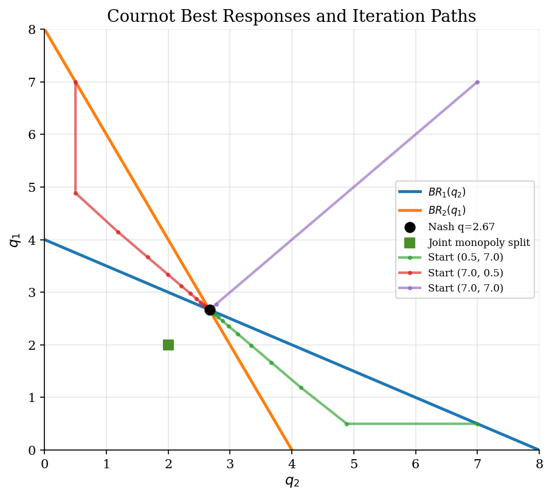
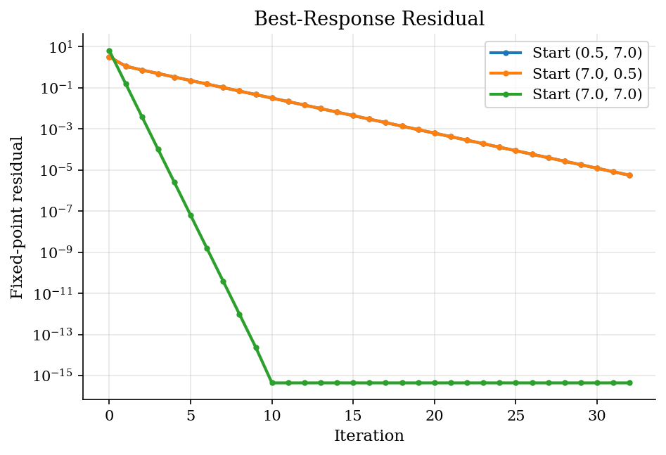
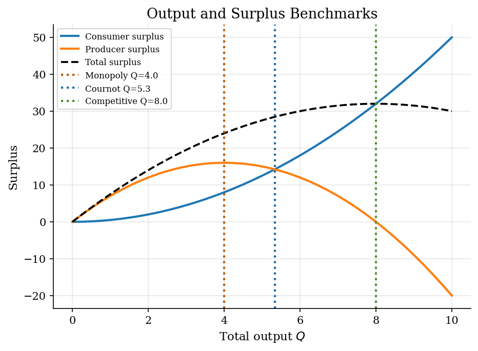

# Cournot Oligopoly and Best-Response Dynamics

> A static quantity game solved by closed-form Nash conditions and checked by best-response iteration.

## Overview

Cournot competition is a small static game with a large economic lesson: market power comes from each firm's recognition that its own output moves the market price. The Nash quantity is not the joint-profit maximum and not the competitive quantity. It is the point where each firm is already choosing its optimal quantity given the other firm's quantity.

Two solution views run side by side. The first is the closed-form first-order condition. The second iterates best responses and reports a fixed-point residual. The iteration matters because larger games usually do not have a one-line equilibrium formula.

## Equations

Two firms choose quantities $q_1$ and $q_2$ simultaneously. Total output is
$Q=q_1+q_2$, inverse demand is

$$
P(Q)=a-bQ,
$$

and firm $i$ has constant marginal cost $c$. Given $q_j$, firm $i$ solves

$$
\max_{q_i \geq 0}\ (a-b(q_i+q_j)-c)q_i.
$$

The interior first-order condition gives the best response

$$
BR_i(q_j)=\frac{a-c-bq_j}{2b}.
$$

A symmetric Nash equilibrium satisfies $q_i=q_j=q^{\ast}$ and
$q^{\ast}=BR_i(q^{\ast})$, so

$$
q^{\ast}=\frac{a-c}{3b},\qquad
P^{\ast}=a-2bq^{\ast}.
$$

The comparison points are also useful:

$$
Q^{M}=\frac{a-c}{2b},\qquad
Q^{C}=\frac{a-c}{b},
$$

where $Q^{M}$ is monopoly output and $Q^{C}$ is the competitive output at
price equal to marginal cost.

## Model Setup

| Object | Value | Meaning |
|---|---:|---|
| $a$ | 10.0 | Demand intercept |
| $b$ | 1.0 | Demand slope |
| $c$ | 2.0 | Marginal cost |
| $q^{\ast}$ | 2.667 | Nash output per firm |
| $P^{\ast}$ | 4.667 | Nash price |
| $\pi^{\ast}$ | 7.111 | Nash profit per firm |
| Damping $\lambda$ | 0.65 | Weight on each new best response |

## Solution Method

The closed-form solution solves the two first-order conditions directly. The best-response iteration treats the same equilibrium as a fixed point of the map $BR(q_1,q_2)=(BR_1(q_2),BR_2(q_1))$.

```text
Algorithm: damped Cournot best-response iteration
Inputs: demand parameters a, b, marginal cost c, start q_0, damping lambda
Output: quantity path q_t and fixed-point residuals

1. Start from a candidate pair q_t = (q_{1t}, q_{2t}).
2. Compute each firm's best response to the other firm's current output.
3. Update q_{t+1} = (1-lambda) q_t + lambda BR(q_t).
4. Repeat until max_i |q_{it} - BR_i(q_{-i,t})| is near zero.
5. Compare the numerical fixed point with q* = (a-c)/(3b).
```

A small residual matters more than a visually stable path: Nash equilibrium is a no-profitable-deviation condition, not just convergence of a line on a plot.

## Results

The best-response curves cross at the Nash quantity. The joint-monopoly split is inside the diagram but not an equilibrium: each firm would rather expand output if the rival stayed at the collusive quantity. The damped paths show how the same Nash condition can be reached by iteration from different starting points.



The residual falls quickly because this linear duopoly has a stable best-response map after damping. Reporting it ties the numerical exercise to the economic definition of equilibrium.



The welfare comparison is the economic reason the equilibrium matters. Cournot output lies between monopoly and perfect competition, so the price is also intermediate. The exact numbers are calibration-specific, but the ranking is the standard Cournot logic.



**Best-Response Convergence**

| Initial q   |   Final q1 |   Final q2 |   Residual |
|:------------|-----------:|-----------:|-----------:|
| (0.5, 7.0)  |     2.6667 |     2.6667 |   5.6e-06  |
| (7.0, 0.5)  |     2.6667 |     2.6667 |   5.6e-06  |
| (7.0, 7.0)  |     2.6667 |     2.6667 |   4.44e-16 |
| Closed form |     2.6667 |     2.6667 |   4.44e-16 |

**Cournot Benchmarks**

| Market structure    |   Total output |   Price |   Profit per firm |
|:--------------------|---------------:|--------:|------------------:|
| Monopoly            |          4     |   6     |            16     |
| Cournot duopoly     |          5.333 |   4.667 |             7.111 |
| Perfect competition |          8     |   2     |             0     |

## Takeaway

Cournot equilibrium is a fixed point with economic content: each firm is already choosing its profit-maximizing quantity given the rival's output. Closed form makes that condition transparent here. Best-response iteration is the computational version of the same idea, and the residual verifies that the iteration has actually reached a Nash equilibrium.

## References

- Cournot, A. A. (1838/1897). *Researches into the Mathematical Principles of the Theory of Wealth*. English translation.
- Fudenberg, D. and Tirole, J. (1991). *Game Theory*. MIT Press.
- Tirole, J. (1988). *The Theory of Industrial Organization*. MIT Press, Ch. 5.
- Vives, X. (1999). *Oligopoly Pricing: Old Ideas and New Tools*. MIT Press.
