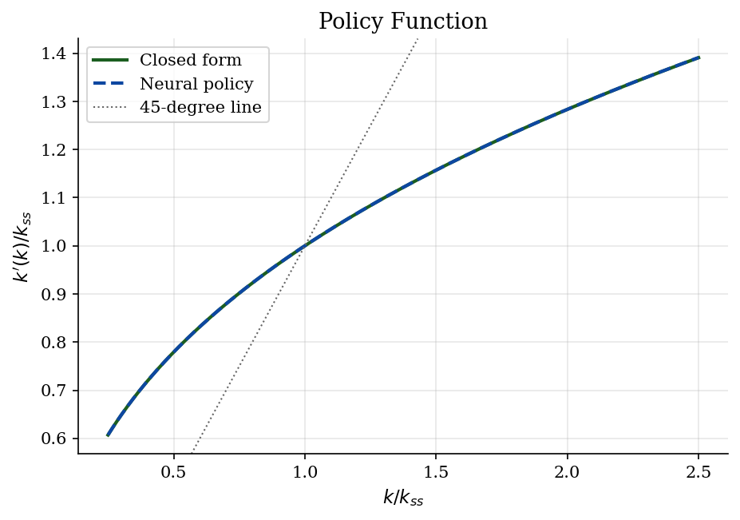
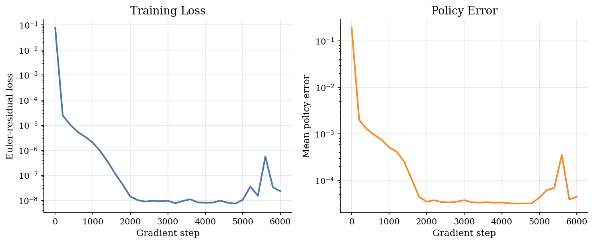
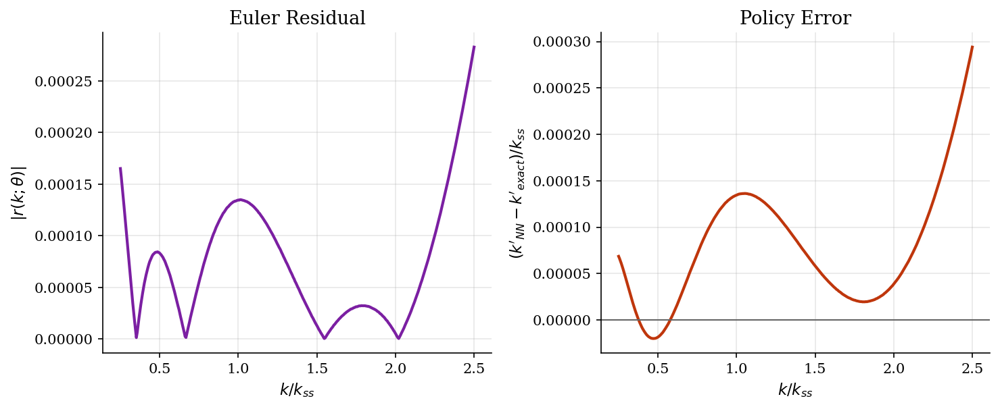
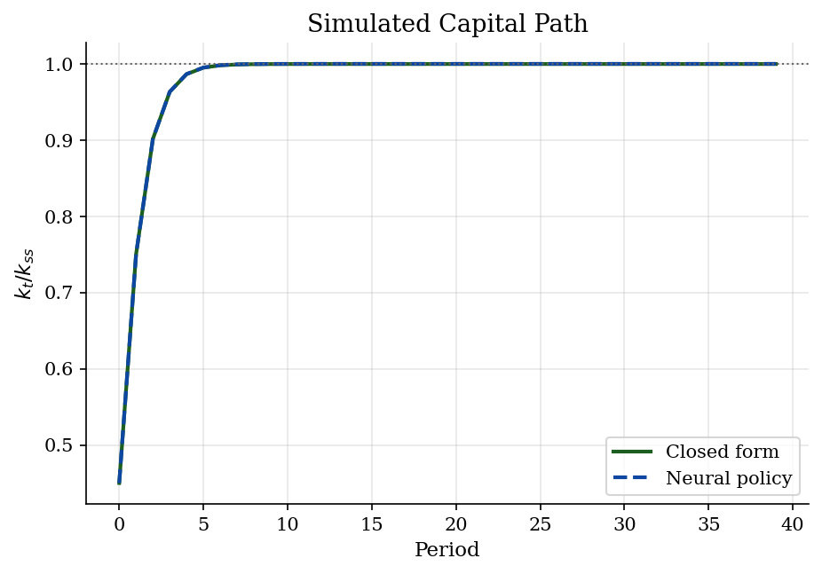

# Deep Learning for Optimal Growth

> A JAX neural net learns the Brock-Mirman saving rule from Euler residuals.

## Overview

A planner chooses how much output to consume today. Remaining output becomes capital tomorrow. The log Cobb-Douglas case has an exact saving rule. That exact rule makes the neural solver easy to audit.

Deep-learning macro methods often rewrite dynamic models as empirical-risk problems. Some solvers optimize lifetime rewards. Some solvers minimize Euler residuals. Some solvers minimize Bellman residuals.

This tutorial uses an Euler-residual loss. The neural net proposes a feasible saving share. Gradient steps fit the policy on simulated capital states. The Brock-Mirman formula audits the trained rule point by point.

## Equations

Capital fully depreciates each period. With state $k_t$, output is

$$
y_t = A k_t^{\alpha}, \qquad 0<\alpha<1,
$$

Feasibility requires

$$
c_t + k_{t+1} = A k_t^{\alpha},
\qquad c_t>0, k_{t+1}>0.
$$

The planner maximizes

$$
\sum_{t=0}^{\infty}\beta^t \log c_t,
\qquad 0<\beta<1.
$$

The Euler equation is

$$
\frac{1}{c_t}
= \beta \frac{\alpha A k_{t+1}^{\alpha-1}}{c_{t+1}}.
$$

The code evaluates the Euler equation as this log residual:

$$
r(k;\theta)
= \log\left[
\beta \alpha A k'(k;\theta)^{\alpha-1}
\frac{c(k;\theta)}{c(k'(k;\theta);\theta)}
\right].
$$

The residual is zero when the Euler equation holds. Training chooses parameters that make this residual small.

The population risk is

$$
\Xi(\theta) = E\left[r(k;\theta)^2\right].
$$

The program replaces that expectation with simulated capital draws. With draws $k_1,\ldots,k_n$, it solves the empirical problem

$$
\Xi_n(\theta) = \frac{1}{n}\sum_{i=1}^{n} r(k_i;\theta)^2,
\qquad
\hat{\theta} = \arg\min_{\theta} \Xi_n(\theta).
$$

The neural policy first chooses a saving share:

$$
s(k;\theta)
= s_{\min} + (s_{\max}-s_{\min})
\sigma\left(N_{\theta}(\log(k/k_{ss}))\right),
$$

It then imposes feasibility by construction:

$$
k'(k;\theta)=s(k;\theta)A k^{\alpha},
\qquad
c(k;\theta)=(1-s(k;\theta))A k^{\alpha}.
$$

This special case has an exact policy:

$$
k'(k)=\alpha\beta A k^{\alpha},
\qquad
c(k)=(1-\alpha\beta)A k^{\alpha},
$$

The steady state is

$$
k_{ss}=(\alpha\beta A)^{1/(1-\alpha)}.
$$

## Model Setup

| Symbol | Value | Role |
|--------|-------|------|
| $\alpha$ | 0.36 | Capital share in $A k^{\alpha}$ |
| $\beta$ | 0.95 | Discount factor |
| $A$ | 2.0 | Total factor productivity |
| $k_{ss}$ | 0.5524 | Closed-form steady-state capital |
| $c_{ss}$ | 1.0629 | Closed-form steady-state consumption |
| Training states | [0.138, 1.381] | Uniform random draws around $k_{ss}$ |
| Neural net | 1-16-16-1 tanh MLP | Maps $\log(k/k_{ss})$ to a saving share |
| Saving-share bounds | [0.02, 0.95] | Keep $c$ and $k'$ feasible |
| Batch size | 256 | States per gradient step |
| Gradient steps | 6000 | Adam updates using JAX autodiff |

## Solution Method

The method starts with a parameterized policy. It draws states from a training interval. It evaluates an economic residual at those states. It minimizes the average squared residual.

Richer DSGE examples can optimize lifetime rewards. Other DSGE examples can minimize Bellman residuals. This model only needs Euler residuals. JAX autodiff provides the gradient. Adam updates the weights.

```text
Algorithm: simulated-state Euler-residual training
Inputs:
    alpha, beta, A
    training interval K
    saving-share bounds s_min, s_max
    batch size n
    steps T
Output:
    feasible neural policy k'(k; theta)
Initialize theta
Initialize Adam moments
Compute the exact steady state k_ss
Use sigmoid(z) = 1 / (1 + exp(-z))
For t = 1,...,T:
    Draw minibatch states k_1,...,k_n from K
    Evaluate saving shares s(k_i; theta):
        x_i = log(k_i / k_ss)
        q_i = N_theta(x_i)
        s_i = s_min + (s_max - s_min) * sigmoid(q_i)
    Evaluate consumption c(k_i; theta):
        y_i = A * k_i^alpha
        c_i = (1 - s_i) * y_i
    Evaluate next capital k'(k_i; theta):
        k_i_next = s_i * y_i
    Evaluate c(k'(k_i; theta); theta):
        x_i_next = log(k_i_next / k_ss)
        q_i_next = N_theta(x_i_next)
        s_i_next = s_min + (s_max - s_min) * sigmoid(q_i_next)
        y_i_next = A * k_i_next^alpha
        c_i_next = (1 - s_i_next) * y_i_next
    Compute residuals r(k_i; theta):
        r_i = log(beta * alpha * A * k_i_next^(alpha - 1) * c_i / c_i_next)
    Set Xi_n(theta) = (1/n) sum_i r_i^2
    Update theta with one Adam step using the gradient of Xi_n(theta)
Audit k'(k; theta) on a holdout grid against the exact rule
```

The audit is not part of the training loss. It exists because this Brock-Mirman case has the closed-form rule $k'=\alpha\beta A k^\alpha$. The comparison shows what the residual-trained neural policy learned.

## Results

The trained policy is almost the exact constant-saving rule. The x-axis uses capital relative to the steady state. The main object is the saving rule away from $k_{ss}$. The exact and neural policy functions lie nearly on top of each other.



The training curves show the fitting process. The Euler-residual loss falls sharply. The mean policy error falls with it.

Both series drop by several orders of magnitude. The loss curve uses fresh minibatches. The error curve uses a fixed audit grid.



The residual plot is the numerical check. A small log Euler residual means the Euler equation is nearly satisfied. The policy-error panel compares the neural rule with the closed-form rule. That direct comparison is available only in this teaching example.

Residuals stay small across the grid. The remaining policy error is centered near zero.



Starting below the steady state gives a transition path. The exact path converges to the steady state. The neural path follows the same transition. Both paths start from the same initial capital.



The table reports the holdout audit on the plotted grid. Policy errors are in capital units. The Euler residual column is the maximum absolute log residual. Values near zero mean the Euler equation is nearly satisfied.

**Policy Approximation Accuracy**

|   Final loss |   Mean policy error |   Max policy error |   Max Euler residual |   Terminal path error |   Gradient steps |
|-------------:|--------------------:|-------------------:|---------------------:|----------------------:|-----------------:|
|  2.31559e-08 |         4.43835e-05 |        0.000162423 |          0.000282804 |           0.000116169 |             6000 |

The estimated policy is nearly identical to the exact Brock-Mirman policy. The learned saving share is nearly flat. Its mean is 0.3420. The exact saving share is $\alpha\beta=0.3420$.

The policy figure is the main evidence. The table records the diagnostics behind the plot.

## Takeaway

Deep learning is not needed to solve this Brock-Mirman model. The example is useful because the answer is known. The same residual-minimization machinery appears in larger nonlinear macro models.

Feasibility comes from the policy parameterization. Training comes from Euler residuals on simulated states. Credibility comes from the out-of-sample closed-form audit.

## References

- Brock, W. A., and Mirman, L. J. (1972). *Optimal Economic Growth and Uncertainty: The Discounted Case*. Journal of Economic Theory.
- Maliar, L., Maliar, S., and Winant, P. (2022). *Deep Learning for Solving Dynamic Economic Models*. Lecture slides.
