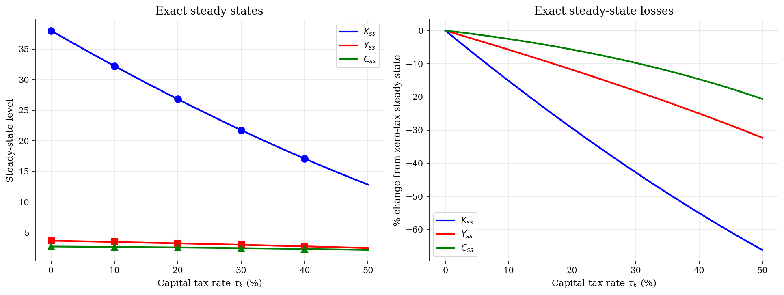

# Capital Taxes and Saving in a Global RBC Model

> A rebated capital tax leaves goods available today unchanged, but it lowers the private return that governs saving.

## Overview

Suppose the government taxes capital income and sends the revenue back as a lump-sum transfer. No goods disappear from the aggregate resource constraint. The representative household still changes its plan, because one more unit of capital now pays only the after-tax marginal product. The policy experiment is therefore about a wedge between what the economy can produce and what the household privately earns by saving.

A closed-form steady state gives the long-run benchmark, but it does not show how the saving rule changes after productivity shocks. For that we solve the stochastic RBC model on a global capital and productivity grid. The grid solution lets the tax wedge move the entire policy function, then we simulate every tax regime on the same productivity path.

## Equations

Let $K_t$ be aggregate capital at the start of period $t$, $z_t$ aggregate
TFP, $c_t$ consumption, and $K_{t+1}$ next-period capital. Preferences are

$$\mathbb{E}_0 \sum_{t=0}^{\infty} \beta^t
\frac{c_t^{1-\sigma}}{1-\sigma}, \qquad \sigma>0,$$

with Cobb-Douglas output $Y_t=z_t K_t^\alpha$. Productivity follows

$$\log z_{t+1}=\rho \log z_t+\varepsilon_{t+1},
\qquad \varepsilon_{t+1}\sim N(0,\sigma_\varepsilon^2).$$

The government rebate means aggregate feasibility is the usual RBC resource
constraint,

$$c_t + K_{t+1} = z_t K_t^\alpha + (1-\delta)K_t.$$

The tax appears in the household Euler equation:

$$c_t^{-\sigma} =
\beta \mathbb{E}_t\left[
c_{t+1}^{-\sigma}
\left((1-\tau_k)\alpha z_{t+1}K_{t+1}^{\alpha-1}+1-\delta\right)
\right].$$

Thus the wedge changes the return to saving but not the goods available to the
economy in a given period.

At $z=1$, the exact deterministic steady state is

$$K_{ss}(\tau_k)=
\left(\frac{(1-\tau_k)\alpha}{1/\beta-1+\delta}\right)^{1/(1-\alpha)},$$

with $Y_{ss}=K_{ss}^{\alpha}$, $C_{ss}=Y_{ss}-\delta K_{ss}$, and
tax revenue $T_{ss}=\tau_k \alpha Y_{ss}$.

## Model Setup

| Parameter | Value | Description |
|-----------|-------|-------------|
| $\beta$  | 0.99 | Discount factor |
| $\alpha$ | 0.36 | Capital share |
| $\sigma$ | 2.0 | CRRA coefficient |
| $\delta$ | 0.025 | Depreciation rate |
| $\rho$   | 0.95 | TFP persistence |
| $\sigma_\varepsilon$ | 0.01 | TFP innovation standard deviation |
| $\tau_k$ | [0.0, 0.1, 0.2, 0.3, 0.4] | Permanent tax rates compared |
| Capital grid | 40 points around each $K_{ss}(\tau_k)$ | State and $K'$ choice grid |
| TFP grid | 5 Tauchen states | Approximation to log productivity |
| Simulation periods | 5000 | Same shock seed for every tax regime, with 500 burn-in periods |

## Solution Method

The numerical problem is to recover a saving rule over the full $(z,K)$ state space, away from the deterministic steady state as well as at it. The solver starts with a resource-feasible Bellman pass, which gives a stable global policy on the capital grid. It then iterates directly on the Euler equation, replacing the pre-tax marginal product with $(1-\tau_k)MPK$. Howard improvement speeds up the value iteration step, while the Euler refinement is the part that makes the tax experiment economically meaningful.

```text
Algorithm: global saving rule with a capital-tax wedge
Input: tax rate tau_k, grids K and Z, transition matrix P, primitives beta, alpha, sigma, delta
Output: value V(z,K), saving rule g_K(z,K), consumption rule g_c(z,K)
Compute the exact deterministic K_ss(tau_k) and build a capital grid around it
Discretize log productivity with Tauchen to obtain Z and P
Precompute feasible consumption c = z K^alpha + (1-delta)K - K' for every (z,K,K')
Initialize V_0(z,K)
repeat:
    for each state (z_i,K_m):
        choose K' on the grid to maximize u(c) + beta * sum_j P_ij V_n(z_j,K')
        record V_{n+1}, g_K, and g_c
    apply Howard improvement to the fixed policy
until the sup-norm value update is below epsilon
repeat Euler refinement:
    for each state (z_i,K_m):
        K_plus = g_K(z_i,K_m)
        M = sum_j P_ij g_c(z_j,K_plus)^(-sigma)
            * ((1-tau_k) alpha z_j K_plus^(alpha-1) + 1-delta)
        g_c_new(z_i,K_m) = (beta * M)^(-1/sigma)
        g_K_new(z_i,K_m) = z_i K_m^alpha + (1-delta)K_m - g_c_new(z_i,K_m)
until the consumption policy update is below epsilon
Simulate all tax regimes on the same productivity path
```

The deterministic steady state anchors the long-run comparison. The stochastic policy functions are numerical, so the table below keeps exact steady states separate from simulated means. Across the five tax regimes, VFI used at most **49** outer iterations and Euler refinement used at most **223** iterations.

## Results

The exact steady-state formulas show the size of the distortion before we look at any simulated path. At $\tau_k=30\%$, deterministic capital is 42.7% below the no-tax value, output is 18.2% lower, and consumption is 9.7% lower. Consumption falls less because a lower capital stock also reduces replacement investment. The simulations use the same productivity sequence for every tax rate, so the level differences across paths are the tax wedge, not different shock histories.

The first comparison uses the exact steady-state formula. Capital falls with $(1-\tau_k)^{1/(1-\alpha)}$, so the tax rate is magnified by the capital share. Output and consumption move less than capital, but the economy operates from a lower productive base.



At the median productivity state, the policy functions show the wedge in decision-rule form. Higher taxes move the capital policy down and the consumption policy up: the household saves less because tomorrow's marginal product is partly taxed away.


The simulated paths keep the productivity sequence fixed across regimes. The higher-tax economies therefore track the same booms and recessions from permanently lower capital and output levels.


The stationary distributions add another view of the same mechanism. Higher taxes shift the investment share and the capital-output ratio left, so the economy spends more time in states with a smaller productive base.


The table keeps the closed-form steady-state benchmark separate from the simulated mean. Simulated mean capital is slightly above the deterministic value because productivity risk and the nonlinear policy shift the invariant distribution, but the ranking across tax regimes is unchanged.

**Exact Steady States and Simulated Moments by Tax Rate**

| Tax rate   |    K_ss |   Y_ss |   C_ss |   T_ss |   K_ss / K_ss(0) |   K loss % |   Mean K (sim) |   std(Y) % |
|:-----------|--------:|-------:|-------:|-------:|-----------------:|-----------:|---------------:|-----------:|
| 0%         | 37.9893 | 3.7041 | 2.7543 | 0      |            1     |        0   |        38.9739 |      6.664 |
| 10%        | 32.2229 | 3.4909 | 2.6853 | 0.1257 |            0.848 |       15.2 |        33.0755 |      6.714 |
| 20%        | 26.8064 | 3.2671 | 2.597  | 0.2352 |            0.706 |       29.4 |        27.5309 |      6.767 |
| 30%        | 21.7584 | 3.0307 | 2.4868 | 0.3273 |            0.573 |       42.7 |        22.3595 |      6.823 |
| 40%        | 17.101  | 2.779  | 2.3515 | 0.4002 |            0.45  |       55   |        17.5845 |      6.881 |

## Takeaway

The rebate balances the government budget while the intertemporal wedge remains. Once the household prices saving with $(1-\tau_k)MPK$, the economy carries less capital into every productivity state. The exact steady state gives the clean long-run comparison, and the global policy functions show how the same force operates away from the steady state. Fiscal wedges can be revenue-neutral in resources and still large in allocation.

## References

- Chamley, C. (1986). *Optimal Taxation of Capital Income in General Equilibrium*. Econometrica.
- Judd, K. (1985). *Redistributive Taxation in a Simple Perfect Foresight Model*. JPE.
- Cao, D., Luo, W., and Nie, G. (2023). *Global DSGE Models*. Review of Economic Dynamics.
