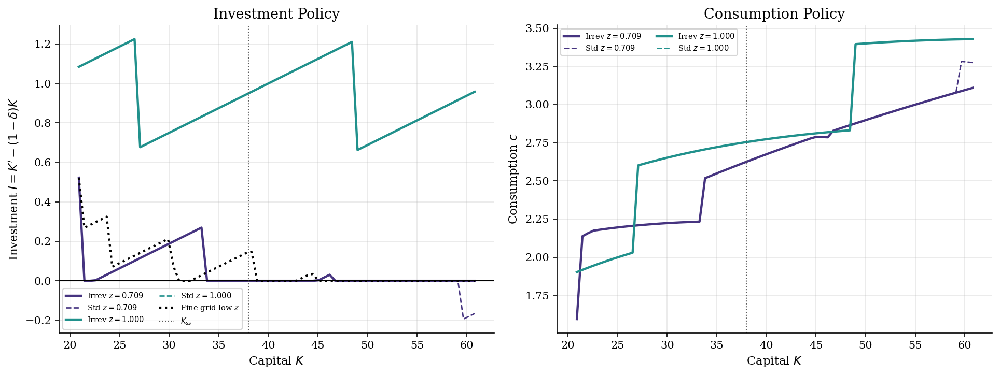
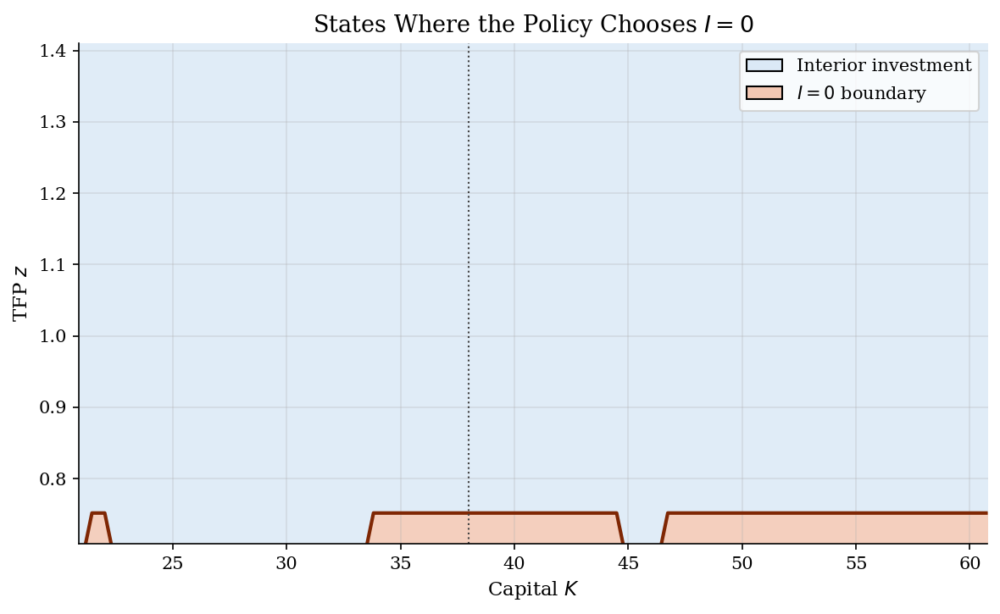
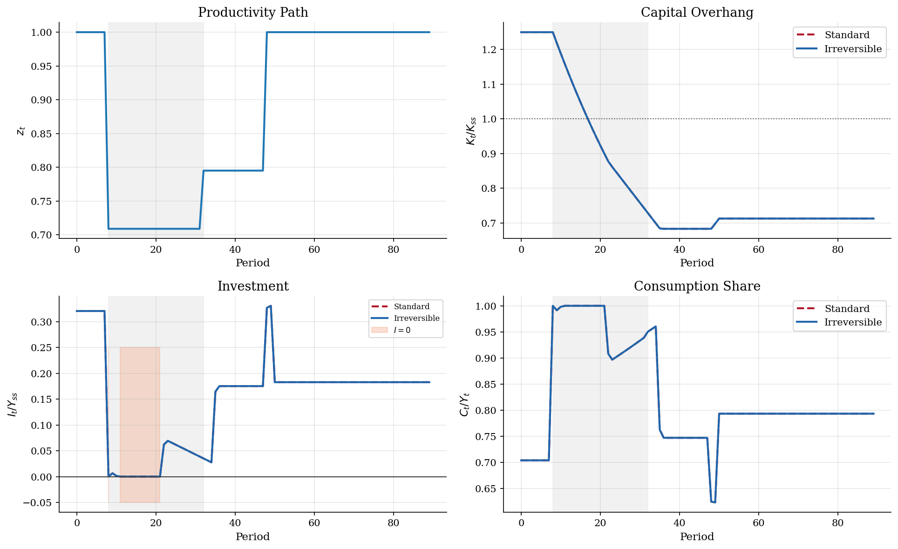
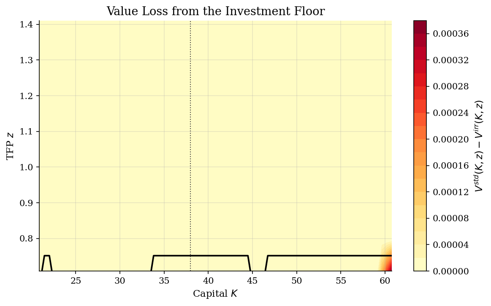

# Capital Overhang from Irreversible Investment in RBC

## Overview

A firm can install machines before it learns that productivity will be low. It can stop new investment. Installed capital only leaves through depreciation.

The model is a stochastic RBC economy with capital $K$ and productivity $z$. The household chooses $K'$ after observing $z$. Irreversible investment imposes $K' \geq (1-\delta)K$, or $I\geq 0$.

The object of interest is the zero-investment boundary. It can bind far from the steady state. Global value function iteration keeps that boundary on the grid. The solution can then show the binding region and the overhang path.

## Equations

Let $K_t$ be beginning-of-period capital, $z_t$ productivity, $c_t$ consumption,
and $K_{t+1}$ next-period capital. Output is $Y_t=z_tK_t^\alpha$ and

$$\log z_{t+1}=\rho \log z_t+\varepsilon_{t+1},
\qquad \varepsilon_{t+1}\sim N(0,\sigma_\varepsilon^2).$$

The Bellman equation is

$$V(K,z)=\max_{K'\in \Gamma(K,z)}\Bigg[
\frac{\left[zK^\alpha+(1-\delta)K-K'\right]^{1-\sigma}}{1-\sigma}
+\beta \sum_{z'} P(z,z')V(K',z')\Bigg].$$

Here $P(z,z')$ is the transition probability from productivity state $z$ to next-period state $z'$, obtained from the Tauchen discretization of the log-AR(1).

The standard RBC choice set is

$$\Gamma^{std}(K,z)=\{K'\geq 0:
zK^\alpha+(1-\delta)K-K'>0\}.$$

Irreversibility adds

$$I_t\equiv K_{t+1}-(1-\delta)K_t\geq 0,
\qquad
\Gamma^{irr}(K,z)=\{K'\geq (1-\delta)K:
zK^\alpha+(1-\delta)K-K'>0\}.$$

Let $\lambda_t$ denote the multiplier on irreversible investment.
The kink is summarized by

$$\lambda_t\geq 0,\qquad I_t\geq 0,\qquad \lambda_t I_t=0.$$

At the deterministic steady state the constraint is slack because
$I_{ss}=\delta K_{ss}>0$.
With the calibration below, $K_{ss}=37.989$, $Y_{ss}=3.704$, $C_{ss}=2.754$, and $I_{ss}=0.950$.

## Model Setup

| Parameter | Value | Description |
|-----------|-------|-------------|
| $\beta$ | 0.99 | Discount factor |
| $\alpha$ | 0.36 | Capital share |
| $\sigma$ | 2.0 | CRRA coefficient |
| $\delta$ | 0.025 | Depreciation rate |
| $\rho$ | 0.9 | Persistence of log productivity |
| $\sigma_\varepsilon$ | 0.05 | Innovation std for log productivity |
| Capital grid | 72 points on [20.89, 60.78] | State grid and candidate $K'$ grid |
| TFP grid | 7 Tauchen states | Common shock grid for both models |
| Overhang experiment | $K_0=1.25K_{ss}$ plus a low-$z$ episode | A stress path, not a stationary moment |

## Solution Method

The computation uses global value function iteration. It solves the standard and irreversible models on the same grids. The point $K'=(1-\delta)K$ is the feasible lower bound under irreversibility. The code evaluates that off-grid boundary for both models so neither solution loses accuracy at the kink; for the standard model it can only win when the optimum is at or above $I=0$. The binding indicator is recorded for the irreversible model, where the boundary choice means the investment floor is active.

```text
Algorithm: global VFI with an irreversible-investment boundary
Input: grids K and Z, transition matrix P, primitives beta, alpha, sigma, delta
Output: value V(K,z), policies g_K(z,K), g_c(z,K), binding indicator b(z,K)
Precompute resources R(z,K)=z K^alpha+(1-delta)K and utility for all grid choices K'
repeat:
    for each productivity state z_i and capital state K_m:
        set A_std(K_m) to all feasible grid choices K'
        set A_irr(K_m) to choices in A_std with K' >= (1-delta)K_m
        add the exact off-grid boundary K'=(1-delta)K_m to both A_std and A_irr
            (for A_std it can only win when the optimum is at or above I=0)
        choose K' to maximize u(R(z_i,K_m)-K') + beta * sum_j P_ij V_n(K',z_j)
        set b(z_i,K_m)=1 if the boundary K'=(1-delta)K_m is chosen
    apply Howard improvement to the fixed policy
until the sup-norm Bellman update is below epsilon
Simulate both policies on the same productivity paths
```

The irreversible model converged in **49** VFI iterations. The standard comparison converged in **49**.

## Results

The policy comparison locates the constraint. At low productivity and high capital, the standard model chooses negative investment. The irreversible policy flattens at $I=0$.



The binding set lies away from the steady state. It appears when capital is high relative to productivity. The constraint can matter in recessions even if average periods are slack.



The stress path starts with capital above steady state. Productivity then falls to its lowest grid state. The standard model disinvests immediately. The irreversible model holds investment at zero until depreciation lowers capital. The gray band marks the low-productivity episode.



The value loss is largest where the boundary binds. Near the steady state, normal replacement investment is positive. The friction mainly prices bad states with too much installed capital.



The stationary simulation starts at $K_{ss}$ and uses common productivity draws. The binding frequency is low in this calibration. That does not make the constraint irrelevant for high-capital recessions.

**Stationary Simulation Moments**

| Model        |   mean K |   std(Y) % |   std(C)/std(Y) |   mean I/Y | I=0 frequency   |
|:-------------|---------:|-----------:|----------------:|-----------:|:----------------|
| Irreversible |   39.499 |      17.11 |           0.729 |      0.251 | 0.42%           |
| Standard RBC |   39.499 |      17.11 |           0.729 |      0.251 | 0.00%           |

The investment floor leaves the steady state unchanged because replacement investment is positive. It changes policy in high-capital recession states. In this run, the boundary covers 9.5% of grid states. It binds for 13.3% of the stress path and 0.42% of stationary periods.

The average simulation rarely reaches the bad overhang region. The stress path is designed to enter it.

## Takeaway

Irreversibility is a theory of bad states. It does not change the deterministic steady state here. When capital is too high for productivity, the standard model disinvests immediately. The irreversible model waits for depreciation and later low investment. Occasionally binding constraints matter because they create state-dependent kinks.

## References

- Abel, A. and Eberly, J. (1996). *Optimal Investment with Costly Reversibility*. Review of Economic Studies.
- Bertola, G. and Caballero, R. (1994). *Irreversibility and Aggregate Investment*. Review of Economic Studies.
- Cao, D., Luo, W., and Nie, G. (2023). *Global GDSGE Models*. Review of Economic Dynamics.
