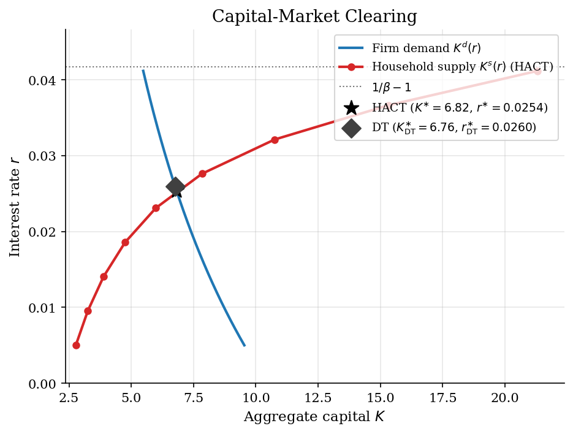
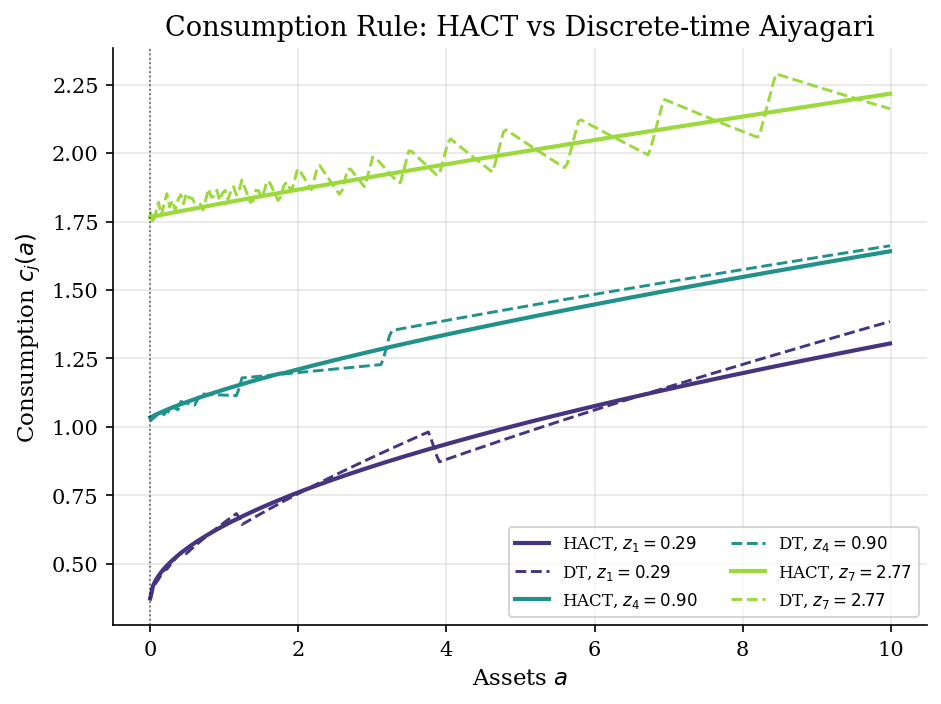
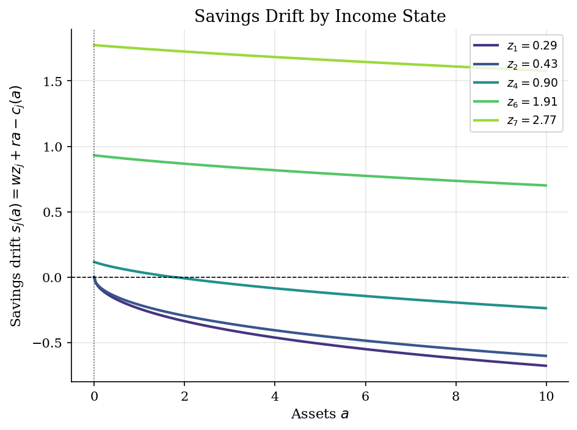
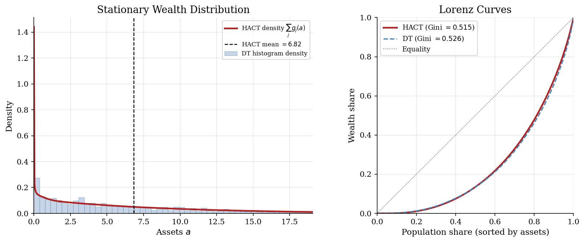
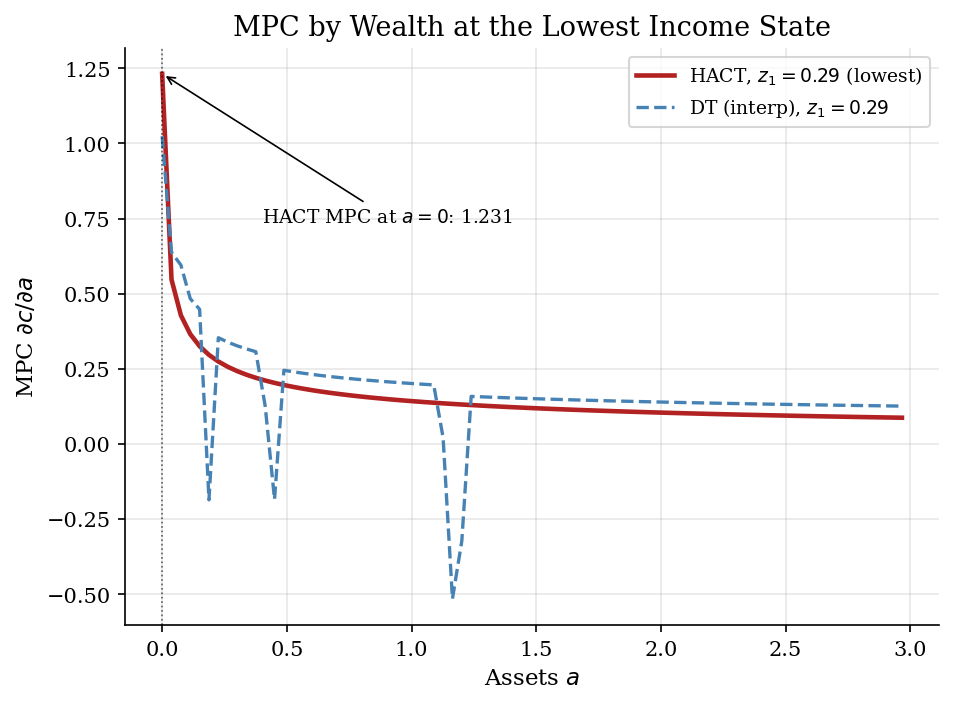

# Continuous-time Aiyagari and the Mean-Field Game

## Overview

This tutorial casts the Aiyagari production economy as a Lasry-Lions mean-field game.
A continuum of ex-ante identical households faces uninsured idiosyncratic labor-income risk and saves through a single asset.
A representative firm rents capital and hires labor from households at competitive prices set in general equilibrium.
The interest rate is the mean field: each household reacts to it as exogenous, and the cross-section of household choices collectively determines it.

The continuous-time formulation makes the mean-field game structure explicit.
Each household's optimal consumption rule solves a Hamilton-Jacobi-Bellman equation parametrised by the field.
The cross-sectional density of households over wealth and income evolves under a Kolmogorov-forward equation driven by the same consumption rule.
The two equations are closed by an aggregation condition that recovers the field from the population's behaviour.
A stationary equilibrium is a fixed point of this coupled system, and the algorithm here is the natural iterative scheme that finds it.

The same three coupled objects are the steady-state block of continuous-time heterogeneous-agent New Keynesian models.
The exposition of the HJB and KFE solvers in this tutorial reuses the upwind discretisation already explained in the Huggett continuous-time tutorial at `heterogeneous-agents/huggett-incomplete-markets/`, and is not re-derived here.
For readers who want the discrete-time formulation as a benchmark, see the Aiyagari tutorial at `dynamic-programming/aiyagari/`.

## Equations

A household is described by two state variables.
The first is the asset level $a \in [\underline a, \bar a]$, where $\underline a$ is the borrowing limit and $\bar a$ is a numerical upper bound chosen so the right tail of the equilibrium density is negligible.
The second is the discrete income state $z_j$ drawn from the grid $\lbrace z_1, \dots, z_N \rbrace$ with $0 < z_1 < \dots < z_N$.
Idiosyncratic labor productivity follows an $N$-state continuous-time Markov chain with generator $Q \in \mathbb{R}^{N \times N}$.
The off-diagonal entry $Q_{jk} \geq 0$ for $j \neq k$ is the Poisson rate at which a household in state $j$ jumps to state $k$, and the diagonal is $Q_{jj} = -\sum_{k \neq j} Q_{jk}$ so that each row of $Q$ sums to zero.
A representative firm with a constant-returns technology produces aggregate output and rents capital and labor at competitive prices.
The firm side reduces to two reduced-form schedules: capital demand $K^{d}(r)$ from the firm first-order condition on capital, and the wage $w(r)$ from the implied capital-output ratio.
The exact functional form of $K^{d}$ and $w$ is the Cobb-Douglas case calibrated in Model Setup; it is not central to what follows.

### Household HJB

Let $V_j(a)$ denote the lifetime value of a household with current assets $a$ in income state $j$.
The household chooses a consumption flow $c \geq 0$ to maximise the expected present value of CRRA utility $u(c) = c^{1 - \sigma} / (1 - \sigma)$ discounted at rate $\rho > 0$.
Cash income arrives at rate $w z_j$ and asset holdings earn $r a$, so the asset state drifts at

$$
\dot a \,=\, s_j(a) \,=\, w z_j + r a - c_j(a),
\qquad a \,\geq\, \underline a .
$$

Standard dynamic-programming arguments produce the Hamilton-Jacobi-Bellman equation with Poisson income switching:

$$
\rho V_j(a) \,=\, \max_{c \,>\, 0}\, \Big\lbrace
\underbrace{u(c)}_{\text{flow utility}}
\,+\, \underbrace{V_j'(a)\, (w z_j + r a - c)}_{\text{drift in } a}
\,+\, \underbrace{\sum_{k} Q_{jk}\, V_k(a)}_{\text{income jump}}
\Big\rbrace .
$$

The interior first-order condition gives the consumption rule by inverting marginal utility at the marginal value of assets:

$$
u'(c_j(a)) \,=\, V_j'(a)
\quad\Longrightarrow\quad
c_j(a) \,=\, [V_j'(a)]^{-1/\sigma} .
$$

The borrowing limit $a \geq \underline a$ is a state constraint enforced via the Kuhn-Tucker condition $s_j(\underline a) \geq 0$, which prevents the unconstrained drift from pushing assets through the floor.
The household HJB therefore depends parametrically on the price $r$ and the implied wage $w(r)$, both of which the household treats as exogenous.

### Stationary KFE and closure

Under the optimal rule $c_j(a)$ and its drift $s_j(a)$, the cross-sectional density $g_j(a)$ of households over wealth and income solves a Kolmogorov-forward equation:

$$
\frac{\partial g_j}{\partial t}(a, t)
\,=\,
-\frac{\partial}{\partial a}\big[s_j(a)\, g_j(a, t)\big]
\,+\, \sum_{k} Q_{kj}\, g_k(a, t) .
$$

The first term is the divergence of the deterministic flux $s_j\, g_j$, and the second term is the net inflow from income switching.
The stationary density solves the time-invariant version with the normalisation $\int (\sum_j g_j)\, da = 1$, and the discretised form is the linear system $\mathbf{A}^{\top} g = 0$ where $\mathbf{A}$ is the same upwind generator that the HJB assembles.
The two equations are therefore dual under one transposition: the same matrix that propagates values backward propagates densities forward, and the same numerical effort discretises both.

The mean field that closes the system is the interest rate $r$.
Each household reacts to $r$ as exogenous through the HJB.
The population's behaviour generates aggregate capital supply

$$
K^{s}(r) \,=\, \int_{\underline a}^{\bar a} a\, \sum_{j} g_j(a; r)\, da ,
$$

where the dependence on $r$ runs through the consumption rule, the drift, and hence the stationary density.
A stationary mean-field-game equilibrium is a price $r^{\ast}$ such that the field is consistent with the aggregate it induces:

$$
K^{s}(r^{\ast}) \,=\, K^{d}(r^{\ast}) .
$$

This single equation closes the HJB-KFE pair, and the triple (HJB at $r^{\ast}$, KFE under the induced drift, closure $K^{s} = K^{d}$) is the Lasry-Lions mean-field game in stationary form.
The remainder of the tutorial computes this fixed point, compares it to the discrete-time Aiyagari solution at the same calibration, and reads off the resulting policies and distributions.

## Model Setup

The calibration matches the discrete-time Aiyagari tutorial so the two solutions can be overlaid directly.
The continuous-time discount rate is set to $\rho = -\log\beta$.
This choice ensures $e^{-\rho} = \beta$ over a one-year horizon, so the two solvers price impatience in the same way.
Income persistence and innovation volatility are kept on the discrete grid because the Rouwenhorst chain has known accuracy properties for $\rho_z$ near unity.

| Object | Value | Role |
|---|---:|---|
| Discount factor $\beta$ | 0.96 | Discrete-time time preference; sets $\rho$ via $\rho = -\log\beta$ |
| Continuous-time discount rate $\rho$ | 0.0408 | Continuous-time time preference |
| Impatience benchmark $1/\beta - 1$ | 0.0417 | Complete-markets ceiling on $r^{\ast}$ |
| CRRA $\sigma$ | 2.0 | Curvature; sets the precautionary motive |
| Capital share $\alpha$ | 0.36 | Cobb-Douglas exponent on $K$ |
| Depreciation $\delta$ | 0.08 | Pins down $K^{d}(r)$ |
| Income persistence $\rho_z$ | 0.9 | AR(1) coefficient on $\log z$ |
| Innovation s.d. $\sigma_\varepsilon$ | 0.2 | AR(1) shock scale |
| Income states $N$ | 7 | Rouwenhorst nodes for $\lbrace z_j \rbrace$ |
| CTMC construction | linear | Generator from discrete $P$ via matrix log, with linear fallback |
| Asset bracket | $[0, 30]$ | $\underline a = 0$ is the no-borrowing limit |
| HACT asset grid $I$ | 800 pts | Uniform on $[\underline a, \bar a]$; HJB upwind scheme |
| DT asset grid | 200 pts | Exponential; denser at $\underline a$ for the VFI reference |
| Implicit HJB step $\Delta$ | 1000 | Large step keeps the implicit update close to a Newton step on $V$ |
| HJB tolerance | 1e-06 | Sup-norm on successive value functions |
| Capital-market tolerance | $5 \times 10^{-4}$ | Relative gap $\lvert K^{s} - K^{d} \rvert / K^{d}$ |

The CTMC generator $Q$ is built from the same Rouwenhorst transition matrix $P$ that the discrete-time solver uses.
The matrix logarithm $Q = \log_m P$ is tried first; this is the exact embedding whenever $P$ is the one-year transition of an underlying continuous-time chain.
If $\log_m P$ returns complex entries or breaks the non-negative off-diagonal structure that a CTMC generator must have, the procedure falls back to the first-order approximation $Q = P - I$.
The fallback is always a valid generator because $P - I$ has non-negative off-diagonals and zero row sums whenever $P$ is a stochastic matrix.
In this run the linear branch was used.

## Solution Method

The mean-field-game fixed point is computed by an iterative scheme on the price $r$ that nests an HJB solve and a KFE solve at each candidate.
At a candidate $r$, the firm side delivers $K^{d}(r)$ and the wage $w(r)$ from the calibrated technology.
The household HJB is then solved by implicit upwind iteration at the prices $(r, w(r))$, and the same upwind generator is transposed to produce the stationary density in one sparse solve.
Aggregate capital supply $K^{s}(r) = \int a \sum_j g_j(a)\, da$ is compared against $K^{d}(r)$, and the bracket on $r$ is updated by bisection until the two match.
The shared upwind generator is what makes the algorithm cheap: the same matrix discretises both the HJB and the KFE, so each pass through the inner loop costs one matrix assembly rather than two separate discretisations.
The construction of that generator and the boundary handling are explained in `heterogeneous-agents/huggett-incomplete-markets/` and are reused here without re-derivation.

### Implicit upwind HJB

Place a uniform asset grid $a_1 < a_2 < \cdots < a_I$ on $[\underline a, \bar a]$ with spacing $\Delta a$, and discretise the HJB by upwind finite differences: at each cell $(a_k, j)$, the marginal value is approximated by the forward or backward difference, depending on the sign of the implied drift, and the borrowing-constraint cell at $a_1 = \underline a$ uses the one-sided difference that respects the state constraint.
The resulting upwind generator on the joint state space is the block matrix

$$
\mathbf A \,=\, \mathrm{diag}(A_{1}, A_{2}, \dots, A_{N})
\,+\, \mathbf{Q} \otimes \mathbf{I}_{I} ,
$$

where each asset block $A_j$ is tridiagonal in $a$ at the current consumption rule and the income-switching block adds the Poisson jumps from $Q$ at every asset level.
The HJB is then advanced by an implicit pseudo-time step,

$$
\big[(1/\Delta + \rho)\, \mathbf I - \mathbf A\big]\, V^{n+1}
\,=\, u(c^{n}) + V^{n} / \Delta ,
$$

which is unconditionally stable because the left-hand matrix is strictly diagonally dominant with positive diagonal.
A large step size $\Delta = 10^{3}$ pushes the update into a Newton-step regime on the fixed-point equation $\rho V - u(c) - \mathbf{A} V = 0$ with the policy frozen, and the inner loop converges in a few dozen iterations.

### KFE by transposing the same generator

When the HJB inner loop converges, the same generator $\mathbf{A}$ at the optimal policy is also the operator that propagates the density forward in time, $\partial g / \partial t = \mathbf{A}^{\top} g$.
The stationary density therefore solves $\mathbf{A}^{\top} g = 0$ with the normalisation $\int (\sum_j g_j)\, da = 1$.
This system is singular because $\mathbf{A}$ has zero row sums; the null space of $\mathbf{A}^{\top}$ is one-dimensional and spanned by the stationary density.
The code pins the scale by replacing one row with the normalisation constraint, solves the resulting non-singular system by sparse LU, and rescales the solution to integrate to one.
The HJB and the KFE share the operator $\mathbf{A}$, so this step is essentially free given the HJB solve.

```text
Algorithm: HACT mean-field-game fixed point
Inputs    asset grid {a_k}, income CTMC (z_j, Q), primitives (rho, sigma, alpha, delta),
          bisection bracket [r_lo, r_hi]
Output    r*, K*, w*, V(a, z), policies c, s, density g(a, z)

repeat (outer iteration on the mean field r)
    r   = 0.5 * (r_lo + r_hi)
    K_d = capital demand from firm FOC at r
    w   = wage at K_d

    # Household HJB at the candidate field
    initialise V_j(a) = u(w z_j + r a) / rho
    repeat
        upwind difference V; build generator A; solve implicit step for V_new
        until max |V_new - V| < eps_HJB

    # KFE from the same generator
    fix one row of A^T to pin scale; solve A^T g = e_fix; renormalise

    # Closure: aggregate supply against firm demand
    K_s = integral a * (sum_j g_j(a)) da
    if |K_s - K_d| / K_d < eps_K: return r, K_d, w, V, c, s, g
    update bracket: K_s > K_d -> r_hi = r; else r_lo = r
```

The HACT inner loop converged in **11 HJB iterations** at the equilibrium price. The final sup-norm change in the value function was $3.91e-07$, well below the tolerance. The outer bisection on $r$ used **11** steps to reach $r^{\ast} = 0.02536$. The relative capital-market gap at this $r^{\ast}$ is $3.54e-04$, which is the numerical residual rather than a model object.

A discrete-time Aiyagari solver runs on the same calibration to produce the side-by-side comparisons in Results; the discrete-time model and its solver are explained in the companion tutorial at `dynamic-programming/aiyagari/`.

## Results

The blue curve is the firm capital-demand schedule $K^{d}(r) = ((r + \delta)/\alpha)^{1/(\alpha - 1)}$, which is analytic and slopes downward in $r$. The red curve is the household capital-supply schedule $K^{s}(r)$ traced by re-solving the HJB and the KFE at nine candidate interest rates. The star marks the HACT equilibrium at $r^{\ast} = 0.0254$ and $K^{\ast} = 6.82$, where the two curves cross. The dotted horizontal line is the complete-markets benchmark $1/\beta - 1 = 0.0417$; the equilibrium return lies about $39\%$ below this benchmark, with the gap measuring the precautionary wedge. The diamond is the discrete-time Aiyagari equilibrium at the same calibration; it falls almost on top of the HACT star, which is the basic calibration check the two methods must pass.



Solid lines are the HACT consumption rule $c_j(a)$ at the equilibrium prices, plotted for the lowest, median, and highest income states. Dashed lines are the discrete-time policy interpolated from its exponential asset grid onto the HACT linear grid. The two methods agree closely over most of the asset range, which is reassuring given that they share calibration and clearing condition. The visible discrepancy is in the slope of $c_j(a)$ in the small-asset region. The HACT lines are smooth functions of $a$ with a kink at $\underline a = 0$ for the constrained income states. The DT lines are piecewise constant in the underlying policy and only become smooth after interpolation, leaving small wiggles that reflect grid discretisation.



The savings drift $s_j(a) = w z_j + r^{\ast} a - c_j(a)$ is the deterministic asset trajectory at the equilibrium prices conditional on staying in income state $j$. The drift is positive for high income states and negative for low income states across most of the asset range. Low-income households therefore dissave from any positive wealth back toward the borrowing limit $\underline a = 0$, where the constraint binds and the drift is exactly zero. High-income households save toward a buffer-stock target where the drift would cross zero from above; the upper bound on the plot is chosen well below that target to keep the small-asset region readable. Income switching at the Poisson intensities encoded in $Q$ moves households across the five drift fields shown, and the stationary density on the next figure is the resulting time-average over these trajectories.



The left panel shows the stationary marginal density over assets $g(a) = \sum_j g_j(a)$ at the equilibrium prices. The red curve is the HACT density on the linear asset grid. The bars are the discrete-time marginal mass binned at uniform width and rescaled by the bin width to produce a comparable density. The two methods agree on the bulk shape of the distribution and on the right tail. Continuous time delivers a smooth density that the discrete-time histogram only approximates, but the cost of that smoothness is the upwind discretisation on a much finer asset grid. The right panel overlays the Lorenz curves implied by the same densities, with the corresponding Gini coefficients in the legend. The two Ginis agree to within $0.011$, which is well below the calibration's own structural uncertainty.



The MPC is defined here as the slope $\partial c_j(a)/\partial a$ of the consumption rule with respect to assets, evaluated at the lowest income state $z_1$. The borrowing constraint binds at $a = 0$ in both methods because $z_1$ is small enough that the household would dissave further if it could. Both methods therefore show a high MPC near the constraint, with the slope decaying as accumulated assets give the household room to smooth consumption. The HACT slope changes continuously and reproduces the kink in the consumption policy at the borrowing limit derived analytically in Achdou-Han-Lasry-Lions-Moll (2022, Section 2). The DT slope is dominated by the policy-grid jumps and shows visible spikes wherever the optimal next-period asset moves from one node to the next. Continuous time gives the exact MPC kink that the discrete-time finite-difference object can only approximate.



Continuous-time bisection converged to the equilibrium return $r^{\ast} = 0.02536$ in 11 steps. The corresponding aggregate capital stock is $K^{\ast} = 6.8203$ and aggregate output is $Y^{\ast} = 1.9960$. The capital-output ratio at the calibration is therefore $K^{\ast}/Y^{\ast} = 3.417$, in the range expected for the standard one-period Aiyagari calibration. The precautionary wedge below the complete-markets benchmark is $1/\beta - 1 - r^{\ast} = 0.0163$, which measures the price reduction that uninsured idiosyncratic risk forces on saving. A fraction $5.4\%$ of households sits within $0.02$ of the borrowing limit, and the stationary wealth Gini is $0.515$. The discrete-time reference run on the same calibration delivers nearly identical numbers, as the side-by-side table below records.

The table reports equilibrium prices, aggregate quantities, distributional moments, and numerical diagnostics for the HACT solution. The bottom block of the table records the HJB inner-loop iteration count, the final sup-norm change in $V$, the outer-bisection iteration count, and the relative capital-market gap at convergence. These last four entries are numerical residuals and should be read as accuracy checks rather than economic objects.

**HACT equilibrium and diagnostics**

| Statistic                                  |      Value |
|:-------------------------------------------|-----------:|
| Interest rate r*                           |  0.025359  |
| Wage w*                                    |  1.2775    |
| Aggregate capital K*                       |  6.8203    |
| Output Y*                                  |  1.996     |
| Capital-output ratio K/Y                   |  3.4169    |
| Precautionary wedge 1/beta - 1 - r*        |  0.01631   |
| Mean wealth E[a]                           |  6.8178    |
| Wealth Gini                                |  0.5146    |
| Mass within 0.02 of borrowing limit        |  0.0541    |
| HACT MPC at borrowing limit, lowest income |  1.2315    |
| HJB iterations at equilibrium              | 11         |
| HJB sup-norm change at equilibrium         |  3.91e-07  |
| Bisection iterations                       | 11         |
| Relative capital-market gap                | -0.0003544 |

The two solvers agree on the headline aggregates to within numerical precision. The interest rate, the aggregate capital stock, and the mean wealth differ across methods by amounts that are dominated by the bisection tolerance and the asset-grid spacing in each solver. The wealth Gini agrees to three decimal places and the mass at the borrowing limit agrees to one percentage point. The only systematic gap is the MPC at the borrowing limit at the lowest income state, where the discrete-time finite-difference object is bounded by the asset-grid spacing on its exponential grid and the HACT object captures the closed-form kink in the consumption policy. This divergence is the headline pedagogical point of the comparison: continuous time delivers the policy slope at the constraint as a finite, computable number rather than as the artifact of a discretisation choice.

**Discrete-time and continuous-time Aiyagari side by side**

| Object                                |    HACT |   Discrete-time |   Absolute gap |
|:--------------------------------------|--------:|----------------:|---------------:|
| Interest rate r*                      | 0.02536 |         0.02596 |         0.0006 |
| Aggregate capital K*                  | 6.8203  |         6.7599  |         0.0603 |
| Mean wealth                           | 6.8178  |         6.7633  |         0.0546 |
| Wealth Gini                           | 0.5146  |         0.526   |         0.0114 |
| Mass at borrowing limit               | 0.0541  |         0.0245  |         0.0296 |
| MPC at borrowing limit, lowest income | 1.2315  |         1.024   |         0.2075 |

## Takeaway

The continuous-time framework turns the Aiyagari fixed point into a coupled HJB-KFE system that requires a small number of sparse linear solves per outer iteration on the price.
The discrete-time and continuous-time solvers agree on the equilibrium interest rate to a few basis points and on aggregate capital to within a fraction of a percent at this calibration.
The visible numerical payoff of working in continuous time is at the borrowing limit, where the HACT consumption rule has a closed-form kink whose slope a finite-grid VFI can only approximate.

The structural payoff is larger and is what makes the continuous-time formulation the modern HA macro standard.
The HJB and the KFE share the same upwind generator, so each step of the equilibrium algorithm costs essentially one matrix assembly rather than two.
The market-clearing condition closes the loop and produces a Lasry-Lions mean-field game on $(a, z)$.
The same steady-state objects reappear unchanged as the long-run block of HACT-style HANK models and as the steady state in sequence-space Jacobian transition methods.
The discrete-time Aiyagari is one point in this larger picture, and the continuous-time formulation is the natural language for the rest of heterogeneous-agent macroeconomics.

## References

- Aiyagari, S. R. (1994). "Uninsured Idiosyncratic Risk and Aggregate Saving." *Quarterly Journal of Economics* 109(3), 659-684.
- Achdou, Y., Han, J., Lasry, J.-M., Lions, P.-L., and Moll, B. (2022). "Income and Wealth Distribution in Macroeconomics: A Continuous-Time Approach." *Review of Economic Studies* 89(1), 45-86.
- Lasry, J.-M., and Lions, P.-L. (2007). "Mean field games." *Japanese Journal of Mathematics* 2(1), 229-260.
- Moll, B. "Lecture notes on continuous-time heterogeneous-agent models." https://benjaminmoll.com/lectures/
