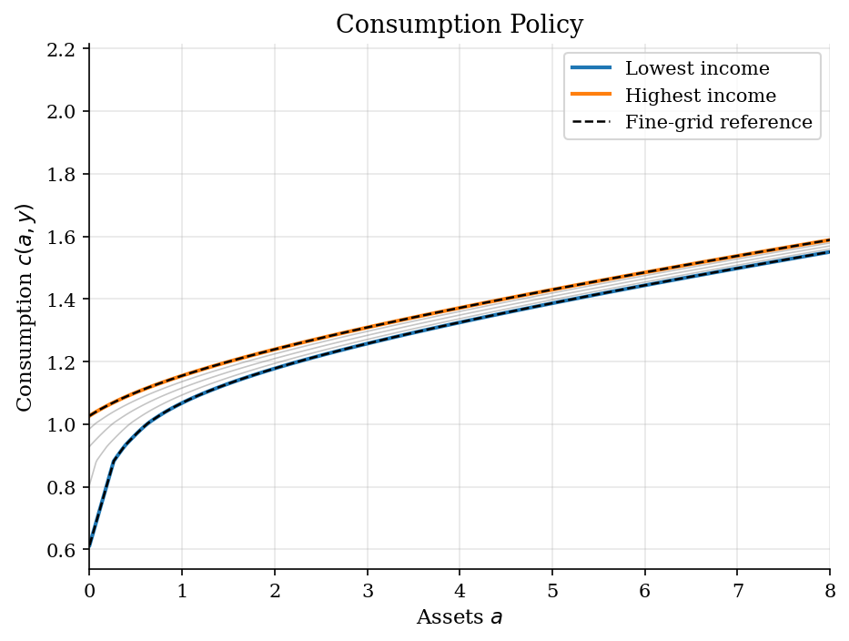
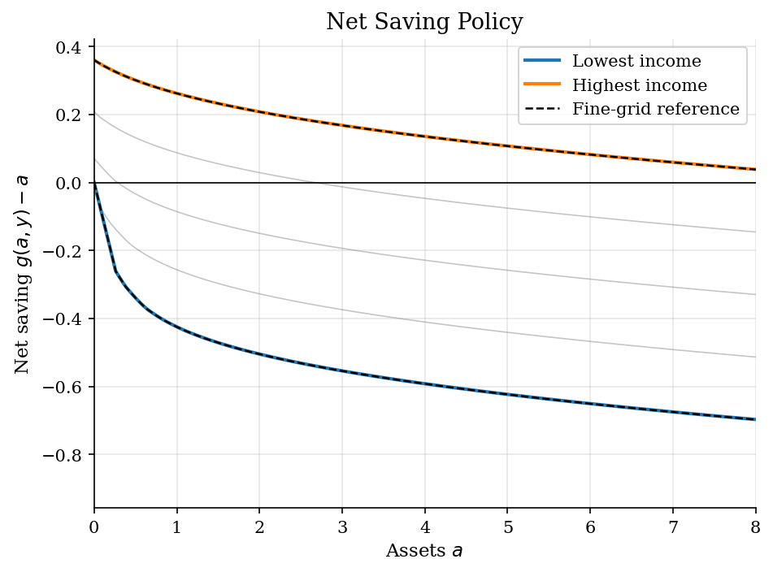
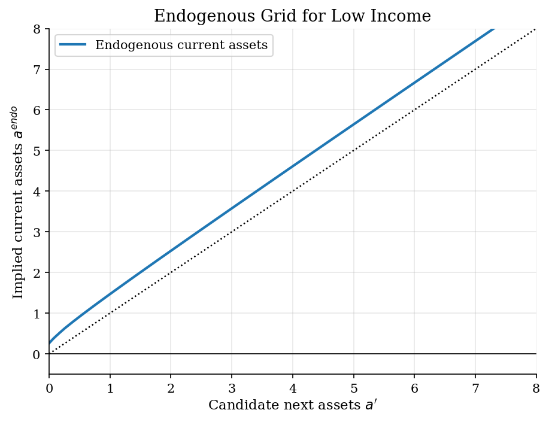
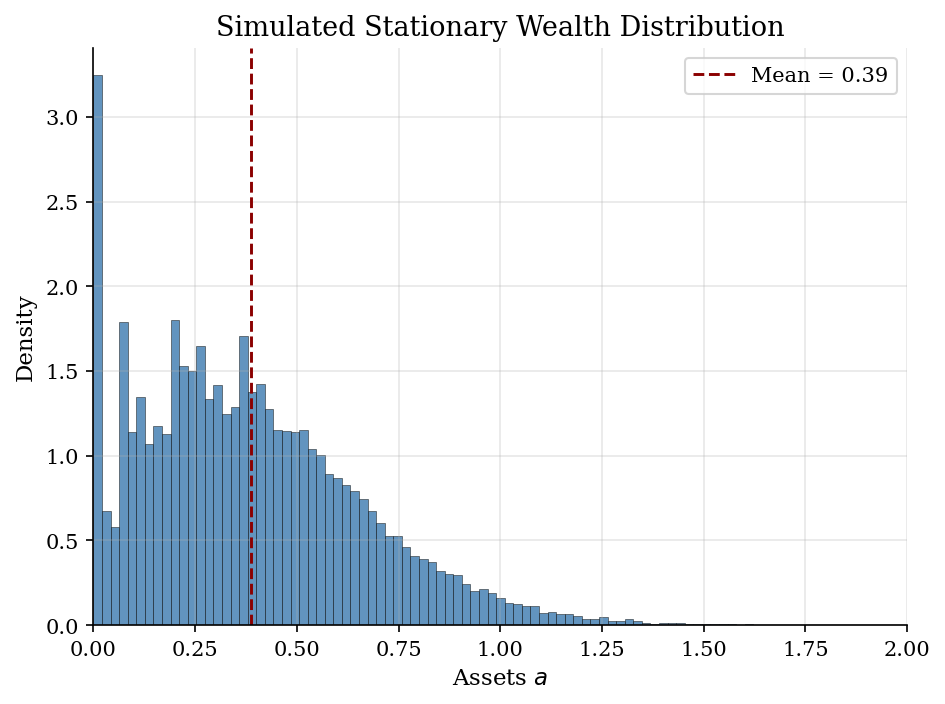
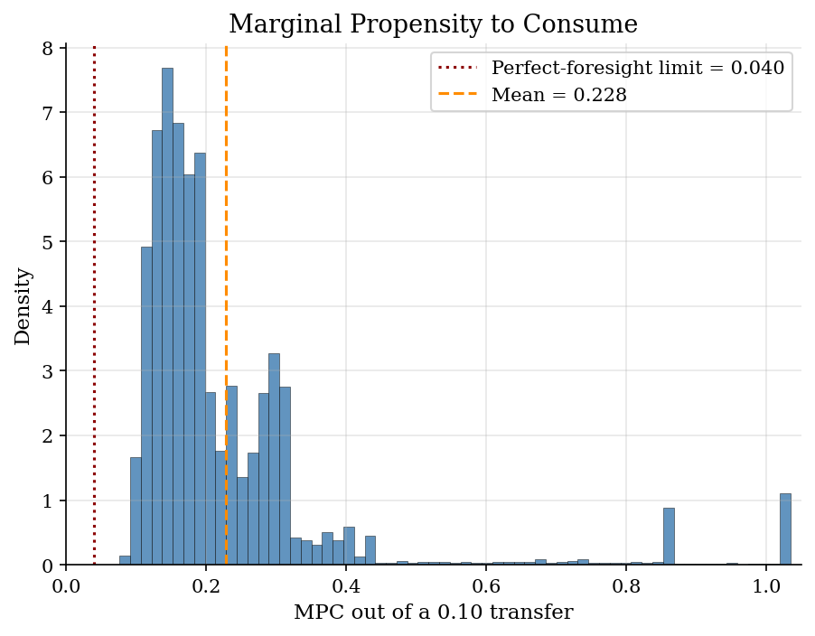

# Buffer-Stock Saving by Endogenous Grid Points

> Euler-equation inversion for a partial-equilibrium income-risk household problem.

## Overview

The economic problem is the buffer-stock saving logic used in [Income Risk and Buffer-Stock Saving](../../dynamic-programming/consumption-savings/), stripped to an IID labor-income benchmark. An impatient household faces uninsurable income risk and cannot borrow below $\underline a=0$. Assets are valuable because they insure consumption against bad future income draws.

This tutorial changes the computation, not the economics. Standard VFI asks, at each current asset level, which next asset choice gives the highest value. Endogenous grid points (EGP) reverse that question. Start from a grid for next-period assets $a'$, use the Euler equation to infer the consumption that would make that choice optimal, and then recover the current asset level that could finance it. The result is the same kind of consumption and saving policy, but without an inner maximization over $a'$.

The neighboring [Envelope-Equation Iteration](../envelope-equation-iteration/) tutorial keeps the same Euler-equation discipline but iterates on marginal value, while the [Huggett equilibrium](../huggett-incomplete-markets/) tutorial moves the incomplete-markets logic into continuous time with market clearing.

## Equations

At the beginning of a period the household has assets $a \in A$ and receives
income $y_j$ from an IID discrete distribution with probabilities $\pi_j$. It
chooses next-period assets $a'=g(a,y_j)$ and consumption $c(a,y_j)$:

$$
V(a,y_j) =
\max_{a' \geq \underline a}
\Bigl[
u(Ra+y_j-a') + \beta \sum_{\ell=1}^{n_y}
\pi_\ell V(a',y_\ell)
\Bigr].
$$

The budget identity is

$$
c(a,y_j) = Ra+y_j-g(a,y_j),
\qquad R=1+r.
$$

Preferences are CRRA, so marginal utility is

$$
u'(c)=c^{-\gamma},
\qquad
(u')^{-1}(\mu)=\mu^{-1/\gamma}.
$$

For an interior next-asset choice, the Euler equation is

$$
u'(c(a,y_j))
=
\beta R
\sum_{\ell=1}^{n_y}
\pi_\ell
u'\!\left(c(g(a,y_j),y_\ell)\right).
$$

At the borrowing limit the Euler equation becomes an inequality:
$u'(c(a,y_j)) \geq \beta R \sum_\ell \pi_\ell u'(c(\underline a,y_\ell))$.
The inequality is the economic reason that constrained households can have
very high MPCs.

## Model Setup

| Parameter | Value | Role |
|---|---:|---|
| $\gamma$ | 2.0 | CRRA risk aversion |
| $\beta$ | 0.95 | Discount factor |
| $r$ | 0.03 | Net risk-free return |
| $\beta R$ | 0.9785 | Patience-return product |
| $\mu_y$ | 1.0 | Mean labor income |
| $\sigma_y$ | 0.2 | Income standard deviation |
| $n_y$ | 5 | IID income states |
| $\underline a$ | 0.0 | Borrowing limit |
| $\bar a$ | 20.0 | Upper asset-grid bound |
| Main asset grid | 120 points | Exponential spacing near the constraint |
| Reference grid | 900 points | Fine-grid EGP policy check |
| Simulation | 50,000 households, 550 periods | Terminal cross section |

## Solution Method

EGP is useful here because the control is next-period assets and the Euler
equation pins down current marginal utility. The algorithm keeps the asset grid
for $a'$ fixed, but the implied current assets are endogenous.

```text
Input: asset grid A for next assets, income states y_j, probabilities pi_j,
       primitives beta, R, gamma, borrowing limit a_min
Initialize c_0(a_i, y_j), for example from consuming current income plus interest
For n = 0, 1, 2, ...:
    For each candidate next asset a_i' in A:
        Compute expected marginal utility
            M_i = sum_j pi_j u'(c_n(a_i', y_j))
        Invert the Euler equation
            c_i = (u')^{-1}(beta R M_i)
    For each current income y_j:
        Map each candidate next asset back to current assets
            a_ij^endo = (c_i + a_i' - y_j) / R
        Interpolate the pairs (a_ij^endo, a_i') onto the exogenous asset grid A
        If an exogenous asset lies below the first endogenous point, set a' = a_min
        Recover c_{n+1}(a,y_j) = R a + y_j - g_{n+1}(a,y_j)
    Stop when max_{a,j} |c_{n+1}(a,y_j) - c_n(a,y_j)| < epsilon
Output: consumption policy c, next-asset policy g
```

The main grid converged in **103 EGP iterations**
with consumption sup-norm error 9.77e-07. A
900-point reference solve gives a maximum consumption-policy gap
of 4.26e-04 over $a \leq 5$; the corresponding
next-asset gap is 4.26e-04. These are grid and interpolation errors,
not a separate economic wedge.

## Results

The consumption policy has the same buffer-stock shape as in the VFI solution. Low-wealth households consume a large share of cash on hand, but the policy is not the deterministic spend-down rule because future income may be bad. The dashed curves are the fine-grid EGP reference for the lowest and highest income states; on the economically relevant range they lie almost on top of the main-grid policy.



Net saving separates income states more sharply. A bad draw pushes the household toward the borrowing limit; a good draw rebuilds the buffer. The zero line should not be read as a single steady state: with IID risk, the household keeps moving across asset states as income draws arrive.



The method itself is visible in the low-income endogenous grid. For each candidate $a'$, the Euler equation delivers consumption, and the budget constraint delivers the current asset level that would rationalize that choice. Current assets below the first endogenous point cannot support the Euler interior solution, so the borrowing constraint supplies the policy there.



The terminal simulated cross section is right-skewed but modest in scale. This is still the IID income benchmark, not a persistent-income Aiyagari distribution. Many households stay close to the constraint, while favorable sequences of draws create the right tail.



MPC heterogeneity is the economic object produced by the policy. Households near the constraint have high MPCs because extra resources relax today's liquidity problem. Wealthier households are closer to the perfect-foresight limiting MPC, 0.041, because a small transfer is mostly saved.



The table combines the simulated stationary cross section with the fine-grid policy check. The high average MPC is an economic result; the small policy gaps are numerical diagnostics for the EGP interpolation.

**Simulation and Accuracy Summary**

| Statistic                            | Value    |
|:-------------------------------------|:---------|
| Mean assets                          | 0.388    |
| Mean consumption                     | 1.012    |
| Wealth Gini                          | 0.389    |
| Average MPC, 0.10 transfer           | 0.228    |
| Average local MPC                    | 0.252    |
| Fraction at borrowing limit          | 5.1%     |
| Consumption gap vs fine grid, a <= 5 | 4.26e-04 |
| Savings gap vs fine grid, a <= 5     | 4.26e-04 |
| Perfect-foresight MPC limit          | 0.0413   |

## Takeaway

EGP is not a different household model. It is a cleaner way to compute the same Euler-equation policy when the control is next-period assets and the constraint is simple. In this income-risk problem, reversing the grid turns the costly VFI search over $a'$ into interpolation from an endogenous current asset grid.

The economics is still buffer-stock economics: bad income draws push households toward the borrowing limit, good draws rebuild assets, and MPCs are high for liquidity-constrained households. The computational gain matters because the same household problem is usually solved repeatedly inside equilibrium or estimation loops.

## References

- Carroll, C. D. (2006). The Method of Endogenous Gridpoints for Solving Dynamic Stochastic Optimization Problems. *Economics Letters*, 91(3), 312-320.
- Deaton, A. (1991). Saving and Liquidity Constraints. *Econometrica*, 59(5), 1221-1248.
- Carroll, C. D. (1997). Buffer-Stock Saving and the Life Cycle/Permanent Income Hypothesis. *Quarterly Journal of Economics*, 112(1), 1-55.
- Kaplan, G. and Violante, G. L. (2022). The Marginal Propensity to Consume in Heterogeneous Agent Models. *Annual Review of Economics*, 14, 747-775.
