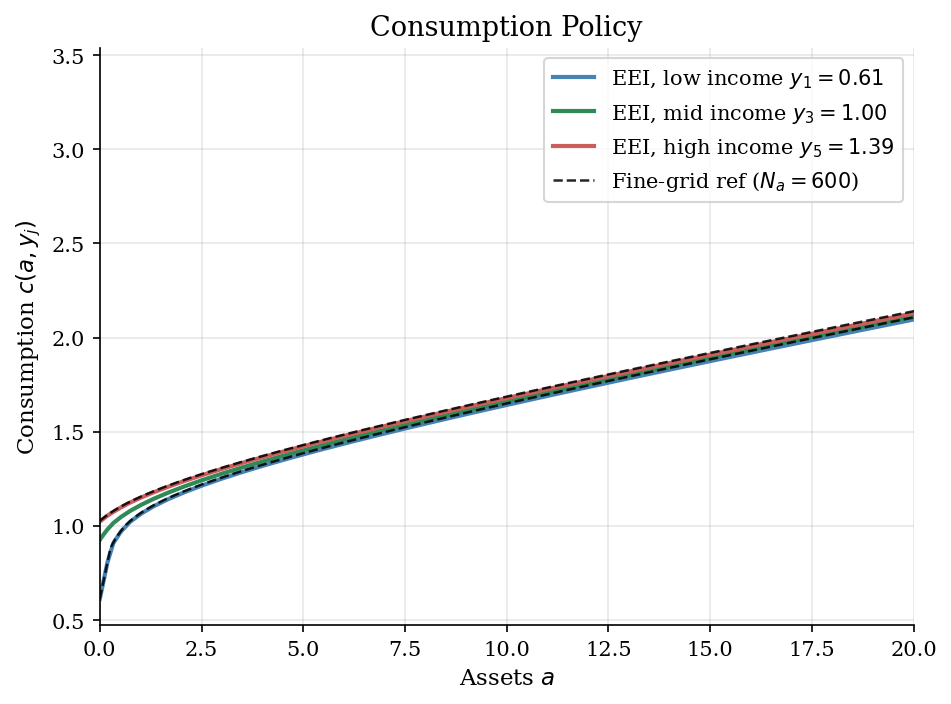
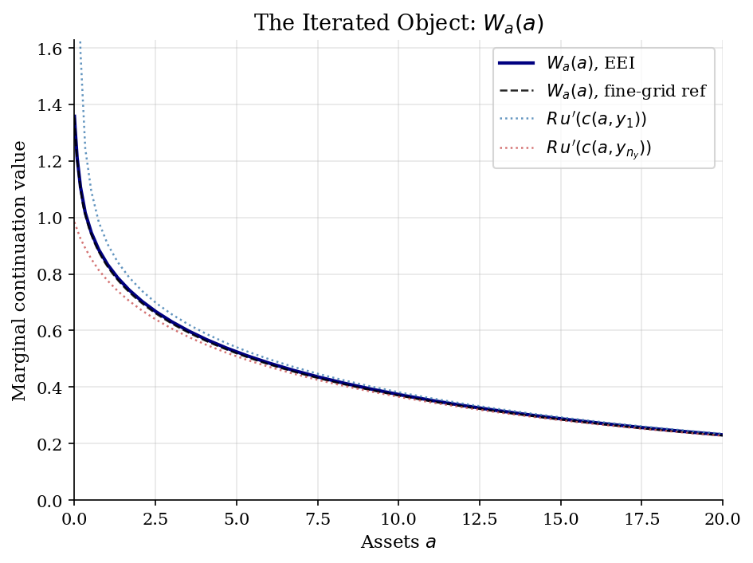
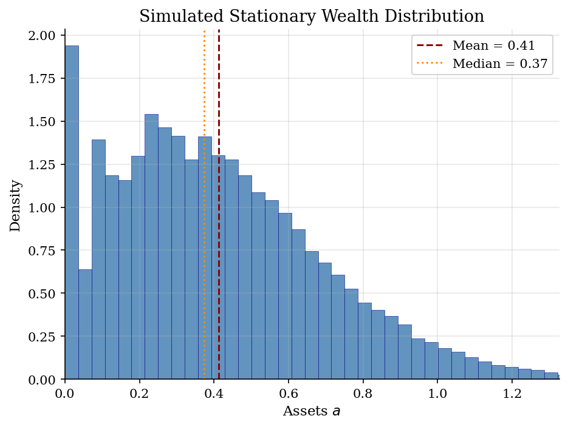
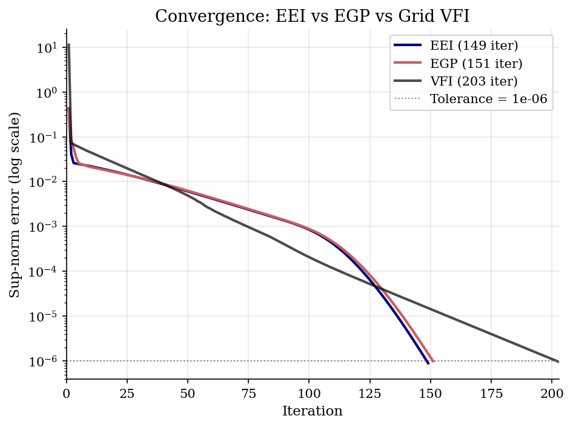

# Envelope-Equation Iteration for Buffer-Stock Saving

> Iterating the marginal continuation value $W_a(a)$ to solve a partial-equilibrium income-risk household problem.

## Overview

An impatient CRRA household faces IID labor income and a hard zero borrowing limit. The economic question is the standard buffer-stock one of Deaton (1991) and Carroll (1997): how much wealth does a household hold purely for self-insurance, and how does the marginal value of that wealth fall as $a$ moves away from the constraint? Three tutorials in this repo solve different versions of the same problem. The [buffer-stock VFI tutorial](../../dynamic-programming/consumption-savings/) iterates on $V(a,y)$ and maximises over $a'$ at every state. The neighbouring [EGP tutorial](../endogenous-grid-points/) fixes the grid in next-period assets and reads $a$ off the budget identity. This tutorial keeps the household problem fixed and changes the iterated object once more.

Envelope-equation iteration (EEI), introduced by Maliar and Maliar (2013), works directly with the marginal continuation value

$$ W_a(a) \;=\; \frac{\partial}{\partial a}\,\mathbb{E}_y\,V(a,y) \;=\; R\,\sum_j \pi_j\,u'\!\bigl(c(a,y_j)\bigr), $$

where the second equality is the Benveniste–Scheinkman envelope condition. EEI alternates two steps. The envelope step maps a consumption policy $c(a,y)$ into the one-dimensional curve $W_a(a)$ by averaging $u'(c)$ across income states. The Euler step then recovers $c(a,y)$ from $u'(c) = \beta\,W_a(R a + y - c)$ at each $(a,y)$. Convergence is in consumption-policy space, just like EGP, and the method inherits the contraction structure of the underlying Bellman operator.

Why look at this fixed point as a separate object? First, it makes explicit that the household policy is governed by a marginal value, not by the value level — so VFI on $V$, EGP on $c$, and EEI on $W_a$ all converge to the same buffer-stock rule. Second, the marginal continuation value $W_a$ is the *only* object that the Euler equation needs from tomorrow's policy. Carrying it explicitly is what makes EEI extend cleanly to problems where Euler inversion is awkward — for example, default and discrete-choice frictions in the original Maliar–Maliar paper, where there is no closed-form $(u')^{-1}$ applied at the right next-asset value to invert.

## Equations

The household enters the period with assets $a$ and observes income $y_j$
drawn IID from $\{y_1,\dots,y_{n_y}\}$ with probabilities $\pi_j$. With gross
return $R = 1+r$, the Bellman equation in pre-decision form is

$$
V(a,y_j) \;=\; \max_{a' \geq \underline a}\,
\Bigl\{\,u\!\bigl(R a + y_j - a'\bigr) \;+\; \beta\,W(a')\,\Bigr\},
\qquad
W(a') \;=\; \sum_{\ell=1}^{n_y}\pi_\ell\,V(a',y_\ell),
$$

with the budget identity $c(a,y_j) = R a + y_j - g(a,y_j)$. Preferences are
CRRA, so

$$
u(c) = \frac{c^{1-\gamma}-1}{1-\gamma},
\qquad
u'(c) = c^{-\gamma},
\qquad
(u')^{-1}(\mu) = \mu^{-1/\gamma}.
$$

At an interior optimum the Euler equation pins down today's marginal utility
at a single object, the marginal continuation value $W_a(a')$:

$$
u'\!\bigl(c(a,y_j)\bigr) \;=\; \beta\,W_a\!\bigl(g(a,y_j)\bigr).
$$

Differentiating the value function under the maximum and applying the
envelope theorem gives

$$
W_a(a) \;=\; \sum_{\ell=1}^{n_y}\pi_\ell\,V_a(a,y_\ell)
\;=\; R\,\sum_{\ell=1}^{n_y}\pi_\ell\,u'\!\bigl(c(a,y_\ell)\bigr).
$$

These two equations close the system without ever using the value level. The
borrowing limit shows up as a Kuhn–Tucker margin: when it binds,
$g(a,y_j) = \underline a$ and the Euler condition holds with strict inequality,

$$
u'\!\bigl(R a + y_j - \underline a\bigr) \;\geq\; \beta\,W_a(\underline a),
$$

which is the slack-constraint mechanism that delivers near-unit MPCs at low
wealth.

## Model Setup

| Object | Value | Role |
|---|---:|---|
| CRRA $\gamma$ | 2.0 | Curvature; sets the precautionary motive and the slope of $W_a$ |
| Discount factor $\beta$ | 0.95 | Annual time preference |
| Net rate $r$ | 0.03 | Exogenous risk-free return |
| Patience–return product $\beta R$ | 0.9785 | $<1$ rules out an unbounded asset target |
| Income mean $\mu_y$ | 1.0 | Normalisation |
| Income s.d. $\sigma_y$ | 0.2 | Width of the IID labor-income shock |
| Income states $n_y$ | 5 | Width-fitted equal-spaced normal grid |
| Borrowing limit $\underline a$ | 0.0 | Hard zero; binds with positive mass |
| Upper grid bound $\bar a$ | 50.0 | Wide enough to contain the simulated tail |
| EEI asset grid | 50 pts | Power-spaced; denser at $\underline a$ |
| Reference asset grid | 600 pts | Audit grid for the EEI policy |
| Convergence tolerance | 1e-06 | Sup-norm on the consumption iterates |
| Simulation | 50,000 households, 500 periods | Forward-iterated cross section |

## Solution Method

**The trade.** VFI updates a value level by maximizing
$u(R a + y_j - a') + \beta\,\mathbb{E}V(a',y')$ over $a'$ at every state,
and pays for a one-dimensional search per grid point per iteration. EGP
sidesteps that search by inverting marginal utility analytically and reading
the implied current asset off the budget identity. EEI sits between the two:
the inner step is still a one-dimensional Euler-equation root, but the object
carried across iterations is the scalar curve $W_a(a)$ rather than the value
$V(a,y)$ or the policy $c(a,y)$. Because $W_a$ collapses the entire
$n_y$-state policy into a single function of $a$, the Euler step only needs
one interpolation per state — the same data structure that EGP uses, applied
on the *exogenous* asset grid rather than an endogenous one.

The Euler step at $(a, y_j)$ solves a scalar root: find $c \in (0,\,Ra + y_j -
\underline a)$ such that

$$
u'(c) \;=\; \beta\,W_a(R a + y_j - c).
$$

Because $u'$ is strictly decreasing in $c$ and $W_a$ is non-increasing in $a'$
(continuation marginal value falls with wealth), the residual is monotone and
bisection converges quadratically in the bracket width. The boundary check
$u'(R a + y_j - \underline a) \geq \beta\,W_a(\underline a)$ catches the
constraint case in closed form, so no root is wasted on the constrained
branch.

```text
Algorithm: EEI for IID-income buffer-stock saving
Inputs    asset grid {a_i}, income chain ({y_j}, {pi_j}),
          primitives (beta, R, gamma), borrowing limit a_min, tolerance eps
Output    consumption policy c(a, y), saving policy g(a, y),
          marginal continuation value W_a(a)

Initialise c_0(a_i, y_j) = (R - 1) a_i + y_j        # consume current resources
repeat n = 0, 1, 2, ...
    # 1. Envelope step: collapse the policy into W_a on the exogenous grid
    W_{a,n}(a_i) = R * sum_l pi_l * u'(c_n(a_i, y_l))

    # 2. Euler step at each (a_i, y_j)
    for each i, j:
        cash = R a_i + y_j
        if u'(cash - a_min) >= beta * W_{a,n}(a_min):
            g_{n+1}(a_i, y_j) = a_min                # constraint binds
            c_{n+1}(a_i, y_j) = cash - a_min
        else:
            # Solve u'(c) - beta * W_{a,n}(cash - c) = 0 by bisection on c.
            c_star = bisect(lambda c: u'(c) - beta * W_{a,n}(cash - c),
                            lo=eps, hi=cash - a_min - eps)
            g_{n+1}(a_i, y_j) = cash - c_star
            c_{n+1}(a_i, y_j) = c_star

    err = max_{i,j} |c_{n+1}(a_i, y_j) - c_n(a_i, y_j)|
until err < eps
```

Two facts about this update help in reading the convergence figure. First,
EEI iterates on consumption *errors* — like EGP — so its sup-norm shrinks at
roughly $\beta$ per step once the constraint set is identified, faster than
the $\beta$-rate contraction of the value level. Second, the bisection inside
the Euler step does $O(\log\varepsilon)$ work per state per iteration, which
is the entire cost premium over EGP at this calibration: EGP avoids that
inner loop because the analytic $(u')^{-1}$ delivers $c$ at each candidate
$a'$ in one operation. The trade-off flips when $(u')^{-1}$ is unavailable
or when the policy has discrete-choice kinks that break monotonicity of the
endogenous-grid map.

**Coarse vs fine grid.** The 50-point EEI solve converged in
**149 iterations** with a sup-norm consumption error below
$10^{-6}$. The same grid took 151 EGP iterations and
203 grid-VFI iterations — the iteration counts compare
fixed-point objects, not optimised library implementations. To audit the
discretisation, the same household problem was rerun by EGP on a
600-point grid; on the active range $a \leq 20$, the
coarse EEI policy lies within 1.09e-02 of the reference in
consumption and 1.09e-02 in next assets. Those gaps are pure grid
and interpolation wedges, not a different economic mechanism.

## Results

The first figure shows the EEI consumption policy at three income states with the fine-grid EGP reference overlaid for the lowest and highest $y_j$. The shape is the standard buffer-stock policy: concave, increasing in $a$, and shifted by income because IID $y_j$ enters cash on hand directly. Near the borrowing limit the slope is close to the 45-degree consume-everything line $c = R a + y_j$, since the constraint is either binding or about to bind; far from $\underline a$ the slope falls toward the perfect-foresight limit $\kappa^{\ast} \approx 0.041$. The dashed reference curves track the coarse EEI lines almost exactly — the maximum gap on $a \leq 20$ is 1.09e-02, which is the discretisation audit.



The second figure shows the actual quantity that EEI iterates on. $W_a(a)$ is steep near the borrowing limit because an extra dollar is most valuable to a household with no buffer; the curve flattens as $a$ grows and the marginal benefit of saving asymptotes to $\beta R \cdot \kappa^\ast$-implied levels. The dotted curves are the state-specific marginal utilities $R\,u'(c(a, y_j))$ at the extreme income states. The envelope condition averages those state-by-state curves with the income probabilities $\pi_j$, which is why $W_a$ sits between them and is closer to the lowest-income line at small $a$ — that is the income state that drives most of the precautionary value of holding wealth.



Forward-iterating the EEI saving policy for 500 periods on 50,000 households gives the cross section in the third figure. The distribution is right-skewed with mean $\bar a = 0.41$ and a non-trivial mass exactly at the constraint (3.1% of agents); the spike at zero is the Kuhn–Tucker margin showing up in the marginal distribution. The scale is modest because income is IID — there is no persistence to amplify good histories — and because $\beta R < 1$ rules out an asset target that drifts to infinity. Replacing IID income with a persistent Rouwenhorst chain and closing the model with capital-market clearing produces the much wider Aiyagari cross section in the [Aiyagari tutorial](../../dynamic-programming/aiyagari/).



The fourth figure compares the three updating equations on the same 50-point asset grid. EEI and EGP both iterate in consumption-policy space and contract at almost identical rates: their error curves overlay because both use the same Euler equation and differ only in how they invert it. Grid VFI iterates on the value level and contracts at the slower $\beta$-rate of the Bellman operator on $V$, which is why it needs more iterations to hit the same tolerance. The plot is meant to read as a comparison of fixed-point objects, not as a wall-clock race — the EEI implementation here uses bisection at every state for transparency, whereas a tuned EGP code avoids that one-dimensional solve entirely.



The table separates economic outputs from numerical diagnostics. The asset distribution and MPC come from simulating the EEI saving policy on the coarse grid; the fine-grid rows compare that policy with a denser EGP reference and bound the discretisation wedge.

**Solution and Simulation Summary**

| Statistic                                | Value    |
|:-----------------------------------------|:---------|
| EEI iterations                           | 149      |
| Same-grid EGP iterations                 | 151      |
| Same-grid VFI iterations                 | 203      |
| Fine-grid reference points               | 600      |
| Fine-grid reference iterations           | 140      |
| Max consumption gap vs reference, a ≤ 20 | 1.09e-02 |
| Max next-asset gap vs reference, a ≤ 20  | 1.09e-02 |
| Mean assets                              | 0.4124   |
| Fraction at borrowing limit              | 3.1%     |
| Mean MPC, 0.10 transfer                  | 0.2197   |
| Perfect-foresight MPC limit              | 0.0413   |
| 10th percentile wealth                   | 0.074    |
| 50th percentile wealth                   | 0.374    |
| 90th percentile wealth                   | 0.799    |

## Takeaway

EEI is not a new household model. It is a different fixed point for the same incomplete-markets problem, defined directly on the marginal continuation value $W_a(a)$ instead of on the value level or on the consumption policy itself. The buffer-stock economics is unchanged: households with little wealth consume nearly all of any extra cash, households far from the constraint smooth toward the perfect-foresight limit $\kappa^{\ast}\approx0.041$, and a non-trivial mass (3.1% in this calibration) sits exactly at the borrowing limit and pulls the average MPC well above the unconstrained benchmark to 0.220.

The computational lesson is the one Maliar and Maliar emphasise: the envelope theorem can be used as an *update rule*, not only as a theorem applied after a value or policy has been solved. Carrying $W_a$ explicitly is what makes EEI extend cleanly to default and discrete-choice settings where Euler inversion via $(u')^{-1}$ is awkward because the policy is non-monotone in cash on hand. On the smooth buffer-stock benchmark used here, EGP is faster — its inner step is an analytic inverse rather than a one-dimensional root — but the three methods agree on the same policy to within 1e-02 on the active asset range, which is exactly the discretisation wedge.

## References

- Maliar, L. and Maliar, S. (2013). Envelope Condition Method with an Application to Default Risk Models. *Journal of Economic Dynamics and Control*, 37(7), 1439-1459.
- Carroll, C. D. (2006). The Method of Endogenous Gridpoints for Solving Dynamic Stochastic Optimization Problems. *Economics Letters*, 91(3), 312-320.
- Deaton, A. (1991). Saving and Liquidity Constraints. *Econometrica*, 59(5), 1221-1248.
- Carroll, C. D. (1997). Buffer-Stock Saving and the Life Cycle/Permanent Income Hypothesis. *Quarterly Journal of Economics*, 112(1), 1-55.
- Ljungqvist, L. and Sargent, T. (2018). *Recursive Macroeconomic Theory*. MIT Press, 4th edition, Ch. 18.
