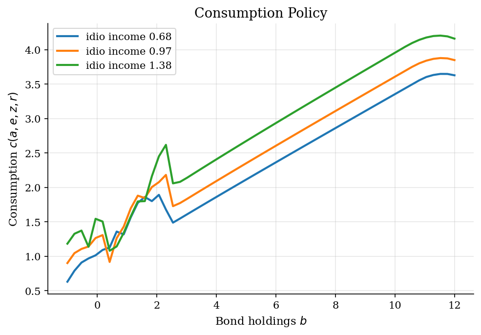
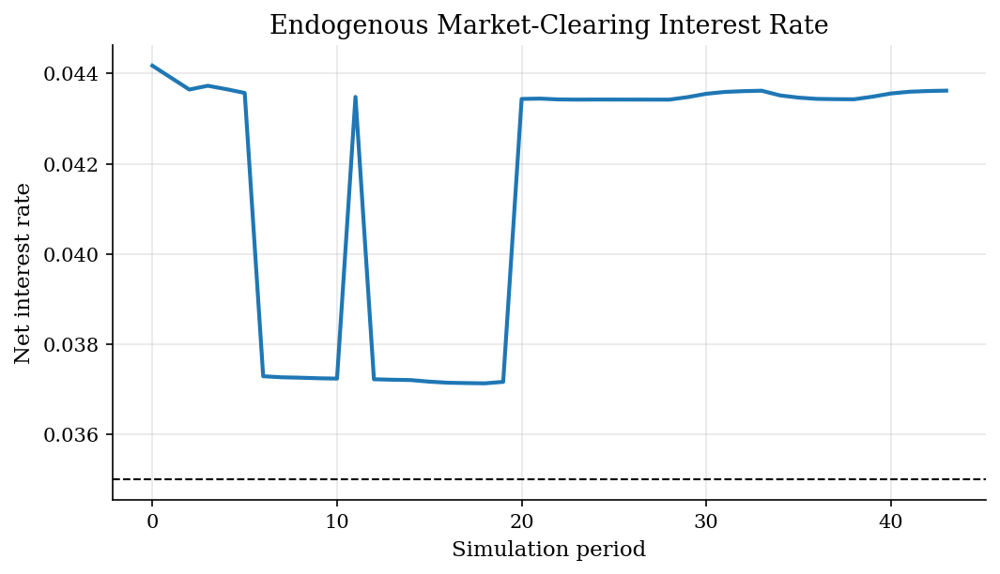
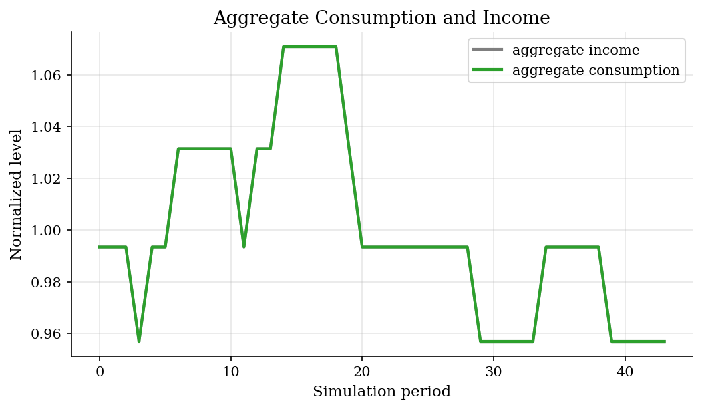
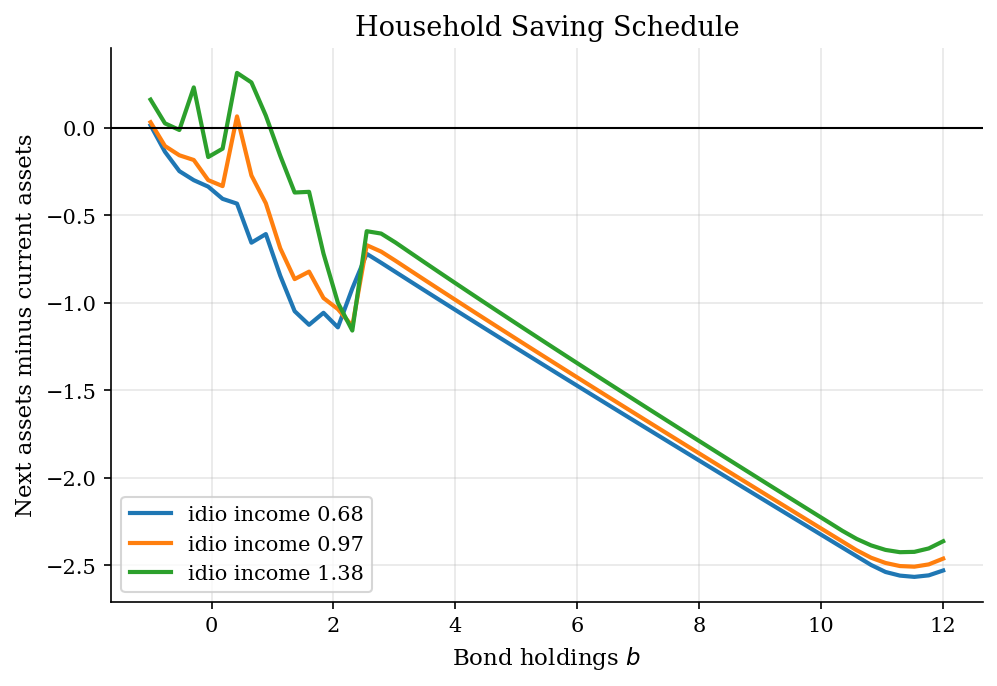
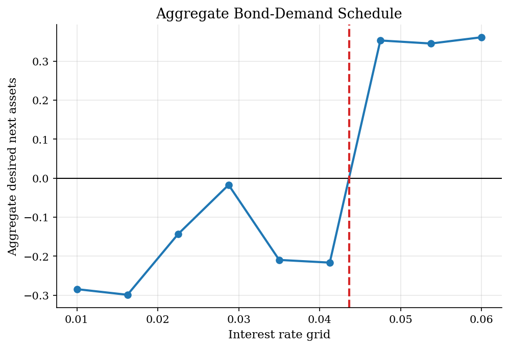
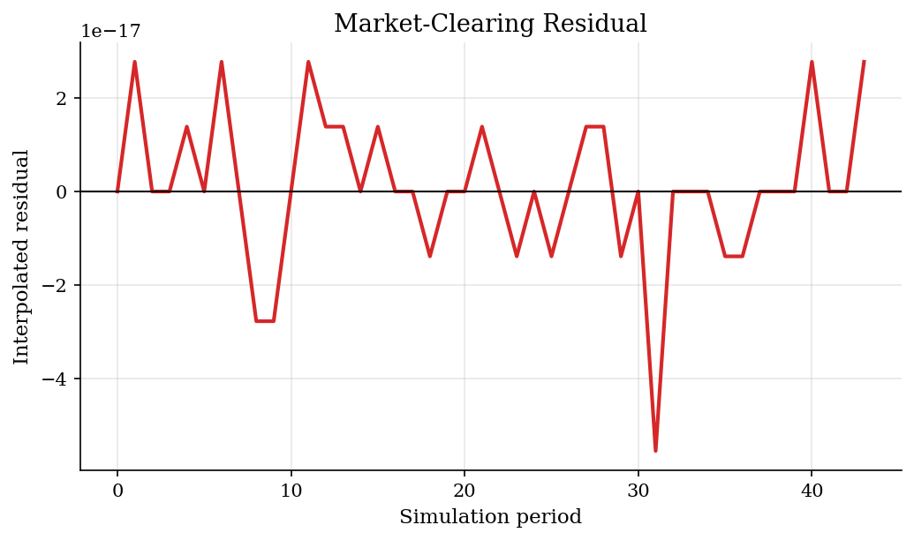
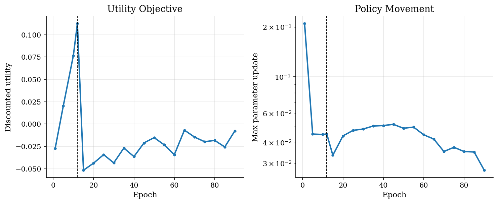
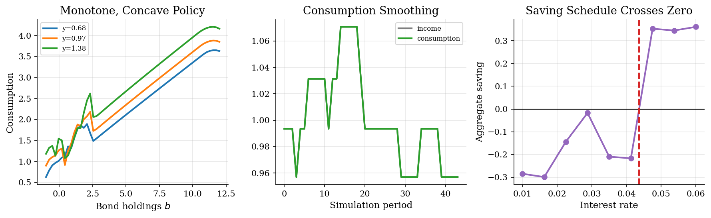

# Structural Reinforcement Learning for Huggett with Aggregate Risk

## Overview

Households live in a one-bond incomplete-markets economy. Each household has bond holdings, faces persistent idiosyncratic income risk, and also lives through aggregate income shocks. Bonds are in zero net supply. In each simulated period the interest rate moves until desired aggregate saving is zero.

Structural Reinforcement Learning (SRL) uses reinforcement learning ideas to solve this equilibrium without putting the full cross-sectional distribution into the household state. Here is what the household knows: its own bond holdings, its own income state, the aggregate income state, and the current interest rate. Here is what it does not observe: the entire distribution of wealth and income across households.

That restriction is the computational trick. The algorithm learns a price-conditioned saving rule from simulated equilibrium paths. It is a restricted-perceptions equilibrium, not a full rational-expectations master-equation solution. The point of the tutorial is to show how the price-conditioned policy and market-clearing step make the aggregate-risk Huggett problem tractable.

This artifact was generated with the `quick` profile. Selection reason: auto selected quick because JAX sees only CPU devices.

## Equations

The household enters period $t$ with bond holdings $b_t \ge \underline b$,
	idiosyncratic income state $y_t$, aggregate income state $z_t$, and net
	interest rate $r_t$. Current resources are

	$$x_t = \exp(z_t)y_t + (1+r_t)b_t.$$

	The tabular policy is a feasible next-asset rule:

	$$b_{t+1} = g_\theta(b_t,y_t,z_t,r_t) \in [\underline b, x_t - c_{\min}].$$

	Consumption and period utility are

	$$c_t = x_t - g_\theta(b_t,y_t,z_t,r_t), \qquad u(c_t) = \frac{c_t^{1-\sigma}-1}{1-\sigma}.$$

	The Structural Reinforcement Learning objective is a Monte Carlo estimate of
	expected lifetime utility:

	$$J(\theta) = \mathbb{E}[\sum_{t=0}^{T-1}\beta^t u(c_t)].$$

	For a candidate interest-rate grid point $r^\ell$, the current distribution
	$\mu_t(b,y)$ implies aggregate desired bond holdings

	$$B_t(r^\ell;\theta) = \sum_{b,y}\mu_t(b,y)g_\theta(b,y,z_t,r^\ell).$$

	Zero net bond supply means $B_t(r_t;\theta)=0$. During training the
	implementation uses a differentiable weighted root over the rate grid:

	$$\omega_t^\ell = \frac{\exp[-(B_t(r^\ell;\theta)/\tau)^2]}{\sum_m \exp[-(B_t(r^m;\theta)/\tau)^2]}, \qquad r_t^{\mathrm{soft}} = \sum_\ell \omega_t^\ell r^\ell.$$

	For the reported equilibrium path, the tutorial uses the paper-style
	interpolated market-clearing rate. If two adjacent grid points bracket zero,
	the rate is

	$$r_t = (1-\lambda_t)r^\ell + \lambda_t r^{\ell+1}, \qquad
	\lambda_t = \frac{-B_t(r^\ell;\theta)}{B_t(r^{\ell+1};\theta)-B_t(r^\ell;\theta)}.$$

	Given a policy and a realized aggregate state, the cross-sectional distribution
is advanced by a non-stochastic histogram update. Each mass point is split
linearly between the two nearest asset-grid points after applying
$g_\theta$, then multiplied by the idiosyncratic transition matrix.

## Model Setup

The calibration follows the published SRL Huggett experiment. The period is a year, $\beta=0.96$, and CRRA curvature is $\sigma=2$. Idiosyncratic log income has persistence 0.6 and innovation volatility 0.2. Aggregate log income has persistence 0.9 and volatility 0.02. The borrowing limit is $\underline b=-1$, and net bond supply is zero. Both income processes are discretized by Rouwenhorst, which preserves persistence accurately at the small state counts used here.

The published benchmark uses 200 bond points up to $b=50$, 3 idiosyncratic income states, 30 aggregate states, and 20 interest-rate points on $[0.01,0.06]$. The lifetime objective is truncated at 170 periods. The structural policy-gradient step uses 512 simulated aggregate paths per update, 50 warm-up epochs, an initial learning rate of $10^{-3}$, exponential learning-rate decay of 0.5, and a convergence threshold of $3\times 10^{-4}$. The hyperparameter table in the Results section lists the active-run values alongside this benchmark.

## Solution Method

The algorithm trains a tabular structural policy rather than solving a Bellman equation with the distribution as a state variable. Here is what the algorithm learns: a saving rule indexed by household states, the aggregate shock, and the current interest rate. Here is how prices clear the market: after the policy is evaluated on every rate-grid point, the aggregate saving schedule is interpolated to find the rate that sets bond demand to zero.

```text
Algorithm: Structural Reinforcement Learning Huggett solve
Input: calibration, bond grid, income grid, aggregate grid, rate grid
Initialize theta so aggregate saving is responsive to the interest rate
for epoch = 1,...,N:
    draw mini-batch of aggregate-income paths
    for each path and period:
        evaluate household next-bond policy on every rate-grid point
        aggregate household choices into a bond-demand schedule
        find the market-clearing interest rate from that schedule
        compute utility and update the distribution by histogram transport
    differentiate the truncated utility objective with respect to theta
    update theta by Adam ascent with exponential learning-rate decay
After training, simulate one path using interpolated market clearing
```

The warm-up phase holds the initial cross section fixed. The adaptive phase updates the distribution implied by the current policy. This separation is the useful SRL decomposition: household dynamics and payoffs are structural, while equilibrium prices are learned from the simulated economy generated by the current policy.

## Results

The figures below follow the objects emphasized in the published SRL Huggett exercise. The consumption policy should rise with bond holdings and flatten out for wealthier households. Aggregate consumption should move with aggregate income but be smoother. The interest rate is endogenous, and the saving schedule should cross zero where the bond market clears.

















Here is how prices clear the market. For each candidate interest rate, the current distribution and the price-conditioned saving rule imply aggregate desired bond holdings. The equilibrium rate is the point where that schedule crosses zero. The diagnostic simulation uses linear interpolation across adjacent rate-grid points, matching the published SRL benchmark's market-clearing logic.

The economic calibration follows the SRL Huggett experiment.

**Huggett calibration**

| Parameter                            |   Value | Symbol   |
|:-------------------------------------|--------:|:---------|
| Discount factor                      |   0.96  | beta     |
| CRRA coefficient                     |   2     | gamma    |
| Idiosyncratic log-income persistence |   0.6   | rho_e    |
| Idiosyncratic log-income volatility  |   0.2   | sigma_e  |
| Aggregate log-income persistence     |   0.9   | rho_z    |
| Aggregate log-income volatility      |   0.02  | sigma_z  |
| Borrowing limit                      |  -1     | a_min    |
| Net bond supply                      |   0     | B        |
| Minimum consumption                  |   0.001 | c_min    |

These are the Huggett settings reported in the published SRL appendix and used by this tutorial run.

**Published SRL grid and training settings**

| Parameter                 |   Published SRL benchmark |   Tutorial setting |
|:--------------------------|--------------------------:|-------------------:|
| Asset grid points         |                  200      |            56      |
| Asset upper bound         |                   50      |            12      |
| Idiosyncratic states      |                    3      |             3      |
| Aggregate states          |                   30      |             7      |
| Interest-rate grid points |                   20      |             9      |
| Interest-rate lower bound |                    0.01   |             0.01   |
| Interest-rate upper bound |                    0.06   |             0.06   |
| Truncation horizon        |                  170      |            44      |
| Maximum parameter updates |                 1000      |            90      |
| Warm-up epochs            |                   50      |            12      |
| Batch size                |                  512      |            14      |
| Initial learning rate     |                    0.001  |             0.045  |
| Learning-rate decay       |                    0.5    |             0.55   |
| Convergence threshold     |                    0.0003 |             0.0001 |
| Diagnostic horizon        |                  170      |            44      |

Soft residuals are the differentiable training residuals. Hard residuals come from the post-training grid-clearing simulation.

**Training and market-clearing diagnostics**

| Diagnostic                                                    | Value       |
|:--------------------------------------------------------------|:------------|
| Converged by policy movement criterion                        | No          |
| Epochs completed                                              | 90          |
| Final parameter movement                                      | 0.0272527   |
| Convergence threshold                                         | 0.0003      |
| Final normalized utility objective                            | -0.0237778  |
| Mean soft market residual during training                     | 0.101114    |
| Mean interpolated market-clearing residual                    | 9.77753e-18 |
| Maximum interpolated market-clearing residual                 | 5.55112e-17 |
| Share of periods with a bracketing root                       | 1.000       |
| Mean equilibrium interest rate                                | 0.041674    |
| Interest-rate standard deviation                              | 0.00289853  |
| Mean aggregate consumption                                    | 1.04502     |
| Aggregate consumption volatility divided by income volatility | 1           |

The benchmark is the paper's Huggett aggregate-risk experiment, not an exact master-equation solution. The checks compare calibration, grid settings, convergence, market clearing, and the qualitative objects shown in the paper figures.

**Published SRL benchmark comparison**

| Benchmark item             | Published SRL benchmark                                                                                                                                                      | Tutorial run                                                                                             | Assessment   |
|:---------------------------|:-----------------------------------------------------------------------------------------------------------------------------------------------------------------------------|:---------------------------------------------------------------------------------------------------------|:-------------|
| Calibration                | beta=0.96, sigma=2, rho_y=0.6, nu_y=0.2, rho_z=0.9, nu_z=0.02, B=0, borrowing limit=-1                                                                                       | Uses the same Huggett calibration and c_min=1e-3                                                         | Matched      |
| Grid and training settings | 200 bond points, b_max=50, 3 income states, 30 aggregate states, 20 rate points on [0.01, 0.06], T=170, 1000 epochs, 50 warm-up epochs, lr_ini=1e-3, lr_decay=0.5, batch=512 | Uses the same grid, horizon, learning-rate schedule, and batch size                                      | Matched      |
| Convergence status         | Average convergence at 480.6 epochs over 10 runs                                                                                                                             | Did not converge after 90 epochs; final movement 0.0273                                                  | Not met      |
| Market-clearing residual   | Average bond-market clearing gap about 4.4e-6                                                                                                                                | Mean absolute residual 9.78e-18; maximum 5.55e-17; bracketing share 1.000                                | Matched      |
| Qualitative figure match   | monotone and concave consumption, smoother aggregate consumption than income, endogenous interest rates, saving schedule crossing zero                                       | monotone share 0.897; concave share 0.852; C/Y volatility ratio 1.000; saving schedule crosses zero: yes | Mixed        |

## Takeaway

Structural Reinforcement Learning turns the aggregate-risk Huggett problem into a simulation-based policy optimization problem with prices as low-dimensional state variables. The tutorial reproduces the paper benchmark's calibration and grid settings, then checks the same economic objects: concave consumption, endogenous prices, smoother aggregate consumption, and a near-zero market-clearing residual. In this run, the maximum interpolated bond-market residual is 5.551e-17.

## References

- [Yang, Y., Wang, C., Schaab, A., and Moll, B. (2025). Structural Reinforcement Learning for Heterogeneous Agent Macroeconomics. arXiv:2512.18892.](https://arxiv.org/html/2512.18892v1)
- [Huggett, M. (1993). The risk-free rate in heterogeneous-agent incomplete-insurance economies. *Journal of Economic Dynamics and Control*, 17(5-6), 953-969.](https://doi.org/10.1016/0165-1889%2893%2990024-M)
