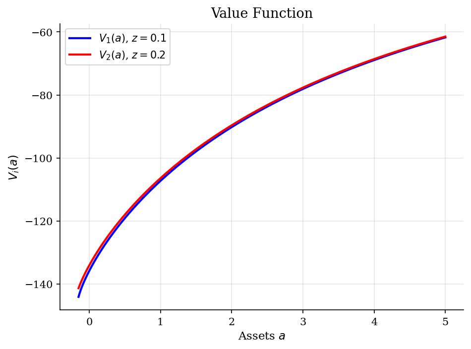
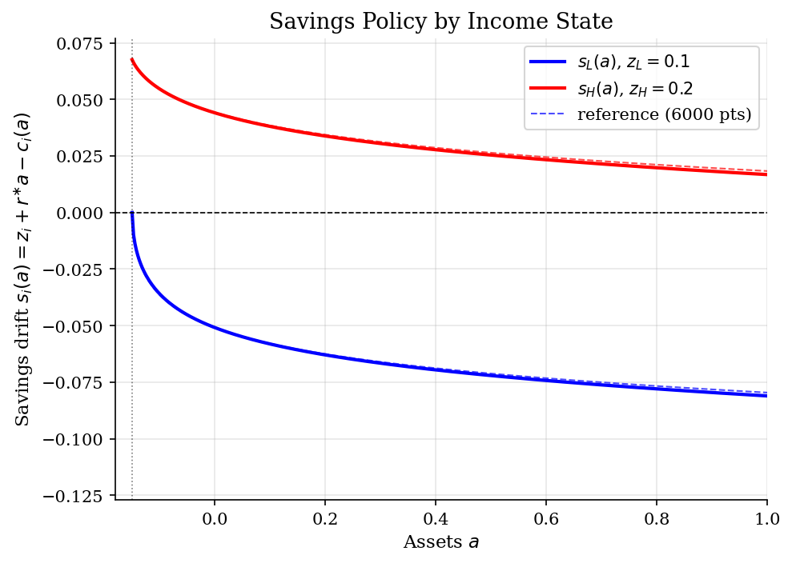
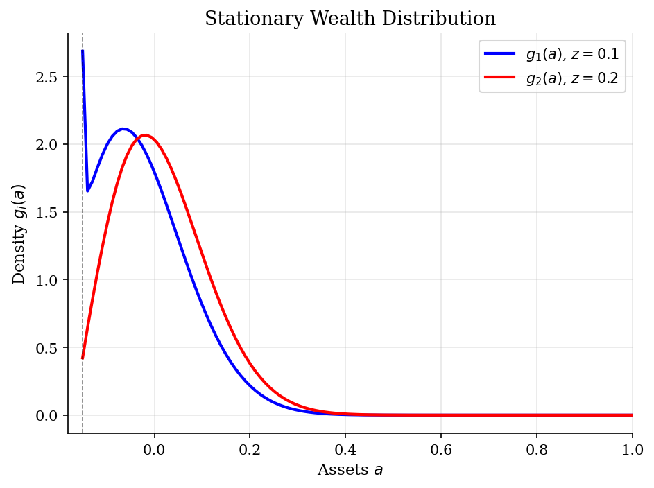
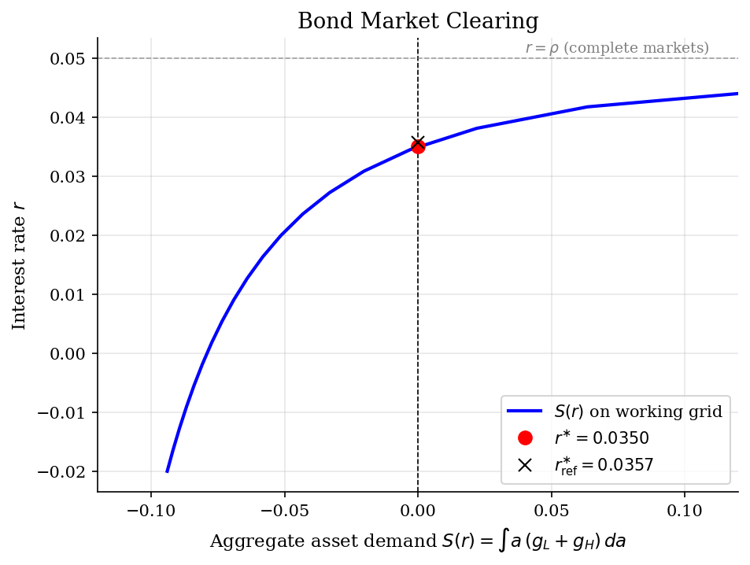

# Huggett Equilibrium and the Risk-Free Rate

## Overview

Households receive stochastic income and trade one risk-free bond. They can borrow only
down to $a \geq \underline a$. Since the bond is in zero net supply, aggregate asset
demand must equal zero.

The object is the equilibrium return $r^{\ast}$. It is the rate that makes stationary
bond demand $S(r^{\ast})$ equal zero. With incomplete insurance, households want buffer
wealth at $r = \rho$. Market clearing therefore requires $r^{\ast} < \rho$.

The computation links household policy to the cross section. The HJB gives consumption
and savings drift at a candidate $r$. The KFE turns that drift into a stationary density.
Bisection updates $r$ until aggregate bond demand clears.

## Equations

A household in income state $i \in \lbrace L, H \rbrace$ receives endowment
$z_i$ as a flow per unit time. Income jumps from state $i$ to the other state
$j$ at Poisson intensity $\lambda_i$, so the expected duration in state $i$ is
$1/\lambda_i$. Assets $a$ accumulate continuously between jumps according to

$$
\dot a \,=\, s_i(a) \,=\, z_i + r\, a - c_i(a),
\qquad a \,\geq\, \underline a ,
$$

where $r$ is the equilibrium return on the bond, $c_i(a)$ is the consumption
policy in state $i$, and $\underline a$ is the borrowing limit. Period utility
is CRRA: $u(c) = c^{1-\sigma}/(1-\sigma)$ for $\sigma \ne 1$.

### Deriving the HJB with Poisson income switching

Let $V_i(a)$ be the household's value when assets are $a$ and income state is
$i$. Over a small interval of length $\Delta t$, with probability
$1 - \lambda_i\, \Delta t + o(\Delta t)$ the income state stays at $i$ and
assets drift by $\dot a\, \Delta t$. With probability
$\lambda_i\, \Delta t + o(\Delta t)$ the income state jumps to $j$ at the start
of the interval and the household enters next period with the same assets but
the new value function $V_j$. The discrete-time Bellman is

$$
V_i(a) \,=\, \max_{c \,\geq\, 0} \Big\lbrace
u(c)  \Delta t \,+\, e^{-\rho\, \Delta t} 
\big[(1 - \lambda_i\, \Delta t)  V_i(a + \dot a\, \Delta t)
\,+\, \lambda_i\, \Delta t\, V_j(a)\big] \Big\rbrace
\,+\, o(\Delta t) .
$$

Expand $e^{-\rho \Delta t} = 1 - \rho\, \Delta t + o(\Delta t)$ and
$V_i(a + \dot a\, \Delta t) = V_i(a) + V_i'(a)  \dot a\, \Delta t +
o(\Delta t)$. Subtract $V_i(a)$, divide by $\Delta t$, and take
$\Delta t \to 0$. The cross terms $\rho\, \Delta t \cdot \lambda_i$ and
$\rho\, \Delta t \cdot V_i'(a)  \dot a$ are $o(\Delta t)$ and drop out. The
result is the **HJB equation with Poisson switching**

$$
\rho\, V_i(a) \,=\, \max_{c \,>\, 0}  \Big\lbrace
\underbrace{u(c)}_{\text{flow utility}}
\,+\, \underbrace{V_i'(a)  (z_i + r\, a - c)}_{\text{drift in } a}
\,+\, \underbrace{\lambda_i\, (V_j(a) - V_i(a))}_{\text{income jump}}
\Big\rbrace .
$$

This is one continuous-state HJB per income state, coupled by the jump term.
The first two pieces are exactly the Ramsey-style HJB (flow utility plus
shadow value times drift). The third piece is new: it is the rate
$\lambda_i$ of leaving the current income state times the value gain
$V_j(a) - V_i(a)$ from arriving in the other one.

### First-order condition

The maximand depends on $c$ through $u(c) - V_i'(a)  c$, so the interior
first-order condition equates marginal utility to the marginal value of
assets,

$$
u'(c_i(a)) \,=\, V_i'(a)
\quad\Longrightarrow\quad
c_i(a) \,=\, [V_i'(a)]^{-1/\sigma} ,
$$

and the implied savings drift is

$$
s_i(a) \,=\, z_i + r\, a - c_i(a) .
$$

The marginal value $V_i'(a)$ is the **shadow price** of one extra unit of
assets in state $i$ and serves the same role here as $V'(k)$ in the Ramsey
HJB.

### The borrowing limit as a state constraint

The borrowing limit $a \geq \underline a$ is a state constraint, not a budget
constraint. It binds whenever the unconstrained drift would push assets
through the floor. The Kuhn-Tucker condition is

$$
s_i(\underline a) \,\geq\, 0
\quad\Longleftrightarrow\quad
V_i'(\underline a) \,\geq\, u'(z_i + r\, \underline a) ,
$$

with equality when the constraint is slack and strict inequality (a kink in
$V_i'$) when the household would prefer to dissave further. The numerical
scheme enforces this by computing the implied unconstrained drift at
$a = \underline a$ and clipping consumption to $z_i + r\, \underline a$ when
the drift would be negative.

### The Kolmogorov forward equation

Once the household policy is known, the cross-section of households evolves
as a deterministic transport along the drift, plus stochastic switching
between income states. Let $g_i(a, t)$ be the time-$t$ density of households
in state $i$ at asset level $a$. Mass conservation requires the density to
satisfy a continuity equation: the rate of change of mass in any region
equals the inflow at the left boundary minus the outflow at the right
boundary, plus the income-switching gain or loss. In differential form,

$$
\frac{\partial g_i}{\partial t}(a, t)
\,=\,
-\frac{\partial}{\partial a}\big[s_i(a)  g_i(a, t)\big]
\,-\, \lambda_i\, g_i(a, t)
\,+\, \lambda_j\, g_j(a, t) .
$$

The first term is the divergence of the deterministic flux $s_i\, g_i$ along
the asset axis. The second term removes mass from state $i$ at the leaving
rate $\lambda_i$. The third term adds mass arriving from state $j$ at rate
$\lambda_j$. The stationary density satisfies

$$
0 \,=\, -\frac{\partial}{\partial a}\big[s_i(a)  g_i(a)\big]
\,-\, \lambda_i\, g_i(a) \,+\, \lambda_j\, g_j(a),
\qquad \int_{\underline a}^{\bar a} \big[g_L(a) + g_H(a)\big]  da \,=\, 1 .
$$

Discretised on the same asset grid as the HJB, this becomes
$\mathbf{A}^{\top} g \,=\, 0$, where $\mathbf{A}$ is the upwind generator
used to solve the HJB and $g$ is the joint density across grid points and
income states. The HJB and KFE are dual under one transposition: the same
matrix encodes both the operator that propagates values backward and the
operator that propagates densities forward.

### Equilibrium return

The single bond is in zero net supply. The bond market clears when the
average asset holding integrates to zero,

$$
S(r) \,\equiv\, \int_{\underline a}^{\bar a} a\, [g_L(a) + g_H(a)]  da \,=\, 0 .
$$

The equilibrium return $r^{\ast}$ is the root of $S(r)$. With incomplete
insurance, households want a buffer at $r = \rho$ (so $S(\rho) > 0$), and
they want to borrow at very low $r$ (so $S(r) < 0$ for small $r$). The
bisection on $r$ finds the wedge $r^{\ast} < \rho$ that closes the bond
market. In this run,
$r^{\ast} = 0.03499$ and the residual is $5.43e-06$.

## Model Setup

The calibration keeps only the ingredients needed for Huggett pricing. There are two
income states, symmetric switching, one bond, and a borrowing limit.

| Object | Value | Role |
|---|---:|---|
| Discount rate $\rho$ | 0.05 | Continuous-time time preference; complete-markets benchmark for $r$ |
| CRRA $\sigma$ | 2.0 | Curvature; sets the precautionary motive and Euler curvature |
| Income endowments $(z_L, z_H)$ | (0.1, 0.2) | Two-state Poisson chain with stationary mean $\bar z = 0.1500$ |
| Switching intensities $(\lambda_L, \lambda_H)$ | (1.2, 1.2) | Symmetric jumps; expected duration in each state $1/\lambda_i \approx 0.83$ |
| Borrowing limit $\underline a$ | -0.15 | Hard lower bound; chosen so $z_L + r\underline a > 0$ at the equilibrium $r$ |
| Upper bound $\bar a$ | 5.0 | Set wide enough that the right tail of $g_i$ is numerically zero |
| Working asset grid | 2000 pts | Uniform on $[\underline a, \bar a]$; HJB upwind scheme |
| Reference asset grid | 6000 pts | Audit solve at the same calibration; defines the discretisation gap |
| Implicit step $\Delta$ | 1000 | Large step keeps the implicit HJB update close to a Newton step on $V$ |
| HJB tolerance | 1e-06 | Sup-norm on successive value functions |
| Bisection tolerance | $10^{-5}$ | On the bond-market residual $\lvert S(r)\rvert$ |

The symmetric income chain implies $p_L = p_H = 0.5$. Expected income is
$\bar z = 0.1500$. The KFE solution recovers
$|p_L - 0.5| = 1.11e-16$.

## Solution Method

The equilibrium is found by three nested loops. The outer loop bisects on the
return $r$. For each candidate $r$, the middle loop solves the HJB by an
implicit upwind iteration, then solves the KFE for the stationary density,
then evaluates the bond-market residual $S(r)$. Each piece below is the
Achdou-Han-Lasry-Lions-Moll method specialised to two income states.

### Upwind discretisation of the HJB

Place a uniform grid $a_1 < a_2 < \cdots < a_I$ on $[\underline a, \bar a]$
with spacing $\Delta a$. At each pair $(a_k, i)$ the solver computes the
forward and backward asset slopes

$$
D^{+}_{k, i} V \,=\, \frac{V_i(a_{k+1}) - V_i(a_k)}{\Delta a},
\qquad
D^{-}_{k, i} V \,=\, \frac{V_i(a_k) - V_i(a_{k-1})}{\Delta a},
$$

and the candidate consumptions $c^{+}_{k, i} = (D^{+}_{k, i} V)^{-1/\sigma}$
and $c^{-}_{k, i} = (D^{-}_{k, i} V)^{-1/\sigma}$. The implied drifts are
$s^{+}_{k, i} = z_i + r\, a_k - c^{+}_{k, i}$ and $s^{-}_{k, i}$ analogously.
The upwind rule keeps the side whose drift points away from the grid point:
forward when $s^{+}_{k, i} > 0$, backward when $s^{-}_{k, i} < 0$, and the
zero-drift consumption $c^{0}_{k, i} = z_i + r\, a_k$ otherwise. A central
difference would mix the two sides with equal weight and produce oscillating
iterates because information in the HJB flows in the direction of the drift.

At the borrowing limit $a_1 = \underline a$ the backward difference is
undefined, so the algorithm uses the forward difference and additionally
enforces the state constraint by clipping consumption to
$z_i + r\, \underline a$ when the implied forward drift is negative. At the
upper end $a_I = \bar a$ the forward difference is undefined, so the
algorithm uses the backward difference; the upper bound is set wide enough
that no probability mass sits there in equilibrium.

### The upwind generator

Once the upwind drifts are picked at every grid point, define $s^{+}_{k, i}
\equiv \max(s_{k, i}, 0)$ and $s^{-}_{k, i} \equiv \min(s_{k, i}, 0)$. The
asset block of the upwind generator is tridiagonal: at row $(k, i)$ the
super-diagonal entry is $s^{+}_{k, i}/\Delta a$, the sub-diagonal entry is
$-s^{-}_{k, i}/\Delta a$, and the diagonal entry is the negative of their sum.
Stacking both income states gives a $2I \times 2I$ block-tridiagonal generator
$\mathbf{A}^{n}$,

$$
\mathbf{A}^{n} \,=\, \mathrm{diag}(A_{L}^{n},  A_{H}^{n})
\,+\,
\begin{pmatrix} -\lambda_L\, \mathbf{I} & \lambda_L\, \mathbf{I} \\
\lambda_H\, \mathbf{I} & -\lambda_H\, \mathbf{I} \end{pmatrix} ,
$$

where $A_i^{n}$ is the upwind asset-drift block for income state $i$ at the
current consumption policy and the off-block matrices encode income
switching. The matrix has zero row sums (it is a CTMC generator) and
non-positive diagonal.

### Implicit pseudo-time step

An explicit update $V^{n+1} = V^n + \Delta\, (u(c^n) + \mathbf{A}^{n} V^n -
\rho V^n)$ is unstable for moderate $\Delta$ because the upwind transition
rates $|s_{k, i}|/\Delta a$ can be large on fine grids. The implicit version
replaces $\mathbf{A}^{n} V^n$ with $\mathbf{A}^{n} V^{n+1}$ and rearranges to

$$
[(1/\Delta + \rho)  \mathbf{I} - \mathbf{A}^{n}]  V^{n+1}
\,=\, u(c^{n}) + V^{n} / \Delta .
$$

The matrix on the left is strictly diagonally dominant with positive
diagonal (because $\mathbf{A}^{n}$ has zero row sums and non-positive
diagonal), so the system is unconditionally invertible regardless of
$\Delta$. Taking $\Delta \to \infty$ recovers a Newton step on
$\rho V - u(c) - \mathbf{A} V = 0$ with the policy frozen, which is why the
HJB inner loop converges in a handful of iterations rather than the hundreds
that an explicit value iteration would need.

### KFE by transposing the same generator

When the HJB inner loop converges, the upwind generator $\mathbf{A}^{\ast}$ at
the equilibrium policy is exactly the operator whose transpose pushes the
density forward in time:

$$
\frac{\partial g}{\partial t} \,=\, \mathbf{A}^{\top}  g .
$$

The stationary density solves $\mathbf{A}^{\top} g = 0$, a singular system
because $\mathbf{A}$ has zero row sums (so $\mathbf{A}^{\top}$ has a zero
right-singular vector). The code pins down the scale by replacing one row
with a normalisation constraint, solving the resulting non-singular system
by sparse LU, and rescaling so that $\int (g_L + g_H)  da = 1$. The same
matrix that solved the HJB therefore solves the KFE; this **operator
duality** is the elegance of the continuous-time framework.

### Outer bisection on $r$

Bond demand $S(r) \,=\, \int a\, (g_L + g_H)  da$ is monotone increasing in
$r$ at this calibration: a higher return makes saving more attractive
($s_i(a)$ rises by $a$ for all $a > 0$) and borrowing more painful, so the
density shifts rightward on the asset axis. Since $S(\rho) > 0$ (the
precautionary motive at $r = \rho$ pulls households toward positive assets)
and $S(r) < 0$ for $r$ small enough that low-income borrowers would max out
at $\underline a$, bisection finds a unique $r^{\ast} \in (0, \rho)$ with
$S(r^{\ast}) = 0$.

```text
Algorithm: Huggett equilibrium by HJB-KFE bisection
Inputs    asset grid {a_k}, income states (z_L, z_H), Poisson rates (lambda_L, lambda_H),
          primitives (rho, sigma, a_min), bisection bracket [r_lo, r_hi]
Output    equilibrium r*, value V_i(a), policies c_i(a), s_i(a), density g_i(a)

repeat (outer bisection)
    r = 0.5 * (r_lo + r_hi)

    # Inner HJB by implicit upwind finite differences
    initialise V_i(a) = u(z_i + r a) / rho                         # myopic guess
    repeat
        for each (a_k, i):
            dVf = (V_i(a_{k+1}) - V_i(a_k)) / da                   # forward
            dVb = (V_i(a_k) - V_i(a_{k-1})) / da                   # backward
            cf  = (dVf)^(-1/sigma);   sf = z_i + r a_k - cf
            cb  = (dVb)^(-1/sigma);   sb = z_i + r a_k - cb
            if   sf > 0: c_i(a_k) = cf;            drift = sf      # upwind forward
            elif sb < 0: c_i(a_k) = cb;            drift = sb      # upwind backward
            else        : c_i(a_k) = z_i + r a_k;  drift = 0       # local steady state

        build A from upwind drifts plus income-switching block
        solve [(1/Delta + rho) I - A] V_new = u(c) + V / Delta     # implicit step
        if max|V_new - V| < eps_HJB: break
        V <- V_new

    # KFE for the stationary distribution
    fix one row of A^T to pin scale; solve A^T g = e_fix; renormalise so int g = 1

    # Bond-market excess demand
    S(r) = sum_k a_k * (g_L(a_k) + g_H(a_k)) * da
    if |S(r)| < eps_S: return r, V, c, s, g
    if S(r) > 0: r_hi = r              # too much saving; lower r
    else       : r_lo = r              # too much borrowing; raise r
```

**Working solve.** The HJB inner loop converged in **9 iterations**. The final sup-norm change was $7.91e-07$. Bisection found $r^{\ast} = 0.03499$ on the 2000-point grid. The bond-market residual is $5.43e-06$.

**Reference solve.** The reference grid repeats the solve with $I_{\rm ref} = 6000$ points. It gives $r^{\ast}_{\rm ref} = 0.03572$. The interest-rate gap is $7.30e-04$. On $a \in [\underline a, 1]$, the savings-policy gap is $1.57e-03$ in sup norm.

## Results

The value functions are increasing and concave in assets. $V_H(a)$ lies above $V_L(a)$ because high income raises cash on hand. Both curves steepen near the borrowing limit. The relative value gap against the reference grid is $0.155\%$.



The savings policy is the asset drift at $r^{\ast}$. Low-income households decumulate above the borrowing limit. High-income households save near the limit to rebuild buffer wealth. Income switching moves households between the two drift fields. The reference gap is $1.57e-03$ in sup norm on $[\underline a, 1]$.



The KFE turns drift into a cross-sectional density. Low-income mass piles near the borrowing limit because negative drift pushes left. High-income density is flatter because positive drift moves households right. The population share within $0.02$ of the limit is $5.8\%$.



The demand curve plots aggregate asset demand against $r$. Higher returns raise saving and reduce borrowing, so $S(r)$ rises with $r$. The complete-markets benchmark is $r = \rho$. The Huggett equilibrium is lower, at $r^{\ast} = 0.03499$. The precautionary wedge is $\rho - r^{\ast} = 0.01501$.



The table reports prices, cross-sectional moments, and discretisation diagnostics. The mean-wealth and bond-market-residual rows report the same quantity: bisection drives $|S(r^{\ast})|$ down to the small residual shown, so mean assets are zero up to that bisection tolerance rather than exactly zero.

**Equilibrium and Discretisation Summary**

| Statistic                             | Value    |
|:--------------------------------------|:---------|
| Discount rate rho                     | 0.0500   |
| Equilibrium r* (working grid)         | 0.03499  |
| Equilibrium r* (reference grid)       | 0.03572  |
| Precautionary wedge rho - r*          | 0.01501  |
| Mean wealth E[a]                      | 5.43e-06 |
| Mean income E[z]                      | 0.1500   |
| Mean consumption E[c]                 | 0.1500   |
| Mass within 0.02 of borrowing limit   | 0.0581   |
| Prob(z = z_low)                       | 0.5000   |
| Prob(z = z_high)                      | 0.5000   |
| Bond-market residual abs(S(r*))       | 5.43e-06 |
| r* gap, working vs reference          | 7.30e-04 |
| Sup-norm savings gap, a in [a_min, 1] | 1.57e-03 |
| Sup-norm value gap, a in [a_min, 1]   | 2.23e-01 |
| Relative value gap (% of value scale) | 0.155%   |
| HJB iterations (working)              | 9        |
| HJB sup-norm change (working)         | 7.91e-07 |

## Takeaway

The Huggett price is a market-clearing return. Income risk and the borrowing limit make
households want buffer wealth at $r = \rho$. The bond market clears only at a lower
return. In this run the wedge is $\rho - r^{\ast} = 0.01501$.

The HJB/KFE loop ties the household policy to the stationary cross section. The upwind
HJB respects the borrowing limit. The KFE then measures aggregate asset demand. Bisection
on $r$ closes the zero-net-supply bond market.

## References

- Huggett, M. (1993). "The risk-free rate in heterogeneous-agent incomplete-insurance economies." *Journal of Economic Dynamics and Control* 17(5-6), 953-969.
- Achdou, Y., Han, J., Lasry, J.-M., Lions, P.-L., and Moll, B. (2022). "Income and Wealth Distribution in Macroeconomics: A Continuous-Time Approach." *Review of Economic Studies* 89(1), 45-86.
- Moll, B. "Lecture notes on continuous-time heterogeneous-agent models." https://benjaminmoll.com/lectures/
- **See also.** The continuous-time Aiyagari extension in [`heterogeneous-agents/aiyagari-hact/`](../../heterogeneous-agents/aiyagari-hact/) reuses the upwind HJB and KFE solver developed here, then adds production, mean-field game equilibrium, and a discrete-time benchmark.
