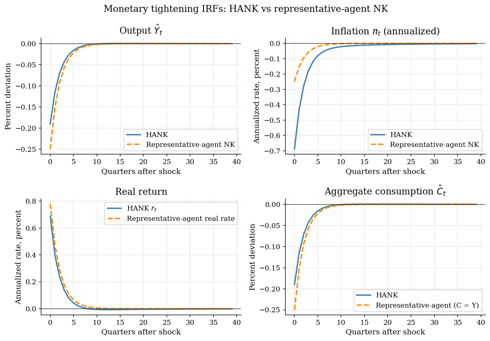
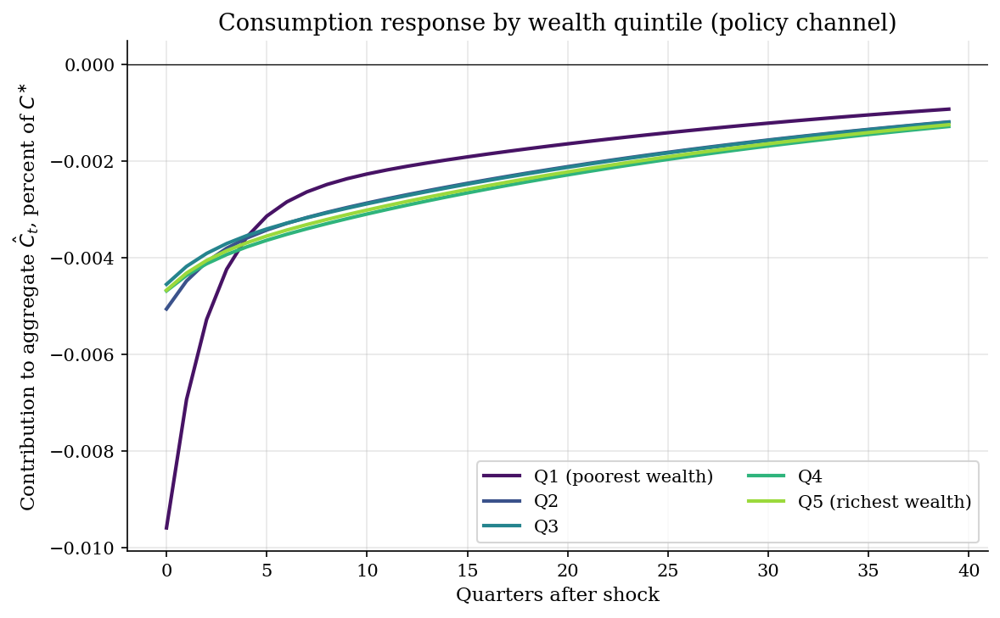
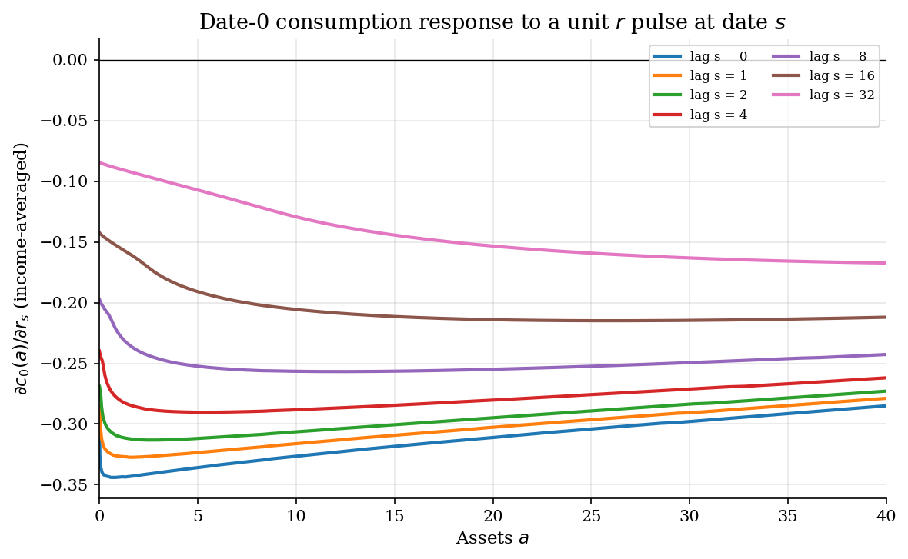
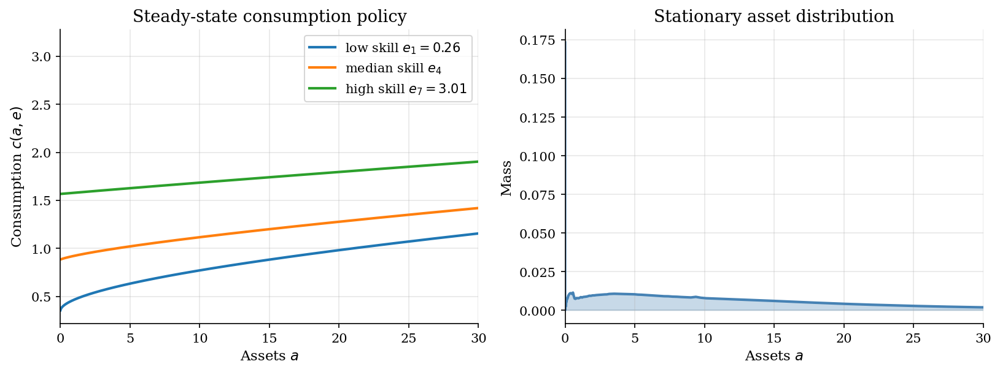

# Sequence-Space Jacobian for One-Asset HANK

## Overview

A HANK economy maps the path of a monetary policy shock into paths of output, inflation, the real interest rate, and the cross section of consumption. Solving for those paths requires propagating the shock through the household block, the firm block, the New Keynesian Phillips curve, and the monetary rule simultaneously.

Sequence-space Jacobians make that propagation tractable. Each block is linearized around the steady state and represented by a matrix that maps a sequence of inputs into a sequence of outputs. The aggregate impulse response is then the solution of a single linear system whose blocks compose like Lego pieces.

This tutorial follows the canonical one-asset HANK setup from Auclert, Bardóczy, Rognlie, and Straub (2021). Households save in bonds, supply labor elastically, and receive firm dividends as a skill-proportional transfer. The steady-state household block reuses ideas from the discrete-time Aiyagari tutorial [`dynamic-programming/aiyagari/`](../../dynamic-programming/aiyagari/) and the endogenous-grid-point inversion in [`heterogeneous-agents/endogenous-grid-points/`](../endogenous-grid-points/), extended to elastic labor via a joint endogenous-grid step over consumption and hours. The figure overlays a representative-agent New Keynesian benchmark, the same three-equation NK model solved in [`dsge/nkdsge/`](../../dsge/nkdsge/), so the reader can read off the contribution of heterogeneity to monetary transmission.

## Equations

**Household problem.** Each household has assets $a \geq 0$ and idiosyncratic
skill $e$ on a finite grid with transition matrix $P(e' \mid e)$. With
consumption $c$, hours $n$, real return $r_t$, real wage $w_t$, and a per-skill
transfer $e \cdot T_t$ (skill-proportional rebate of firm dividends net of
taxes), the budget constraint and the intra- and inter-temporal first-order
conditions are

$$
c_t + a_{t+1} = (1 + r_t)\, a_t + w_t\, e\, n_t + e\, T_t, \qquad a_{t+1} \geq 0,
$$

$$
v_{\varphi}\, n_t^{1/\varphi} = w_t\, e\, c_t^{-1/\eta},
\qquad
c_t^{-1/\eta} = \beta\, \mathbb{E}_t\lbrack (1 + r_{t+1})\, c_{t+1}^{-1/\eta} \rbrack,
$$

where $\eta$ is the elasticity of intertemporal substitution and $\varphi$ is
the Frisch elasticity of labor supply.

**Firm block.** A representative final-good firm produces $Y_t = Z_t\, L_t$
from labor with constant returns. Labor demand $L_t = Y_t / Z_t$ follows from
the production function. Real marginal cost and firm profits are

$$
mc_t = w_t / Z_t,
\qquad
\mathrm{Div}_t = Y_t - w_t\, L_t = Y_t\, (1 - mc_t).
$$

Monopolistic intermediate firms set prices subject to Rotemberg adjustment
costs. To first order in deviations from the zero-inflation steady state
$mc^{\ast} = 1 / \mu^{\ast}$, the New Keynesian Phillips curve is

$$
\pi_t = \frac{1}{1 + r^{\ast}}\, \pi_{t+1} + \kappa\, (mc_t - 1/\mu^{\ast}),
$$

where the discount factor $1/(1 + r^{\ast})$ comes from real-rate discounting
of next-period price-setting profits (the exact Rotemberg first-order form
matches the canonical sequence-jacobian notebook).

**Monetary and fiscal blocks.** The central bank sets the nominal rate one
period in advance via a Taylor rule on lagged inflation, with $i^{\ast}_t$ a
shock to the rate target. The current real return is the predetermined
nominal rate deflated by current inflation:

$$
i^{\ast}_t = i^{\ast} + v_t,
\qquad
1 + r_t = (1 + i^{\ast}_{t-1} + \phi_{\pi}\, \pi_{t-1}) / (1 + \pi_t).
$$

Government debt $B$ is constant and the fiscal block balances the budget with
a lump-sum tax $\mathrm{Tax}_t = r_t\, B$. The per-skill transfer is

$$
T_t = \mathrm{Div}_t - \mathrm{Tax}_t = Y_t\,(1 - w_t / Z_t) - r_t\, B.
$$

**Sequence-space equilibrium map.** Stack T periods of unknowns
$U = (\pi, w, Y)$ and shocks $Z = v$. Three target equations -- NKPC residual,
asset-market clearing $A_t = B$, and goods-market clearing $Y_t = C_t$ -- close
the system; the labor market then clears by Walras' law. Linearizing,
$H_U\, \mathrm{d}U + H_Z\, \mathrm{d}Z = 0$, so
$\mathrm{d}U = -H_U^{-1} H_Z\, \mathrm{d}Z$.

**Household-block Jacobian.** Nine matrices of shape $(T, T)$ collect the
partial derivatives of the three household aggregates with respect to the
three inputs,

$$
J^{Y, x}_{t, s} = \frac{\partial Y_t}{\partial x_s}, \qquad
Y \in \lbrace C, A, N^E \rbrace, \quad x \in \lbrace r, w, T \rbrace,
$$

where $N^E_t = \int e\, n_t(a, e)\, \mathrm{d}\mu_t$ is aggregate effective
labor supply. Building these matrices via the fake-news algorithm is the
algorithmic content of SSJ.

## Model Setup

**Parameters.** Quarterly calibration matched to the canonical
sequence-space HANK notebook of Auclert et al. (2021).

| Object | Symbol | Value | Role |
|---|---|---:|---|
| Elasticity of intertemporal substitution | $\eta$ | 0.50 | Relative risk aversion $= 1/\eta = 2$ |
| Frisch elasticity | $\varphi$ | 0.50 | Labor-supply curvature |
| Discount factor | $\beta$ | 0.9822 | Calibrated so $A^\ast = B$ |
| Labor disutility | $v_{\varphi}$ | 0.7862 | Calibrated so $N^E_{\ast} = 1$ |
| Markup | $\mu^{\ast}$ | 1.20 | 20 percent steady-state markup |
| TFP | $Z$ | 1.00 | Normalized |
| NKPC slope | $\kappa$ | 0.10 | On real marginal cost |
| Taylor inflation | $\phi_{\pi}$ | 1.50 | |
| Shock persistence | $\rho_v$ | 0.61 | AR(1) on monetary innovation |
| Skill persistence | $\rho_e$ | 0.966 | AR(1) on log skill |
| Skill innovation std | $\sigma_e$ | 0.50 | Unconditional std target |
| Government debt | $B$ | 5.6 | Bond supply, household wealth target |
| Skill grid | $n_e$ | 7 | Rouwenhorst |
| Asset grid | $n_a$ | 200 | Exponential on $[0.0, 150.0]$ |
| Sequence horizon | $T$ | 300 | Quarters |
| Monetary shock | $\varepsilon_0$ | 0.00250 | 100 bp annualized tightening |

**Steady-state values.** Real return $r^\ast = 0.0050$
quarterly (~2.0 percent annual). Output $Y^\ast =
1.000$, real wage $w^\ast = 0.8333$, profits $\mathrm{Div}^\ast =
0.1667$, fiscal transfer $T^\ast = 0.1387$. Aggregate
consumption $C^\ast = 1.0000$, asset holdings $A^\ast = 5.6000$
clear the bond market against $B = 5.6$, and effective labor supply
$N^E_{\ast} = 1.0000$ matches steady-state labor demand.

## Solution Method

The block decomposition makes the problem tractable. The household block is
the heavy piece because its inputs and outputs are sequences of aggregates.

**Steady-state household block.** Endogenous grid points solve the joint
$(c, n)$ policy by FOC inversion, with a Newton subsolver for the borrowing-
constrained region. The stationary distribution follows from forward-iterating
the Young (2010) lottery on the saving policy. A joint Broyden iteration on
$(\beta, v_{\varphi})$ matches the asset target $A^{\ast} = B$ and the
labor-supply target $N^E_{\ast} = 1$.

**Fake-news household Jacobian.** Each Jacobian column $J^{Y, x}_{:, s}$ is
the path of aggregate $Y$ in response to a unit pulse to input $x$ at date $s$.
The fake-news algorithm builds the anticipation curves once via backward
iteration of EGM and then convolves them with the time-varying input path
during a forward distribution sweep:

```text
Algorithm: fake-news household-block Jacobian
Inputs    steady-state Va_bar, policies c_bar, n_bar, a'_bar; distribution
          D_bar; horizon T; input x in {r, w, T}
Output    J^{C, x}[t, s], J^{A, x}[t, s], J^{NE, x}[t, s] for t, s = 0..T-1

# Step 1: one-shot perturbation, O(|state|)
out0 = egm_step(Va_bar, x = x_bar + eps, other inputs at steady state)
(dc[0], dn[0], da[0], dVa[0]) = (out0 - bar) / eps

# Step 2: backward anticipation, O(T |state|)
for k = 1..T-1:
    out = egm_step(Va_bar + eps dVa[k-1], all inputs at steady state)
    (dc[k], dn[k], da[k], dVa[k]) = (out - bar) / eps

# Step 3: forward distribution propagation, O(T |state|) per pulse date
for s = 0..T-1:
    delta_D <- 0
    for t = 0..T-1:
        (dc_t, dn_t, da_t) = (dc[s - t], dn[s - t], da[s - t]) if t <= s else 0
        J^{C, x}[t, s]  = <dc_t, D_bar> + <c_bar, delta_D>
        J^{A, x}[t, s]  = <da_t, D_bar> + <a'_bar, delta_D>
        J^{NE, x}[t, s] = <e dn_t, D_bar> + <e n_bar, delta_D>
        delta_D <- bar Lambda delta_D + Tau(da_t) D_bar
```

The two-step structure mirrors Auclert, Bardóczy, Rognlie, and Straub (2021):
anticipation curves are translation-invariant, so they are computed once and
then convolved with the time-varying input path during the forward sweep.
The full SSJ library uses an additional Toeplitz trick that drops the overall
cost to $O(T\,|state|)$; the algorithm above is the simplest version that
still gives the correct Jacobians.

**Firm, NKPC, fiscal, and monetary blocks.** All four are closed-form
$T \times T$ matrices once we substitute $L = Y / Z$ and impose the budget
identities. The aggregate system has unknowns $U = (\pi, w, Y)$ stacked over
$T$ periods and three targets per period (NKPC, asset-market, goods-market
clearing). The labor market then clears by Walras' law. The resulting
$3 T \times 3 T$ system is solved by a single dense linear solve.

**Convergence.** The household EGM converged in
424 iterations to a sup-norm residual of
9.82e-10. The joint $(\beta, v_{\varphi})$ calibration
converged in a few Broyden steps to the targets $A^{\ast} = B$ and
$N^E_{\ast} = 1$. The Jacobian construction took 26.1 seconds at
$T = 300$. The aggregate condition number of $H_U$ is order
$10^{3}$, well within double-precision range.

## Results

A 100 basis-point monetary tightening (matching the canonical Auclert et al. notebook) pushes the real rate up in both economies. Output and consumption fall on impact in HANK with a slightly smaller magnitude than in the representative-agent NK benchmark, because the skill-proportional dividend rule sends a relatively larger share of the dividend swing to high-skill, low-MPC households who absorb it through saving. Even so, HANK shows larger inflation and real-rate responses than RA because the cross-section forces real marginal cost to move more to clear the goods market.



Splitting the household-block consumption response by steady-state wealth quintile shows where the aggregate decline comes from. The lowest quintile, which holds the borrowing-constrained mass with the highest MPC, contributes a disproportionate share of the consumption decline relative to its share of aggregate wealth. Richer quintiles cut consumption too but smooth more, consistent with the standard buffer-stock logic. The decomposition is on the policy channel; the distributional channel (steady-state policy applied to a perturbed distribution) aggregates into the headline number but is not split by quintile.



Each curve is the date-0 consumption response to a unit interest rate pulse anticipated to arrive at a future date $s$. Curves at longer lags are smaller and smoother because anticipation is filtered through the household's Euler equation: high-MPC households at the constraint barely respond to far-future news, while wealthy households respond similarly to news at any horizon below their planning window. These curves are the columns of $J^{C, r}_{0, s}$ before the forward distribution propagation.



Left: the steady-state consumption policy is concave in assets and shifted up by skill. Right: the stationary distribution has a sharp mode near the borrowing constraint and a long right tail. The constrained mass governs the magnitude of MPC heterogeneity, which is what gives HANK its IRF amplification.



The household block is the costly piece; the aggregate solve is a single dense system. The peak-response rows summarize the central economic comparison between HANK and the RA NK benchmark.

**Solver diagnostics and IRF peak responses**

| Quantity                                    | Value     |
|:--------------------------------------------|:----------|
| Household EGM iterations to convergence     | 424       |
| Household EGM final sup-norm residual       | 9.82e-10  |
| Calibrated discount factor                  | 0.98223   |
| Calibrated labor disutility                 | 0.7862    |
| Aggregate savings A*                        | 5.6000    |
| Bond supply B (target)                      | 5.6000    |
| Aggregate effective labor NE                | 1.0000    |
| Aggregate consumption C*                    | 1.0000    |
| Aggregate output Y*                         | 1.0000    |
| Steady-state real rate r* (quarterly)       | 0.0050    |
| Jacobian construction time (seconds, T=300) | 26.14     |
| H_U matrix size                             | 900 x 900 |
| H_U condition number                        | 4.41e+03  |
| Peak HANK output response (% of Y*)         | -0.190    |
| Peak HANK consumption response (% of C*)    | -0.190    |
| Peak RA NK output response (%)              | -0.249    |

The sequence-space solve gives joint impulse responses of output, inflation, the real rate, and aggregate consumption. The representative-agent NK benchmark and the HANK economy share the same calibration and produce IRFs of comparable aggregate magnitude. The cross-sectional decomposition is where the heterogeneity becomes visible: the lowest wealth quintile cuts consumption roughly four times as much as the highest on impact, consistent with the textbook MPC story. Inflation and the real rate also respond more in HANK, because the cross-section forces real marginal cost to move more to clear the goods market. The anticipation curves show why distant future shocks still have a contemporaneous effect on the date-0 policy: even high-MPC households reoptimize over their saving horizon when news arrives, and the response decays smoothly with the anticipation lag.

## Takeaway

Sequence-space Jacobians turn HANK with aggregate shocks into a tractable linear-algebra problem. The household block is the compute-heavy piece, but the fake-news algorithm builds its Jacobian from one backward iteration plus a forward propagation, sidestepping the repeated perfect-foresight resolves that earlier approaches like Krusell-Smith required.

Block composition pays for itself: firm, NKPC, fiscal, and monetary blocks are closed-form $T \times T$ matrices and stack against the household block without recomputing anything. The aggregate IRF is then a single dense solve.

The HANK-vs-RA comparison shows what the heterogeneity is doing economically. At this calibration, the aggregate output and consumption responses are of similar size to the RA NK benchmark, but the cross-section is dramatic: lower wealth quintiles cut consumption several times as much as the upper quintiles. The amplification at the level of inflation and the real rate is also larger in HANK. The same SSJ scaffolding extends to two-asset HANK, sticky wages, estimation by likelihood, and richer fiscal blocks; those extensions and a more aggressive amplification calibration (e.g., shareholder-only dividend rebates) are in the [`sequence-jacobian`](https://github.com/shade-econ/sequence-jacobian) package, which is the natural next stop.

**Numerical match with the canonical package.** Running the same calibration through the canonical [`sequence-jacobian`](https://github.com/shade-econ/sequence-jacobian) package (notebook grid $n_E = 7$, $n_A = 500$) for a $+100$ bp tightening with $\rho_v = 0.61$ gives $\beta^{\ast} = 0.98224$, $v_{\varphi}^{\ast} = 0.7864$, peak output $-0.1908$ percent, peak consumption $-0.1908$ percent, peak inflation $-0.690$ percent annualized, and peak real return $+0.694$ percent annualized. This tutorial returns $\beta^{\ast} = 0.98223$, $v_{\varphi}^{\ast} = 0.7862$, peak output and consumption both $-0.190$ percent, peak inflation $-0.688$ percent, and peak real return $+0.688$ percent. The two implementations agree to roughly three significant figures; the remaining gap reflects the $n_A = 200$ grid used here versus the $n_A = 500$ grid used in the canonical notebook.

## References

- Auclert, A., Bardóczy, B., Rognlie, M., and Straub, L. (2021). Using the Sequence-Space Jacobian to Solve and Estimate Heterogeneous-Agent Models. *Econometrica*, 89(5), 2375-2408.
- Carroll, C. D. (2006). The Method of Endogenous Gridpoints for Solving Dynamic Stochastic Optimization Problems. *Economics Letters*, 91(3), 312-320.
- Galí, J. (2015). *Monetary Policy, Inflation, and the Business Cycle: An Introduction to the New Keynesian Framework and Its Applications.* Princeton University Press.
- Young, E. R. (2010). Solving the Incomplete Markets Model with Aggregate Uncertainty Using the Krusell-Smith Algorithm and Non-Stochastic Simulations. *Journal of Economic Dynamics and Control*, 34(1), 36-41.
- [`sequence-jacobian`](https://github.com/shade-econ/sequence-jacobian) Python package, reference implementation by Auclert, Bardóczy, Rognlie, and Straub.
