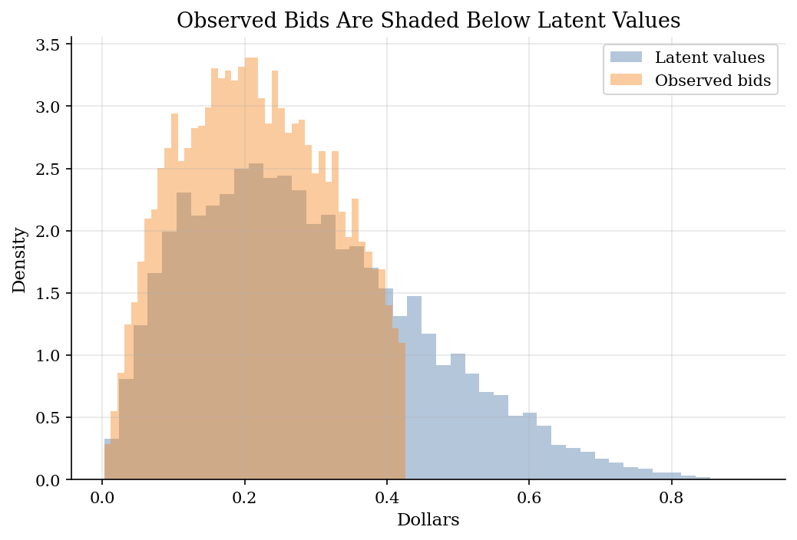

# Recovering Auction Values from First-Price Bids

> Use the first-price auction equilibrium condition to turn observed bids into pseudo-values.

## Overview

What do bids reveal about values? In a first-price auction the answer is not the bid itself. Bidders shade below value because paying more reduces surplus when they win.

The object is the latent distribution of private values. The data contain all bids and the number of bidders, but the econometrician does not observe values.

The tutorial simulates a known-truth auction, discards the values during estimation, estimates the bid distribution, and inverts the first-order condition into pseudo-values. The known truth is used only to check recovery.

## Equations

There are $n$ symmetric risk-neutral bidders in each first-price sealed-bid
auction. Bidder $i$ observes a private value $v_i$ drawn independently from a
common distribution $F_v$ and submits bid $b_i$. The highest bidder wins and
pays its own bid.

Let $s(v)$ be a strictly increasing symmetric equilibrium bid rule. A bidder
with value $v$ who bids as if its type were $x$ earns

$$
\pi(v,x) = (v-s(x))F_v(x)^{n-1}.
$$

The first-order condition at $x=v$ is

$$
s'(v)F_v(v) + (n-1)(s(v)-v)f_v(v) = 0.
$$

This condition implies the equilibrium bid schedule

$$
s(v)=v-\frac{\int_0^v F_v(t)^{n-1}dt}{F_v(v)^{n-1}}.
$$

For estimation, write the same condition in terms of the observed bid
distribution. If $G$ and $g$ are the CDF and density of bids, then monotonicity
gives $G(b)=F_v(v)$ and $g(b)=f_v(v)/s'(v)$. Solving for value gives the
GPV-style pseudo-value inversion:

$$
\hat v_i = b_i + \frac{\hat G(b_i)}{(n-1)\hat g(b_i)}.
$$

The density estimate is least stable near the bid support boundaries, so the
exercise trims low and high bid quantiles before evaluating recovery.

## Model Setup

| Object | Value | Role |
|---|---:|---|
| Auctions | 3,000 | Independent repetitions |
| Bidders per auction | 4 | Fixed competition level in the inversion |
| Value distribution | Beta(2,5) on [0,1] | Known truth for simulation only |
| Auction format | First-price sealed bid | Winner pays own bid |
| Reserve price | None | Lower support starts at zero |
| Observed by estimator | Bids and bidder count | Values are hidden during recovery |
| Boundary trim | 5% in each tail | Avoids unstable density estimates |

## Solution Method

The computation has two parts. First it creates auction data from the symmetric equilibrium. Then it acts like an econometrician who only sees bids.

```text
Algorithm: GPV-style value recovery
Input: all bids b_i from auctions with n bidders
Output: pseudo-values vhat_i and an estimated value distribution

1. Simulate private values from a known distribution F_v.
2. Compute the monotone first-price equilibrium bid rule s(v).
3. Store the bids b_i = s(v_i), then hide the values from the estimator.
4. Estimate the bid CDF Ghat(b_i) with empirical ranks.
5. Estimate the bid density ghat(b_i) with a kernel density estimate.
6. Drop the lowest and highest bid tails.
7. Recover pseudo-values vhat_i = b_i + Ghat(b_i) / [(n-1) ghat(b_i)].
8. Compare the pseudo-value distribution with the hidden true values.
```

The key economic input is monotonicity. It lets the rank of a bid stand in for the rank of a value.

## Results

The bid distribution is shifted left of the value distribution. That gap is bid shading. A bid is therefore not a direct measure of willingness to pay.



After the inversion, the recovered pseudo-value CDF is close to the true value CDF over the trimmed support. The match is not exact because the bid density is estimated nonparametrically.


Errors are smallest in the middle of the bid support and larger near the remaining boundaries. That pattern is why empirical GPV applications usually pay close attention to trimming, bandwidths, and boundary correction.


**True and Recovered Value Distributions**

| Series                  |   Mean |   Std. dev. |   P10 |   Median |   P90 |
|:------------------------|-------:|------------:|------:|---------:|------:|
| True values             |   0.28 |       0.132 | 0.112 |    0.265 | 0.473 |
| Recovered pseudo-values |   0.28 |       0.131 | 0.112 |    0.264 | 0.473 |

**Recovery Diagnostics**

|   Auctions |   Bidders |   Observed bids |   Kept bids |   Trimmed share |   RMSE |   MAE |   Correlation |
|-----------:|----------:|----------------:|------------:|----------------:|-------:|------:|--------------:|
|       3000 |         4 |           12000 |       10800 |             0.1 |  0.001 | 0.001 |             1 |

## Takeaway

Observed first-price bids mix values with strategic shading. Under symmetric IPV assumptions and monotone bidding, the equilibrium first-order condition turns the bid CDF and density into pseudo-values.

The exercise also shows the cost of the method. Recovery depends on a density estimate, so the edges of the bid support are fragile. Trimming is not cosmetic; it is part of making the structural inversion usable.

## References

- [Perrigne, I. and Vuong, Q. (2019). Econometrics of Auctions and Nonlinear Pricing. *Annual Review of Economics*, 11, 27-54.](https://doi.org/10.1146/annurev-economics-080218-025702)
- [Guerre, E., Perrigne, I., and Vuong, Q. (2000). Optimal Nonparametric Estimation of First-Price Auctions. *Econometrica*, 68(3), 525-574.](https://doi.org/10.1111/1468-0262.00123)
- [Gentry, M., Komarova, T., and Schiraldi, P. (2023). Preferences and Performance in Simultaneous First-Price Auctions: A Structural Analysis. *Review of Economic Studies*, 90(2), 852-878.](https://doi.org/10.1093/restud/rdac030)
- [Hickman, B. R., Hubbard, T. P., and Saglam, Y. (2012). Structural Econometric Methods in Auctions: A Guide to the Literature. *Journal of Econometric Methods*, 1(1), 67-106.](https://doi.org/10.1515/2156-6674.1019)
- [Krishna, V. (2009). *Auction Theory*, 2nd ed. Academic Press.](https://shop.elsevier.com/books/auction-theory/krishna/978-0-12-374507-1)
