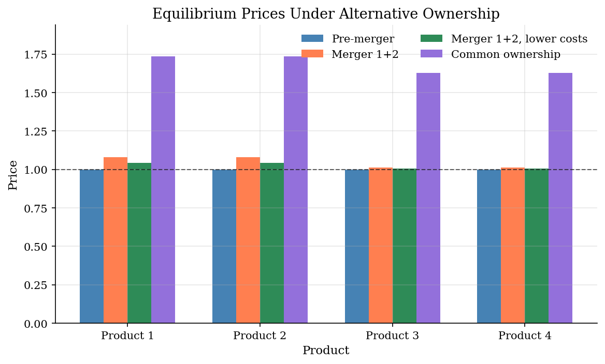
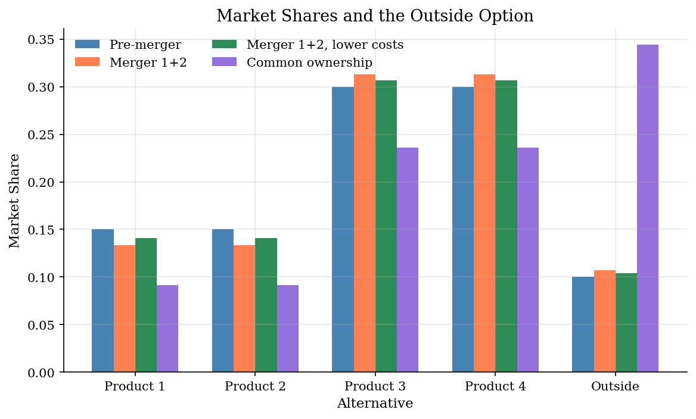
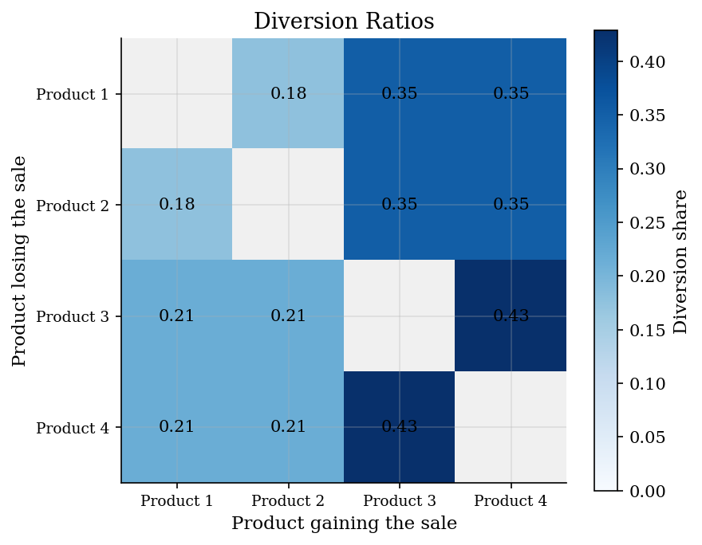

# Bertrand Pricing with Logit Demand

> Ownership changes, diversion, and unilateral merger effects in a four-product market.

## Overview

A differentiated-products merger is a question about where lost sales go. Before a merger, Firm 1 does not care that a price increase on Product 1 sends some consumers to Product 2. After common ownership, those diverted sales are partly recaptured by the same firm, so the old price vector is no longer optimal.

This tutorial calibrates a small logit demand system from pre-merger prices, shares, and one margin. It then changes the ownership matrix and solves the Bertrand-Nash pricing equations again. The exercise is intentionally narrow: it shows how demand, diversion, markups, and marginal-cost efficiencies combine in the basic unilateral effects calculation. The later [BLP random coefficients](../blp-random-coefficients/) tutorial relaxes the logit substitution pattern; [merger simulation across demand systems](../merger-simulation/) compares the consequences of that modeling choice.

## Equations

There are $J$ inside products and an outside good. Product $j$ has price $p_j$,
marginal cost $c_j$, and mean non-price utility $\xi_j$. With
$\alpha<0$, mean utility is
$$\delta_j(p)=\xi_j+\alpha p_j.$$

Logit demand gives inside share
$$
s_j(p)=
\frac{\exp(\delta_j(p))}
{1+\sum_{\ell=1}^J \exp(\delta_\ell(p))},
\qquad
s_0(p)=
\frac{1}
{1+\sum_{\ell=1}^J \exp(\delta_\ell(p))}.
$$

The demand derivative used by the pricing equation is
$$
\frac{\partial s_k}{\partial p_j}
=\alpha s_k(\mathbf 1\{j=k\}-s_j).
$$

Let $\Omega_{jk}=1$ when products $j$ and $k$ are controlled by the same firm
and zero otherwise. Bertrand-Nash pricing satisfies, for each product $j$,
$$
0=s_j(p)+\sum_{k=1}^J
\Omega_{jk}(p_k-c_k)\frac{\partial s_k(p)}{\partial p_j}.
$$
If $\Delta_{jk}=\partial s_j/\partial p_k$, the markup equation is
$$
p-c=-(\Omega\circ \Delta')^{-1}s.
$$

The diversion ratio from product $j$ to product $k$ is
$$
D_{j\to k}=\frac{s_k}{1-s_j},\qquad j\neq k.
$$
Under simple logit this depends only on product $k$'s share and the outside
option. That is the IIA restriction: substitution is not allowed to depend on
which products are objectively closer substitutes.

For welfare comparisons, the logit consumer-surplus index is
$$
CS(p)=\frac{1}{-\alpha}
\log\left(1+\sum_{j=1}^J \exp(\xi_j+\alpha p_j)\right),
$$
up to the usual income constant.

## Model Setup

The data are a transparent calibration rather than an estimated market. Products 1 and 2 are the merging products; products 3 and 4 are outside rivals within the market.

| Object | Value | Role |
|--------|-------|------|
| Inside products | 4 | Four single-product firms before the merger |
| Inside shares | [0.15, 0.15, 0.30, 0.30] | Observed product shares |
| Outside share | 0.10 | No-purchase option |
| Prices | [1.00, 1.00, 1.00, 1.00] | Pre-merger prices |
| Product 1 margin | 0.50 | Pins down the logit price coefficient |
| $\alpha$ | -2.3529 | Calibrated price sensitivity |
| Marginal costs | [0.50, 0.50, 0.39, 0.39] | Recovered from the pre-merger FOCs |
| Counterfactuals | merger 1+2, merger 1+2 with lower costs, common ownership | Ownership and cost experiments |

## Solution Method

The computation has two distinct parts. Calibration makes the observed pre-merger market exactly rationalized by logit demand and Bertrand pricing. Counterfactual simulation then holds demand fixed, changes ownership and possibly costs, and searches for the new price vector.

```text
Inputs: pre-merger prices p, shares s, firm labels f(j),
        one observed margin, and counterfactual ownership labels
Outputs: calibrated demand/costs and equilibrium outcomes by scenario

1. Set s0 = 1 - sum_j s_j.
2. Use Product 1's margin to infer alpha from its single-product FOC.
3. Recover mean utilities: xi_j = log(s_j / s0) - alpha p_j.
4. Build Delta(p), the logit demand Jacobian at observed prices.
5. Recover marginal costs from p - c = -[(Omega .* Delta')]^{-1}s.
6. For each counterfactual ownership/cost scenario:
       solve F_j(p) = s_j(p)
                    + sum_k Omega_jk (p_k-c_k) ds_k(p)/dp_j = 0
       compute shares, outside share, consumer surplus, HHI, and residuals.
```

The pre-merger FOC residual after calibration is 0.00e+00. The post-merger solutions below use the same equations, not a reduced-form pass-through rule.

## Results

The price comparison shows the unilateral effect directly. Common ownership of Products 1 and 2 raises both of their prices because the merged firm now values sales recaptured by its partner product. Products 3 and 4 also move up because prices are strategic complements. The cost-saving scenario lowers the merged products' marginal costs, but it does not mechanically restore the pre-merger equilibrium.



The share shifts explain where the price effect goes. The merged products lose some volume after their prices rise. Part of that volume moves to rival inside products, and part leaves the inside market altogether through the outside good. That outside option matters because it limits how much price pressure can be internalized by any set of firms.



Rows are products losing a marginal sale; columns are products that receive it. The logit restriction is visible: the larger-share products absorb more diverted sales from every other product. That is convenient for a first merger exercise, but it is also exactly why richer demand systems are needed when closeness of substitution is central.



The table keeps the equilibrium accounting in one place. HHI is computed using inside-good firm shares, so it captures the ownership change rather than the outside option. Consumer surplus is reported as a change from the pre-merger calibration. The FOC residuals are included because a merger simulation is only as credible as the solved post-merger pricing equations.

**Merger simulation outcomes**

| Scenario                |   Avg Price |   Price Change (%) |   Inside Share |   Outside Share |   CS Change |   HHI |   FOC Residual |
|:------------------------|------------:|-------------------:|---------------:|----------------:|------------:|------:|---------------:|
| Pre-merger              |      1      |               0    |         0.9    |          0.1    |      0      |  2778 |        0       |
| Merger 1+2              |      1.0456 |               4.56 |         0.8928 |          0.1072 |     -0.0296 |  3351 |        9.2e-15 |
| Merger 1+2, lower costs |      1.0241 |               2.41 |         0.8962 |          0.1038 |     -0.016  |  3338 |        1.2e-15 |
| Common ownership        |      1.6808 |              68.08 |         0.6557 |          0.3443 |     -0.5254 | 10000 |        8.9e-16 |

## Takeaway

The basic merger calculation is not an HHI calculation with a price effect attached. It is a pricing first-order condition with a different ownership matrix. A merger raises prices when diverted sales are valuable enough to the common owner; marginal-cost efficiencies push the other way. In simple logit, diversion is easy to compute but tightly restricted by IIA, so the exercise is best read as the clean benchmark before richer demand estimates and product-specific substitution patterns are introduced.

## References

- Berry, S. (1994). "Estimating Discrete-Choice Models of Product Differentiation." *RAND Journal of Economics*, 25(2).
- Werden, G. and Froeb, L. (1994). "The Effects of Mergers in Differentiated Products Industries." *Journal of Law, Economics, & Organization*, 10(2).
- Nevo, A. (2000). "Mergers with Differentiated Products: The Case of the Ready-to-Eat Cereal Industry." *RAND Journal of Economics*, 31(3).
