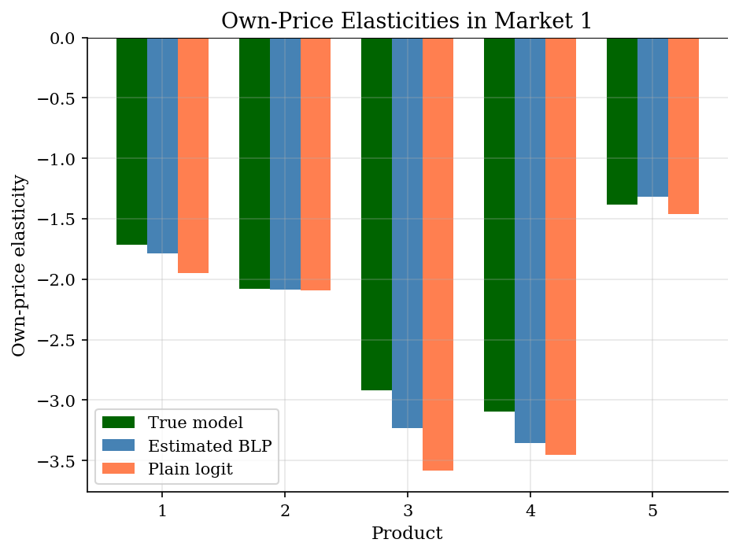
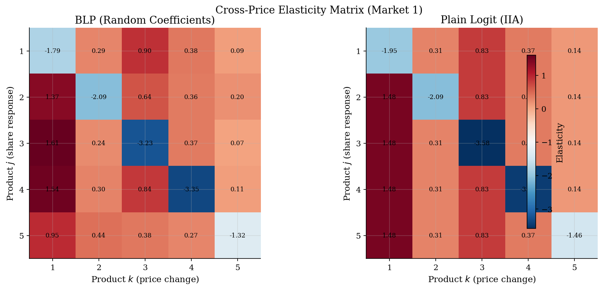

# Differentiated-Products Demand with BLP

> Random-coefficients demand for substitution patterns and merger counterfactuals.

## Overview

Suppose an antitrust team wants to know which products win demand when one brand raises price. Matching market shares is not enough for that question. The answer depends on the substitution matrix, and that matrix drives merger effects, markups, and welfare calculations in differentiated-products IO.

Plain logit gives a clean first pass because Berry inversion turns shares into mean utilities. The tradeoff is the IIA restriction: if one product changes price, all rivals gain share in proportion to their existing shares. BLP keeps the same share-fitting discipline but adds random coefficients. Consumers differ in their taste for the observed characteristic and in price sensitivity, so products that attract similar buyers become closer substitutes.

This tutorial uses a synthetic market where the true parameters are known. The computation inverts shares for mean utilities, estimates taste dispersion with IV/GMM, and then compares the implied elasticities with the true DGP and a plain-logit benchmark.

## Equations

Consumer $i$ in market $t$ chooses among $J$ inside goods and an outside good.
Think of $x_{jt}$ as a product attribute such as quality, style, or size.
The indirect utility from inside product $j$ is

$$u_{ijt} = \beta_0 + \beta_x x_{jt} + \alpha p_{jt} + \xi_{jt} + \sigma_x \nu_{i1} x_{jt} + \sigma_p \nu_{i2} p_{jt} + \varepsilon_{ijt}$$

where $x_{jt}$ is an observed product characteristic, $p_{jt}$ is price,
$\xi_{jt}$ is unobserved quality, $\nu_i \sim N(0,I)$, and
$\varepsilon_{ijt}$ is Type-I extreme value. The outside good has utility
normalized to zero.

It is useful to separate mean utility from the individual-specific part:

$$\delta_{jt} = \beta_0 + \beta_x x_{jt} + \alpha p_{jt} + \xi_{jt}, \qquad \mu_{ijt} = \sigma_x \nu_{i1} x_{jt} + \sigma_p \nu_{i2} p_{jt}$$

For a candidate $\sigma=(\sigma_x,\sigma_p)$, simulated market shares are

$$s_{jt} = \frac{1}{ns} \sum_{i=1}^{ns} \frac{\exp(\delta_{jt} + \mu_{ijt})}{1 + \sum_{k=1}^{J} \exp(\delta_{kt} + \mu_{ikt})}$$

The BLP contraction finds the mean utilities that make predicted shares equal
observed shares:

$$\delta^{(r+1)}_{jt} = \delta^{(r)}_{jt} + \log s^{\text{obs}}_{jt} - \log s^{\text{pred}}_{jt}(\delta^{(r)}, \sigma)$$

Given $\delta(\sigma)$, the linear demand equation is

$$\delta_{jt} = X_{jt}\theta_1 + \xi_{jt}, \qquad X_{jt}=(1,x_{jt},p_{jt})$$

and the identifying moments are $E[Z_{jt}\xi_{jt}]=0$. The instruments include
a cost shifter and sums of rival characteristics, so price can be endogenous
through $\operatorname{Cov}(p_{jt},\xi_{jt}) \ne 0$.

## Model Setup

The example has 100 independent markets with five products per market. Each product has an observed characteristic, an unobserved quality draw, a cost shifter, and a price. Price loads on both cost and unobserved quality, so the IV step has an actual endogeneity problem to solve.

| Object | Value | Role |
|-----------|-------|-------------|
| $T$ | 100 | Markets |
| $J$ | 5 | Products per market |
| $ns$ | 200 | Simulation draws used for shares |
| $\beta_0$ | 2.0 | Mean inside-good utility |
| $\beta_x$ | 1.5 | Mean taste for $x$ |
| $\alpha$ | -0.8 | Mean price coefficient |
| $\sigma_x$ | 0.8 | Dispersion in taste for $x$ |
| $\sigma_p$ | 0.3 | Dispersion in price sensitivity |

## Solution Method

The estimator is a nested fixed point with GMM. The outer search chooses the taste-dispersion parameters $\sigma=(\sigma_x,\sigma_p)$. For each trial $\sigma$, the inner contraction finds the mean utilities $\delta(\sigma)$ that reproduce the observed shares.

```text
Inputs: observed shares s_obs, characteristics x, prices p, instruments Z, draws nu
Choose trial nonlinear parameters sigma = (sigma_x, sigma_p)
Initialize delta with the simple-logit inversion log(s_jt) - log(s_0t)
Repeat until the share residual is small:
    predict shares s_pred(delta, sigma) by averaging over taste draws nu
    update delta <- delta + log(s_obs) - log(s_pred)
Run 2SLS of delta(sigma) on (1, x, p) using Z
Compute xi(sigma) and Q(sigma) = n g(sigma)' W g(sigma), where g = Z' xi / n
Search over sigma and keep the minimizer
Output: sigma_hat, theta_1_hat, xi_hat, elasticities
```

The contraction is the share inversion. It asks what common product utility must be present for the model to match observed shares after averaging over consumer heterogeneity. The GMM step then checks whether the recovered unobserved qualities are orthogonal to excluded cost and rival-characteristic instruments.

At the true nonlinear parameters, the contraction converged in **627 iterations** with max $|\delta^{\mathrm{recovered}}-\delta^{\mathrm{true}}|=2.45e-11$. The GMM search used Nelder-Mead after a coarse starting grid and evaluated the objective 46 times.

## Results

The estimated model matches the simulated market shares closely. That is expected because the data come from the same random-coefficients family. The stronger checks are the parameter table and the elasticity comparison. They show whether the estimator recovers the objects that matter for counterfactual IO work.

The share fit sits on the 45-degree line because the BLP contraction forces the model to rationalize observed shares at the chosen nonlinear parameters. A good-looking share plot alone does not prove that the substitution pattern is right.


The true-DGP bars are available because this is a simulation. Estimated BLP tracks the product-level pattern, with a maximum own-elasticity error of 0.315 in this market. Plain logit has no consumer-specific price coefficient, so its elasticities inherit price and share differences rather than the composition of buyers.



The inner fixed point is slow but stable. On the log scale, the update norm falls almost linearly, which is the practical reason the BLP inversion can be embedded inside an outer GMM search.


The cross-elasticity matrix is the main economic object here. In the plain-logit panel, every off-diagonal entry in a column is identical, so a price increase for product k sends the same proportional demand response to each rival. In the BLP panel, off-diagonal entries vary by row because products attract different mixtures of consumer tastes.



Because the data are synthetic, the parameter table is an actual truth check rather than a loose calibration summary. The nonlinear parameters are harder to pin down than the linear taste and price coefficients, but they are the parameters that move substitution away from IIA.

**Estimated vs True Parameters**

| Parameter                  |   True |   Estimated |
|:---------------------------|-------:|------------:|
| $\beta_0$ (intercept)      |    2   |       1.969 |
| $\beta_x$ (characteristic) |    1.5 |       1.576 |
| $\alpha$ (price)           |   -0.8 |      -0.835 |
| $\sigma_x$ (RC on $x$)     |    0.8 |       0.951 |
| $\sigma_p$ (RC on price)   |    0.3 |       0.196 |

## Takeaway

BLP changes the counterfactual object. The contraction lets each candidate $\sigma$ fit observed shares, while the IV/GMM moments choose the amount of heterogeneity that makes recovered unobserved quality orthogonal to excluded instruments. With heterogeneity in the model, substitution no longer has to follow existing shares. That is the natural step after simple logit demand before using demand estimates for mergers, markups, or welfare.

## References

- Berry, S., Levinsohn, J., and Pakes, A. (1995). "Automobile Prices in Market Equilibrium." *Econometrica*, 63(4), 841-890.
- Berry, S. (1994). "Estimating Discrete-Choice Models of Product Differentiation." *RAND Journal of Economics*, 25(2), 242-262.
- Nevo, A. (2000). "A Practitioner's Guide to Estimation of Random-Coefficients Logit Models of Demand." *Journal of Economics & Management Strategy*, 9(4), 513-548.
