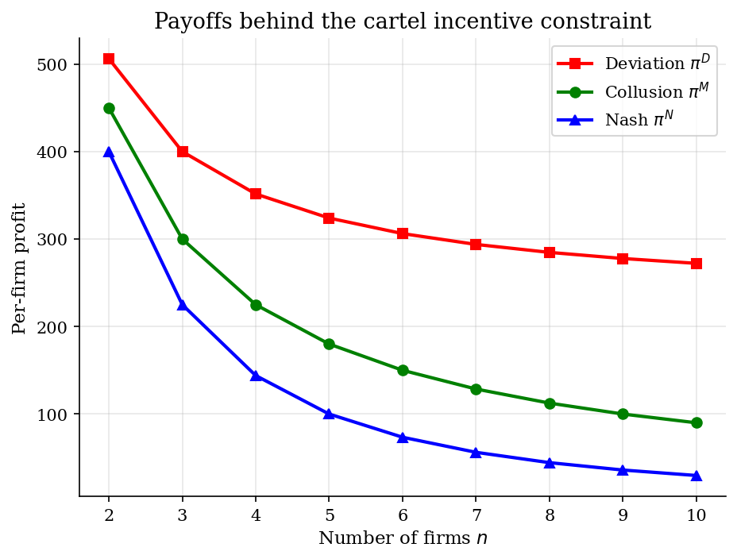
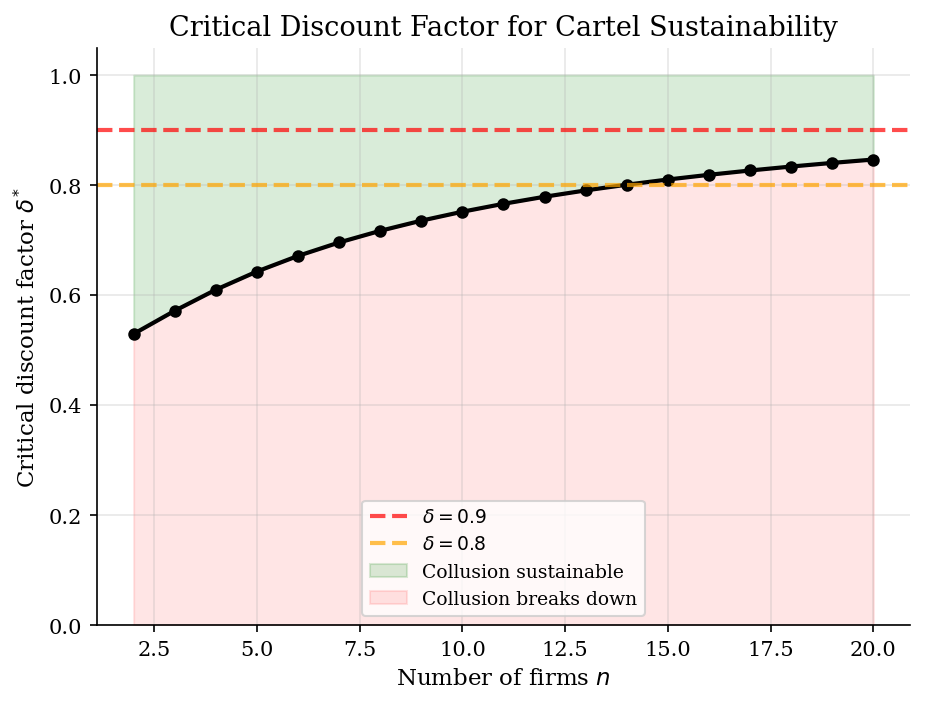
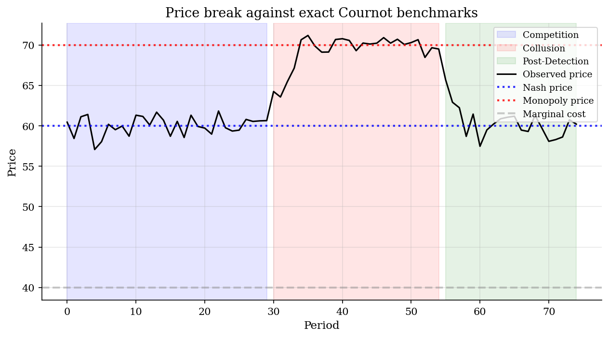
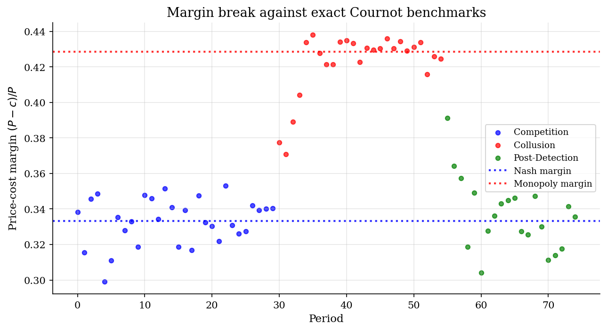

# Cartel Stability and Price Screens

> Repeated interaction can make high prices self-enforcing, but only when future rents are large enough.

## Overview

A cartel is not just a high-price outcome. It is a dynamic incentive problem. If all firms restrict output, they share monopoly rents. If one firm quietly expands while rivals keep cooperating, it earns a one-period windfall. The question is whether the future value of the relationship is large enough to make that deviation unattractive.

The tutorial uses symmetric Cournot demand because the incentive constraint is closed form, then adds a stylized price path with competitive, cartel, and post-detection regimes, so the price screen can be read against exact Nash and monopoly benchmarks. The neighboring [HHI tutorial](../effective-hhi/) is a static concentration screen; this one asks whether firms can sustain a collusive path once repeated interaction is made explicit.

## Equations

Firms $i=1,\ldots,n$ choose quantities $q_i$. Total quantity is
$Q=\sum_i q_i$, inverse demand is $P(Q)=a-Q$, and all firms have constant
marginal cost $c<a$. Let $\delta\in(0,1)$ be the common discount factor.

| Regime | Per-firm quantity | Per-firm profit |
|---|---:|---:|
| Cournot-Nash | $q^N=\dfrac{a-c}{n+1}$ | $\pi^N=\left(\dfrac{a-c}{n+1}\right)^2$ |
| Joint monopoly split equally | $q^M=\dfrac{a-c}{2n}$ | $\pi^M=\dfrac{(a-c)^2}{4n}$ |
| One firm deviates while others collude | $q^D=\dfrac{(n+1)(a-c)}{4n}$ | $\pi^D=\dfrac{(n+1)^2(a-c)^2}{16n^2}$ |

A grim-trigger cartel colludes until a deviation is detected and then reverts to
Cournot-Nash forever. The value of staying in the cartel is

$$
V^M=\frac{\pi^M}{1-\delta},
$$

while the value of deviating once is

$$
V^D=\pi^D+\frac{\delta\pi^N}{1-\delta}.
$$

The incentive constraint $V^M\geq V^D$ is equivalent to

$$
\delta\geq
\delta^{\ast}
=\frac{\pi^D-\pi^M}{\pi^D-\pi^N}
=\frac{(n+1)^2}{n^2+6n+1}.
$$

The price-screen simulation uses the same exact benchmarks. It observes

$$
P_t=P^{r_t}+\eta_t,\qquad
r_t\in\{N,M,N\},
$$

where $P^N$ is the Cournot price, $P^M$ is the joint-monopoly price, and the
regime $r_t$ moves from competition to cartel conduct and then back after
detection. The reported margin is $m_t=(P_t-c)/P_t$.

## Model Setup

The numerical choices are deliberately transparent: the repeated-game object is analytical, while the simulated time series is only a clean way to see the price and margin breaks that an empirical screen would look for.

| Object | Value | Role |
|---|---:|---|
| Demand intercept $a$ | 100 | Sets the competitive and monopoly price benchmarks |
| Marginal cost $c$ | 40 | Common cost used in profits and margins |
| Baseline firms | 2 | Duopoly used for the simulated price path |
| Firm-count grid | 2 to 50 | Exact cartel-stability thresholds by $n$ |
| Reference patience | $\delta=0.9$ | Used to mark which firm counts are sustainable |
| Regimes | 30+25+20 periods | Competition, cartel, post-detection |
| Price noise | $\sigma=1.5$ | Adds sampling noise around the exact regime price |

## Solution Method

There is no numerical fixed point hidden here. The Cournot equilibrium, the joint-monopoly allocation, and the deviation payoff are closed form. The algorithm simply evaluates the incentive constraint and then uses those exact prices as the ground truth for the simulated screen.

```text
Algorithm: repeated-Cournot cartel screen
Input: demand intercept a, marginal cost c, firm-count grid N, discount factor delta
Output: delta*(n), sustainability flags, price and margin benchmarks
1. For each n in N, compute the symmetric Cournot payoff pi^N(n).
2. Compute the equal-split joint-monopoly payoff pi^M(n).
3. Let one firm best respond to the other n-1 firms' collusive quantities;
   record the one-shot deviation payoff pi^D(n).
4. Evaluate delta*(n) = [pi^D(n)-pi^M(n)] / [pi^D(n)-pi^N(n)].
5. Mark collusion sustainable when delta >= delta*(n).
6. For the baseline duopoly, simulate prices around P^N, then P^M,
   then P^N again; compute margins m_t = (P_t-c)/P_t.
```

With $\delta=0.9$, the exact threshold in this calibration allows at most 33 symmetric firms. The simulated price path is not evidence by itself; it is a benchmark showing what a clean structural break would look like before adding demand shocks, capacity constraints, or procurement institutions.

## Results

The two sides of the incentive constraint are visible directly. The distance from $\pi^M$ up to $\pi^D$ is the short-run gain from cheating. The distance from $\pi^N$ up to $\pi^M$ is the per-period rent lost after punishment. Adding members dilutes the monopoly rent faster than it shrinks the deviation opportunity.



The threshold curve is exact for the linear Cournot model. At $\delta=0.9$, the last sustainable symmetric market has 33 firms; adding one more pushes the deviation constraint above the reference discount factor. Stigler's coordination problem rewritten as an incentive constraint.



The simulated price path is constructed with known regimes. Before the cartel, prices fluctuate around the exact Nash benchmark. During the cartel, they move toward the monopoly benchmark, and after detection they return to Nash. Real applications replace these clean reference lines with estimated costs, demand, and counterfactual competitive prices.



The margin version of the same screen removes the level of marginal cost from the price comparison. In this simple run cost is constant, so the margin break adds no identification by itself. In field data, the margin view is useful because cartel allegations usually have to separate conduct from cost shocks.



The table reports exact payoffs and thresholds. For $\delta=0.9$, the feasibility cutoff lies between 33 and 34 firms. The high-$n$ rows are included to show the breakdown region, not because a 50-firm symmetric Cournot cartel is the empirically natural case.

**Exact Cartel Stability Conditions ($a=100$, $c=40$)**

|   n |   pi_N |   pi_M |   pi_D |   delta_star | delta_0.9_sustains   |
|----:|-------:|-------:|-------:|-------------:|:---------------------|
|   2 |  400   |  450   |  506.2 |       0.5294 | yes                  |
|   3 |  225   |  300   |  400   |       0.5714 | yes                  |
|   4 |  144   |  225   |  351.6 |       0.6098 | yes                  |
|   5 |  100   |  180   |  324   |       0.6429 | yes                  |
|   6 |   73.5 |  150   |  306.2 |       0.6712 | yes                  |
|   8 |   44.4 |  112.5 |  284.8 |       0.7168 | yes                  |
|  10 |   29.8 |   90   |  272.2 |       0.7516 | yes                  |
|  15 |   14.1 |   60   |  256   |       0.8101 | yes                  |
|  20 |    8.2 |   45   |  248.1 |       0.8464 | yes                  |
|  30 |    3.7 |   30   |  240.2 |       0.889  | yes                  |
|  33 |    3.1 |   27.3 |  238.8 |       0.8975 | yes                  |
|  34 |    2.9 |   26.5 |  238.4 |       0.9001 | no                   |
|  40 |    2.1 |   22.5 |  236.4 |       0.9131 | no                   |
|  50 |    1.4 |   18   |  234.1 |       0.9286 | no                   |

## Takeaway

The repeated-game calculation reduces the cartel story to a single discipline condition. The short-run deviation gain is always positive; the question is whether future collusive rents are valuable enough to deter it. In the duopoly, $\delta^{\ast}=0.5294$; with ten symmetric firms, $\delta^{\ast}=0.7516$; at $\delta=0.9$, the cutoff is 33 firms. Price and margin breaks are screens, not verdicts. They say where to look before bringing in costs, demand shocks, monitoring, communication, capacity, procurement rules, and the legal record.

## References

- Stigler, G. (1964). A Theory of Oligopoly. *Journal of Political Economy*, 72(1), 44--61.
- Porter, R. (1983). A Study of Cartel Stability: The Joint Executive Committee, 1880--1886. *Bell Journal of Economics*, 14(2), 301--314.
- Harrington, J. (2008). Detecting Cartels. In *Handbook of Antitrust Economics*. MIT Press.
- Igami, M. and Sugaya, T. (2021). Measuring the Incentive to Collude: The Vitamin Cartels, 1990--1999. *Review of Economic Studies*, 89(3), 1460--1494.
