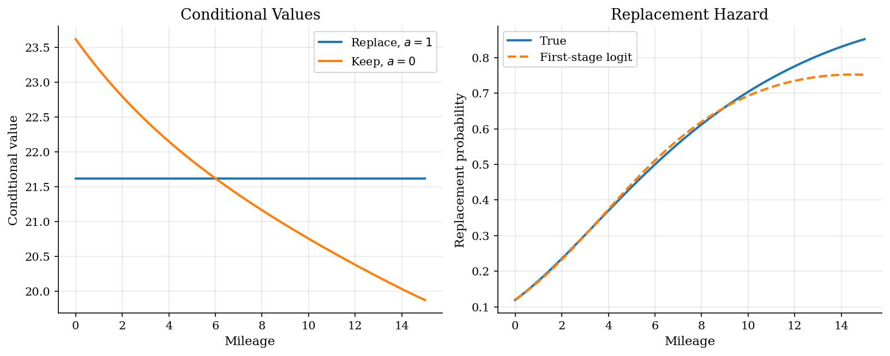
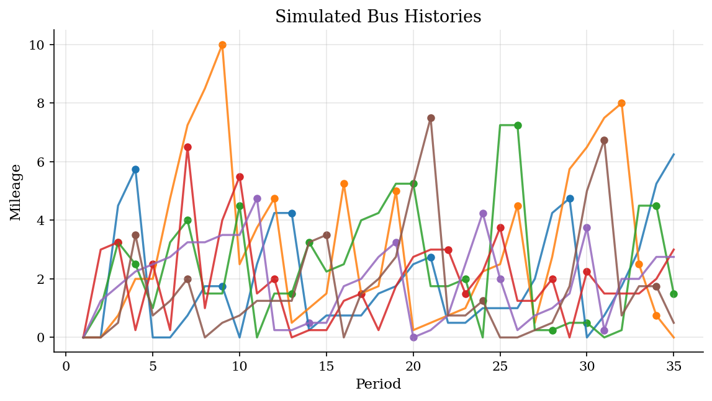
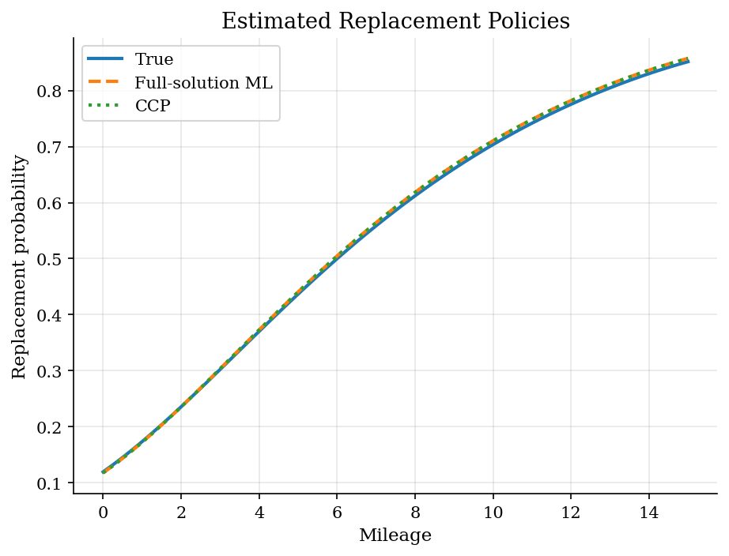

# Bus Engine Replacement in a Dynamic Choice Model

> Mileage, continuation values, and observed replacement hazards in a Rust-style maintenance model.

## Overview

A transit agency sees each bus many times before an engine is replaced. Keeping the old engine saves the replacement cost today, but it also lets mileage drift upward and makes future maintenance less attractive. Replacing the engine resets the bus toward a low-mileage state. The observed replacement hazard therefore mixes two objects an economist wants to separate: current operating payoffs and the continuation value of a fresher engine.

That separation requires computation because a candidate payoff vector is not enough to evaluate the likelihood. Each trial value of the structural parameters implies a dynamic program, a replacement policy, and then a choice probability for each observed bus-period. The tutorial solves the model, simulates a panel with known truth, and compares nested fixed-point maximum likelihood, a Hotz-Miller conditional-choice-probability (CCP) estimator, and a mathematical program with equilibrium constraints (MPEC). The MPEC version makes continuation values optimization variables and imposes the Bellman equations as feasibility conditions.

The example also complements the dynamic IO models in [dynamic entry and exit](../dynamic-entry-exit/) and [Markov-perfect investment](../dynamic-games/). Here there is one decision maker rather than strategic firms, so the estimation problem is easier to see: recover payoff parameters from observed replacement choices.

## Equations

Let $x_t \in X$ denote mileage at the start of period $t$. The action
$a_t=1$ replaces the engine and $a_t=0$ keeps it. Replacement flow utility is
normalized to zero:

$$u(x,1) = 0,$$

and the keep payoff is

$$u(x,0) = \theta_0 + \theta_1 x, \qquad \theta_1 < 0.$$

The transition matrix $F_a(x' \mid x)$ gives next period's mileage. Replacement
uses $F_1$ and is close to the transition from a new engine; keeping uses $F_0$
and lets mileage drift upward. With additive Type-I extreme value shocks, the
conditional value functions satisfy

$$v_a(x) = u(x,a) + \beta \sum_{x'} F_a(x' \mid x)
\left[\log\left(\exp(v_1(x')) + \exp(v_0(x'))\right) + \gamma\right],$$

where $\gamma$ is Euler's constant. The replacement probability is

$$P_\theta(1 \mid x) =
\frac{\exp(v_1(x))}{\exp(v_1(x))+\exp(v_0(x))}.$$

For panel observations $(x_{it}, d_{it})$, where $d_{it}=1$ means replacement,
the full-solution likelihood is

$$\ell(\theta)=\sum_{i,t}
d_{it}\log P_\theta(1 \mid x_{it})
+ (1-d_{it})\log[1-P_\theta(1 \mid x_{it})].$$

The CCP estimator starts from a first-stage estimate $\hat p(x)$ of
$\Pr(a=1 \mid x)$. Given $\hat p$, form the policy transition

$$\hat F(x' \mid x)=\hat p(x)F_1(x' \mid x)+[1-\hat p(x)]F_0(x' \mid x).$$

For any candidate $\theta$, the Hotz-Miller ex ante value solves the linear
system

$$W_\theta =
\bar u_\theta(\hat p)+\beta \hat F W_\theta,$$

where $\bar u_\theta(\hat p)$ includes the keep payoff and the logit entropy
terms implied by $\hat p$. The model-implied replacement probability is then

$$P_\theta^{HM}(1 \mid x)
=\Lambda\left(\beta F_1 W_\theta
-\theta_0-\theta_1 x-\beta F_0 W_\theta\right),$$

with $\Lambda(z)=1/(1+\exp(-z))$.

The MPEC estimator chooses $\theta$ and the conditional values $v$ jointly:

$$
\max_{\theta,v}\ \ell(v)
\quad\text{subject to}\quad
v_a(x) = u(x,a;\theta) + \beta \sum_{x'} F_a(x' \mid x)
\left[\log\sum_{j\in\{0,1\}}\exp(v_j(x'))+\gamma\right]
$$

for every action and mileage state. The likelihood still uses the logit choice
formula, but the fixed point appears as equality constraints rather than an
inner loop inside the objective.

## Model Setup

| Parameter | Value | Description |
|-----------|-------|-------------|
| $\beta$ | 0.9 | Discount factor |
| $\theta_0$ | 2.00 | Keep-engine payoff intercept |
| $\theta_1$ | -0.15 | Mileage cost slope |
| Mileage states | 61 | Grid for $x \in [0,15]$ |
| Transition law | Exponential increments | Replacement resets to the low-mileage transition |
| Buses | 1500 | Simulated panel units |
| Periods | 35 | Observations per bus |
| Ground truth | Known | Data are simulated from $\theta=(2.00,-0.15)$ |

## Solution Method

The nested fixed-point estimator treats the dynamic program as part of the likelihood. Every candidate $\theta$ implies a replacement hazard only after the conditional value functions have been solved.

```text
Algorithm: nested fixed-point likelihood for replacement
Input: grid X, transitions F_0 and F_1, discount beta, panel choices (x_it, d_it)
Output: structural estimate theta and implied policy P_theta(1 | x)
for each candidate theta proposed by the outer optimizer:
    initialize conditional values v_0(x), v_1(x)
    repeat:
        inclusive(x) = log(exp(v_1(x)) + exp(v_0(x))) + gamma
        update v_1(x) = beta * sum_x' F_1(x' | x) inclusive(x')
        update v_0(x) = theta_0 + theta_1 x + beta * sum_x' F_0(x' | x) inclusive(x')
        error = sup_x,a |v_a^{new}(x) - v_a^{old}(x)|
    until error < epsilon
    compute P_theta(1 | x) from the logit choice formula
    evaluate the panel choice likelihood
choose theta that maximizes the likelihood
```

The Hotz-Miller estimator moves the dynamic-programming burden into a first-stage policy estimate. In this run the first stage is a flexible logit in mileage and mileage squared; the known data-generating policy is held out for comparison, not used in estimation.

```text
Algorithm: Hotz-Miller CCP estimator
Input: same grid, transitions, beta, and panel choices
Output: structural estimate theta_CCP and implied policy P_theta^HM(1 | x)
Estimate first-stage CCPs p_hat(x) = Pr(d=1 | x)
Build the policy transition F_hat = p_hat F_1 + (1 - p_hat) F_0
for each candidate theta:
    construct expected flow payoffs under p_hat, including logit entropy terms
    solve (I - beta F_hat) W_theta = expected_flow_theta
    recover P_theta^HM(1 | x) from replacement and keep continuation values
    evaluate the panel choice likelihood
choose theta that maximizes the likelihood
```

The MPEC estimator puts the Bellman equations into the optimizer itself.

```text
Algorithm: MPEC for dynamic discrete choice
Input: grid, transitions, beta, panel choices, starting theta and values
Decision variables: theta, v_1(x), v_0(x) for every mileage state
Objective: maximize the panel choice likelihood implied by v
Constraints: Bellman residuals equal zero for both actions and all states
Use a constrained nonlinear optimizer to move theta and v jointly
Report theta, likelihood, optimizer status, and the max Bellman residual
```

The first estimator is direct but repeatedly solves a Bellman fixed point. The second estimator avoids that nested value-function iteration after the first stage, at the cost of relying on the smoothed CCPs. The third estimator keeps the fixed point out of the objective and instead asks whether a candidate value array is feasible.

## Results

The first object to inspect is the replacement hazard, not the parameter vector. The keep value starts high because a low-mileage engine is still useful. As mileage rises, the keep payoff falls and replacement becomes a way to buy a better future state. The first-stage logit follows the true hazard where the simulated panel has mass, but it is only an approximation to the dynamic policy.

The data-generating replacement probability is the benchmark curve. The estimated first-stage CCP is deliberately shown beside it because the CCP estimator lives or dies by this smoothing step.



The panel makes the identification problem concrete. Low and medium mileage states are observed often because buses return there after replacement. Very high mileage states are scarce: in this simulation only **0.29%** of bus-periods have mileage at least 10. That is where estimated hazards are expected to separate from the known policy.

Mileage drifts upward under the keep action and falls after replacement. The points are replacement decisions, not exogenous maintenance shocks.



Because the data are simulated, the true policy can stay on the graph as a ground-truth reference. All three estimators recover the economically important shape: replacement is rare for fresh engines and rises sharply once mileage makes keeping the engine costly. The remaining disagreement is largest in sparsely visited states; it should be read as finite-sample and first-stage approximation error, not as a different economic mechanism.

The full-solution, CCP, and MPEC policies are almost on top of the truth over the states that carry most of the simulated likelihood.



The estimates are close to the data-generating parameters. The full-solution estimator pays for a fresh fixed point at each trial value; the CCP estimator uses the first-stage policy to turn continuation values into a linear solve; the MPEC estimator imposes Bellman equations as nonlinear constraints.

**Structural parameter estimates**

| Parameter   |   True |   Full-solution ML |   Full ML error |      CCP |   CCP error |     MPEC |   MPEC error |
|:------------|-------:|-------------------:|----------------:|---------:|------------:|---------:|-------------:|
| theta_0     |   2    |            2.01812 |         0.01812 |  2.01767 |     0.01767 |  2.01812 |      0.01812 |
| theta_1     |  -0.15 |           -0.15346 |        -0.00346 | -0.15334 |    -0.00334 | -0.15346 |     -0.00346 |

The moments summarize the simulated panel and the numerical solve. The high-mileage share indicates how much likelihood information is available in the region where the replacement probability is already near one. The MPEC residual checks whether the reported conditional values satisfy the Bellman constraints.

**Simulation and solver diagnostics**

| Moment                    |         Value |
|:--------------------------|--------------:|
| Repair rate               |   0.253181    |
| Average mileage           |   2.21011     |
| Share with mileage >= 10  |   0.00293333  |
| VFI iterations            | 228           |
| Full ML success           |   1           |
| CCP success               |   1           |
| MPEC success              |   1           |
| MPEC iterations           |   5           |
| MPEC max Bellman residual |   1.16398e-10 |

## Takeaway

Dynamic discrete choice turns observed hazards into statements about current payoffs and continuation values. In the replacement problem, a high mileage bus is replaced because keeping it is costly today and because replacement changes the distribution of tomorrow's state. Nested fixed-point likelihood estimates that object directly. CCP estimation is faster because it learns part of the policy first, with the structural step depending on how well those first-stage CCPs approximate the true replacement hazard. MPEC changes the architecture again by turning the Bellman equations into feasibility constraints.

## References

- [Rust, J. (1987). Optimal Replacement of GMC Bus Engines: An Empirical Model of Harold Zurcher. *Econometrica*, 55(5), 999-1033.](https://doi.org/10.2307/1911259)
- [Hotz, V. J. and Miller, R. A. (1993). Conditional Choice Probabilities and the Estimation of Dynamic Models. *Review of Economic Studies*, 60(3), 497-529.](https://doi.org/10.2307/2298122)
- [Aguirregabiria, V. and Mira, P. (2010). Dynamic Discrete Choice Structural Models: A Survey. *Journal of Econometrics*, 156(1), 38-67.](https://doi.org/10.1016/j.jeconom.2009.09.007)
