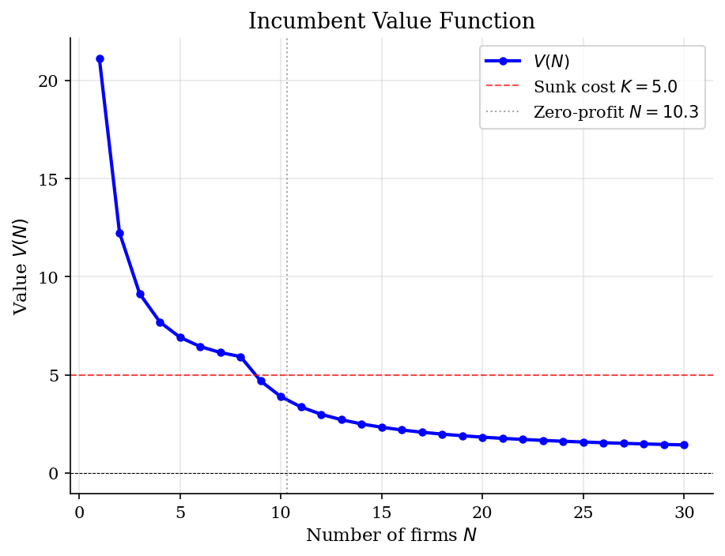
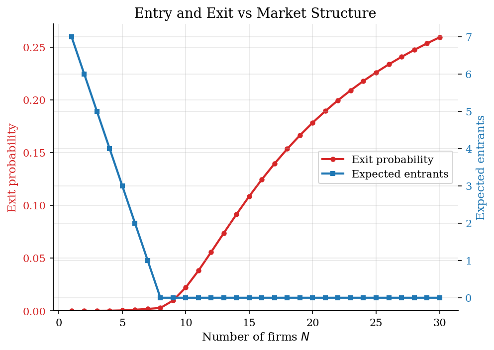
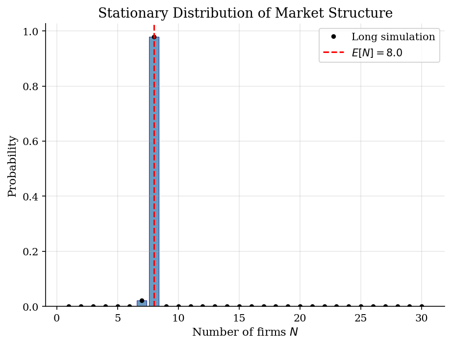
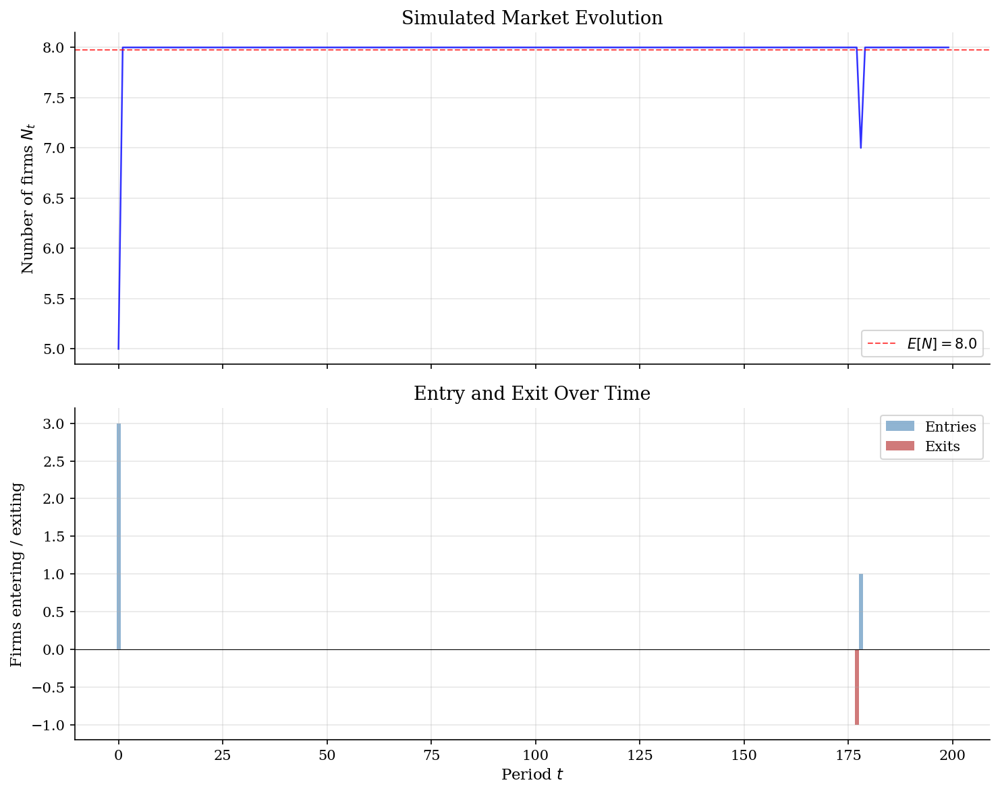

# Entry, Exit, and Market Structure in Oligopoly

> Sunk entry costs and persistent firm counts.

## Overview

Consider a local market with eight active firms. Some firms may be close to leaving. Potential entrants wait outside because entry requires a sunk cost. The firm count is therefore a state variable.

The model uses a symmetric Cournot market. The state is the active firm count $N_t$. Incumbents pay fixed cost $f$ to operate. Entrants pay sunk cost $K$ before earning future profits.

Exit and entry rules depend on future market sizes. We solve a finite-state Bellman fixed point for incumbent values. The implied Markov chain gives persistence and the long-run firm-count distribution.

## Equations

Let $N_t\in\{1,\ldots,N_{\max}\}$ denote the number of active firms at the start
of period $t$. With inverse demand $P=a-bQ$ and constant marginal cost $c$, the
symmetric Cournot flow profit before fixed cost is

$$
\pi(N)=\frac{(a-c)^2}{b(N+1)^2}.
$$

An incumbent's exit value is normalized to zero. If it stays, its deterministic
surplus is

$$
\Delta(N)=\pi(N)-f+\beta \mathbb{E}\left[V(N_{t+1})\mid N_t=N,\text{ stay}\right].
$$

The idiosyncratic stay shock has logistic scale $\sigma_\varepsilon$. The
pre-shock value is the log-sum inclusive value

$$
V(N)=\sigma_\varepsilon
\log\left[1+\exp\left(\frac{\Delta(N)}{\sigma_\varepsilon}\right)\right],
$$

The incumbent exit probability is

$$
p_{\mathrm{exit}}(N)=
\frac{1}{1+\exp\{\Delta(N)/\sigma_\varepsilon\}}.
$$

Entry is decided at the current market state, before the realized exit draws.
Potential entrants use the expected survivor count
$\bar S(N_t)=\mathrm{round}\{N_t[1-p_{\mathrm{exit}}(N_t)]\}$ and enter until
the next entrant would not cover the sunk cost. Entrant $m$ enters only if its
post-entry value $V(\bar S(N_t)+m)$ is at least $K$. Thus

$$
e(N_t)=\max\{e\geq 0: \bar S(N_t)+e\leq N_{\max}
\ \text{and}\ V(\bar S(N_t)+m)\geq K\ \text{for all}\ m=1,\ldots,e\},
$$

with $e(N_t)=0$ when the first entrant does not cover $K$.

Survival and entry define the transition law.

$$
S_t\sim \mathrm{Binomial}\left(N_t,1-p_{\mathrm{exit}}(N_t)\right),
\qquad
N_{t+1}=\max\{1,\min(S_t+e(N_t),N_{\max})\}.
$$

## Model Setup

| Parameter | Value | Description |
|-----------|-------|-------------|
| $a$       | 10  | Demand intercept |
| $b$       | 1  | Demand slope |
| $c$       | 2  | Marginal cost |
| $f$       | 0.5  | Fixed operating cost (per period) |
| $K$       | 5.0  | Sunk entry cost |
| $\beta$  | 0.95 | Discount factor |
| $\sigma_\varepsilon$ | 1.0 | Logistic shock scale |
| $N_{\max}$ | 30 | Maximum number of firms |
| State space | $1,\ldots,30$ | Operating markets; zero-firm market entry is not modeled |
| Simulation periods | 200 | Market path shown in the results |

## Solution Method

The numerical object is a fixed point in incumbent continuation values. Given $V(N)$, the exit rule, entry cutoff, and transition matrix follow. The fixed point prices incumbency as an option.

The algorithm iterates on $V(N)$. Each pass computes exit probabilities and the free-entry cutoff. It then integrates over survivor counts and updates the log-sum value. The final policies define a Markov chain over firm counts.

```text
Algorithm: symmetric entry-exit fixed point
Input: state grid {1,...,N_max}, primitives (a,b,c,f,K,beta,sigma), tolerance epsilon
Output: V(N), p_exit(N), expected entry, transition matrix P, stationary distribution mu
Initialize V_0(N) from myopic operating values
repeat for n = 0, 1, 2, ...:
    for each market size N:
        compute current Cournot profit pi(N)
        compute p_exit(N) from the logit stay/exit rule using V_n
        compute expected survivor count S_bar(N)
        choose entrants e(N) by the cutoff V_n(S_bar(N)+e) >= K
        for each possible number of rival survivors S:
            add V_n(min{S + 1 + e(N), N_max}) to the incumbent's continuation value
        update V_{n+1}(N) with the log-sum inclusive value
    replace V_n by a damped average of V_n and V_{n+1}
until max_N |V_{n+1}(N)-V_n(N)| < epsilon
Construct P(N'|N) from binomial survival and the same state-level entry rule
Iterate mu_{m+1}=mu_m P until mu is invariant
```

The value iteration converged in **667 iterations** with sup-norm error **9.94e-09**. The invariant distribution solves $\mu=\mu P$ for the policy-induced Markov chain.

## Results

Incumbency value falls as more firms divide Cournot rents. The dashed line is the sunk entry cost. Below it, a new firm would not enter. An incumbent may still stay because it already paid the cost. The vertical line marks the static zero-flow-profit benchmark.



Exit risk rises with crowding because profits and continuation values fall. Expected entry is high when the market is thin. It falls once post-entry value drops below $K$. The gap between thresholds is the hysteresis region created by sunk entry.



The invariant distribution is tightly centered because free entry offsets exits near the profitable range. The black markers show a long simulation from the same Markov chain. The maximum simulation gap is **5.42e-04** after burn-in.



The simulated path shows the same object over time. The firm count stays near the invariant mean. The lower panel shows the turnover events that prevent absorption. With this calibration, turnover is modest.



Expected market size lies below the static zero-profit count. Entrants must recover sunk cost $K$ plus the operating cost. Incumbents still have continuation value, so exit remains smooth.

**Equilibrium Statistics**

| Statistic                           |      Value |
|:------------------------------------|-----------:|
| Expected number of firms E[N]       |   7.98     |
| Std. deviation of N                 |   0.15     |
| Modal number of firms               |   8        |
| Zero-profit N (static)              |  10.3      |
| Per-firm profit at E[N]             |   0.79     |
| Net profit (pi - f) at E[N]         |   0.29     |
| Expected incumbent exit probability |   0.0027   |
| Expected exits (firms/period)       |   0.021    |
| Expected entry (firms/period)       |   0.02     |
| Max stationary simulation gap       |   0.000542 |
| VFI iterations                      | 667        |

Thin markets have high incumbent value and attract entrants. Crowded markets have lower profits and higher exit risk. Entry shuts down before incumbents are certain to leave.

**Value Function and Policies at Selected Market Structures**

|   N |   Profit pi(N) |   Net profit pi-f |   V(N) |   Exit prob |   Expected entry |
|----:|---------------:|------------------:|-------:|------------:|-----------------:|
|   1 |         16     |            15.5   | 21.133 |      0      |                7 |
|   2 |          7.111 |             6.611 | 12.244 |      0      |                6 |
|   3 |          4     |             3.5   |  9.133 |      0      |                5 |
|   5 |          1.778 |             1.278 |  6.912 |      0.0004 |                3 |
|   7 |          1     |             0.5   |  6.138 |      0.0018 |                1 |
|  10 |          0.529 |             0.029 |  3.96  |      0.0221 |                0 |
|  15 |          0.25  |            -0.25  |  2.48  |      0.1085 |                0 |
|  20 |          0.145 |            -0.355 |  1.982 |      0.1783 |                0 |
|  25 |          0.095 |            -0.405 |  1.723 |      0.2259 |                0 |
|  30 |          0.067 |            -0.433 |  1.562 |      0.2592 |                0 |

## Takeaway

The entry and exit conditions separate. Static profits show whether a firm covers the operating cost. Dynamic values show whether keeping the incumbency option is worthwhile. A sunk entry cost creates a band where incumbents stay and entrants wait. That band makes firm counts persistent in Ericson-Pakes style IO models.

## References

- Ericson, R. and Pakes, A. (1995). Markov-perfect industry dynamics: A framework for empirical work. *Review of Economic Studies*, 62(1):53-82.
- Hopenhayn, H. (1992). Entry, exit, and firm dynamics in long run equilibrium. *Econometrica*, 60(5):1127-1150.
